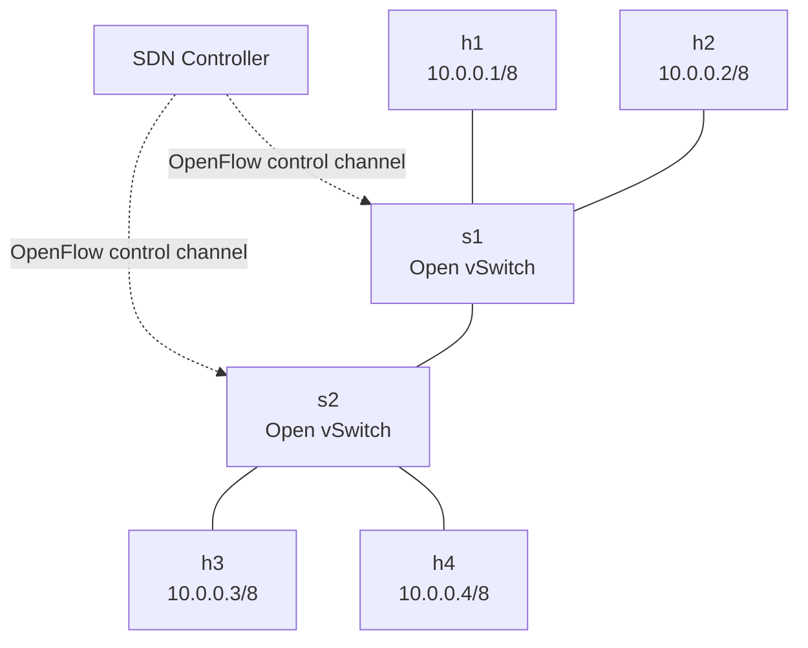
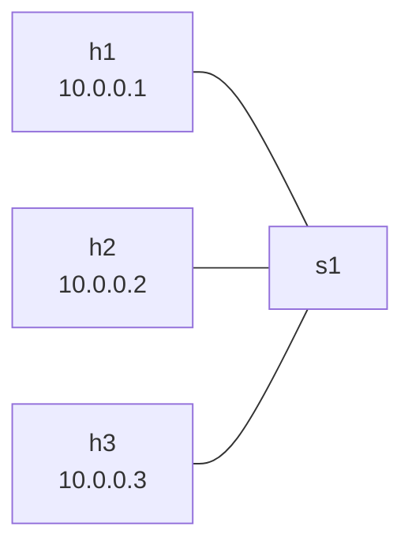
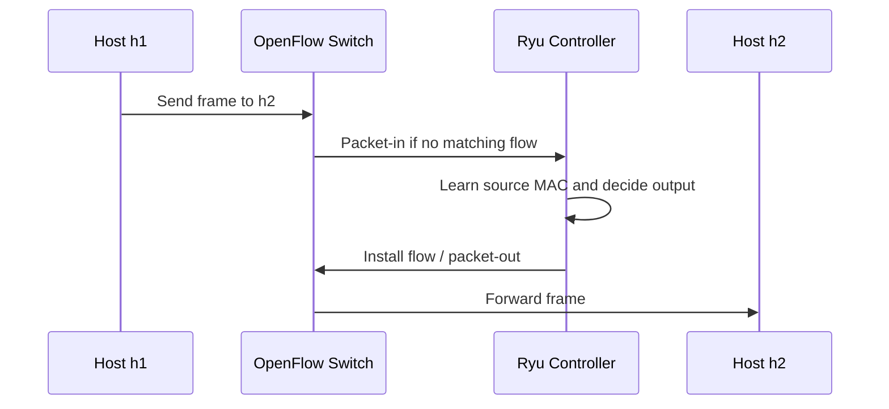

# Day 1 Lab - SDN Fundamentals with Mininet and Open vSwitch

## 1. Lab Purpose

This lab helps learners observe the core SDN concepts discussed in Day 1:

- Data plane vs control plane.
- SDN controller behavior.
- OpenFlow switch behavior.
- Flow tables.
- Host-to-host forwarding.
- What changes when controller connectivity is removed.
- Why SDN troubleshooting still requires traditional packet-path thinking.

The lab uses Mininet and Open vSwitch because they allow learners to build a complete SDN topology quickly without physical switches.

## 2. Target Audience

This lab is written for experienced network engineers. It assumes learners already understand:

- IP addressing.
- Layer 2 switching.
- Layer 3 reachability.
- MAC learning.
- ARP.
- Ping and traceroute.
- Basic Linux commands.
- Basic routing/switching troubleshooting.

The purpose is not to teach basic networking. The purpose is to make SDN control/data plane separation visible.

## 3. Lab Duration

Recommended duration: 3 hours.

Suggested timing:

| Section | Time |
|---|---:|
| Instructor briefing | 15 min |
| Environment verification | 20 min |
| Lab 1: Basic Mininet topology | 35 min |
| Lab 2: Open vSwitch flow table inspection | 35 min |
| Lab 3: Remote controller behavior | 45 min |
| Lab 4: Controller failure and manual flow insertion | 45 min |
| Review and discussion | 25 min |

## 4. Lab Topology

The main topology has:

- 4 hosts.
- 2 OpenFlow switches.
- 1 controller.
- Links between hosts, switches, and switch-to-switch connection.



## 5. Required Software

Recommended lab platform:

- Ubuntu 20.04/22.04/24.04 VM or server.
- Mininet.
- Open vSwitch.
- Python 3.
- Ryu controller or built-in Mininet controller.
- Wireshark optional.

Recommended student access:

- SSH to lab VM or server.
- Web browser for documentation.
- Terminal access.

## 6. Instructor Preparation

Before class, verify the lab machine has:

```bash
which mn
which ovs-vsctl
which ovs-ofctl
python3 --version
sudo mn --version
```

If Ryu is used:

```bash
python3 -m pip show ryu
```

If Ryu is not installed, the lab can still be completed with the default Mininet controller for basic sections. For the remote controller section, Ryu is recommended.

Common installation commands on Ubuntu:

```bash
sudo apt update
sudo apt install -y mininet openvswitch-switch openvswitch-testcontroller python3-pip curl tcpdump
python3 -m pip install ryu
```

Clean up any previous Mininet state before starting:

```bash
sudo mn -c
```

## 7. Lab Safety Notes

Run Mininet labs only on a lab VM or dedicated lab server.

Do not run random Open vSwitch cleanup commands on a production host because they may affect real OVS bridges.

In this lab, all commands are intended for a disposable training environment.

## 8. Lab Deliverables

Each student or group should submit:

- Screenshot or copied output of `net`.
- Output of `pingall`.
- Output of `ovs-ofctl dump-flows` before and after traffic.
- Short explanation of what changed in the flow table.
- Short explanation of what happened when the controller was unavailable.
- Answers to the review questions at the end.

## 9. Section A - Verify Lab Environment

### Objective

Confirm Mininet and Open vSwitch are installed and working.

### Steps

1. Clean any previous Mininet topology:

```bash
sudo mn -c
```

2. Check Mininet:

```bash
sudo mn --test pingall
```

Expected result:

- Mininet starts a simple topology.
- Hosts can ping each other.
- Mininet exits after the test.

3. Check Open vSwitch service:

```bash
sudo systemctl status openvswitch-switch --no-pager
```

If the service is not running:

```bash
sudo systemctl start openvswitch-switch
```

4. Check OVS command tools:

```bash
ovs-vsctl --version
ovs-ofctl --version
```

### Discussion

Mininet creates Linux network namespaces for hosts and uses Open vSwitch as the virtual switch. This gives us a small but realistic SDN lab where we can inspect switch behavior directly.

## 10. Section B - Create a Basic Single-Switch Topology

### Objective

Create a simple topology and verify basic host connectivity.

### Topology



### Steps

1. Start Mininet with one switch and three hosts:

```bash
sudo mn --topo single,3 --mac --switch ovsk --controller default
```

You should see the `mininet>` prompt.

2. Display the topology:

```bash
net
```

3. Display host information:

```bash
dump
```

4. Test connectivity:

```bash
pingall
```

5. Test a specific flow:

```bash
h1 ping -c 3 h2
```

6. Open a second terminal on the lab machine and inspect OVS bridges:

```bash
sudo ovs-vsctl show
```

7. Inspect flow table:

```bash
sudo ovs-ofctl dump-flows s1
```

8. In the Mininet prompt, stop the lab:

```bash
exit
```

9. Clean up:

```bash
sudo mn -c
```

### Expected Observations

- Mininet creates hosts `h1`, `h2`, `h3`.
- The hosts can ping each other.
- Open vSwitch bridge `s1` exists while Mininet is running.
- Flow entries appear in the switch.

### Analysis

The switch is the data plane. The controller helps decide forwarding behavior depending on controller and switch mode. Even in this simple topology, the forwarding behavior is represented in flow entries.

## 11. Section C - Build the Main Two-Switch Topology

### Objective

Build a topology with multiple switches and observe forwarding across a switch-to-switch link.

### Steps

1. Start Mininet:

```bash
sudo mn --topo linear,2,2 --mac --switch ovsk --controller default
```

This creates:

- `s1` with two hosts.
- `s2` with two hosts.
- Link between `s1` and `s2`.

2. Display topology:

```bash
net
```

Expected logical topology:

```text
h1 -- s1 -- s2 -- h3
h2 -- s1    s2 -- h4
```

3. Confirm host IP addresses:

```bash
dump
```

4. Test all connectivity:

```bash
pingall
```

5. Test across switches:

```bash
h1 ping -c 3 h3
```

6. Check ARP table on `h1`:

```bash
h1 arp -n
```

7. Check interfaces:

```bash
h1 ip addr
s1 ifconfig
s2 ifconfig
```

8. In a second terminal, inspect OVS:

```bash
sudo ovs-vsctl show
sudo ovs-ofctl show s1
sudo ovs-ofctl show s2
```

9. Dump flow tables:

```bash
sudo ovs-ofctl dump-flows s1
sudo ovs-ofctl dump-flows s2
```

### Expected Observations

- Cross-switch ping works.
- ARP entries are created.
- Flow tables contain forwarding entries.
- Switch ports can be mapped to hosts and inter-switch links.

### Instructor Note

Ask students:

- Which devices are data plane elements?
- Where is the control function?
- What commands show host state?
- What commands show switch state?
- What commands show forwarding logic?

## 12. Section D - Observe Flow Table Changes

### Objective

Observe how traffic affects OpenFlow entries.

### Steps

1. Start clean if needed:

```bash
sudo mn -c
sudo mn --topo linear,2,2 --mac --switch ovsk --controller default
```

2. In a second terminal, clear existing flows:

```bash
sudo ovs-ofctl del-flows s1
sudo ovs-ofctl del-flows s2
```

3. Display empty or minimal flow tables:

```bash
sudo ovs-ofctl dump-flows s1
sudo ovs-ofctl dump-flows s2
```

4. In Mininet, generate traffic:

```bash
h1 ping -c 3 h4
```

5. Dump flows again:

```bash
sudo ovs-ofctl dump-flows s1
sudo ovs-ofctl dump-flows s2
```

6. Generate another traffic pair:

```bash
h2 ping -c 3 h3
```

7. Dump flows again:

```bash
sudo ovs-ofctl dump-flows s1
sudo ovs-ofctl dump-flows s2
```

### Expected Observations

Depending on controller behavior, learners may see:

- Table-miss behavior.
- Learned flows.
- Normal forwarding action.
- Packet counters increasing.
- Duration values increasing.

### Analysis Questions

1. Which flow entries changed after traffic was generated?
2. Which counters increased?
3. Can you identify ingress and egress ports?
4. What is the difference between a flow entry and a route?
5. How does this compare with MAC address learning on a traditional switch?

## 13. Section E - Use a Remote Controller with Ryu

### Objective

Run an external SDN controller and connect Mininet switches to it.

### Controller Behavior

In this section, Ryu will act as a simple learning switch controller. The controller receives packet-in events, learns MAC locations, and installs flow entries.



### Steps

1. Clean Mininet:

```bash
sudo mn -c
```

2. Start Ryu controller in Terminal 1:

```bash
ryu-manager ryu.app.simple_switch_13
```

If `ryu-manager` is not in path:

```bash
python3 -m ryu.cmd.manager ryu.app.simple_switch_13
```

Leave this terminal running.

3. Start Mininet in Terminal 2:

```bash
sudo mn --topo linear,2,2 --mac --switch ovs,protocols=OpenFlow13 --controller remote,ip=127.0.0.1,port=6653
```

4. In Mininet, verify topology:

```bash
net
```

5. Test connectivity:

```bash
pingall
```

6. Watch the Ryu terminal output.

7. Dump flows:

```bash
sudo ovs-ofctl -O OpenFlow13 dump-flows s1
sudo ovs-ofctl -O OpenFlow13 dump-flows s2
```

8. Test a specific flow:

```bash
h1 ping -c 5 h4
```

9. Dump flows again:

```bash
sudo ovs-ofctl -O OpenFlow13 dump-flows s1
sudo ovs-ofctl -O OpenFlow13 dump-flows s2
```

### Expected Observations

- Ryu starts and listens for OpenFlow connections.
- Mininet switches connect to Ryu.
- Ryu logs switch connections and packet events.
- Flow entries appear after traffic is generated.
- Counters increase when matching traffic passes.

### Troubleshooting

If pings fail:

1. Confirm Ryu is running.
2. Confirm Mininet points to the correct controller IP and port.
3. Confirm OVS protocol is OpenFlow13.
4. Check flows:

```bash
sudo ovs-ofctl -O OpenFlow13 dump-flows s1
sudo ovs-ofctl -O OpenFlow13 dump-flows s2
```

5. Check controller connection:

```bash
sudo ovs-vsctl show
```

Look for controller connection information under each bridge.

## 14. Section F - Controller Failure Behavior

### Objective

Observe what happens when the controller is stopped.

### Important Concept

In many production SDN systems, the controller is not always in the data path. Existing forwarding may continue for some flows, but new changes, endpoint learning, policy updates, or tunnel control may be affected.

This lab uses OpenFlow learning-switch behavior, so results depend on which flows already exist.

### Steps

1. Keep Mininet running with Ryu controller.

2. Generate traffic:

```bash
h1 ping -c 3 h4
h2 ping -c 3 h3
```

3. Dump flow tables:

```bash
sudo ovs-ofctl -O OpenFlow13 dump-flows s1
sudo ovs-ofctl -O OpenFlow13 dump-flows s2
```

4. Stop Ryu controller by pressing `Ctrl+C` in the Ryu terminal.

5. Test previously used traffic:

```bash
h1 ping -c 3 h4
```

6. Clear flows:

```bash
sudo ovs-ofctl -O OpenFlow13 del-flows s1
sudo ovs-ofctl -O OpenFlow13 del-flows s2
```

7. Try ping again:

```bash
h1 ping -c 3 h4
```

8. Restart Ryu:

```bash
ryu-manager ryu.app.simple_switch_13
```

or:

```bash
python3 -m ryu.cmd.manager ryu.app.simple_switch_13
```

9. Try ping again:

```bash
h1 ping -c 3 h4
```

### Expected Observations

- Previously installed flows may continue to forward until they expire or are removed.
- After flows are deleted, new traffic may fail while the controller is unavailable.
- When the controller returns, traffic can work again.

### Analysis Questions

1. Did existing traffic continue after the controller stopped?
2. What happened after flow entries were deleted?
3. What does this suggest about controller failure in SDN?
4. Why must production SDN designs define controller failure behavior clearly?

## 15. Section G - Manual Flow Insertion

### Objective

Manually program Open vSwitch forwarding entries to understand data plane programmability.

### Warning

Manual flows are for learning only. In production SDN, direct manual changes to fabric switches can create drift from controller intent.

### Steps

1. Clean and start a simple topology without a controller:

```bash
sudo mn -c
sudo mn --topo single,2 --mac --switch ovsk --controller none
```

2. Test connectivity:

```bash
h1 ping -c 3 h2
```

Expected:

- Ping should fail because there is no controller and no flows.

3. In a second terminal, inspect switch ports:

```bash
sudo ovs-ofctl show s1
```

Typical mapping:

- `s1-eth1` connected to `h1`.
- `s1-eth2` connected to `h2`.

4. Add simple forwarding flows:

```bash
sudo ovs-ofctl add-flow s1 "in_port=1,actions=output:2"
sudo ovs-ofctl add-flow s1 "in_port=2,actions=output:1"
```

5. Test connectivity again:

```bash
h1 ping -c 3 h2
```

6. Inspect flows:

```bash
sudo ovs-ofctl dump-flows s1
```

7. Delete flows:

```bash
sudo ovs-ofctl del-flows s1
```

8. Test connectivity again:

```bash
h1 ping -c 3 h2
```

### Expected Observations

- Without controller or flows, traffic fails.
- With manual flows, traffic can pass.
- Removing flows breaks traffic again.

### Analysis

This shows the basic concept of data plane programmability. The switch can forward based on programmed rules, whether those rules are installed by a controller or manually.

## 16. Section H - Packet Capture Optional

### Objective

Observe ARP, ICMP, and OpenFlow control traffic.

### Steps

1. Start Ryu and Mininet using OpenFlow13.

2. In another terminal, capture traffic on loopback for controller communication:

```bash
sudo tcpdump -i lo port 6653 -nn
```

3. Generate ping:

```bash
h1 ping -c 3 h4
```

4. Stop capture with `Ctrl+C`.

5. Capture on a switch interface:

```bash
sudo tcpdump -i s1-eth1 -nn
```

6. Generate ping again.

### Expected Observations

- OpenFlow messages appear between switch and controller on TCP port 6653.
- ARP and ICMP appear on host-facing interfaces.

### Discussion

This helps separate:

- Control traffic between controller and switch.
- Data traffic between hosts.

## 17. Section I - Troubleshooting Checklist

If the lab does not work, use this structured checklist.

### Mininet Cleanup

```bash
sudo mn -c
```

### Check OVS

```bash
sudo systemctl status openvswitch-switch --no-pager
sudo ovs-vsctl show
```

### Check Controller

```bash
ps aux | grep ryu
sudo ss -lntp | grep 6653
```

### Check Topology

Inside Mininet:

```bash
net
dump
links
```

### Check Connectivity

Inside Mininet:

```bash
pingall
h1 ping -c 3 h2
h1 arp -n
```

### Check Flows

Outside Mininet:

```bash
sudo ovs-ofctl dump-flows s1
sudo ovs-ofctl dump-flows s2
```

For OpenFlow13:

```bash
sudo ovs-ofctl -O OpenFlow13 dump-flows s1
sudo ovs-ofctl -O OpenFlow13 dump-flows s2
```

## 18. Section J - Mapping Lab Concepts to Production SDN

| Lab Concept | Production SDN Equivalent |
|---|---|
| Mininet host | Endpoint, VM, user device, server |
| Open vSwitch | Switch, virtual switch, SDN edge |
| Ryu controller | SDN controller |
| OpenFlow control channel | Southbound control interface |
| Flow table | Forwarding entries, policy entries, hardware programming |
| Manual flow insertion | Direct device change, usually discouraged in controller-managed domains |
| Controller failure | Controller HA and failure-mode design |
| Flow counters | Telemetry and forwarding evidence |
| `pingall` | Basic reachability validation |

## 19. Instructor Debrief

Use these questions to connect the lab back to Day 1 theory:

1. Which component represented the data plane?
2. Which component represented the control plane?
3. What did the controller do when the switch had no matching flow?
4. What did the switch do after flows were installed?
5. What happened when the controller was stopped?
6. Why did previously installed flows matter?
7. How is this similar to or different from Cisco SD-WAN?
8. Why is "SDN = OpenFlow" an incomplete statement?
9. Why is direct manual change risky in controller-managed networks?
10. What would be required for this lab to become production-grade?

## 20. Student Review Questions

1. Explain the difference between data plane and control plane using this lab topology.
2. What is an OpenFlow flow entry?
3. What is the purpose of `ovs-ofctl dump-flows`?
4. Why can traffic fail when no controller is available?
5. Why might existing traffic continue after controller failure?
6. What is the difference between controller-installed flows and manually inserted flows?
7. How does Ryu behave as a learning switch controller?
8. What command shows Mininet topology?
9. What command shows OVS bridge and controller configuration?
10. In production SDN, why should controller failure behavior be documented?

## 21. Cleanup

At the end of the lab:

1. Exit Mininet:

```bash
exit
```

2. Clean Mininet:

```bash
sudo mn -c
```

3. Stop Ryu if running:

```bash
Ctrl+C
```

4. Confirm no Mininet leftovers:

```bash
sudo ovs-vsctl show
ip netns list
```

## 22. Optional Extension - Custom Topology File

If time allows, create a custom Python topology.

Create a file named `day1_topology.py`:

```python
from mininet.topo import Topo


class Day1Topo(Topo):
    def build(self):
        s1 = self.addSwitch("s1")
        s2 = self.addSwitch("s2")

        h1 = self.addHost("h1", ip="10.0.0.1/8")
        h2 = self.addHost("h2", ip="10.0.0.2/8")
        h3 = self.addHost("h3", ip="10.0.0.3/8")
        h4 = self.addHost("h4", ip="10.0.0.4/8")

        self.addLink(h1, s1)
        self.addLink(h2, s1)
        self.addLink(s1, s2)
        self.addLink(h3, s2)
        self.addLink(h4, s2)


topos = {"day1topo": Day1Topo}
```

Run it:

```bash
sudo mn --custom day1_topology.py --topo day1topo --mac --switch ovs,protocols=OpenFlow13 --controller remote,ip=127.0.0.1,port=6653
```

Discussion:

- Custom topologies are useful for repeatable lab design.
- This is similar to infrastructure-as-code thinking: topology is described in code and recreated consistently.

## 23. Optional Extension - Compare OpenFlow Versions

Run the topology with default OpenFlow behavior, then with OpenFlow13:

```bash
sudo mn --topo single,2 --mac --switch ovsk --controller default
```

Then:

```bash
sudo mn --topo single,2 --mac --switch ovs,protocols=OpenFlow13 --controller remote,ip=127.0.0.1,port=6653
```

Compare:

```bash
sudo ovs-ofctl dump-flows s1
sudo ovs-ofctl -O OpenFlow13 dump-flows s1
```

Discussion:

- Protocol versions matter.
- Controller and switch must agree on supported OpenFlow version.
- Production SDN systems also have compatibility matrices.

## 24. Key Takeaways

- Mininet provides a practical way to observe SDN behavior.
- Open vSwitch acts as the SDN data plane in this lab.
- Ryu acts as a simple external controller.
- Flow tables show how forwarding decisions are represented.
- Controller availability affects new flow programming.
- Existing forwarding state may continue depending on architecture and timers.
- Manual flow insertion demonstrates programmability but also illustrates drift risk.
- SDN troubleshooting requires both controller-level and data-plane-level evidence.

