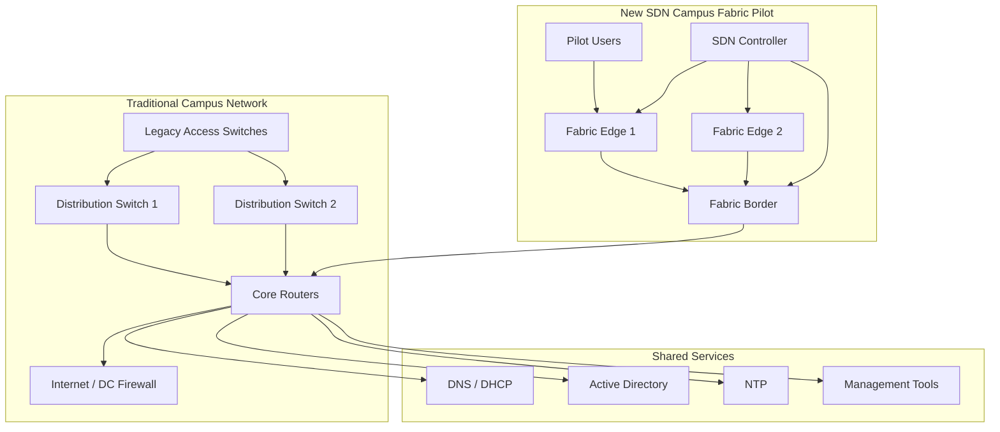
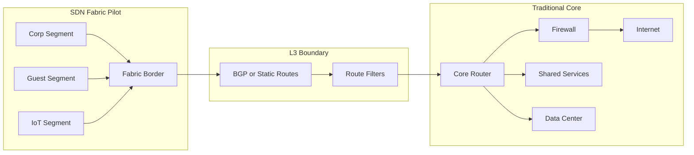
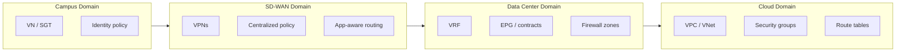
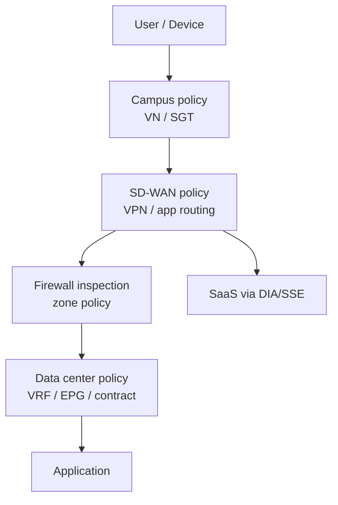
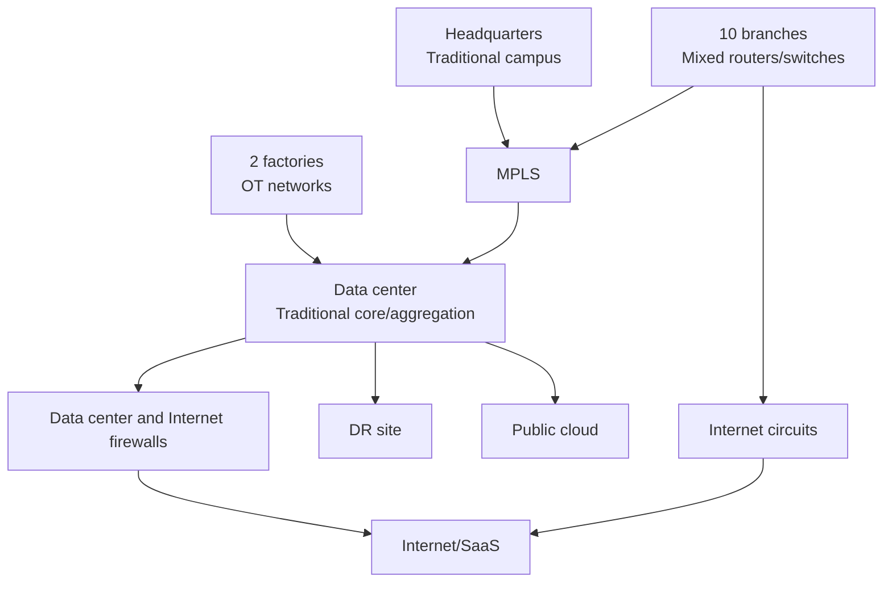
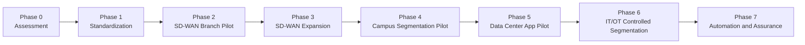

# Day 2 Lab - SDN Integration and Deployment Scenario Exercises

## 1. Lab Purpose

Day 2 theory focused on SDN integration and deployment in brownfield enterprise networks. This lab turns those topics into scenario-based design and troubleshooting exercises.

Unlike Day 1, this lab is not primarily a command-by-command Mininet exercise. Day 2 is about architecture decisions:

- How does an SDN domain connect to a traditional network?
- How should routing be exchanged?
- How is segmentation preserved across domains?
- Where should firewalls and policy enforcement sit?
- How should migration be phased?
- What should be validated before and after change?
- What is the rollback plan?

The goal is to make learners think like enterprise network architects, not only device operators.

## 2. Target Audience

This lab is for experienced network engineers who understand:

- VLANs, VRFs, ACLs, firewall zones.
- OSPF/BGP/static routing.
- WAN and branch connectivity.
- SD-WAN concepts.
- Basic campus/data center architecture.
- Change management and maintenance windows.

## 3. Lab Format

This lab contains three scenario exercises:

1. **Exercise 1 - Integrating an SDN Fabric with a Traditional Core**
2. **Exercise 2 - Segmentation Mapping Across Campus, SD-WAN, and Data Center**
3. **Exercise 3 - Brownfield Migration Plan for a Multi-Site Enterprise**

Each exercise includes:

- Scenario.
- Current state.
- Requirements.
- Tasks.
- Expected deliverables.
- Instructor guidance.
- Suggested answer framework.
- Review questions.

Recommended duration: 3.5 to 4 hours.

Suggested timing:

| Section | Time |
|---|---:|
| Instructor briefing | 15 min |
| Exercise 1 | 60 min |
| Exercise 2 | 70 min |
| Exercise 3 | 75 min |
| Group presentation and debrief | 30-40 min |

## 4. Required Tools

Minimum:

- Whiteboard or digital diagramming tool.
- Markdown editor, PowerPoint, draw.io, Visio, Lucidchart, or similar.
- Access to Day 2 theory document.

Optional:

- EVE-NG/GNS3/Cisco CML for routing simulation.
- Mininet for simple reachability demonstration.
- Spreadsheet for policy matrix.
- NetBox/Nautobot demo for source-of-truth discussion.

This lab can be completed fully as a design workshop without a simulator.

## 5. Student Deliverables

Each group should submit:

- One architecture diagram per exercise.
- Routing integration plan.
- Segmentation mapping table.
- Security enforcement decision.
- Validation checklist.
- Rollback plan.
- Short explanation of risks and trade-offs.

## 6. Exercise 1 - Integrating an SDN Fabric with a Traditional Core

## 6.1 Scenario

Your enterprise is piloting a new SDN campus fabric in one building. The rest of the campus still uses a traditional core/distribution/access design.

The new SDN fabric must connect to the existing traditional core so users in the fabric can access:

- Data center applications.
- Internet through existing firewall.
- Shared services: DNS, DHCP, NTP, Active Directory.
- Existing management network.

The organization wants a safe pilot with limited blast radius.

## 6.2 Current-State Network

## 6.3 Technical Facts

Existing traditional network:

- Core uses OSPF internally.
- Internet and data center traffic goes through the firewall.
- User VLANs are currently routed at distribution switches.
- Shared services are reachable through the core.
- Management network is in a separate VRF.

Pilot SDN fabric:

- Has a fabric border connecting to the traditional core.
- Has two fabric edge switches.
- Has three pilot segments:
  - Corporate users.
  - Guest users.
  - IoT devices.
- The controller is deployed in the management network.

## 6.4 Requirements

Functional requirements:

- Corporate users in the SDN fabric must access shared services and data center apps.
- Guest users must access Internet only.
- IoT devices must access only the IoT platform in the data center.
- Management tools must reach fabric switches and controller.
- Existing legacy users must not be disrupted.

Security requirements:

- Guest cannot access corporate or management networks.
- IoT cannot access corporate user networks.
- Fabric management must be restricted.
- All guest Internet traffic must pass through existing firewall.

Operational requirements:

- Pilot must be reversible.
- Routing changes must be limited.
- Existing OSPF domain must not be destabilized.
- Monitoring must show fabric border and edge status.

## 6.5 Student Tasks

### Task 1 - Define the Integration Boundary

Decide:

- Where is the SDN-to-traditional boundary?
- Is the boundary Layer 2 or Layer 3?
- Which device owns routing between fabric and core?
- Where is the default route for each segment?

### Task 2 - Choose Routing Method

Choose one:

- Static routing.
- OSPF.
- BGP.
- Hybrid static plus dynamic routing.

Explain why.

### Task 3 - Define Route Exchange

Create a table:

| Prefix/Segment | Advertised From | Advertised To | Method | Notes |
|---|---|---|---|---|
| Corporate pilot prefix | Fabric border | Core |  |  |
| Guest prefix | Fabric border | Firewall/core |  |  |
| IoT prefix | Fabric border | Core/firewall |  |  |
| Shared services | Core | Fabric border |  |  |
| Default route | Core/firewall | Fabric border |  |  |
| Management | Core mgmt VRF | Controller/fabric devices |  |  |

### Task 4 - Define Security Enforcement

Decide where to enforce:

- Guest Internet-only policy.
- IoT-to-IoT-platform policy.
- Corporate-to-application access.
- Management access.

### Task 5 - Validation Plan

Define pre-checks and post-checks.

Pre-check examples:

- Backup core and border config.
- Confirm current OSPF neighbors.
- Confirm current route table.
- Confirm firewall rules.
- Confirm management reachability.
- Confirm controller health.

Post-check examples:

- Corporate user reaches DNS/AD/apps.
- Guest reaches Internet only.
- Guest cannot reach internal networks.
- IoT reaches IoT platform only.
- Management reaches fabric nodes.
- No unexpected routes appear in core.

### Task 6 - Rollback Plan

Define:

- Trigger conditions.
- Steps to remove routes.
- Steps to shut or disconnect pilot border.
- Steps to restore previous firewall behavior if changed.
- Validation after rollback.

## 6.6 Suggested Answer Framework

Recommended integration approach:

- Use a Layer 3 boundary between fabric border and traditional core.
- Avoid extending legacy VLANs into the SDN fabric during the pilot.
- Use BGP or static routing for the pilot boundary rather than injecting many fabric routes into OSPF directly.
- Use route filtering and summarization.
- Keep guest and IoT separated with dedicated VRF/VN/segment mapping.
- Send guest traffic to firewall/Internet path only.
- Keep management in a controlled management VRF or equivalent.

Recommended architecture:

## 6.7 Review Questions

1. Why is a Layer 3 boundary usually safer than Layer 2 extension for an SDN pilot?
2. Why should route filtering be used at the boundary?
3. What could go wrong if guest routes are leaked into the wrong VRF?
4. Why should the pilot have a clear rollback trigger?
5. What evidence proves the pilot did not disrupt the legacy network?

## 7. Exercise 2 - Segmentation Mapping Across Campus, SD-WAN, and Data Center

## 7.1 Scenario

The enterprise already has Cisco SD-WAN for branch connectivity. The company now wants to extend segmentation from campus and branch users to data center applications.

The business wants consistent policy for:

- Corporate users.
- Guest users.
- IoT devices.
- OT systems.
- Management users.
- Server applications.

The challenge is that each domain uses different segmentation constructs.

## 7.2 Current and Target Domains

## 7.3 Requirements

Business policy:

- Corporate users can access ERP, CRM, DNS, AD, and approved SaaS.
- Guest users can access Internet only.
- IoT devices can access IoT platform only.
- OT systems can access historian and jump host only.
- Management users can access network devices and controllers.
- Server-to-server communication must be limited by application dependency.

Technical requirement:

- Preserve segmentation across campus, WAN, and data center.
- Avoid using one flat corporate routing domain.
- Log denied traffic for security review.
- Provide a policy matrix.
- Identify where each policy is enforced.

## 7.4 Student Tasks

### Task 1 - Build Segment Catalog

Complete the table:

| Segment | Purpose | Campus Mapping | SD-WAN Mapping | Data Center Mapping | Cloud Mapping |
|---|---|---|---|---|---|
| Corporate | Employee access |  |  |  |  |
| Guest | Internet-only |  |  |  |  |
| IoT | Device access |  |  |  |  |
| OT | Industrial systems |  |  |  |  |
| Management | Admin access |  |  |  |  |
| Server | Application hosting |  |  |  |  |

### Task 2 - Build Policy Matrix

Complete the matrix:

| Source | Destination | Access | Enforcement Point | Logging | Notes |
|---|---|---|---|---|---|
| Corporate | ERP | HTTPS permit |  | Yes |  |
| Corporate | SaaS | HTTPS permit |  | Yes |  |
| Guest | Internet | DNS/HTTP/HTTPS permit |  | Yes |  |
| Guest | Internal | Deny |  | Yes |  |
| IoT | IoT platform | Required ports permit |  | Yes |  |
| IoT | Corporate | Deny |  | Yes |  |
| OT | Historian | Required ports permit |  | Yes |  |
| OT | Corporate | Deny by default |  | Yes |  |
| Management | Network devices | SSH/HTTPS/SNMP permit |  | Yes |  |
| Server App | Server DB | App-specific permit |  | Yes |  |

### Task 3 - Draw Policy Enforcement Map

Show where policy is enforced:

- Campus fabric.
- SD-WAN edge.
- Data center fabric.
- Firewall.
- Cloud security group.
- SSE/SASE if used.

### Task 4 - Define Routing and Segmentation Rules

Answer:

- Which segments require separate routing tables?
- Which segments can share routing but use group policy?
- Which routes are leaked between segments?
- Which traffic must be forced through firewall?
- Which traffic can be enforced by fabric policy?

### Task 5 - Identify Operational Risks

List risks:

- Policy mismatch across domains.
- Missing route leaking.
- Firewall object mismatch.
- SGT/EPG/VPN mapping confusion.
- Guest accidentally reaching internal resources.
- OT dependencies unknown.
- Cloud security group not aligned with enterprise policy.

## 7.5 Suggested Answer Framework

Example segment mapping:

| Segment | Campus Mapping | SD-WAN Mapping | Data Center Mapping | Cloud Mapping |
|---|---|---|---|---|
| Corporate | VN Corp + SGT Corp | VPN 10 | VRF Corp | Corp VNet/VPC |
| Guest | VN Guest | VPN 20 or DIA-only | No DC access | Internet only |
| IoT | VN IoT + SGT IoT | VPN 30 | Shared services VRF/EPG | IoT app VPC if needed |
| OT | Separate OT VN/domain | VPN 40 | Historian DMZ | Usually no direct cloud |
| Management | VN Mgmt | VPN 99 | Mgmt VRF | Mgmt subnet |
| Server | N/A | DC route target | ACI VRF/EPG | App VPC/VNet |

Example enforcement model:

Important conclusion:

> Segmentation is not one object. It is a mapping of identity, routing, policy, and enforcement across multiple domains.

## 7.6 Review Questions

1. Why is segmentation mapping harder in multi-domain SDN?
2. What is the difference between macrosegmentation and group-based policy?
3. Which traffic should always go through firewall inspection?
4. Why is cloud security group alignment important?
5. What could happen if the SD-WAN VPN mapping does not match campus segmentation?

## 8. Exercise 3 - Brownfield Migration Plan for a Multi-Site Enterprise

## 8.1 Scenario

The enterprise wants to move from traditional network operations toward SDN over 12-18 months.

The board expects:

- Faster branch rollout.
- Better segmentation.
- Reduced manual configuration.
- Better visibility.
- Lower operational risk.

The technical teams are concerned about:

- Legacy applications.
- Incomplete documentation.
- Firewall policy complexity.
- OT sensitivity.
- Hardware readiness.
- Limited automation experience.

Your group must create a realistic migration plan.

## 8.2 Enterprise Current State

## 8.3 Problems Identified

Technical problems:

- Branch configs are inconsistent.
- VLAN IDs differ by site.
- Some ACLs are undocumented.
- Firewall rules contain old objects.
- No central source of truth.
- Monitoring is device-centric.
- Data center application dependencies are unclear.
- OT traffic flows are poorly documented.

Operational problems:

- Changes require multiple teams.
- Rollback plans are inconsistent.
- Documentation is updated manually.
- Many changes are made by CLI.
- No automated compliance check.
- Troubleshooting across branch/WAN/DC is slow.

## 8.4 Target Capabilities

The enterprise wants:

- SD-WAN for standardized branch connectivity.
- Campus segmentation for users, guest, IoT, and management.
- Data center segmentation for critical applications.
- IT/OT separation with industrial DMZ.
- Cloud connectivity through controlled routing.
- Source of truth.
- Automation for low-risk repetitive tasks.
- Monitoring and assurance dashboards.

## 8.5 Student Tasks

### Task 1 - Define Migration Principles

Write 5-8 principles.

Examples:

- Do not migrate unknown dependencies.
- Underlay stability before overlay expansion.
- Pilot before mass rollout.
- Segment gradually.
- Automate only standardized processes.
- Every migration wave must have rollback.
- Security policy must have an owner.

### Task 2 - Build Migration Roadmap

Create a phased roadmap:

| Phase | Name | Scope | Goals | Exit Criteria |
|---|---|---|---|---|
| 0 | Assessment |  |  |  |
| 1 | Standardization |  |  |  |
| 2 | SD-WAN pilot/expansion |  |  |  |
| 3 | Campus pilot |  |  |  |
| 4 | Data center pilot |  |  |  |
| 5 | IT/OT segmentation |  |  |  |
| 6 | Automation and assurance |  |  |  |

### Task 3 - Select First Pilot

Choose one:

- New branch.
- Existing low-risk branch.
- Guest network in HQ.
- IoT segment in one building.
- Non-critical data center application.

Justify your choice.

### Task 4 - Define Readiness Checklist

Create a checklist:

- Hardware readiness.
- Software version.
- IP plan.
- Routing design.
- Firewall policy.
- Application dependency.
- Monitoring.
- Backup.
- Rollback.
- User acceptance.

### Task 5 - Define Success Metrics

Examples:

- Branch deployment time reduced by 50%.
- Configuration compliance above 95%.
- Mean time to troubleshoot reduced.
- Guest/internal segmentation validated.
- Number of manual changes reduced.
- Monitoring coverage improved.
- Policy exceptions documented.

### Task 6 - Risk Register

Complete the table:

| Risk | Impact | Likelihood | Mitigation | Owner |
|---|---|---|---|---|
| Unknown application dependency | High | High | Dependency discovery and pilot | App/Network |
| Wrong route advertisement | High | Medium | Route filters and rollback | Network |
| OT disruption | High | Medium | Passive discovery and OT approval | OT/Security |
| Automation error | Medium | Medium | Pre-checks, staging, approval | NetOps |
| Firewall policy mismatch | High | Medium | Joint policy review | Security |

## 8.6 Suggested Answer Framework

Recommended roadmap:

Recommended first pilot:

- A new branch or low-risk existing branch.

Reason:

- SD-WAN knowledge already exists.
- Branch templates provide clear value.
- Blast radius is limited.
- Success metrics are measurable.
- Rollback can be planned with old router/path.

Alternative pilot:

- Guest segmentation in HQ.

Reason:

- Clear security requirement.
- Limited access needs.
- Easier to validate: Internet works, internal access denied.

Avoid as first pilot:

- Core data center migration.
- OT production cell.
- Executive building.
- Highly customized legacy branch.

## 8.7 Review Questions

1. Why should assessment come before SDN product deployment?
2. Why is a new branch often a good SDN pilot?
3. Why should OT not usually be the first migration domain?
4. What makes a good migration exit criterion?
5. How do you prove SDN delivered business value?

## 9. Group Presentation Format

Each group presents for 7-10 minutes.

Presentation should include:

- Exercise selected or all exercise summary.
- Architecture diagram.
- Key design decisions.
- Routing and segmentation model.
- Security enforcement points.
- Migration/validation/rollback.
- Risks and mitigations.

Instructor should challenge each group with:

- What happens if the controller fails?
- Where is the default route?
- How do you avoid route leaks?
- How do you prove guest cannot access internal systems?
- What is your rollback trigger?
- Who owns the policy matrix?

## 10. Instructor Scoring Rubric

| Area | Weight | Criteria |
|---|---:|---|
| Architecture clarity | 20% | Clear boundaries, correct domain separation |
| Routing design | 15% | Safe route exchange, filtering, default route logic |
| Segmentation design | 20% | Clear segment mapping and policy matrix |
| Security integration | 15% | Enforcement points, firewall/NAT/identity considered |
| Migration realism | 15% | Phased plan, pilot, readiness, rollback |
| Operational thinking | 15% | Monitoring, ownership, validation, documentation |

## 11. Common Mistakes to Watch For

Common mistakes:

- Extending Layer 2 everywhere because it feels easy.
- Injecting too many routes into the legacy core.
- Ignoring return path.
- Treating segmentation as only VLANs.
- Forgetting firewall policy ownership.
- Not separating guest from corporate routing.
- Allowing IoT or OT broad access.
- Choosing OT or core data center as first pilot.
- Automating before standardizing data.
- Writing migration phases without exit criteria.
- No rollback trigger.

## 12. Key Takeaways

- Day 2 is about integration boundaries.
- SDN-to-traditional integration must be designed around routing, segmentation, security, and operations.
- Multi-domain segmentation requires mapping between different constructs such as VN, SGT, VPN, VRF, EPG, firewall zone, and cloud security group.
- Brownfield migration must be phased, validated, and reversible.
- A good pilot has limited blast radius and measurable success.
- The best SDN design is not the most advanced one; it is the safest design that solves real business problems.

