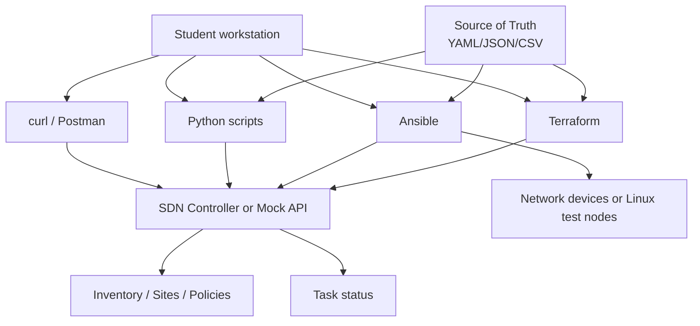
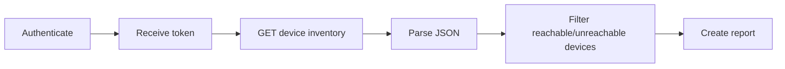
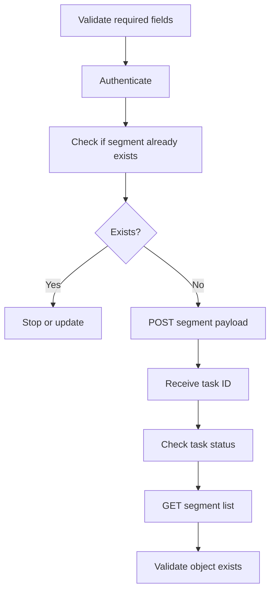
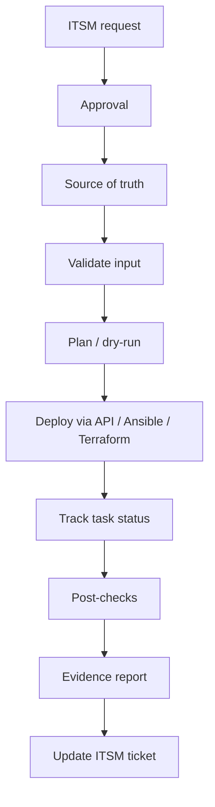

# Day 3 Lab - SDN Automation with REST APIs, Ansible, and Terraform

## 1. Lab Purpose

Day 3 theory covered SDN automation, APIs, source of truth, idempotency, Ansible, Terraform, and infrastructure as code.

This lab gives learners practical automation exercises that can be completed with either:

- A real SDN controller, such as Cisco Catalyst Center, Cisco SD-WAN Manager, Cisco ACI APIC, or a DevNet sandbox.
- A mock REST API server provided by the instructor.
- A local JSON file workflow if no controller or Internet access is available.

The lab focuses on safe automation patterns:

- Read first.
- Validate input.
- Make small changes.
- Track task status.
- Run post-checks.
- Avoid hardcoded secrets.
- Produce evidence.

## 2. Lab Format

The lab contains four exercises:

1. **Exercise 1 - REST API Inventory Collection**
2. **Exercise 2 - REST API Configuration or Policy Object Creation**
3. **Exercise 3 - Ansible Network Automation Workflow**
4. **Exercise 4 - Terraform-Style Infrastructure as Code Workflow**

Recommended duration: 4 to 4.5 hours.

Suggested timing:

| Section | Time |
|---|---:|
| Instructor briefing | 15 min |
| Environment verification | 20 min |
| Exercise 1 | 45 min |
| Exercise 2 | 60 min |
| Exercise 3 | 70 min |
| Exercise 4 | 60 min |
| Review and discussion | 30 min |

## 3. Required Tools

Student machine or shared lab VM:

- Linux/macOS terminal or Windows with WSL.
- Python 3.
- curl.
- jq.
- Git.
- Ansible.
- Terraform.
- VS Code or text editor.
- Postman optional.

Install examples on Ubuntu:

```bash
sudo apt update
sudo apt install -y python3 python3-pip curl jq git ansible unzip
```

Terraform installation should follow current HashiCorp guidance or use a prebuilt lab VM.

Check tools:

```bash
python3 --version
curl --version
jq --version
ansible --version
terraform version
git --version
```

## 4. Lab Topology and Automation Architecture



## 5. Instructor Preparation

Choose one lab mode.

## 5.1 Mode A - Real Controller

Use this mode if you have access to:

- Cisco Catalyst Center.
- Cisco SD-WAN Manager.
- Cisco ACI APIC.
- Cisco DevNet sandbox.
- Any SDN controller with REST API.

Instructor must provide:

- Controller URL.
- Username/password or token workflow.
- API documentation link.
- Read-only endpoint for inventory.
- Safe write endpoint for object creation or tag/label/policy object.
- Cleanup steps.

Recommended safety:

- Use lab-only accounts.
- Use limited privileges.
- Use test sites or test objects.
- Avoid production controllers.

## 5.2 Mode B - Mock API Server

Use this mode when no real controller is available.

Instructor can run a simple mock API server that behaves like a small SDN controller:

- Authentication returns a token.
- Inventory endpoint returns devices.
- Segment endpoint allows creating a segment.
- Task endpoint returns completion status.

This lab guide includes a mock server script in Section 7.

## 5.3 Mode C - Offline JSON Workflow

Use this mode if no server is available.

Students use JSON files as mock API responses and focus on:

- Parsing.
- Validation.
- Payload creation.
- Ansible/Terraform structure.

Mode C is less realistic but still useful for learning automation logic.

## 6. Lab Deliverables

Each student or group should submit:

- API inventory output.
- Parsed device table.
- Example JSON payload.
- Evidence of API task status or mock task status.
- Ansible inventory and playbook.
- Terraform configuration or pseudo-provider workflow.
- Short explanation of pre-checks, post-checks, and rollback.
- Answers to review questions.

## 7. Optional Mock SDN API Server

Use this section if no real controller is available.

Create a working directory:

```bash
mkdir -p ~/sdn-day3-lab
cd ~/sdn-day3-lab
```

Create `mock_sdn_api.py`:

```python
from http.server import BaseHTTPRequestHandler, HTTPServer
import json
import time
import uuid


TOKENS = set()
TASKS = {}
SEGMENTS = []

DEVICES = [
    {
        "id": "dev-001",
        "hostname": "hq-core-01",
        "role": "core",
        "site": "HQ",
        "managementIp": "10.10.0.11",
        "status": "reachable",
        "softwareVersion": "17.9.5"
    },
    {
        "id": "dev-002",
        "hostname": "branch-01-edge-01",
        "role": "sdwan-edge",
        "site": "BRANCH-01",
        "managementIp": "10.20.1.11",
        "status": "reachable",
        "softwareVersion": "17.9.5"
    },
    {
        "id": "dev-003",
        "hostname": "branch-02-edge-01",
        "role": "sdwan-edge",
        "site": "BRANCH-02",
        "managementIp": "10.20.2.11",
        "status": "unreachable",
        "softwareVersion": "17.6.4"
    },
    {
        "id": "dev-004",
        "hostname": "dc-leaf-01",
        "role": "data-center-leaf",
        "site": "DC-01",
        "managementIp": "10.30.0.21",
        "status": "reachable",
        "softwareVersion": "10.2"
    }
]


def send_json(handler, code, payload):
    body = json.dumps(payload, indent=2).encode()
    handler.send_response(code)
    handler.send_header("Content-Type", "application/json")
    handler.send_header("Content-Length", str(len(body)))
    handler.end_headers()
    handler.wfile.write(body)


class MockSDNHandler(BaseHTTPRequestHandler):
    def _authorized(self):
        auth = self.headers.get("Authorization", "")
        if not auth.startswith("Bearer "):
            return False
        token = auth.split(" ", 1)[1]
        return token in TOKENS

    def do_POST(self):
        length = int(self.headers.get("Content-Length", 0))
        raw_body = self.rfile.read(length) if length else b"{}"
        try:
            body = json.loads(raw_body.decode())
        except Exception:
            body = {}

        if self.path == "/api/v1/auth/token":
            username = body.get("username")
            password = body.get("password")
            if username == "admin" and password == "admin":
                token = str(uuid.uuid4())
                TOKENS.add(token)
                send_json(self, 200, {"token": token})
            else:
                send_json(self, 401, {"error": "invalid credentials"})
            return

        if not self._authorized():
            send_json(self, 401, {"error": "missing or invalid token"})
            return

        if self.path == "/api/v1/segments":
            required = ["name", "vrf", "site", "description"]
            missing = [field for field in required if field not in body]
            if missing:
                send_json(self, 400, {"error": "missing required fields", "missing": missing})
                return

            if any(seg["name"] == body["name"] and seg["site"] == body["site"] for seg in SEGMENTS):
                send_json(self, 409, {"error": "segment already exists"})
                return

            segment = {
                "id": "seg-" + str(uuid.uuid4())[:8],
                "name": body["name"],
                "vrf": body["vrf"],
                "site": body["site"],
                "description": body["description"]
            }
            SEGMENTS.append(segment)
            task_id = "task-" + str(uuid.uuid4())[:8]
            TASKS[task_id] = {
                "taskId": task_id,
                "status": "completed",
                "createdAt": int(time.time()),
                "result": "segment created",
                "segment": segment
            }
            send_json(self, 202, {"taskId": task_id, "message": "segment creation accepted"})
            return

        send_json(self, 404, {"error": "not found"})

    def do_GET(self):
        if self.path == "/api/v1/health":
            send_json(self, 200, {"status": "healthy", "controller": "mock-sdn-api"})
            return

        if not self._authorized():
            send_json(self, 401, {"error": "missing or invalid token"})
            return

        if self.path == "/api/v1/devices":
            send_json(self, 200, {"devices": DEVICES})
            return

        if self.path == "/api/v1/segments":
            send_json(self, 200, {"segments": SEGMENTS})
            return

        if self.path.startswith("/api/v1/tasks/"):
            task_id = self.path.rsplit("/", 1)[-1]
            task = TASKS.get(task_id)
            if not task:
                send_json(self, 404, {"error": "task not found"})
                return
            send_json(self, 200, task)
            return

        send_json(self, 404, {"error": "not found"})

    def log_message(self, format, *args):
        print("%s - %s" % (self.address_string(), format % args))


if __name__ == "__main__":
    server = HTTPServer(("0.0.0.0", 8080), MockSDNHandler)
    print("Mock SDN API listening on http://0.0.0.0:8080")
    print("Login: admin / admin")
    server.serve_forever()
```

Start the mock API:

```bash
python3 mock_sdn_api.py
```

In another terminal, test health:

```bash
curl http://127.0.0.1:8080/api/v1/health | jq
```

Expected output:

```json
{
  "status": "healthy",
  "controller": "mock-sdn-api"
}
```

## 8. Exercise 1 - REST API Inventory Collection

## 8.1 Objective

Authenticate to an SDN controller or mock API, retrieve device inventory, parse JSON, and produce a useful device report.

## 8.2 Workflow



## 8.3 Steps Using Mock API

Set variables:

```bash
export API_URL="http://127.0.0.1:8080"
export API_USER="admin"
export API_PASS="admin"
```

Authenticate:

```bash
export TOKEN=$(curl -s -X POST "$API_URL/api/v1/auth/token" \
  -H "Content-Type: application/json" \
  -d "{\"username\":\"$API_USER\",\"password\":\"$API_PASS\"}" | jq -r .token)
```

Verify token:

```bash
echo "$TOKEN"
```

Retrieve devices:

```bash
curl -s "$API_URL/api/v1/devices" \
  -H "Authorization: Bearer $TOKEN" | jq
```

Create a concise table:

```bash
curl -s "$API_URL/api/v1/devices" \
  -H "Authorization: Bearer $TOKEN" \
  | jq -r '.devices[] | [.hostname, .role, .site, .managementIp, .status, .softwareVersion] | @tsv'
```

Filter unreachable devices:

```bash
curl -s "$API_URL/api/v1/devices" \
  -H "Authorization: Bearer $TOKEN" \
  | jq '.devices[] | select(.status != "reachable")'
```

## 8.4 Python Version

Create `inventory_report.py`:

```python
import os
import requests


api_url = os.environ.get("API_URL", "http://127.0.0.1:8080")
username = os.environ.get("API_USER", "admin")
password = os.environ.get("API_PASS", "admin")


def login():
    response = requests.post(
        f"{api_url}/api/v1/auth/token",
        json={"username": username, "password": password},
        timeout=10,
    )
    response.raise_for_status()
    return response.json()["token"]


def get_devices(token):
    response = requests.get(
        f"{api_url}/api/v1/devices",
        headers={"Authorization": f"Bearer {token}"},
        timeout=10,
    )
    response.raise_for_status()
    return response.json()["devices"]


def main():
    token = login()
    devices = get_devices(token)

    print(f"{'Hostname':25} {'Role':20} {'Site':12} {'IP':15} {'Status':12} {'Version'}")
    print("-" * 95)
    for device in devices:
        print(
            f"{device['hostname']:25} "
            f"{device['role']:20} "
            f"{device['site']:12} "
            f"{device['managementIp']:15} "
            f"{device['status']:12} "
            f"{device['softwareVersion']}"
        )

    unreachable = [device for device in devices if device["status"] != "reachable"]
    if unreachable:
        print("\nUnreachable devices:")
        for device in unreachable:
            print(f"- {device['hostname']} at {device['site']}")


if __name__ == "__main__":
    main()
```

Install dependency if needed:

```bash
python3 -m pip install requests
```

Run:

```bash
python3 inventory_report.py
```

## 8.5 Expected Observations

- API authentication returns a token.
- Device inventory is structured JSON.
- `jq` or Python can extract useful operational reports.
- Read-only automation is safe and valuable.

## 8.6 Review Questions

1. Why should automation start with read-only workflows?
2. What is the difference between inventory and source of truth?
3. Why should scripts check HTTP status codes?
4. What would you add to make this report production-ready?

## 9. Exercise 2 - REST API Configuration or Policy Object Creation

## 9.1 Objective

Create a new segment object through an API, track task status, and validate the result.

This exercise demonstrates controlled write automation.

## 9.2 Scenario

The network team needs to create a new guest segment for `BRANCH-03`.

Required segment:

| Field | Value |
|---|---|
| Name | guest-branch-03 |
| VRF | guest |
| Site | BRANCH-03 |
| Description | Guest Internet-only segment for Branch 03 |

## 9.3 Workflow



## 9.4 Create Payload

Create `segment_guest_branch_03.json`:

```json
{
  "name": "guest-branch-03",
  "vrf": "guest",
  "site": "BRANCH-03",
  "description": "Guest Internet-only segment for Branch 03"
}
```

## 9.5 Submit API Request

```bash
curl -s -X POST "$API_URL/api/v1/segments" \
  -H "Authorization: Bearer $TOKEN" \
  -H "Content-Type: application/json" \
  -d @segment_guest_branch_03.json | tee create_segment_response.json | jq
```

Extract task ID:

```bash
export TASK_ID=$(jq -r .taskId create_segment_response.json)
echo "$TASK_ID"
```

Check task status:

```bash
curl -s "$API_URL/api/v1/tasks/$TASK_ID" \
  -H "Authorization: Bearer $TOKEN" | jq
```

Validate segment exists:

```bash
curl -s "$API_URL/api/v1/segments" \
  -H "Authorization: Bearer $TOKEN" | jq
```

## 9.6 Error Handling Test

Try sending an incomplete payload:

```bash
cat > bad_segment.json <<'EOF'
{
  "name": "bad-segment"
}
EOF
```

Submit:

```bash
curl -s -X POST "$API_URL/api/v1/segments" \
  -H "Authorization: Bearer $TOKEN" \
  -H "Content-Type: application/json" \
  -d @bad_segment.json | jq
```

Expected:

- API returns error for missing required fields.

Try creating the same segment again:

```bash
curl -s -X POST "$API_URL/api/v1/segments" \
  -H "Authorization: Bearer $TOKEN" \
  -H "Content-Type: application/json" \
  -d @segment_guest_branch_03.json | jq
```

Expected:

- API returns conflict or duplicate object message.

## 9.7 Production Discussion

In a real SDN controller, creating a segment may require additional steps:

- Create VN/VRF.
- Map to site.
- Assign IP pool.
- Attach policy.
- Deploy to fabric.
- Verify task status.
- Validate endpoint behavior.
- Confirm firewall and routing integration.

## 9.8 Review Questions

1. Why is a `202 Accepted` response not enough to prove success?
2. Why should automation check for existing objects before creating new ones?
3. What would rollback mean for this segment?
4. What post-checks would you run before closing the change?

## 10. Exercise 3 - Ansible Network Automation Workflow

## 10.1 Objective

Use Ansible to perform repeatable automation tasks using inventory, variables, and playbooks.

This exercise uses local files and the mock API so it can run without physical routers.

## 10.2 Scenario

The operations team wants a repeatable workflow to:

- Load site variables.
- Generate a segment payload.
- Call the SDN API.
- Save evidence.

## 10.3 Directory Structure

Create:

```bash
mkdir -p ansible/{group_vars,output,payloads}
cd ansible
```

Create `inventory.yml`:

```yaml
all:
  hosts:
    localhost:
      ansible_connection: local
```

Create `group_vars/all.yml`:

```yaml
api_url: "http://127.0.0.1:8080"
api_user: "admin"
api_pass: "admin"

segment:
  name: "iot-branch-04"
  vrf: "iot"
  site: "BRANCH-04"
  description: "IoT device segment for Branch 04"
```

Create `payloads/segment.json.j2`:

```json
{
  "name": "{{ segment.name }}",
  "vrf": "{{ segment.vrf }}",
  "site": "{{ segment.site }}",
  "description": "{{ segment.description }}"
}
```

## 10.4 Create Ansible Playbook

Create `create_segment.yml`:

```yaml
---
- name: Create SDN segment through REST API
  hosts: localhost
  gather_facts: false

  tasks:
    - name: Validate required variables
      ansible.builtin.assert:
        that:
          - segment.name is defined
          - segment.vrf is defined
          - segment.site is defined
          - segment.description is defined
        fail_msg: "Required segment variables are missing."

    - name: Render JSON payload
      ansible.builtin.template:
        src: payloads/segment.json.j2
        dest: output/segment_payload.json

    - name: Authenticate to SDN API
      ansible.builtin.uri:
        url: "{{ api_url }}/api/v1/auth/token"
        method: POST
        body_format: json
        body:
          username: "{{ api_user }}"
          password: "{{ api_pass }}"
        status_code: 200
      register: login_result
      no_log: true

    - name: Store token
      ansible.builtin.set_fact:
        api_token: "{{ login_result.json.token }}"
      no_log: true

    - name: Get existing segments
      ansible.builtin.uri:
        url: "{{ api_url }}/api/v1/segments"
        method: GET
        headers:
          Authorization: "Bearer {{ api_token }}"
        status_code: 200
      register: existing_segments

    - name: Determine if segment already exists
      ansible.builtin.set_fact:
        segment_exists: >-
          {{
            existing_segments.json.segments
            | selectattr('name', 'equalto', segment.name)
            | selectattr('site', 'equalto', segment.site)
            | list
            | length > 0
          }}

    - name: Create segment when missing
      ansible.builtin.uri:
        url: "{{ api_url }}/api/v1/segments"
        method: POST
        headers:
          Authorization: "Bearer {{ api_token }}"
          Content-Type: "application/json"
        body_format: json
        body: "{{ lookup('file', 'output/segment_payload.json') | from_json }}"
        status_code: 202
      register: create_result
      when: not segment_exists

    - name: Save create result evidence
      ansible.builtin.copy:
        content: "{{ create_result | to_nice_json }}"
        dest: output/create_result.json
      when: not segment_exists

    - name: Show no-change message
      ansible.builtin.debug:
        msg: "Segment already exists. No change required."
      when: segment_exists

    - name: Check task status
      ansible.builtin.uri:
        url: "{{ api_url }}/api/v1/tasks/{{ create_result.json.taskId }}"
        method: GET
        headers:
          Authorization: "Bearer {{ api_token }}"
        status_code: 200
      register: task_result
      when: not segment_exists

    - name: Save task result evidence
      ansible.builtin.copy:
        content: "{{ task_result.json | to_nice_json }}"
        dest: output/task_result.json
      when: not segment_exists

    - name: Display task result
      ansible.builtin.debug:
        var: task_result.json
      when: not segment_exists
```

## 10.5 Run Playbook

```bash
ansible-playbook -i inventory.yml create_segment.yml
```

Run it again:

```bash
ansible-playbook -i inventory.yml create_segment.yml
```

Expected:

- First run creates the segment.
- Second run should detect that the segment already exists and report no change.

## 10.6 Review Generated Evidence

```bash
ls -l output
cat output/segment_payload.json | jq
cat output/task_result.json | jq
```

## 10.7 Discussion

This exercise demonstrates:

- Variable-driven automation.
- Payload templating.
- REST API calls through Ansible.
- Basic idempotency.
- Evidence collection.

Production improvements:

- Store secrets in Ansible Vault.
- Use formal schema validation.
- Integrate with source of truth.
- Add approval workflow.
- Add rollback.
- Add post-change reachability tests.

## 10.8 Review Questions

1. How does this playbook avoid duplicate segment creation?
2. Which tasks are pre-checks?
3. Which tasks are post-checks?
4. Why is `no_log: true` used?
5. What would you change before using this in production?

## 11. Exercise 4 - Terraform-Style Infrastructure as Code Workflow

## 11.1 Objective

Understand Terraform concepts: provider, resource, plan, apply, state, and drift.

Because not every SDN controller has a convenient Terraform provider in a generic classroom environment, this exercise uses the `local_file` provider to model infrastructure-as-code behavior safely.

The goal is to teach workflow and thinking, not a specific provider.

## 11.2 Scenario

The network team wants to manage segment definitions as code.

The desired segment catalog will be stored in Terraform and rendered as JSON artifacts that could later be consumed by API automation.

## 11.3 Create Terraform Working Directory

```bash
mkdir -p ~/sdn-day3-lab/terraform-segments
cd ~/sdn-day3-lab/terraform-segments
```

Create `main.tf`:

```hcl
terraform {
  required_version = ">= 1.0"

  required_providers {
    local = {
      source  = "hashicorp/local"
      version = "~> 2.5"
    }
  }
}

locals {
  segments = {
    corporate_branch_05 = {
      name        = "corporate-branch-05"
      vrf         = "corp"
      site        = "BRANCH-05"
      description = "Corporate user segment for Branch 05"
    }
    guest_branch_05 = {
      name        = "guest-branch-05"
      vrf         = "guest"
      site        = "BRANCH-05"
      description = "Guest Internet-only segment for Branch 05"
    }
  }
}

resource "local_file" "segment_json" {
  for_each = local.segments

  filename = "${path.module}/output/${each.value.name}.json"
  content  = jsonencode(each.value)
}

output "segment_files" {
  value = [for segment in local_file.segment_json : segment.filename]
}
```

## 11.4 Run Terraform

```bash
terraform init
terraform fmt
terraform validate
terraform plan
terraform apply
```

Approve with:

```text
yes
```

Review output:

```bash
ls -l output
cat output/guest-branch-05.json | jq
```

## 11.5 Modify Desired State

Edit `main.tf` and add a third segment:

```hcl
    iot_branch_05 = {
      name        = "iot-branch-05"
      vrf         = "iot"
      site        = "BRANCH-05"
      description = "IoT device segment for Branch 05"
    }
```

Run:

```bash
terraform fmt
terraform plan
```

Observe:

- Terraform shows what will be created before applying.

Apply:

```bash
terraform apply
```

## 11.6 Drift Demonstration

Manually edit one generated JSON file:

```bash
sed -i.bak 's/Guest Internet-only/Modified manually/' output/guest-branch-05.json
```

Run:

```bash
terraform plan
```

Expected:

- Terraform detects that the file content differs from desired state.

Apply to restore:

```bash
terraform apply
```

## 11.7 Discussion

This exercise demonstrates:

- Desired state.
- Plan before apply.
- State tracking.
- Drift detection.
- Version-controlled definitions.

In a real SDN environment, a Terraform provider might manage:

- Cloud network resources.
- Firewall objects.
- SDN policy objects.
- Controller templates.
- Site resources.

But Terraform must be used carefully:

- State file must be protected.
- Team state locking is required.
- Provider behavior must be understood.
- Destroy operations can be dangerous.

## 11.8 Review Questions

1. What is the purpose of `terraform plan`?
2. What does Terraform state track?
3. Why is manual change outside Terraform a drift risk?
4. Why must Terraform state be protected?
5. When would Terraform be better than Ansible?

## 12. Capstone Mini-Exercise - Design a Safe Automation Workflow

## 12.1 Scenario

Your enterprise wants to automate branch onboarding.

Each new branch requires:

- Site code.
- Hostnames.
- Management IPs.
- WAN transports.
- LAN prefixes.
- Guest segment.
- Corporate segment.
- IoT segment.
- NTP/SNMP/syslog.
- SD-WAN template variables.
- Monitoring registration.
- ITSM evidence.

## 12.2 Group Task

Design a workflow using:

- Source of truth.
- API calls.
- Ansible.
- Terraform if appropriate.
- Pre-checks.
- Post-checks.
- Rollback.
- Approval.

## 12.3 Required Diagram



## 12.4 Required Deliverables

- Workflow diagram.
- Required input fields.
- Tool selection.
- Failure handling.
- Rollback concept.
- Security controls.

## 13. Instructor Scoring Rubric

| Area | Weight | Criteria |
|---|---:|---|
| API understanding | 20% | Correct authentication, methods, status codes, task tracking |
| Safety controls | 20% | Pre-checks, post-checks, rollback, blast-radius awareness |
| Ansible workflow | 20% | Variables, templates, idempotency, evidence |
| Terraform workflow | 15% | Plan/apply/state/drift understood |
| Security | 15% | Credential handling, RBAC, no hardcoded secrets in production |
| Explanation | 10% | Clear reasoning and production readiness discussion |

## 14. Common Mistakes

Watch for:

- Hardcoding credentials.
- Treating token output casually.
- Ignoring HTTP status codes.
- Ignoring task status.
- Assuming API success means network success.
- Creating duplicate objects.
- Not validating input.
- Not collecting evidence.
- Confusing inventory with source of truth.
- Using Terraform without understanding state.
- Using Ansible without idempotency.

## 15. Cleanup

Stop mock API server with `Ctrl+C`.

Optional cleanup:

```bash
rm -rf ~/sdn-day3-lab
```

If keeping files for review, do not delete the directory.

## 16. Key Takeaways

- SDN automation should start with read-only inventory and reporting.
- REST APIs provide structured access to controller functions.
- Write automation must validate input, track tasks, and perform post-checks.
- Ansible is useful for operational workflows, templates, API calls, and orchestration.
- Terraform is useful for desired-state infrastructure workflows when provider support is mature.
- Source of truth defines intended state; controller inventory usually shows discovered state.
- Idempotency prevents duplicate or repeated unintended changes.
- Automation must include security controls for credentials and API access.
- Safe automation is governed, observable, and reversible.

