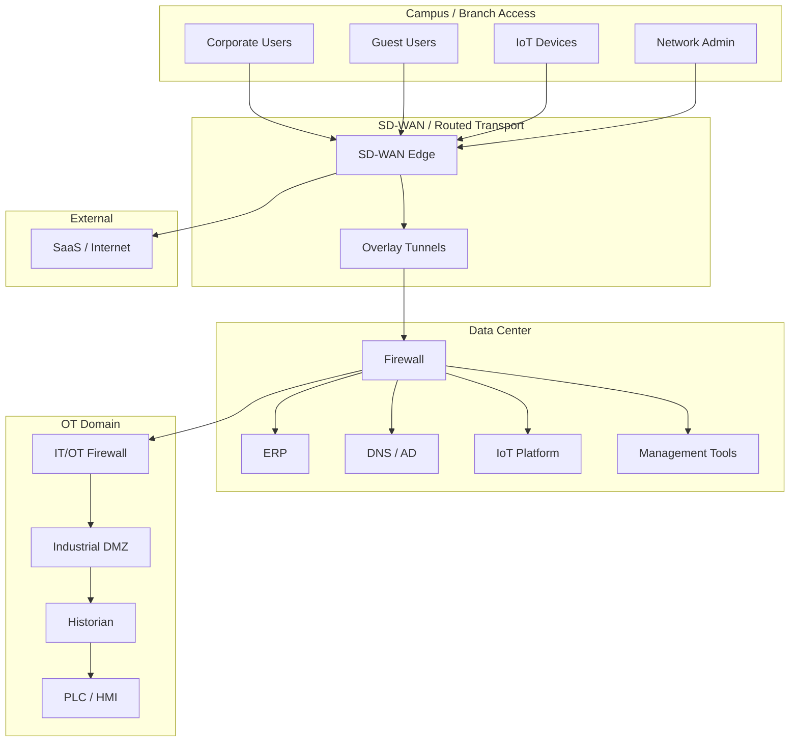
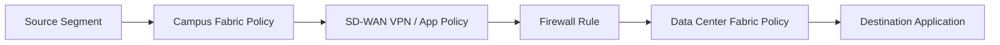
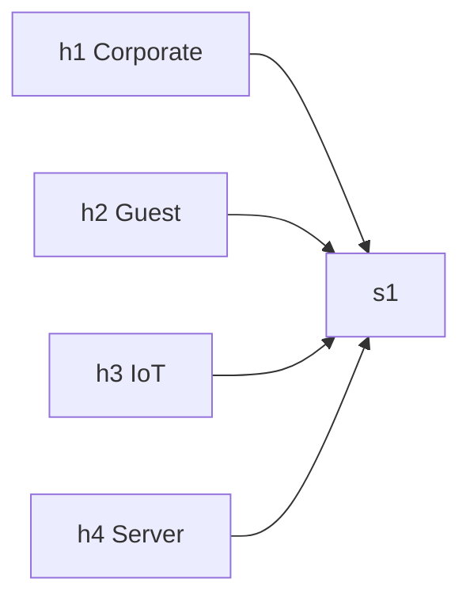
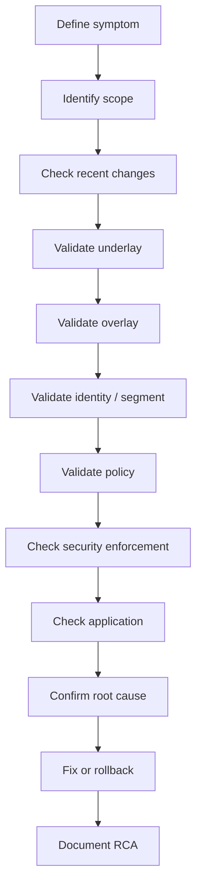

# Day 4 Lab - SDN Security, Monitoring, Assurance, and Troubleshooting

## 1. Lab Purpose

Day 4 theory focused on security, segmentation, monitoring, assurance, AI/ML operations, troubleshooting, incident response, and RCA in SDN environments.

This lab turns those topics into practical scenario exercises.

The goal is not only to test connectivity. The goal is to teach learners how to:

- Validate segmentation policy.
- Identify enforcement points.
- Collect health and telemetry evidence.
- Troubleshoot control plane, data plane, policy, identity, and automation-related issues.
- Write a short root-cause analysis.
- Build operational runbooks for SDN environments.

## 2. Lab Format

The lab contains four exercises:

1. **Exercise 1 - Segmentation and Policy Validation**
2. **Exercise 2 - SDN Health Monitoring and Assurance Dashboard Design**
3. **Exercise 3 - Troubleshooting Controlled Fault Scenarios**
4. **Exercise 4 - Incident Response and RCA Workshop**

Recommended duration: 4 hours.

Suggested timing:

| Section | Time |
|---|---:|
| Instructor briefing | 15 min |
| Exercise 1 | 60 min |
| Exercise 2 | 45 min |
| Exercise 3 | 90 min |
| Exercise 4 | 45 min |
| Review and debrief | 25 min |

## 3. Lab Modes

This lab can be run in three modes.

## 3.1 Mode A - Scenario Workshop Only

No simulator required.

Students use diagrams, policy matrices, logs, and fault descriptions to perform analysis and produce deliverables.

Best for:

- Architecture-focused courses.
- Classrooms without emulation servers.
- Senior learners who need design and operations practice.

## 3.2 Mode B - Mininet/Open vSwitch Practical Mode

Use Mininet and Open vSwitch to simulate simple segmentation and flow behavior.

Best for:

- Demonstrating allow/deny behavior.
- Showing flow counters.
- Practicing packet-path validation.

## 3.3 Mode C - Controller or Platform Mode

Use real or sandbox platforms:

- Cisco Catalyst Center / SD-Access sandbox.
- Cisco SD-WAN Manager sandbox.
- Cisco ACI APIC sandbox.
- EVE-NG/GNS3/CML with virtual routers/firewalls.
- Mock API from Day 3 extended with health/fault states.

Best for:

- Real API and dashboard experience.
- Controller health and task validation.
- Platform-specific troubleshooting.

## 4. Student Deliverables

Each group should submit:

- Segmentation policy matrix.
- Enforcement point map.
- Positive and negative test results.
- Monitoring and telemetry requirement list.
- Troubleshooting evidence for assigned fault.
- Short RCA report.
- Prevention actions.

## 5. Common Scenario for All Exercises

Enterprise network segments:

- Corporate users.
- Guest users.
- IoT devices.
- OT systems.
- Server applications.
- Management network.

Applications and services:

- ERP application in data center.
- DNS/AD shared services.
- IoT platform.
- OT historian.
- Network management tools.
- Internet/SaaS.

High-level target architecture:



## 6. Exercise 1 - Segmentation and Policy Validation

## 6.1 Objective

Design and validate segmentation policy for common enterprise segments.

Learners must prove both:

- Required traffic is allowed.
- Prohibited traffic is denied.

Positive testing alone is not enough.

## 6.2 Business Policy

Required policy:

- Corporate users can access ERP, DNS/AD, and approved SaaS.
- Guest users can access Internet only.
- IoT devices can access only the IoT platform and DNS if required.
- OT systems can send data to historian only.
- Network admins can access management tools and infrastructure devices.
- Server-to-server traffic is allowed only when application dependency is documented.
- All denied flows from Guest, IoT, and OT should be logged.

## 6.3 Student Task 1 - Build Policy Matrix

Complete the table:

| Source | Destination | Required Access | Action | Enforcement Point | Logging | Test Method |
|---|---|---|---|---|---|---|
| Corporate | ERP | HTTPS | Permit |  | Yes |  |
| Corporate | DNS/AD | DNS/Kerberos/LDAP as required | Permit |  | Yes |  |
| Corporate | Internet/SaaS | HTTPS | Permit |  | Yes |  |
| Guest | Internet | DNS/HTTP/HTTPS | Permit |  | Yes |  |
| Guest | Internal networks | Any | Deny |  | Yes |  |
| IoT | IoT platform | MQTT/HTTPS or app-specific | Permit |  | Yes |  |
| IoT | Corporate | Any | Deny |  | Yes |  |
| OT | Historian | Required industrial protocol | Permit |  | Yes |  |
| OT | Corporate | Any | Deny |  | Yes |  |
| Management | Network devices | SSH/HTTPS/SNMP | Permit |  | Yes |  |

## 6.4 Student Task 2 - Enforcement Point Map

Draw where policy is enforced.

Example:



Questions:

- Which policies are enforced at the access layer?
- Which policies are enforced at the firewall?
- Which policies are enforced in the data center fabric?
- Which policies require identity integration?
- Which policies require application-layer inspection?

## 6.5 Student Task 3 - Positive and Negative Test Plan

Create a test plan:

| Test ID | Source | Destination | Expected Result | Evidence |
|---|---|---|---|---|
| T01 | Corporate | ERP HTTPS | Permit | Ping/app test/firewall log |
| T02 | Guest | ERP HTTPS | Deny | Firewall/fabric deny log |
| T03 | Guest | Internet HTTPS | Permit | Browser/curl/log |
| T04 | IoT | Corporate SSH | Deny | Deny log |
| T05 | OT | Historian | Permit | App/port test |
| T06 | OT | Internet | Deny | Deny log |

Evidence examples:

- Controller policy status.
- Firewall log entry.
- Packet capture.
- Flow counter.
- Application test.
- Synthetic probe.
- SIEM event.

## 6.6 Optional Mininet Practical

If the instructor wants a lightweight command lab, use Linux hosts to represent segments.

Topology:



Start Mininet:

```bash
sudo mn --topo single,4 --mac --switch ovsk --controller none
```

Expected host roles:

- `h1`: Corporate.
- `h2`: Guest.
- `h3`: IoT.
- `h4`: Server.

Without controller or flows, traffic should fail.

Add broad permit flows:

```bash
sudo ovs-ofctl add-flow s1 "in_port=1,actions=output:4"
sudo ovs-ofctl add-flow s1 "in_port=4,actions=output:1"
```

Test:

```bash
h1 ping -c 3 h4
```

Add Guest-to-Server deny by not creating h2-to-h4 flows, or explicitly drop:

```bash
sudo ovs-ofctl add-flow s1 "priority=100,in_port=2,actions=drop"
```

Test:

```bash
h2 ping -c 3 h4
```

Inspect flows:

```bash
sudo ovs-ofctl dump-flows s1
```

Discussion:

- This is not a production segmentation model.
- It demonstrates enforcement logic and counters.
- Real enterprise segmentation would use VRFs, SGTs, EPGs, firewall zones, cloud security groups, or host policy.

## 6.7 Expected Learning

Learners should understand:

- A policy is incomplete without enforcement and testing.
- Deny tests are as important as permit tests.
- Logging must be designed, not assumed.
- Segmentation must map across multiple domains.

## 7. Exercise 2 - SDN Health Monitoring and Assurance Dashboard Design

## 7.1 Objective

Design monitoring and assurance requirements for an SDN environment.

The goal is to move beyond device up/down monitoring and define what a NOC or SOC needs to operate SDN safely.

## 7.2 Scenario

The enterprise has deployed:

- SD-WAN across branches.
- Pilot campus fabric at headquarters.
- Data center SDN fabric.
- Firewalls between major zones.
- Identity service for user/device classification.
- Basic monitoring using SNMP and syslog.

Leadership asks:

> How do we know the SDN environment is healthy, secure, and behaving as intended?

## 7.3 Student Task 1 - Monitoring Layer Design

Complete the table:

| Layer | What to Monitor | Data Source | Alert Example | Owner |
|---|---|---|---|---|
| Physical | Interfaces, power, hardware | SNMP/telemetry | Link down | NOC |
| Underlay | Routing, reachability, MTU | Routing table, probes | BGP neighbor down | Network |
| Overlay | Tunnels, endpoints | Controller/API | Tunnel down | Network |
| Controller | Services, cluster, tasks | Controller API/logs | Controller node degraded | Platform |
| Policy | Deployment status, deny logs | Controller/firewall | Policy deployment failed | Network/Security |
| Identity | Auth success/failure, group | ISE/RADIUS logs | Auth failure spike | Security/Network |
| Application | Latency, availability | Synthetic probe/APM | ERP latency high | App/NOC |
| Automation | Task success/failure | Pipeline logs | Playbook failed | NetOps |

## 7.4 Student Task 2 - Dashboard Design

Design four dashboards:

1. NOC dashboard.
2. Security dashboard.
3. Application experience dashboard.
4. Executive summary dashboard.

For each dashboard, define:

- Audience.
- Top 5 metrics.
- Alert thresholds.
- Drill-down links.
- Required data sources.

## 7.5 Student Task 3 - Assurance Logic

Define intended state vs actual state checks.

Examples:

| Intent | Actual State Check | Pass/Fail Logic |
|---|---|---|
| All branches have 2 tunnels | Controller tunnel API | Pass if both tunnels up |
| Guest cannot access internal | Firewall/fabric deny logs and synthetic test | Pass if denied |
| ERP reachable from corporate | Synthetic HTTPS test | Pass if HTTP 200 within SLA |
| IoT only reaches IoT platform | Flow logs | Pass if no unauthorized flows |
| Controller cluster healthy | Controller API | Pass if all services healthy |

## 7.6 AI/ML Discussion

For each use case, decide whether AI/ML is useful:

| Use Case | AI/ML Useful? | Why / Why Not |
|---|---|---|
| Detect unusual traffic from IoT |  |  |
| Predict WAN circuit saturation |  |  |
| Automatically modify firewall policy |  |  |
| Suggest root cause for branch outage |  |  |
| Identify abnormal authentication failures |  |  |

Expected conclusion:

- AI/ML is useful for detection, correlation, and recommendation.
- Automated remediation should be limited to low-risk actions until mature.

## 8. Exercise 3 - Troubleshooting Controlled Fault Scenarios

## 8.1 Objective

Practice structured SDN troubleshooting.

Each group receives one or more fault scenarios. They must identify:

- Symptom.
- Affected scope.
- Most likely layer.
- Evidence required.
- Root cause.
- Fix.
- Validation.
- Prevention.

## 8.2 Troubleshooting Method

Use this flow:



## 8.3 Fault Scenario A - Guest Can Reach Internal Server

Symptom:

- A test from Guest network successfully reaches an internal web server.

Expected behavior:

- Guest should access Internet only.

Provided evidence:

```text
Source: Guest segment
Destination: Internal web server 10.30.10.50 TCP/443
Recent change: Guest Internet breakout policy updated yesterday
Firewall log: permit guest-zone to inside-zone tcp/443
Controller policy: Guest segment exists
SD-WAN policy: Guest VPN has route to data center
```

Student tasks:

- Identify likely root cause.
- Identify missing control.
- Propose fix.
- Define validation tests.
- Define prevention action.

Suggested root cause:

- Guest route or firewall policy allows access to internal zone.
- Guest VPN/segment should not have data center route except required services, or firewall should deny guest-to-inside.

Fix:

- Remove guest route to internal networks or restrict route leaking.
- Add explicit deny guest-to-internal.
- Validate guest-to-Internet permit and guest-to-internal deny.

## 8.4 Fault Scenario B - Corporate Users Cannot Reach ERP

Symptom:

- Corporate users at Branch 02 cannot reach ERP in data center.

Expected behavior:

- Corporate users should access ERP over HTTPS.

Provided evidence:

```text
Affected site: BRANCH-02 only
Other branches: OK
SD-WAN tunnel: up
Branch underlay: reachable
DNS resolution: ERP resolves to 10.40.20.25
SD-WAN app policy: ERP traffic should use MPLS preferred, Internet backup
Firewall log: no matching traffic from Branch 02 corporate prefix
Recent change: Branch 02 template updated this morning
```

Student tasks:

- Decide whether issue is underlay, overlay, policy, routing, or application.
- List commands/API checks required.
- Propose likely root cause.
- Define fix and validation.

Suggested root cause candidates:

- Branch 02 corporate prefix not advertised into SD-WAN overlay.
- Wrong VPN/segment assigned in template.
- Local route missing.
- Policy incorrectly classifies ERP traffic.

Validation:

- Check Branch 02 route table.
- Check SD-WAN advertised routes.
- Check segment/VPN assignment.
- Generate test traffic and confirm firewall sees it.

## 8.5 Fault Scenario C - Tunnel Down After Certificate Renewal

Symptom:

- Several branch tunnels are down after a controller maintenance window.

Expected behavior:

- Tunnels should reconnect automatically.

Provided evidence:

```text
Affected: 5 branches
Underlay Internet: reachable
DNS to controller: works
NTP: one affected branch has clock drift
Controller log: certificate validation failed
Recent change: controller certificate renewed
```

Student tasks:

- Identify likely root cause.
- Explain why underlay can be healthy while overlay is down.
- Define checks.
- Define remediation.

Suggested root cause:

- Certificate trust or time synchronization issue.

Fix:

- Correct NTP.
- Validate certificate chain.
- Confirm controller and edge trust.
- Restart control connection if required.

## 8.6 Fault Scenario D - IoT Devices Reach Wrong Application

Symptom:

- IoT devices in Building A are sending traffic to a corporate application server.

Expected behavior:

- IoT devices should only reach IoT platform.

Provided evidence:

```text
Endpoint group: some IoT devices classified as Corporate
Authentication method: MAC authentication bypass
Identity system: device profile missing for new vendor OUI
Firewall log: traffic permitted as corporate segment
```

Suggested root cause:

- Identity/profiling issue caused wrong segment assignment.

Fix:

- Update endpoint profiling.
- Reassign devices to IoT group.
- Add compensating policy deny.
- Validate classification and access.

## 8.7 Fault Scenario E - API Automation Shows Success but Policy Not Active

Symptom:

- Automation pipeline reports success, but new deny policy is not enforced.

Provided evidence:

```text
API response: 202 Accepted
Task status: failed on 2 devices
Automation checked only HTTP response
Controller task detail: device unreachable during policy deployment
```

Suggested root cause:

- Automation treated task acceptance as deployment success.

Fix:

- Check task status.
- Add post-check.
- Retry after device reachability restored.
- Update pipeline failure logic.

## 8.8 Fault Scenario F - Large Packets Fail Across Overlay

Symptom:

- Ping works.
- Web browsing partially works.
- File transfer fails.

Provided evidence:

```text
Overlay tunnel: up
Small ping: success
DF-bit ping with large size: fails
Underlay MTU: 1500
Overlay encapsulation enabled
Firewall blocks ICMP fragmentation-needed
```

Suggested root cause:

- MTU/path MTU discovery issue.

Fix:

- Adjust TCP MSS.
- Increase underlay MTU where possible.
- Permit required ICMP.
- Validate with DF-bit test.

## 9. Exercise 4 - Incident Response and RCA Workshop

## 9.1 Objective

Write a short RCA for one assigned fault scenario.

## 9.2 RCA Template

Students should complete:

| Section | Content |
|---|---|
| Incident title |  |
| Severity |  |
| Business impact |  |
| Detection method |  |
| Timeline |  |
| Root cause |  |
| Contributing factors |  |
| Resolution |  |
| Validation |  |
| Prevention actions |  |
| Owner |  |
| Due date |  |

## 9.3 Example RCA

Incident title:

- Guest users could access internal web server.

Business impact:

- Security policy violation. No confirmed data loss.

Root cause:

- Guest segment was incorrectly allowed through firewall to the internal web zone after a policy update.

Contributing factors:

- Negative test for guest-to-internal access was not included in post-change validation.
- Guest VPN route to data center was not reviewed during policy change.

Resolution:

- Added explicit deny from guest zone to internal zones.
- Removed unnecessary guest route to internal prefixes.
- Validated guest-to-Internet permit and guest-to-internal deny.

Prevention:

- Add negative tests to post-change checklist.
- Require policy matrix review for guest segment changes.
- Add monitoring alert for guest-to-internal allowed traffic.

## 10. Optional Practical - Build a Simple Health Check Script

If using the Day 3 mock API server, students can write a simple health check.

Example script `health_check.py`:

```python
import requests


API_URL = "http://127.0.0.1:8080"


def main():
    response = requests.get(f"{API_URL}/api/v1/health", timeout=5)
    response.raise_for_status()
    health = response.json()
    print(f"Controller status: {health['status']}")


if __name__ == "__main__":
    main()
```

Run:

```bash
python3 health_check.py
```

Discussion:

- A real health check should include authentication, controller services, device reachability, tunnels, policy tasks, and recent critical alarms.

## 11. Instructor Scoring Rubric

| Area | Weight | Criteria |
|---|---:|---|
| Segmentation design | 20% | Clear policy matrix and enforcement points |
| Test quality | 15% | Includes positive and negative validation |
| Monitoring design | 15% | Covers physical, underlay, overlay, controller, policy, application |
| Troubleshooting method | 20% | Structured analysis with evidence |
| RCA quality | 20% | Clear root cause, impact, timeline, prevention |
| Security thinking | 10% | Logs, ownership, least privilege, IT/OT care |

## 12. Common Mistakes

Watch for:

- Testing only allowed flows.
- Assuming dashboard health equals real service health.
- Ignoring return path.
- Skipping identity checks.
- Treating controller state as the only truth.
- Ignoring firewall logs.
- Troubleshooting overlay before underlay.
- Forgetting recent changes.
- Writing RCA with symptoms instead of root cause.
- No prevention actions.

## 13. Key Takeaways

- SDN security depends on policy, enforcement, logging, and governance.
- Segmentation must be validated with both permit and deny tests.
- Monitoring must cover physical, underlay, overlay, controller, policy, identity, application, and automation layers.
- Assurance compares intended state with actual state.
- AI/ML can assist with anomaly detection and RCA, but human validation remains essential.
- SDN troubleshooting must combine traditional packet-path thinking with controller, policy, identity, and automation evidence.
- A good RCA identifies root cause, contributing factors, resolution, validation, and prevention.

