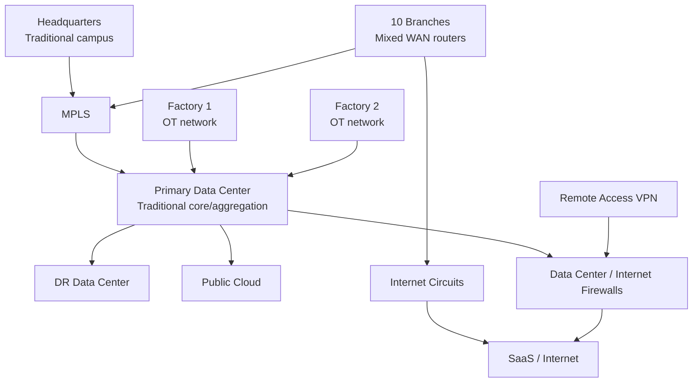
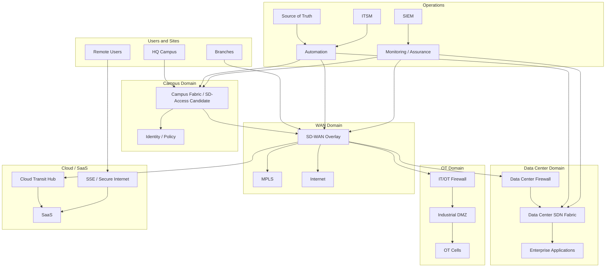
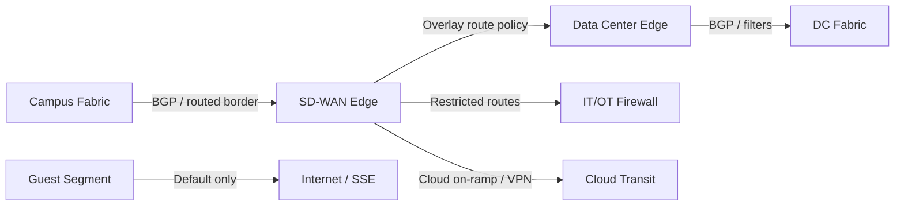
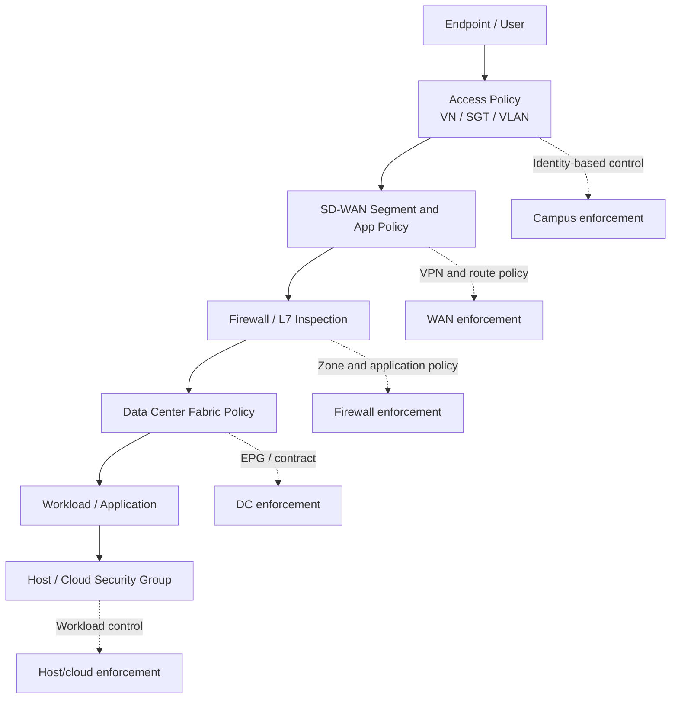
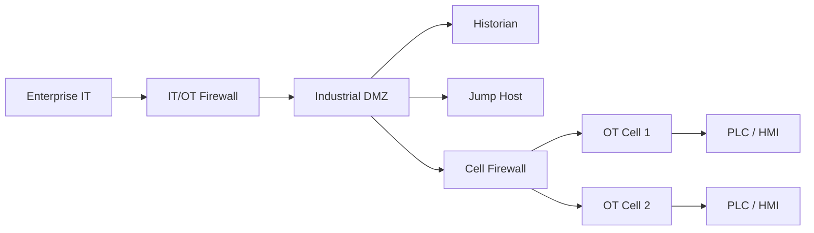
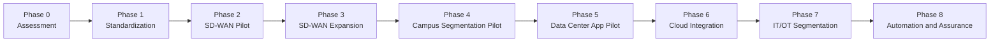

# Day 5 Lab - SDN Capstone Enterprise Design Workshop

## 1. Lab Purpose

Day 5 is the capstone lab for the SDN course.

The objective is to synthesize everything from Days 1-4:

- SDN architecture.
- Brownfield integration.
- Routing and segmentation.
- Security and IT/OT policy.
- Automation and infrastructure as code.
- Monitoring, assurance, troubleshooting, and RCA.
- Migration planning and rollback.

This lab is a design workshop. Students work in groups to produce and defend an enterprise SDN design.

The goal is not to create a perfect vendor-specific low-level design. The goal is to show that learners can make practical architecture decisions, explain trade-offs, and plan a safe transformation from traditional networking to SDN.

## 2. Lab Format

Recommended duration: 5-6 hours.

Suggested timing:

| Section | Time |
|---|---:|
| Instructor briefing and scenario review | 30 min |
| Group design work phase 1: requirements and target architecture | 60 min |
| Group design work phase 2: segmentation, routing, security | 75 min |
| Group design work phase 3: automation, monitoring, migration | 75 min |
| Presentation preparation | 30 min |
| Group presentations | 90 min |
| Final debrief | 30 min |

Recommended group size:

- 3-5 students per group.

Recommended group roles:

- Lead architect.
- Routing/WAN designer.
- Security/segmentation designer.
- Automation/operations designer.
- Presenter/documentation owner.

## 3. Capstone Scenario

The customer is a multi-site enterprise planning to transition from traditional networking to an SDN-oriented architecture.

## 3.1 Business Profile

The enterprise has:

- One headquarters campus.
- One primary data center.
- One disaster recovery data center.
- Ten regional branch offices.
- Two manufacturing plants with OT systems.
- Public cloud workloads.
- SaaS applications.
- Remote users.
- Existing MPLS and Internet circuits.
- Existing firewall infrastructure.
- Basic monitoring.
- Limited automation.
- Interest in SD-WAN or another WAN overlay for standardized branch connectivity.

## 3.2 Current-State Architecture

## 3.3 Current Problems

Technical problems:

- Branch configurations are inconsistent.
- VLAN and subnet standards differ by site.
- Guest, IoT, and corporate users are not consistently separated.
- OT access is controlled mainly by legacy firewall rules.
- Data center application dependencies are poorly documented.
- Firewall rules contain old objects and exceptions.
- Cloud routing is managed separately from enterprise routing.
- Monitoring is device-centric and does not show end-to-end application paths.
- No central source of truth.

Operational problems:

- New branch deployment takes 4-6 weeks.
- Changes require manual CLI work on many devices.
- Rollback plans are inconsistent.
- Troubleshooting across campus, WAN, firewall, and data center is slow.
- Security team and network team use different policy language.
- Documentation is frequently out of date.

## 4. Business Requirements

The target architecture must support:

- Faster branch deployment.
- Secure segmentation for corporate, guest, IoT, OT, server, and management networks.
- Improved WAN application experience.
- Controlled cloud and SaaS access.
- Better visibility and troubleshooting.
- Reduced manual configuration.
- Phased migration with rollback.
- Better alignment between network and security teams.
- Minimal disruption to production systems.

## 5. Technical Requirements

The design must include:

- SD-WAN or equivalent WAN overlay.
- Integration with existing MPLS and Internet transport.
- Campus segmentation design.
- Data center segmentation design.
- IT/OT segmentation with industrial DMZ.
- Cloud connectivity model.
- Firewall and security enforcement model.
- Routing boundary design.
- Monitoring and assurance plan.
- Automation/source-of-truth approach.
- Migration roadmap.
- Rollback and validation strategy.

## 6. Constraints

Assume:

- The enterprise cannot replace all hardware in year one.
- OT systems cannot tolerate aggressive scanning or untested enforcement.
- MPLS contract remains active for two more years.
- Some branches have only one Internet circuit.
- The security team owns firewall policy.
- The cloud team owns cloud route tables and security groups.
- Operations team has limited automation experience.
- The team can be trained on SD-WAN or the selected WAN overlay during the pilot.
- Change windows are limited to weekends for major changes.

## 7. Required Group Deliverables

Each group must produce:

1. Target architecture diagram.
2. SDN domain selection.
3. Routing integration plan.
4. Segmentation model.
5. Policy matrix.
6. Security enforcement map.
7. IT/OT integration approach.
8. Monitoring and assurance plan.
9. Automation plan.
10. Migration roadmap.
11. Rollback and validation plan.
12. Risk register.
13. Final presentation.

## 8. Deliverable 1 - Target Architecture Diagram

Students should draw a high-level target architecture.

Example structure:

## 9. Deliverable 2 - SDN Domain Selection

Complete the table:

| Domain | Proposed Technology / Approach | Deploy Now, Later, or Keep Traditional | Reason |
|---|---|---|---|
| WAN |  |  |  |
| Campus |  |  |  |
| Data Center |  |  |  |
| Cloud |  |  |  |
| OT |  |  |  |
| Operations |  |  |  |

Guidance:

- WAN is often a strong first SDN domain because branch standardization and application-aware routing create measurable value.
- Campus may be phased by building or user group.
- Data center SDN should start with selected applications.
- OT should be conservative and firewall/DMZ-driven.
- Automation should start with read-only and low-risk workflows.

## 10. Deliverable 3 - Routing Integration Plan

Students must define routing boundaries.

Questions:

- What routing protocol is used at each boundary?
- Where is BGP used?
- Where are static routes acceptable?
- Where are routes summarized?
- Which routes are leaked between segments?
- Where is the default route for guest, corporate, IoT, OT, and management?
- How is asymmetric routing avoided?
- How are cloud routes exchanged?

Template:

| Boundary | Routing Method | Advertised Routes | Filters / Controls | Risk |
|---|---|---|---|---|
| Campus to SD-WAN |  |  |  |  |
| SD-WAN to Data Center |  |  |  |  |
| Data Center to Cloud |  |  |  |  |
| SD-WAN to OT Firewall |  |  |  |  |
| Guest to Internet |  |  |  |  |

Example routing diagram:

## 11. Deliverable 4 - Segmentation Model

Start with macrosegmentation.

Recommended segments:

- Corporate.
- Guest.
- IoT.
- OT.
- Server.
- Management.
- DMZ.
- Cloud workloads.
- Remote users.

Complete:

| Business Segment | Purpose | Campus Mapping | SD-WAN Mapping | Data Center Mapping | Cloud Mapping | Owner |
|---|---|---|---|---|---|---|
| Corporate |  |  |  |  |  |  |
| Guest |  |  |  |  |  |  |
| IoT |  |  |  |  |  |  |
| OT |  |  |  |  |  |  |
| Server |  |  |  |  |  |  |
| Management |  |  |  |  |  |  |

## 12. Deliverable 5 - Policy Matrix

Complete at least 12 policy entries.

Template:

| Source | Destination | Protocol / Application | Action | Enforcement Point | Logging | Owner |
|---|---|---|---|---|---|---|
| Corporate | ERP | HTTPS | Permit |  | Yes |  |
| Corporate | SaaS | HTTPS | Permit |  | Yes |  |
| Guest | Internet | DNS/HTTP/HTTPS | Permit |  | Yes |  |
| Guest | Internal | Any | Deny |  | Yes |  |
| IoT | IoT Platform | App-specific | Permit |  | Yes |  |
| IoT | Corporate | Any | Deny |  | Yes |  |
| OT | Historian | Required OT protocol | Permit |  | Yes |  |
| OT | Internet | Any | Deny |  | Yes |  |
| Management | Network Devices | SSH/HTTPS/SNMP | Permit |  | Yes |  |
| Remote User | Selected Apps | HTTPS | Permit |  | Yes |  |
| Server Web | Server App | App port | Permit |  | Yes |  |
| Server App | Database | DB port | Permit |  | Yes |  |

## 13. Deliverable 6 - Security Enforcement Map

Students must show where security is enforced.

Answer:

- Which traffic must pass through firewall?
- Which traffic can be controlled by fabric policy?
- Which traffic requires identity?
- Which policies require logging?
- Which exceptions are temporary?

## 14. Deliverable 7 - IT/OT Integration Approach

Design conservative IT/OT segmentation.

Required elements:

- IT/OT firewall.
- Industrial DMZ.
- Historian.
- Jump host.
- Remote vendor access model.
- Passive monitoring.
- Emergency access process.

Example:

Questions:

- What traffic is allowed from IT to OT?
- What traffic is allowed from OT to IT?
- How is vendor access controlled?
- What should be monitored?
- What must not be changed during the first phase?

## 15. Deliverable 8 - Monitoring and Assurance Plan

Students must define monitoring by layer.

| Layer | What to Monitor | Data Source | Alert Example | Owner |
|---|---|---|---|---|
| Physical |  |  |  |  |
| Underlay |  |  |  |  |
| Overlay |  |  |  |  |
| Controller |  |  |  |  |
| Policy |  |  |  |  |
| Identity |  |  |  |  |
| Application |  |  |  |  |
| Automation |  |  |  |  |

Assurance checks:

| Intent | Actual State Check | Pass/Fail Logic |
|---|---|---|
| Guest Internet only | Synthetic test + deny log |  |
| Branch has two tunnels | Controller API |  |
| ERP reachable from corporate | HTTPS probe |  |
| IoT cannot reach corporate | Deny log / flow test |  |
| Controller healthy | Controller service health |  |

## 16. Deliverable 9 - Automation Plan

Automation must be phased.

Phase 1:

- Inventory collection.
- Config backup.
- Compliance checks.
- Device reachability.

Phase 2:

- Branch onboarding templates.
- Segment object creation.
- Monitoring registration.
- Standard NTP/SNMP/syslog validation.

Phase 3:

- Controlled policy deployment.
- ITSM integration.
- Drift detection.
- Limited closed-loop remediation.

Complete:

| Workflow | Tool | Input | Pre-Check | Change | Post-Check | Rollback |
|---|---|---|---|---|---|---|
| Inventory report |  |  |  |  |  |  |
| Branch onboarding |  |  |  |  |  |  |
| Segment creation |  |  |  |  |  |  |
| Policy deployment |  |  |  |  |  |  |

## 17. Deliverable 10 - Migration Roadmap

Create a phased roadmap.

Recommended structure:

Migration template:

| Phase | Scope | Prerequisites | Activities | Exit Criteria | Rollback |
|---|---|---|---|---|---|
| 0 | Assessment |  |  |  |  |
| 1 | Standardization |  |  |  |  |
| 2 | Pilot |  |  |  |  |
| 3 | Expansion |  |  |  |  |

## 18. Deliverable 11 - Rollback and Validation Plan

Rollback plan must include:

- Trigger condition.
- Decision owner.
- Technical rollback steps.
- Communication plan.
- Expected rollback duration.
- Validation after rollback.

Validation plan must include:

- Routing validation.
- Tunnel validation.
- Policy validation.
- Application validation.
- Security log validation.
- User acceptance.
- Monitoring validation.

Template:

| Change | Rollback Trigger | Rollback Steps | Validation | Owner |
|---|---|---|---|---|
| Branch SD-WAN migration | App outage > 15 min |  |  |  |
| Guest segmentation | Guest reaches internal |  |  |  |
| DC application migration | App test fails |  |  |  |
| OT firewall insertion | OT flow disruption |  |  |  |

## 19. Deliverable 12 - Risk Register

Complete:

| Risk | Impact | Likelihood | Mitigation | Owner |
|---|---|---|---|---|
| Unknown application dependency | High | High | Dependency mapping and pilot | App/Network |
| Route leak | High | Medium | Route filtering and review | Network |
| Guest reaches internal | High | Medium | Negative testing and firewall deny | Security |
| OT disruption | High | Medium | Passive discovery and OT approval | OT |
| Automation error | Medium | Medium | Pre-checks, staging, approval | NetOps |
| Controller outage | Medium | Low/Medium | HA, backup, DR runbook | Platform |
| Cloud route conflict | Medium | Medium | Cloud/network joint review | Cloud/Network |

## 20. Presentation Structure

Each group presents for 15-20 minutes.

Required sections:

1. Business requirements.
2. Current-state assumptions.
3. Target architecture.
4. SDN domain selection.
5. Routing design.
6. Segmentation and policy matrix.
7. Security enforcement and IT/OT.
8. Monitoring and assurance.
9. Automation.
10. Migration roadmap.
11. Risks, validation, and rollback.
12. Final recommendation.

## 21. Instructor Challenge Questions

Use these questions during presentations:

- Why did you choose this as the first pilot?
- What happens if the SDN controller is unavailable?
- Where is the default route for Guest?
- How do you prevent route leaks?
- How do you validate Guest cannot reach internal networks?
- How does IoT reach only the IoT platform?
- How does OT access historian?
- Who owns the policy matrix?
- Where is firewall inspection required?
- What data must exist before automation?
- How do you avoid asymmetric routing?
- What is your rollback trigger?
- What is your six-month success metric?

## 22. Scoring Rubric

| Area | Weight | Criteria |
|---|---:|---|
| Architecture | 20% | Clear target architecture, domain boundaries, realistic SDN selection |
| Integration | 15% | Routing, segmentation, firewall, cloud, and legacy integration |
| Security | 20% | Policy matrix, enforcement points, IT/OT, logging, ownership |
| Automation and Operations | 15% | Source of truth, API/Ansible/Terraform approach, monitoring, assurance |
| Migration and Risk | 20% | Phased roadmap, rollback, validation, risk mitigation |
| Presentation | 10% | Clear explanation, trade-off analysis, answers to challenge questions |

## 23. Instructor Suggested Answer Direction

A strong answer usually includes:

- Consider starting with a WAN overlay pilot because branch standardization has clear scope, measurable value, and manageable rollback.
- Use phased campus SDN for guest/IoT/corporate segmentation.
- Use data center SDN for selected application groups, not all workloads at once.
- Use IT/OT firewall and industrial DMZ before deeper OT segmentation.
- Use cloud hub/transit and align cloud security groups with enterprise policy.
- Use BGP at major routing boundaries with filtering and summarization.
- Keep guest Internet-only with no unnecessary internal route leaking.
- Build source of truth before advanced automation.
- Automate inventory and compliance before policy deployment.
- Monitor controller, underlay, overlay, policy, identity, and application health.
- Use positive and negative validation tests.
- Define rollback for every migration wave.

## 24. Common Mistakes

Watch for:

- Designing only the fabric and ignoring the boundaries.
- Trying to deploy every SDN domain at once.
- Making OT the first pilot.
- Creating too many segments too early.
- Ignoring identity readiness.
- Forgetting DNS and NAT.
- Ignoring return path.
- Assuming firewall team will automatically accept new policy.
- Using automation without source of truth.
- No rollback trigger.
- No negative security testing.
- No ownership for policy matrix.

## 25. Final Debrief Questions

Ask the class:

1. Which domain is the best first SDN pilot and why?
2. Which design decision had the highest risk?
3. Which part of the architecture is hardest to operate?
4. Which policy is hardest to validate?
5. What should be automated first?
6. What should not be automated yet?
7. Which telemetry is most important?
8. What would you present to management as business value?

## 26. Key Takeaways

- Enterprise SDN design is an integration problem, not only a controller deployment.
- Hybrid SDN is normal.
- Routing boundaries must be explicit.
- Segmentation must be mapped across campus, WAN, data center, cloud, firewall, and OT.
- Security policy requires ownership, logging, validation, and rollback.
- Automation depends on source of truth and operational maturity.
- Monitoring and assurance must be included from the start.
- Migration must be phased and reversible.
- The strongest design is the one that solves business problems with controlled risk.
