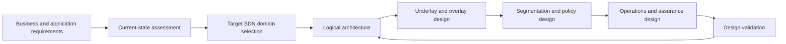
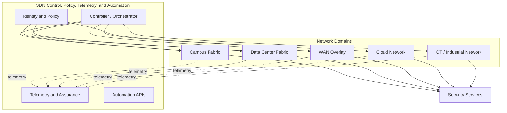
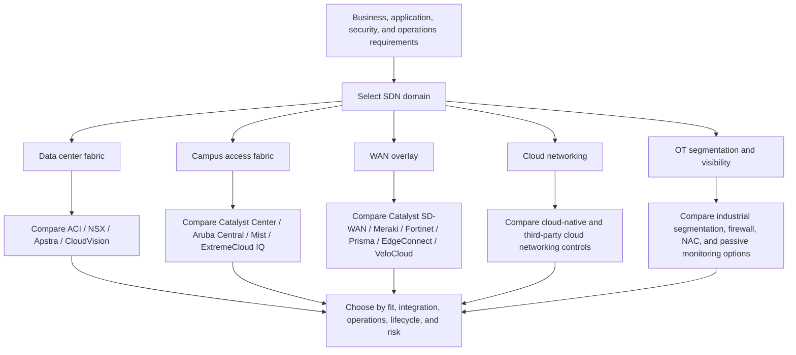
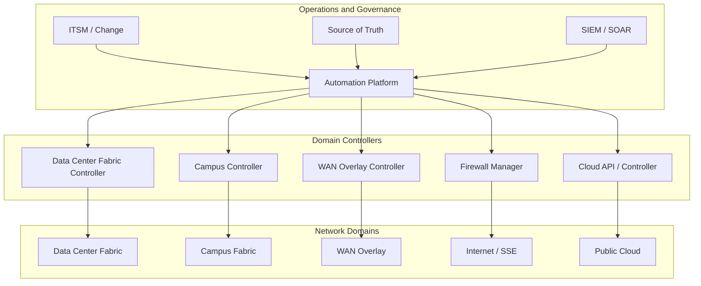
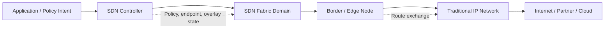
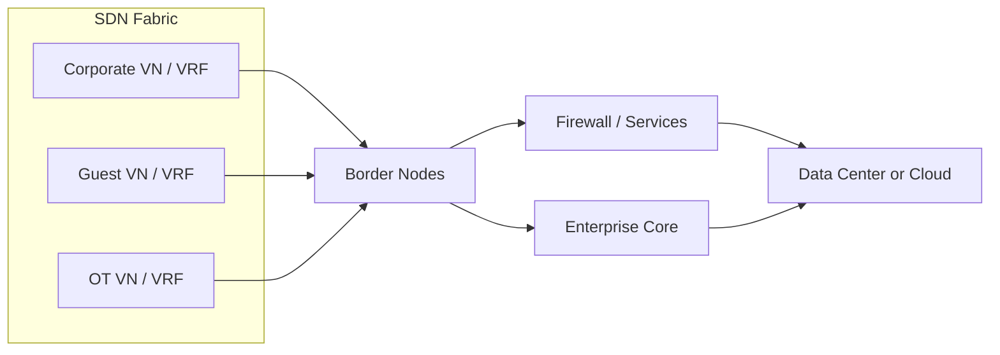
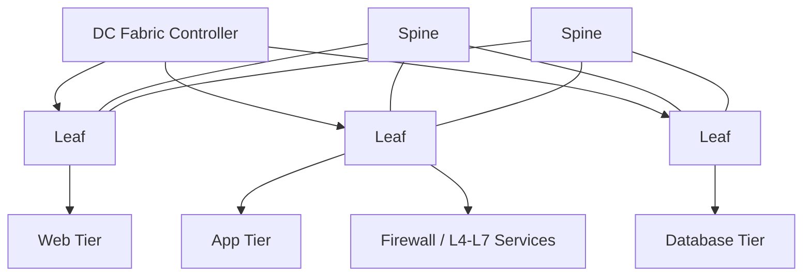
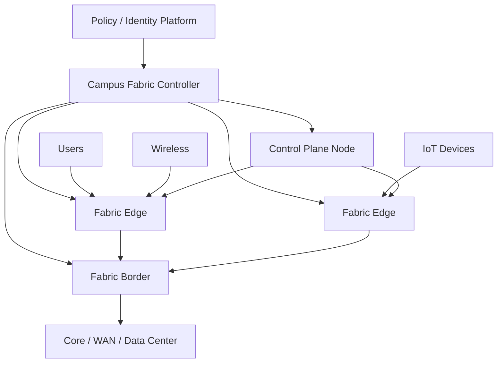
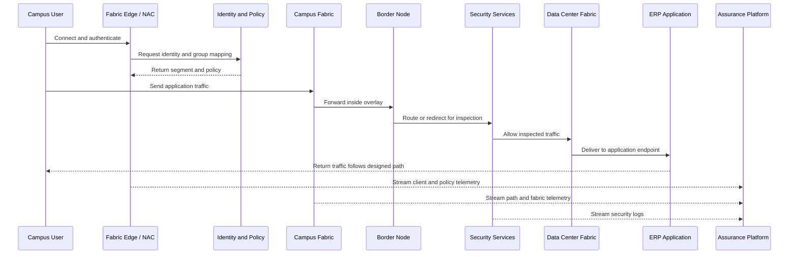

# Chapter 2 - SDN Design

## 1. Chapter Introduction and Positioning

Software-Defined Networking design is not the act of choosing a controller and drawing a new topology. A good SDN design translates business requirements, application flows, security policy, operational workflows, and migration constraints into a target architecture that can be automated, monitored, and changed safely.

This chapter focuses on design. Implementation and migration are covered in Chapter 3. Operations, monitoring, assurance, and troubleshooting are covered in Chapter 4. Automation, agentic operations, and optimization are covered in Chapter 5.

The design mindset is simple: decide where the network should be abstracted, where policy should be enforced, where routing should remain explicit, and where operational control must stay local.

## 2. Learning Objectives

After completing this chapter, participants should be able to:

- Build an SDN design from business, application, security, and operational requirements.
- Select appropriate SDN domains for campus, data center, WAN, cloud, and OT environments.
- Explain the relationship between underlay, overlay, controller, policy, identity, and telemetry.
- Design routing, segmentation, and service insertion boundaries between SDN and non-SDN domains.
- Compare common SDN design patterns and understand when each pattern is useful.
- Evaluate trade-offs for centralized control, distributed forwarding, multi-domain policy, resiliency, and operations.
- Produce a practical SDN high-level design that can be validated before implementation.

## 3. SDN Design Methodology

SDN design should follow a structured method. The workflow below is intentionally iterative: validation and operational feedback should improve the design before production deployment.

### 3.1 Design Workflow

### 3.2 Why This Order Matters

Starting with a product selection often creates a narrow design. Starting with requirements exposes the real constraints:

- Some applications require deterministic latency and predictable paths.
- Some security zones require firewall inspection regardless of fabric capability.
- Some sites cannot tolerate controller dependency during a WAN outage.
- Some operations teams are ready for infrastructure-as-code, while others need a staged operating model.
- Some brownfield networks have overlapping address space, fragile routing, or undocumented service chains.

The SDN design must respect these conditions. SDN removes some operational friction, but it does not remove physics, routing fundamentals, failure domains, or organizational boundaries.

## 4. Design Inputs

An SDN design should be built from four groups of input.

| Input area | Questions to answer | Design impact |
|---|---|---|
| Business | Which services must improve? Which sites, users, or applications are in scope? | Determines SDN domains, priorities, and rollout boundaries. |
| Application | Which flows matter most? East-west, north-south, user-to-app, machine-to-machine? | Drives fabric, segmentation, service insertion, and telemetry design. |
| Security | What must be isolated? Where must inspection happen? Which identity sources are trusted? | Drives macrosegmentation, microsegmentation, firewall placement, and policy model. |
| Operations | Who owns controllers, policy, automation, monitoring, and change approval? | Drives RBAC, source of truth, operational handoff, and troubleshooting model. |

### 4.1 Enterprise Design Scope Scenario

An enterprise wants to modernize the network for three reasons:

- Slow deployment of new application environments.
- Inconsistent segmentation between campus, data center, and cloud.
- Limited visibility into user-to-application performance.

The first design decision is not whether to deploy a specific fabric. The first design decision is the scope:

- Data center SDN may solve workload mobility and application segmentation.
- Campus SDN may solve user/device segmentation and access policy.
- WAN overlay may solve transport independence and application path control.
- Cloud networking automation may solve workload provisioning consistency.
- Assurance tooling may solve visibility even before full SDN adoption.

The best design may combine several domains, but each domain must have a clear purpose.

## 5. Current-State Assessment

Current-state assessment is a design activity, not an implementation task. The goal is to understand what the SDN design must preserve, improve, or replace.

### 5.1 Assessment Checklist

| Area | What to collect | Why it matters |
|---|---|---|
| Topology | L2/L3 diagrams, STP boundaries, routing adjacencies, WAN paths | Determines underlay readiness and failure domains. |
| Addressing | IP blocks, summarization, overlaps, NAT points | Determines segmentation, routing, and cloud connectivity feasibility. |
| Routing | IGP/BGP/static routes, redistribution, default route behavior | Determines border design and route-leak controls. |
| VLAN/VRF usage | Tenant networks, user groups, OT zones, guest networks | Maps old segmentation to new SDN segmentation. |
| Security services | Firewalls, IDS/IPS, proxies, NAC, identity stores | Determines policy source and service insertion points. |
| Applications | Critical flows, dependencies, ports, latency requirements | Prevents breaking important traffic paths during design. |
| Operations | Tooling, monitoring, change process, ownership | Determines operational manageability of the design. |

### 5.2 Common Findings

Experienced teams often discover that the main design problem is not controller placement. It is usually one of these:

- VLANs are used as both broadcast boundaries and security boundaries.
- Firewall rules refer to IP subnets rather than business roles.
- Routing is functional but difficult to summarize.
- Some routes are learned through redistribution chains that are not documented.
- Identity information exists, but it is not consistently connected to network policy.
- Monitoring tools can show device health but not user-to-application experience.

These findings should shape the SDN design. A fabric cannot compensate for a policy model that nobody can explain.

## 6. SDN Enterprise Reference Architecture

The following reference architecture shows SDN as a set of coordinated domains rather than a single network island.

### 6.1 Architecture View

### 6.2 Design Principle

Do not design every domain as if it has the same control model. A data center fabric, a campus fabric, a WAN overlay, a cloud network, and an OT network solve different problems.

| Domain | Main design goal | Common SDN approach |
|---|---|---|
| Data center | Workload connectivity, microsegmentation, consistent policy | Leaf-spine fabric, VXLAN/EVPN, policy controller, service insertion. |
| Campus | User/device access, identity-based segmentation, simplified access operations | Fabric edge/border/control roles, endpoint identity, group-based policy. |
| WAN | Transport abstraction, application-aware path selection, branch consistency | Overlay tunnels, centralized policy, SLA-aware forwarding. |
| Cloud | Consistent workload networking and security across accounts/subscriptions | Infrastructure-as-code, cloud-native policy, transit design. |
| OT | Strong segmentation, deterministic behavior, controlled access | Zone/conduit model, strict allow lists, passive monitoring, controlled north-south access. |

### 6.3 Domain and Solution Fit Workflow

Do not compare SDN solutions only by feature list. Compare them by domain fit, integration model, operational readiness, lifecycle risk, and the kind of policy the organization needs to express.

Evaluate solution fit using these questions:

- What is the installed switching, routing, firewall, wireless, and cloud base?
- Which segmentation model is required: VRF, VNI, security group, endpoint group, tag, ACL, or firewall zone?
- Which identity systems and security tools must integrate with the SDN domain?
- How important is multi-vendor support compared with integrated lifecycle support?
- Does the operations team have the skills to troubleshoot the selected object model?
- Are APIs mature enough for the automation model planned in Chapter 5?
- What brownfield constraints could limit the target architecture?

### 6.4 Multi-Domain SDN Design

Large enterprises rarely use one SDN domain for everything. A realistic architecture may combine:

- Data center fabric.
- Campus access fabric.
- WAN overlay.
- Cloud networking.
- Firewalls and security service edge.
- Identity and policy platforms.
- ITSM, SIEM/SOAR, automation, and source-of-truth systems.

Cross-domain design challenges:

- Policy consistency across different policy models.
- Identity propagation between access, security, cloud, and application domains.
- Route exchange between fabrics, overlays, firewalls, and cloud transit points.
- Segmentation mapping between VRF, VNI, security group, tag, endpoint group, and firewall zone.
- Firewall and service insertion without creating unnecessary traffic hairpinning.
- Overlapping IP address spaces.
- Change coordination between network, security, server, cloud, and OT teams.
- End-to-end troubleshooting when each controller sees only part of the path.

Design recommendation: start with the SDN domain that has clear business value and manageable operational scope. Then design integration points deliberately. Multi-domain expansion should be evidence-based, not product-stack driven.

## 7. Logical SDN Architecture Design

Logical design describes how control, policy, forwarding, identity, telemetry, and automation relate to one another. It should be product-aware but not product-dependent.

### 7.1 Core Building Blocks

| Building block | Design question | Example design decision |
|---|---|---|
| Controller | What does the controller own? | It owns fabric policy and endpoint mapping, but not all enterprise routing. |
| Underlay | What provides IP reachability? | Routed leaf-spine, routed campus access, or routed WAN transport. |
| Overlay | What abstraction is created above the underlay? | VXLAN fabric, tunnel overlay, virtual network, group-based segment. |
| Policy model | How is intent represented? | VRF/VN, security group, endpoint group, contract, ACL, tag, or cloud security group. |
| Enforcement point | Where is policy applied? | Fabric edge, data center leaf, firewall, cloud gateway, WAN edge. |
| Telemetry | What proves that the design works? | Flow records, streaming telemetry, path traces, health scores, event correlation. |
| API | How will the design be changed safely? | Controller API, NETCONF/RESTCONF, Terraform provider, Ansible collection. |

### 7.2 Control Boundary

The control boundary defines where the SDN controller makes decisions and where traditional routing or switching remains authoritative.

A clean control boundary avoids unclear ownership. For example, a campus fabric controller may manage endpoint-to-segment mapping, while the core network still uses BGP or OSPF. At the border, the design must define route exchange, summarization, default-route behavior, failure detection, and security inspection.

## 8. Underlay Design

The underlay is the physical or routed network that carries overlay traffic. SDN does not remove the need for a stable underlay. It increases the requirement for predictable underlay behavior.

### 8.1 Underlay Design Goals

- Provide IP reachability between fabric nodes or tunnel endpoints.
- Converge quickly during link or node failure.
- Avoid unnecessary Layer 2 fault domains.
- Support ECMP where appropriate.
- Keep routing simple enough to troubleshoot during a fabric outage.
- Provide MTU headroom for encapsulation such as VXLAN, GRE, IPsec, or other overlay headers.

### 8.2 Common Underlay Patterns

| Pattern | When to use | Strengths | Trade-offs |
|---|---|---|---|
| Layer 3 leaf-spine | Data center fabric, scalable campus core | Predictable latency, ECMP, small failure domains | Requires routed design discipline and address planning. |
| Routed access | Modern campus with fabric edge nodes | Removes STP dependency, improves convergence | May require hardware/software refresh. |
| Existing routed core | Brownfield campus or enterprise core | Lower disruption, preserves operational familiarity | May inherit legacy routing complexity. |
| Provider or internet transport | WAN overlay | Transport abstraction and cost flexibility | Overlay health depends on transport quality and monitoring. |

### 8.3 MTU Design

Overlay encapsulation adds headers. If the underlay MTU is too small, large packets may fragment or fail silently when Path MTU Discovery is blocked.

Design recommendations:

- Standardize jumbo MTU in data center fabrics where supported.
- Validate end-to-end MTU between overlay endpoints.
- Include firewall and service appliances in MTU testing.
- Document the payload MTU exposed to applications.

## 9. Overlay and Fabric Design

The overlay provides logical connectivity independent of the physical topology. In enterprise SDN, overlays are commonly used to provide segmentation, workload mobility, policy consistency, or application-aware path control.

### 9.1 Overlay Design Decisions

| Decision | Options | Design guidance |
|---|---|---|
| Encapsulation | VXLAN, GRE, IPsec, vendor-specific tunnel | Choose based on domain requirements, hardware support, and policy model. |
| Endpoint learning | Data-plane learning, control-plane learning, controller-assisted | Prefer explicit control-plane learning at scale. |
| Segment identity | VLAN, VRF, VNI, group tag, endpoint group | Use the smallest model that matches security and operations needs. |
| Border behavior | Route leaking, firewall insertion, NAT, external routing | Keep border behavior explicit and documented. |
| Multi-site design | Stretched network, routed inter-site, multi-pod/multi-site fabric | Avoid stretching failure domains unless the application requirement is clear. |

### 9.2 VXLAN/EVPN as a Common Pattern

VXLAN provides Layer 2 or Layer 3 overlay segmentation by carrying tenant traffic over an IP underlay. EVPN provides a control plane for endpoint and route information.

Why it is commonly used:

- It supports large-scale segmentation beyond VLAN limits.
- It works well with routed underlays and ECMP.
- It can support both Layer 2 extension and Layer 3 tenant routing.
- It is widely implemented by major data center and campus vendors.

When to be cautious:

- If the operations team cannot troubleshoot BGP EVPN, controller-based abstraction must provide excellent visibility.
- If the design stretches Layer 2 across sites, failure domains and operational risk increase.
- If route leaking between segments is uncontrolled, segmentation loses value.

## 10. Routing Boundary Design

Routing boundaries are where SDN and non-SDN domains exchange reachability. They are among the most important parts of the design because they determine blast radius, traffic symmetry, failover behavior, and troubleshooting clarity.

### 10.1 Boundary Model

### 10.2 Design Choices

| Choice | Why it matters | Practical guidance |
|---|---|---|
| BGP vs OSPF/IS-IS vs static | Determines policy control and scale | BGP is often preferred at boundaries because filtering, attributes, and summarization are explicit. |
| Default route placement | Determines internet and cloud egress | Avoid multiple uncontrolled defaults for the same segment. |
| Route summarization | Limits failure and route churn | Summarize at domain boundaries when addressing supports it. |
| Route leaking | Enables controlled inter-segment communication | Use explicit route leaking with firewall/policy controls. |
| Symmetry | Required for stateful firewalls and some inspection tools | Design active/active carefully; asymmetric return traffic breaks inspection. |

### 10.3 Practical Scenario: Guest Access

Requirement: Guest users should access only the internet and must not reach internal applications.

Design pattern:

- Place guest endpoints in a dedicated virtual network or VRF.
- Advertise only a default route toward internet security services.
- Do not leak internal routes into the guest segment.
- Apply DNS, web filtering, and NAT at the service edge.
- Use telemetry to verify that guest traffic never uses internal application paths.

Why this pattern works: it does not depend only on ACLs at the access layer. The routing table itself prevents internal reachability.

## 11. Segmentation and Policy Design

Segmentation design is where SDN usually delivers the most visible enterprise value. Traditional segmentation is often subnet-centric. SDN segmentation can be identity-aware, application-aware, and centrally modeled.

### 11.1 Segmentation Models

| Model | Description | When to use |
|---|---|---|
| VLAN/subnet | Traditional L2/L3 segmentation | Small environments, compatibility, simple isolation. |
| VRF/virtual network | Macrosegmentation with separate routing tables | Business units, tenants, guest, OT, compliance zones. |
| Security group/tag | Identity or role-based policy | User/device groups that move across locations. |
| Endpoint group | Application or workload policy grouping | Data center applications and microsegmentation. |
| Cloud security group | Cloud-native workload policy | Public cloud or hybrid cloud workloads. |

### 11.2 Macrosegmentation vs Microsegmentation

Macrosegmentation separates large security domains such as Corporate, Guest, OT, PCI, or Management.

Microsegmentation controls communication inside or between those domains based on role, workload, application, or identity.

Use macrosegmentation when:

- Routing separation is required.
- Different teams own different zones.
- Compliance requires strong isolation.
- Firewall insertion is mandatory between zones.

Use microsegmentation when:

- Devices or workloads share an IP subnet but require different access.
- Users move between locations but should keep the same policy.
- East-west application traffic needs tighter control.
- The organization wants least-privilege access without creating hundreds of VLANs.

### 11.3 Policy Matrix

A useful SDN design includes a policy matrix before configuration begins.

| Source | Destination | Policy | Enforcement point | Notes |
|---|---|---|---|---|
| Corporate users | ERP application | Allow TCP 443 | Campus fabric and data center policy | Identity-based access preferred. |
| Guest users | Internet | Allow TCP 80/443 | Guest border/firewall | No internal route leakage. |
| OT PLCs | Historian | Allow required industrial protocol | OT firewall or industrial policy point | Strict allow list. |
| Vendor users | OT zone | Deny by default | Remote access gateway and firewall | Temporary exception workflow only. |
| Server tier web | Server tier database | Allow application ports | Data center fabric/firewall | Avoid broad subnet-to-subnet rules. |

### 11.4 Policy Design Principles

- Define policy in business terms first: user role, device type, application, data sensitivity.
- Translate business policy into network constructs second: VRF, VNI, tag, contract, ACL, firewall rule.
- Prefer implicit deny between segments unless a business flow is known.
- Keep policy enforcement close to the source when possible, but use firewalls where deep inspection or compliance logging is required.
- Avoid creating a unique segment for every exception. Exceptions should have lifecycle ownership.

## 12. Security Service Insertion

SDN fabrics can enforce many policies directly, but firewalls and security services remain important. The design question is not whether a firewall is still needed. The question is where inspection must happen and how traffic is steered through it consistently.

### 12.1 Common Service Insertion Patterns

| Pattern | When to use | Strengths | Trade-offs |
|---|---|---|---|
| Central firewall between segments | Regulated zones, clear north-south flows | Strong control and logging | Can become a bottleneck or hairpin point. |
| Distributed fabric policy | High-volume east-west flows | Scalable enforcement near endpoints | May not provide deep packet inspection. |
| Service graph or policy-based redirection | Data center application tiers | Consistent service chaining | Requires careful failure and bypass design. |
| Cloud-native inspection | Cloud workload traffic | Integrates with cloud controls | Operational model differs by cloud provider. |
| SASE/SSE edge | Internet and SaaS access | Strong user-to-cloud security | Less suitable for local east-west traffic. |

### 12.2 PCI Application Zone Scenario

Requirement: Only payment application servers may communicate with database servers. Administrative access must pass through privileged access management and be logged.

Design pattern:

- Place PCI workloads in a dedicated VRF or tenant.
- Use endpoint groups for web, application, and database tiers.
- Allow only required application ports between tiers.
- Force administrative access through a jump host or PAM service.
- Send north-south and administrative flows through a firewall or inspection service.
- Stream flow logs and policy events to the assurance/security platform.

Why this pattern works: the design separates reachability, role-based policy, and inspection. If one control is misconfigured, the others still reduce exposure.

## 13. Identity and Access Design

Identity gives SDN designs context. Without identity, policy often falls back to IP address and subnet logic.

### 13.1 Identity Sources

| Identity source | Typical use |
|---|---|
| 802.1X / NAC | User and device authentication at access edge. |
| MAC Authentication Bypass | Printers, cameras, IoT, and devices that cannot run 802.1X. |
| Directory services | User group and role mapping. |
| Certificate authority | Device trust and machine identity. |
| Endpoint security platform | Device posture and risk. |
| Cloud identity provider | SaaS/cloud access and federated roles. |

### 13.2 Design Guidance

- Use identity for policy classification, not only admission control.
- Decide what happens when identity lookup fails.
- Separate employee, contractor, guest, unmanaged device, IoT, and OT access patterns.
- Avoid relying only on MAC address for high-trust access.
- Document identity-to-segment mappings as part of the design.

## 14. Data Center SDN Design Pattern

Data center SDN is usually driven by application agility, workload segmentation, and consistent network policy.

### 14.1 Reference Pattern

### 14.2 Design Decisions

| Decision | Recommendation |
|---|---|
| Fabric topology | Use leaf-spine for predictable latency and ECMP. |
| Tenant model | Map business or security domains to tenants/VRFs where isolation is required. |
| Application policy | Model application tiers as groups with explicit contracts or allow rules. |
| L2 extension | Use only where application requirements justify it. Prefer L3 boundaries where possible. |
| Services | Define firewall, load balancer, ADC, NAT, and IDS/IPS insertion early. |
| External connectivity | Use border leaf or external routing nodes with explicit route control. |

### 14.3 Cisco and Industry Examples

| Market segment | Cisco solution examples | Other industry solutions |
|---|---|---|
| Data center fabric | Cisco ACI, Cisco Nexus Dashboard Fabric Controller | VMware NSX, Juniper Apstra, Arista CloudVision with EVPN/VXLAN, Nokia SR Linux/SR OS fabrics |
| Cloud and hybrid operations | Cisco Nexus Dashboard, Cisco Cloud Network Controller | VMware NSX-T, HashiCorp Terraform with cloud providers, cloud-native networking services |

### 14.4 When This Pattern Fits

Use this pattern when the enterprise needs faster application onboarding, consistent segmentation, scalable east-west connectivity, or stronger workload visibility.

Avoid overdesigning it for small static data centers. If applications rarely change and segmentation is simple, a lighter EVPN/VXLAN or traditional routed design may be enough.

## 15. Campus SDN Design Pattern

Campus SDN is usually driven by user/device segmentation, simplified access policy, and better visibility into endpoint experience.

### 15.1 Reference Pattern

### 15.2 Design Decisions

| Decision | Recommendation |
|---|---|
| Access authentication | Use 802.1X where possible; define fallback for non-802.1X devices. |
| Virtual networks | Use VRFs or virtual networks for major trust zones. |
| Group-based policy | Use identity groups for users, devices, and roles that move around campus. |
| Border placement | Place borders where the fabric connects to core, firewall, WAN, or data center. |
| Wireless integration | Decide whether wireless traffic enters the same policy domain as wired traffic. |
| Guest access | Keep guest routing and policy simple: internet-only, no internal route leakage. |

### 15.3 Cisco and Industry Examples

| Market segment | Cisco solution examples | Other industry solutions |
|---|---|---|
| Campus fabric and access policy | Cisco Software-Defined Access, Cisco Catalyst Center, Cisco ISE | HPE Aruba Central/NetConductor, Juniper Mist with campus fabric capabilities, ExtremeCloud IQ |
| Identity and access | Cisco ISE | Aruba ClearPass, Fortinet FortiNAC, Microsoft Entra integrations |

### 15.4 When This Pattern Fits

Use this pattern when the enterprise has many user/device groups, frequent moves/adds/changes, IoT growth, guest access requirements, or inconsistent campus segmentation.

Be cautious when identity maturity is low. A campus fabric design depends heavily on accurate identity classification and operational discipline around exceptions.

## 16. WAN Overlay Design Pattern

WAN overlay is an SDN domain that abstracts transport and applies centralized application policy across sites. In this course, it is treated as one SDN design option, not as the center of the SDN architecture.

### 16.1 Design Decisions

| Decision | Recommendation |
|---|---|
| Transport mix | Define how MPLS, internet, LTE/5G, or satellite links are used. |
| Application policy | Classify critical, real-time, business, and bulk traffic. |
| Segmentation | Map enterprise segments consistently across WAN sites. |
| Cloud access | Decide between regional hub, direct internet access, SASE/SSE, or cloud on-ramp. |
| Failure behavior | Define path preference, failover timers, and brownout handling. |
| Local survivability | Decide which services must continue if the controller or orchestrator is unreachable. |

### 16.2 Cisco and Industry Examples

| Market segment | Cisco solution examples | Other industry solutions |
|---|---|---|
| WAN overlay and branch SDN | Cisco Catalyst SD-WAN, Cisco Meraki SD-WAN | VMware VeloCloud, HPE Aruba EdgeConnect, Fortinet Secure SD-WAN, Palo Alto Prisma SD-WAN, Versa Networks |

### 16.3 Trade-Offs

WAN overlay designs improve agility and transport choice, but they also introduce new dependencies: overlay control, certificate lifecycle, tunnel scale, central policy correctness, and application classification accuracy.

The design should be explicit about which traffic stays local, which traffic goes to cloud security, which traffic returns to data center, and which traffic can use direct internet paths.

## 17. Cloud and Multicloud SDN Design Pattern

Cloud networking is already software-defined, but it is often managed separately from enterprise network policy. The design goal is consistency, not identical implementation.

### 17.1 Design Decisions

| Decision | Recommendation |
|---|---|
| Account/subscription structure | Align with business units, environments, and security zones. |
| IP addressing | Avoid overlap with enterprise and partner networks. |
| Transit model | Use hub-and-spoke, cloud WAN, or third-party transit where appropriate. |
| Security controls | Map enterprise policy to cloud security groups, route tables, firewalls, and tags. |
| Automation | Treat cloud network configuration as code. |
| Observability | Collect flow logs, route changes, security events, and application health. |

### 17.2 Practical Scenario: Cloud Workload Access

Requirement: Corporate users need access to an internal application hosted in a public cloud VPC/VNet. Guest users must not reach the cloud private network.

Design pattern:

- Place cloud workloads in private subnets.
- Connect enterprise network to cloud through a controlled transit point.
- Advertise only required cloud prefixes to the corporate segment.
- Do not advertise cloud private routes to guest or unmanaged device segments.
- Apply cloud security groups and enterprise firewall policy.
- Monitor both enterprise and cloud flow logs.

Why this pattern works: it keeps enterprise segmentation consistent while using cloud-native controls where they are strongest.

## 18. IT/OT SDN Design Pattern

OT environments require a different design mindset. Availability, safety, deterministic behavior, and change control are often more important than rapid automation.

### 18.1 Design Principles

- Use a zone-and-conduit model.
- Keep OT control traffic tightly scoped.
- Prefer passive discovery and monitoring before active enforcement.
- Use allow-list policy for critical industrial flows.
- Place controlled gateways between IT and OT.
- Avoid broad identity assumptions for legacy industrial devices.
- Test changes in maintenance windows and lab environments.

### 18.2 Practical Scenario: Historian Access

Requirement: OT controllers must send telemetry to a historian. Corporate users may view historian dashboards but must not directly access PLCs.

Design pattern:

- Place PLCs, HMIs, cameras, and historian systems into separate zones.
- Allow PLC-to-historian traffic only on required protocols.
- Allow corporate user access only to the historian application tier.
- Deny corporate-to-PLC traffic by default.
- Use firewall logging and passive OT monitoring.
- Keep emergency local operation independent from central controller availability.

Why this pattern works: it enables useful IT/OT data sharing without collapsing the security boundary between enterprise IT and production control networks.

## 19. End-to-End Traffic Flow Design

Traffic-flow design tests whether the architecture is real. A diagram should show where classification happens, where encapsulation starts, where routing changes, where policy is enforced, where services inspect traffic, and where telemetry is collected.

### 19.1 User-to-Application Flow

### 19.2 Design Checkpoints

| Checkpoint | Question |
|---|---|
| Classification | How is the user, device, or workload identified? |
| Segment assignment | Which VRF, VNI, group, or endpoint group is used? |
| Routing boundary | Where does overlay forwarding become normal IP routing? |
| Service insertion | Which flows must be inspected or redirected? |
| Return path | Is the return path symmetric where stateful services require it? |
| Telemetry | Which systems prove that policy and path are working? |

Detailed packet-walk questions:

- Is the endpoint authenticated and assigned to the intended segment or group?
- Is the local fabric encapsulation working as expected?
- Is the border node advertising and receiving the correct prefixes?
- Is the correct WAN, core, or service path selected?
- Are overlay tunnels healthy, and is the underlay meeting latency, loss, jitter, and MTU requirements?
- Is the data center or cloud destination reachable through the intended routing table?
- Does the application policy allow the flow at the workload or endpoint-group level?
- Is a firewall, proxy, IPS, or DLP service required in the path?
- Is DNS resolving the expected destination address for the user location and application context?
- Are flow logs and telemetry available from each domain in the path?

## 20. High Availability and Resiliency Design

SDN designs must separate controller availability from data-plane survivability.

### 20.1 Controller Resiliency

Design questions:

- How many controller nodes are required?
- Are controller nodes placed in separate failure domains?
- What happens if a controller is unreachable?
- Which operations require controller availability?
- Which forwarding functions continue locally?
- How are backups, certificates, upgrades, and database health handled?

Practical guidance:

- Use supported controller clustering models.
- Place nodes across resilient infrastructure when latency requirements allow.
- Document control-plane dependencies clearly.
- Validate failure behavior in a lab or pilot.
- Do not assume that all controller outages affect forwarding the same way; behavior differs by solution and function.

### 20.2 Fabric and Border Resiliency

| Component | Design guidance |
|---|---|
| Fabric nodes | Use redundant links and avoid single-homed critical endpoints where possible. |
| Border nodes | Use at least two border nodes for important external connectivity. |
| Firewalls/services | Design HA pairs or service clusters with clear fail-open/fail-closed behavior. |
| Routing | Tune convergence based on application requirements and platform support. |
| Power and cabling | Keep physical redundancy aligned with logical redundancy. |

## 21. Operations by Design

Operations should be designed into the architecture before implementation.

### 21.1 Operational Design Elements

| Element | Design requirement |
|---|---|
| RBAC | Define who can view, change, approve, and audit policy. |
| Naming standards | Standardize sites, devices, interfaces, segments, policies, and application groups. |
| Source of truth | Decide whether IPAM/CMDB/Git/controller inventory is authoritative for each object. |
| Change workflow | Define how policy and fabric changes are requested, tested, approved, and rolled back. |
| Telemetry | Define minimum telemetry for device, fabric, path, flow, identity, and application health. |
| Documentation | Keep design diagrams, policy matrices, traffic flows, and dependencies current. |

### 21.2 Assurance-Ready Design

An SDN design should answer these questions before deployment:

- Which user experience metrics matter?
- Which application flows must be baselined?
- Which policies require compliance reporting?
- Which alerts indicate a control-plane issue?
- Which alerts indicate a data-plane issue?
- Which telemetry sources are required for root-cause analysis?

The detailed monitoring and troubleshooting model is covered in Chapter 4, but the design must reserve the telemetry hooks.

## 22. Design Trade-Off Matrix

| Design choice | Benefit | Cost or risk | Use when |
|---|---|---|---|
| Centralized policy | Consistency and auditability | Policy errors can have wide impact | The organization has strong change control and validation. |
| Distributed enforcement | Scale and local control | Harder to inspect every packet deeply | East-west traffic volume is high. |
| Firewall-centric segmentation | Strong inspection and logging | Hairpin paths and bottlenecks | Compliance or threat model requires deep inspection. |
| Fabric-native segmentation | Fast, scalable policy | Requires trust in fabric enforcement | High scale and role-based segmentation are required. |
| Stretched Layer 2 | Simplifies some legacy application moves | Extends failure domains | Application dependency is proven and temporary. |
| Routed inter-site design | Cleaner failure isolation | Requires application compatibility | Most modern applications and multi-site designs. |
| Multi-domain SDN | Best-fit tools per domain | Integration and operations complexity | Campus, data center, WAN, and cloud each have distinct requirements. |
| Single-vendor architecture | Integrated support and workflows | Vendor dependency | Operational simplicity is more important than component choice. |
| Multi-vendor architecture | Flexibility and negotiation leverage | More integration testing | Standards, skills, and tooling are mature. |
| API automation | Speed and repeatability | Poor validation can deploy errors quickly | The organization has testing, review, and rollback workflows. |
| Identity-based access | Better security and mobility | Depends on identity data quality | User, device, and workload context is reliable. |
| Fabric abstraction | Simpler operations at scale | Engineers must learn new object models | Repeated policy and lifecycle tasks are slowing operations. |
| Closed-loop automation | Faster response to faults or policy drift | Incorrect automated action can widen impact | Guardrails, approval logic, and observability are mature. |

## 23. Practical Design Scenarios

### 23.1 Scenario A: Campus Segmentation for Users, Guests, and IoT

Requirement:

- Employees require access to internal applications.
- Guests require internet-only access.
- IoT cameras must send traffic only to the video management platform.

Recommended design:

- Use separate virtual networks for Corporate, Guest, and IoT.
- Use identity-based classification at access.
- Advertise internal application routes only to Corporate.
- Advertise default internet route only to Guest.
- Allow IoT-to-video platform flows explicitly.
- Monitor denied IoT lateral traffic as a security signal.

Why:

This design reduces lateral movement and keeps guest isolation simple. It also avoids creating a separate VLAN for every device class while still allowing policy based on identity or role.

### 23.2 Scenario B: Data Center Application Segmentation

Requirement:

- Web, application, and database tiers must be separated.
- Developers require controlled access to non-production.
- Production database access must be tightly restricted.

Recommended design:

- Use a data center fabric with endpoint groups or workload groups.
- Define contracts or policies between application tiers.
- Place production and non-production in separate tenants or VRFs where required.
- Insert firewalls for regulated or administrative access.
- Use flow telemetry to validate actual dependencies before tightening policy.

Why:

Application teams often underestimate dependencies. Flow telemetry prevents accidental outages and helps build least-privilege policy from observed behavior.

### 23.3 Scenario C: Hybrid Cloud Connectivity

Requirement:

- Corporate users need private access to cloud workloads.
- Cloud workloads need limited access to data center services.
- Cloud development teams must deploy networks consistently.

Recommended design:

- Use a cloud transit architecture with route control.
- Avoid overlapping IP address ranges.
- Map cloud route tables and security groups to enterprise segments.
- Use Terraform or equivalent infrastructure-as-code for cloud network objects.
- Export flow logs to the enterprise monitoring platform.

Why:

Cloud networking changes quickly. Infrastructure-as-code and centralized visibility reduce configuration drift while still using cloud-native controls.

### 23.4 Scenario D: IT/OT Boundary

Requirement:

- Corporate reporting systems need production metrics.
- OT systems must remain protected from corporate lateral movement.
- Remote vendor access is sometimes required.

Recommended design:

- Use an OT DMZ or controlled services zone.
- Allow historian or broker-based data exchange rather than direct PLC access.
- Require remote vendors to use managed access with time-bound approval.
- Use passive OT monitoring and strict firewall allow lists.
- Keep emergency local operations independent from central IT systems.

Why:

The design supports data sharing without weakening production control safety.

## 24. Detailed Design Analysis

A high-level diagram is useful for communicating scope, but it is not sufficient for implementation. A detailed SDN design must explain how every important traffic class is identified, routed, secured, observed, and recovered after failure. It should also identify which decisions belong to the controller and which remain the responsibility of the underlying network.

### 24.1 Converting Requirements into Verifiable Statements

Requirements should be specific enough to test. Statements such as "the network must be secure" or "the fabric must be highly available" are aspirations, not design requirements. A verifiable requirement identifies a subject, an expected behavior, a condition, and a measurement.

| Weak statement | Verifiable design statement |
|---|---|
| The campus must be secure | Contractor endpoints must not initiate traffic to corporate user subnets; permitted access is limited to DNS, DHCP, Internet egress, and the maintenance portal |
| The data center must converge quickly | Loss of one leaf uplink must not interrupt an established application session for more than the agreed service recovery objective |
| Monitoring must improve | Operations must identify the user, attachment point, policy group, path, and failed dependency for a priority application transaction |
| The WAN must use both circuits | Business-critical traffic must prefer the lowest-loss path that meets latency and jitter thresholds; bulk traffic may use either healthy transport |

Each statement should map to a design mechanism and an acceptance test. This creates traceability from business need to architecture and later to implementation evidence.

### 24.2 Defining the Unit of Policy

One of the most consequential design decisions is the unit to which policy is applied. Traditional networks often use subnets because they are easy to route and filter. Modern SDN systems can apply policy to users, devices, workloads, application tiers, security groups, or combinations of attributes.

The chosen unit should be stable enough to operate. A policy model based on hundreds of individual users or ephemeral workloads becomes difficult to review. A model based only on broad subnets may be too coarse. Most enterprises need a hierarchy:

- **Macrosegmentation** separates major trust domains such as corporate, contractor, guest, production OT, and management.
- **Microsegmentation** controls communication between groups within a macrosegment, such as finance users, engineering workstations, cameras, web servers, and database servers.
- **Application policy** defines the service relationships between application tiers or shared services.
- **Exception policy** grants temporary, accountable access without weakening the baseline model.

The design must describe group ownership and lifecycle. Human Resources may own employee role data, security may approve trust relationships, application owners may validate ports and dependencies, and network operations may implement the resulting constructs. Without ownership, groups and rules accumulate long after their business purpose disappears.

### 24.3 Routing Domain and Addressing Design

VRFs, virtual networks, and overlay segments create isolation, but they do not remove the need for an addressing and routing plan. The design should answer the following questions for every routing domain:

- Which prefixes belong to the domain?
- Where is the default gateway located?
- Where are routes imported or exported?
- Which prefixes may be summarized?
- How is a default route introduced?
- Which external systems exchange routes with the domain?
- Which protocol is used at each boundary?
- How are duplicate or overlapping prefixes handled?
- What prevents route leakage into an unauthorized domain?

Summarization reduces control-plane scale and limits failure propagation, but only when addressing supports it. Arbitrary subnet allocation often forces the fabric or WAN to advertise many specific routes. A modernization program should reserve hierarchical blocks for sites, segments, and services where possible.

Default routing deserves special attention. A default route from an Internet firewall may be appropriate for user networks but unsafe for an OT control segment or management network. If multiple exits advertise defaults, the design must define preference, failure detection, return-path symmetry, and the behavior of stateful security devices.

### 24.4 Border and External Connectivity Design

The border is where an SDN domain meets another routing, security, or administrative domain. Border design is frequently more complex than the internal fabric because it must translate between models.

A complete border design includes:

- Physical attachment and link redundancy.
- Routing protocol, autonomous system, area, authentication, and timers.
- Prefix import and export policy.
- Route summarization and maximum-prefix protection.
- Default route policy.
- Bidirectional Forwarding Detection where appropriate.
- Service insertion and stateful failover behavior.
- Quality-of-service trust and remarking boundaries.
- Telemetry, logging, and packet-capture points.
- Migration coexistence with the legacy network.

eBGP is often used at an SDN fabric boundary because policy is explicit and failure domains are clear. OSPF may remain a requirement when connecting to an established enterprise or provider environment. The correct choice depends on operational standards and failure behavior, not fashion. When OSPF is used, the design should specify area placement, network type, route types, summarization, and redistribution ownership. When BGP is used, it should specify AS numbering, route policy, communities, path selection, and protection against unintended transit.

### 24.5 Enforcement-Point Selection

An enforcement point is the component that makes the allow, deny, redirect, rate-limit, or path-selection decision. Selecting it requires balancing security, scale, visibility, and operational clarity.

| Enforcement location | Strength | Trade-off |
|---|---|---|
| Access or fabric edge | Stops unauthorized traffic close to the source and scales policy distribution | Requires reliable identity and consistent distributed policy state |
| Data center leaf or virtual switch | Controls east-west workload communication without forcing all traffic through a central device | Application dependency mapping and virtual/physical consistency are essential |
| Border node | Provides a clear control point between routing domains | May not control traffic that remains inside a domain |
| Stateful firewall | Provides session awareness, threat inspection, NAT, and mature logging | Can add latency, cost, throughput constraints, and asymmetric-routing risk |
| WAN edge | Controls segment membership and path policy across transports | Does not replace application-tier inspection or local access control |

The design should avoid forcing every flow through every control. Low-risk east-west traffic may use distributed policy. High-risk traffic crossing trust boundaries may require a firewall. OT remote access may require a jump host, multifactor authentication, session recording, and an industrial firewall. Enforcement should be proportionate to risk and observable by operations.

### 24.6 Identity Failure and Fallback Design

Identity-aware networking depends on more than the access switch. The authentication path may include a supplicant, certificate authority, Active Directory, DNS, NTP, RADIUS, identity policy service, posture service, and controller integration.

The design must define behavior for:

- Identity service unreachable.
- Directory service slow or unavailable.
- Expired endpoint or server certificate.
- Unknown MAC address.
- Device that does not support 802.1X.
- Shared device with no individual user identity.
- User changing location or switching between wired and wireless access.
- Policy tag not supported across a legacy transit segment.

Fallback should be deliberate. Critical operational devices may require restricted continuity when central identity services are unreachable. General user devices may be denied or placed in a limited-access segment. Unauthenticated access should never silently receive the same authorization as successful authentication.

### 24.7 Capacity and Scale Planning

Controllers and fabrics have scale limits. A design should evaluate more than interface count. Relevant dimensions include:

- Number of fabric nodes, sites, and controller-managed devices.
- Number of endpoints and endpoint movement rate.
- Number of VRFs, virtual networks, bridge domains, EPGs, security groups, contracts, and policy rules.
- Number of prefixes, MAC addresses, tunnel endpoints, and multicast groups.
- Hardware table consumption for routes, adjacency entries, ACLs, and policy entries.
- API transaction rate and concurrent automation jobs.
- Telemetry event volume, retention, and analytics load.
- Authentication transactions per second and peak reauthentication events.

Average utilization is not enough. Designs must consider boot storms, mass reauthentication, controller restart, endpoint churn, route reconvergence, and telemetry bursts during an incident. Headroom should be reserved for growth and failure conditions. When one node fails, the remaining nodes must support the redistributed workload without exceeding table or link capacity.

### 24.8 High Availability as a Set of Failure Scenarios

High availability should be evaluated one failure at a time. Redundant components do not guarantee a resilient service when they share dependencies.

The design review should model at least these failures:

- One access, leaf, distribution, border, or WAN edge device fails.
- One physical link or port channel member fails.
- One controller node fails.
- The controller cluster loses management connectivity to part of the fabric.
- One routing peer or service provider becomes unavailable.
- A stateful firewall fails over.
- DNS, NTP, AAA, certificate, or identity service is unavailable.
- An incorrect policy is deployed successfully to the whole domain.
- A software upgrade leaves mixed versions during the maintenance window.

For each failure, document detection, convergence, retained function, lost function, user impact, and recovery. The analysis should include failure correlation. For example, both WAN circuits may enter the same building conduit, or both controller management paths may cross the same firewall pair.

### 24.9 Multi-Domain Policy Translation

Enterprises rarely have one policy language from user access to workload. A group may be represented as a security group tag in the campus, a VPN or virtual network in the WAN, and a VRF plus EPG in the data center. The design needs an explicit translation model.

| Business intent | Campus representation | WAN representation | Data center representation |
|---|---|---|---|
| Corporate employee | Corporate VN and employee SGT | Corporate service VPN/VN | Corporate VRF and approved application EPG access |
| Contractor | Contractor VN and contractor SGT | Contractor service VPN/VN | Contractor VRF and limited shared-services EPG access |
| OT operator | OT access segment and operator group | OT transport segment | Controlled industrial-services zone or approved historian EPG |

Tags may be propagated end to end, translated at boundaries, or reclassified in each domain. End-to-end propagation reduces repeated classification but requires compatible systems and trustworthy boundaries. Reclassification can simplify interoperability but creates additional policy mapping and troubleshooting points. The design must state where identity is authoritative and where enforcement evidence is collected.

### 24.10 Brownfield Coexistence Design

Migration requires the legacy and SDN networks to coexist. Coexistence is not a temporary detail that can be deferred to implementation; it affects routing, spanning tree, gateway ownership, and policy.

For a data center migration that preserves existing subnets, a controlled pattern is to connect selected VLANs between the legacy access/core environment and the new fabric through a restricted Layer 2 trunk. Layer 3 reachability between old and new environments is maintained through a separate routed boundary. Gateway ownership is transferred one subnet at a time.

For each migration wave:

1. Validate the Layer 2 path, allowed VLAN list, spanning-tree behavior, and loop prevention.
2. Validate routed coexistence between legacy and fabric networks.
3. Record the existing SVI address, first-hop redundancy state, DHCP relay, ACLs, and dependent services.
4. Disable the legacy gateway for the selected VLAN according to the change sequence.
5. Enable the matching gateway in the fabric while preserving the subnet and default-gateway address.
6. Verify endpoint learning, ARP/ND behavior, routing, contracts, firewall paths, and application transactions.
7. Remove the transitional Layer 2 extension when the final endpoint in that VLAN has migrated and rollback no longer requires it.

The Layer 2 extension should have a defined lifetime. Leaving every legacy VLAN stretched into the new fabric preserves old failure domains and undermines the target design.

### 24.11 Worked Design for the Petroleum Enterprise

The petroleum corporation has two independent data centers, a mixed two-tier and three-tier campus, five remote offices, two factories, dual Layer 3 MPLS VPN providers, and an OT environment built on extended Layer 2 networks. Segmentation is implemented through VLANs and distributed ACLs. Monitoring relies primarily on SNMP and a separate syslog server.

The design program starts with the data center because east-west traffic lacks segmentation, spanning tree wastes bandwidth, and application policy is difficult to understand. Each data center is designed as an independent ACI fabric. The initial operating model uses one tenant with two VRFs: Corporate and Contractor. Network-centric EPG-to-VLAN mapping reduces migration ambiguity. Application-centric grouping remains the target after dependencies are measured and application owners can approve contracts.

The ACI border exchanges routes with the external network through eBGP. Import and export policy is explicit, and default routing toward the Internet firewall is limited to the appropriate VRF. Existing subnets are preserved during migration. A temporary VLAN trunk supports endpoint coexistence, while a routed connection maintains reachability between migrated and nonmigrated networks. The design prevents simultaneous active gateways for the same subnet.

The WAN design follows after the data center foundation is stable. Two virtual networks carry Corporate and Contractor traffic across dual transports. Local routing exchange with existing sites and providers remains explicit. The design defines route preference, failure behavior, and whether Internet or shared services are centralized or locally exited.

Campus modernization follows the WAN. Identity Services Engine authenticates users through 802.1X and maps directory groups to security groups. Devices without supplicants initially use MAC-based classification with restricted policy, followed by profiling in a later phase. The campus separates macrosegments through virtual networks and applies group-based policy within them.

The architecture does not assume that one policy object automatically crosses every domain. It defines group mappings, route boundaries, enforcement points, and telemetry correlation. Operations can trace a contractor session from authentication through campus classification, WAN segment, data center VRF, ACI EPG, contract, and application response.

### 24.12 Design Documentation Package

A complete study-guide design should produce more than one topology diagram. The minimum package normally includes:

- Business and technical requirements with traceability identifiers.
- Current-state and target-state logical diagrams.
- Physical connectivity and failure-domain diagrams.
- Addressing, VRF, VLAN, VNI, EPG, and security-group allocation tables.
- Routing protocol and route-policy design.
- Traffic-flow diagrams for important applications and administrative paths.
- Policy matrix with source, destination, service, action, owner, and justification.
- Identity and authentication sequence.
- Controller, management, DNS, NTP, AAA, and certificate dependencies.
- Scale calculations and platform limits.
- Failure-mode analysis and recovery objectives.
- Migration coexistence model and rollback boundaries.
- Telemetry, logging, assurance, and acceptance-test requirements.
- Decisions, assumptions, risks, and unresolved items.

The design is ready for implementation only when another qualified engineer can understand the intended behavior, identify the boundaries, and derive a test plan without relying on undocumented verbal knowledge.

### 24.13 MTU Engineering

MTU must be calculated for every encapsulation path. The architect begins with the largest inner frame that endpoints are allowed to send, then adds all headers introduced by the network.

For a common VXLAN over IPv4 path, the added headers are approximately:

| Header | Typical size |
|---|---|
| Outer Ethernet | 14 bytes |
| Optional 802.1Q tag | 4 bytes |
| Outer IPv4 | 20 bytes |
| UDP | 8 bytes |
| VXLAN | 8 bytes |

This produces roughly 50 to 54 bytes of overhead before considering additional service-provider labels, encryption, or other encapsulations. If the inner Ethernet frame is 1,518 bytes, the underlay must support at least the resulting outer frame. Operational designs normally provide additional margin rather than selecting the exact minimum.

Testing must use the full path and packet size. ICMP echo with a small payload proves little. For routed IPv4 tests, the engineer can set Don't Fragment and increase the payload until the path limit is identified. IPv6 routers do not fragment transit packets, so Path MTU Discovery behavior and ICMPv6 Packet Too Big delivery are important.

### 24.14 ECMP and Hashing Design

Leaf-spine and WAN overlays frequently use Equal-Cost Multipath. ECMP distributes flows across multiple next hops using a hash calculated from packet fields. A common input is the source and destination IP address, protocol, and transport ports.

ECMP balances flows, not bytes. One large flow can occupy one member while many small flows use others. The design should not assume perfectly equal utilization.

Hash polarization can occur when multiple network stages use similar hash inputs and repeatedly select the same path. Entropy from the VXLAN UDP source port helps underlay devices distribute overlay flows. The platform's supported hashing options should be validated for important traffic such as fragmented packets, encrypted tunnels, and non-TCP/UDP protocols.

Resilient hashing reduces disruption when an ECMP member is added or removed by preserving as many existing flow assignments as possible. This matters for stateful services and long-lived flows.

### 24.15 OSPF and BGP Boundary Mechanics

OSPF and BGP solve different design problems. OSPF builds a link-state topology inside an administrative domain and calculates shortest paths. BGP exchanges reachable prefixes with extensive policy control.

At an OSPF boundary, the design should specify:

- Area number and area type.
- Interface network type.
- Authentication.
- Cost and reference bandwidth.
- Passive-interface policy.
- Summarization point.
- External route type and redistribution ownership.
- Default route origination condition.

At an eBGP boundary, specify:

- Local and peer autonomous system numbers.
- Address family.
- Import and export prefix policy.
- Communities and local preference where used.
- Maximum-prefix limits.
- AS-path and next-hop behavior.
- BFD and timer expectations.
- Default route policy.

Redistribution should have one clear owner and direction. Mutual redistribution at multiple points can reintroduce routes, change metrics, and create loops. Route tags, communities, prefix lists, and summarization should be part of the design, not left to implementation convention.

### 24.16 Route Scale and Summarization

An overlay can advertise host routes for endpoint mobility while external networks require aggregate prefixes. The border design must decide which detail leaves the fabric.

Advertising every endpoint externally increases route scale and exposes mobility churn. Advertising only aggregates improves stability but can create black holes if the aggregate remains advertised when all component subnets are unavailable. Conditional advertisement or discard routes may be needed.

Address allocation should support summarization by site, VRF, and service. For example, allocating a contiguous block to the Contractor VRF at each site allows the WAN and data center borders to advertise one summary while retaining specific routes internally.

### 24.17 Policy Scale Estimation

Policy scale is not equal to the number of lines in a matrix. A controller may compile one logical relationship into entries on many devices and for multiple directions, protocols, and address families.

Suppose 100 EPGs have unrestricted any-to-any relationships. The potential relationship count grows approximately with the square of the group count. A least-privilege matrix normally contains far fewer approved relationships, but shared services can still create many consumers.

The architect should estimate:

- Number of groups and segments.
- Number of provider-consumer relationships.
- Filters per relationship.
- IPv4 and IPv6 duplication.
- Devices on which policy is programmed.
- Logging and counter requirements.
- Temporary exceptions and expected growth.

Reusable contracts reduce object duplication, but over-reuse can make ownership unclear. Dedicated contracts improve application accountability but increase object count. The design should balance scale and operational meaning.

### 24.18 QoS Across SDN Domains

SDN policy does not replace Quality of Service. The design must preserve classification and treatment across access, fabric, WAN, security, and cloud boundaries.

A QoS design identifies:

- Where traffic is classified and marked.
- Which markings are trusted.
- How classes map between domains.
- Queue count, scheduling, and bandwidth guarantees.
- Policing and shaping points.
- Treatment during congestion.
- Whether encapsulation copies inner DSCP to the outer header.

The underlay forwards based on outer headers, so tunnel encapsulation must carry an appropriate QoS marking. At decapsulation, the platform must define whether inner markings are preserved or rewritten. Firewalls, WAN providers, and cloud networks may support different class models, requiring explicit mapping.

### 24.19 Multicast Design

Multicast applications require an end-to-end control and replication design. The architect should identify source and receiver locations, group ranges, expected bandwidth, receiver dynamics, and redundancy requirements.

Relevant mechanisms can include IGMP or MLD at the access edge, PIM in routed domains, multicast VPNs, ingress replication in overlays, and platform-specific multicast gateways. Rendezvous Point placement and failover matter when PIM sparse mode is used.

OT and market-data applications can be sensitive to loss, duplication, and convergence. Testing should include receiver join time, source failover, path failure, and boundary policy. Assuming that multicast will follow unicast design automatically is unsafe.

### 24.20 Service Insertion Symmetry

Service insertion sends traffic through a firewall, load balancer, intrusion-prevention system, proxy, or other service. The design must preserve both reachability and state.

For each service chain, document:

- Traffic selected for redirection.
- Forward and reverse path.
- Service interface mode: routed, transparent, one-arm, or another supported model.
- Health monitoring and bypass behavior.
- Failure action: fail open, fail closed, reroute, or operator intervention.
- Address translation and route dependencies.
- Session synchronization between redundant service nodes.

Asymmetric routing can cause a stateful firewall to drop the return packet because it did not observe the initial session. ECMP, multiple fabric borders, and independent default routes must be evaluated together with service-node ownership.

### 24.21 Failure-Domain Budget

A failure domain is the set of services affected by one fault or change. SDN can reduce or enlarge failure domains depending on object scope.

Examples include:

- One leaf switch and its attached endpoints.
- One fabric site.
- One VRF or virtual network.
- One controller cluster.
- One shared contract used by many applications.
- One automation template applied to all branches.

The design should assign a maximum acceptable blast radius to each change type. A new contract can be deployed to one test EPG before being shared broadly. A template can be rolled out to one site, then a small cohort, then the remaining estate. Scope is a design control as important as redundancy.

### 24.22 Quantitative Availability Analysis

Availability is influenced by component reliability and dependency structure. Two redundant components provide little benefit if they share power, cabling, management, or software failure modes.

The design should calculate service paths rather than simply count devices. For a user-to-application service, dependencies may include access switch, authentication, campus fabric, WAN transport, border, firewall, data center fabric, load balancer, DNS, and application.

Recovery objectives should be stated as:

- Failure detection time.
- Network convergence time.
- Session recovery behavior.
- Application retry or reconnection time.
- Operational detection and escalation time.

The slowest dependency determines the experienced recovery. Subsecond routing convergence does not produce subsecond service recovery when authentication, stateful services, or application sessions take longer.

### 24.23 Design Validation Laboratory

A design lab should reproduce decisions, not only topology. It should include representative routing, segmentation, service insertion, identity, failure, and telemetry behavior.

High-value tests include:

- Maximum expected encapsulated packet size.
- Route import, export, summarization, and default behavior.
- Endpoint move and stale-state cleanup.
- Authorized and prohibited policy relationships.
- Firewall failover and return-path symmetry.
- Controller-node and management-path failure.
- Underlay link and node failure.
- Identity-service loss and fallback authorization.
- Automation retry and rollback.
- Telemetry loss and stale assurance state.

The laboratory cannot reproduce full production scale, but it can validate the logic that creates the greatest risk.

### 24.24 Chapter Conclusion

SDN design is the disciplined translation of intent into boundaries, control relationships, forwarding behavior, and evidence. Product capabilities matter, but they do not replace the need to define traffic flows, routing ownership, identity, enforcement, failure behavior, and operations.

A sound design reduces ambiguity before the first production change. It tells the implementation team what must be built, the security team where policy is enforced, the operations team what must be observed, and management which outcomes and risks are being accepted. Chapter 3 turns this design package into staged implementation and migration work.

## 25. Design Review Checklist

Use this checklist before moving to implementation planning.

| Category | Review question |
|---|---|
| Scope | Are SDN domains and out-of-scope areas clearly defined? |
| Requirements | Are business, application, security, and operations requirements documented? |
| Underlay | Is underlay reachability, resiliency, MTU, and routing behavior validated? |
| Overlay | Are VNIs/VRFs/segments, endpoint learning, and border behavior defined? |
| Routing | Are route exchange, summarization, default routes, and route leaking documented? |
| Segmentation | Is there a policy matrix for major user, device, workload, and OT groups? |
| Security | Are inspection points, service chains, and logging requirements defined? |
| Identity | Are identity sources, fallback behavior, and group mappings defined? |
| Operations | Are RBAC, source of truth, change workflow, and telemetry sources defined? |
| Resiliency | Are controller, border, fabric, and service failure modes understood? |
| Validation | Are test cases defined for reachability, policy, failure, performance, and rollback? |

## 26. Key Takeaways

- SDN design begins with requirements and traffic flows, not product selection.
- The underlay must be stable, simple, and observable because the overlay depends on it.
- Segmentation should be modeled as business policy first and network constructs second.
- Routing boundaries define blast radius, service insertion, failover, and troubleshooting clarity.
- Multi-domain SDN is normal in enterprise environments; consistency matters more than forcing every domain into one model.
- Security and operations must be designed into the architecture before implementation.
- A design is not complete until it includes validation criteria and observable traffic flows.

## 27. References for Further Study

- Cisco, Software-Defined Access solution overview: https://www.cisco.com/site/us/en/solutions/networking/software-defined-access/index.html
- Cisco, Application Centric Infrastructure overview: https://www.cisco.com/site/us/en/products/networking/cloud-networking/application-centric-infrastructure/index.html
- Cisco, Catalyst Center product page: https://www.cisco.com/site/us/en/products/networking/dna-center-platform/index.html
- Cisco, Identity Services Engine product page: https://www.cisco.com/site/us/en/products/security/identity-services-engine/index.html
- Cisco, Nexus Dashboard product page: https://www.cisco.com/site/us/en/products/networking/data-center-networking/nexus-dashboard/index.html
- VMware, NSX documentation: https://docs.vmware.com/en/VMware-NSX/index.html
- Juniper, Apstra data center automation: https://www.juniper.net/us/en/products/network-automation/apstra.html
- Arista, CloudVision: https://www.arista.com/en/products/eos/eos-cloudvision
- HPE Aruba, Central and NetConductor: https://www.arubanetworks.com/products/network-management-operations/central/
- Fortinet, Secure SD-WAN: https://www.fortinet.com/products/sd-wan
