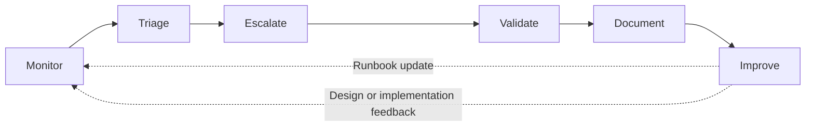
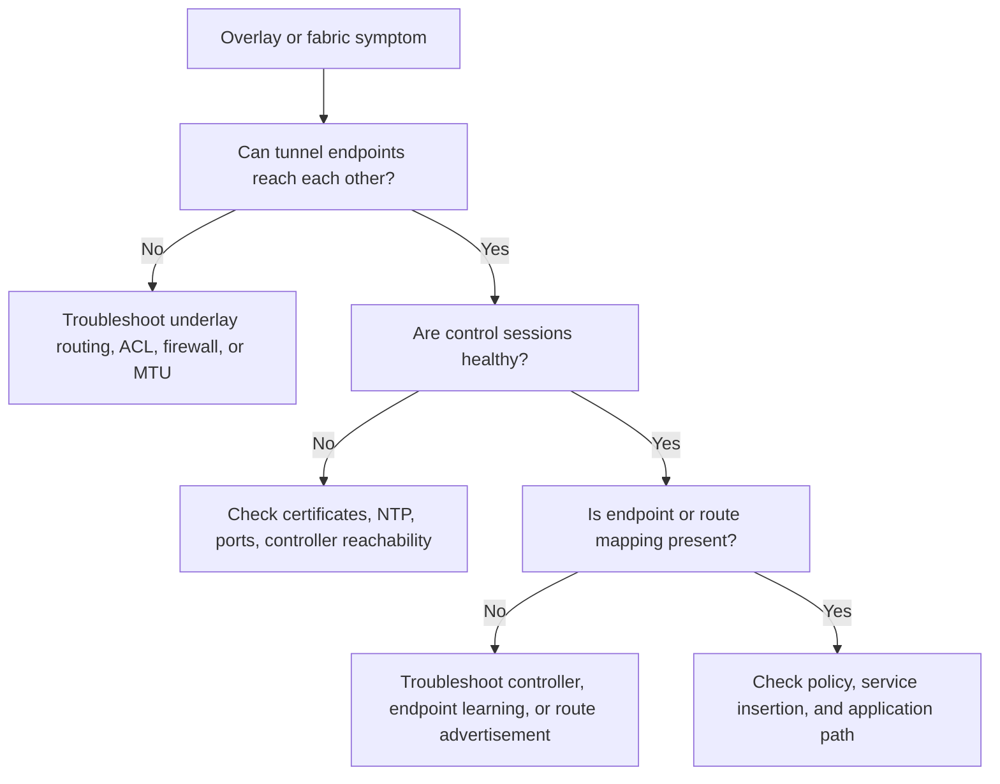
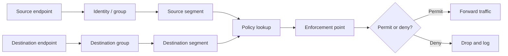
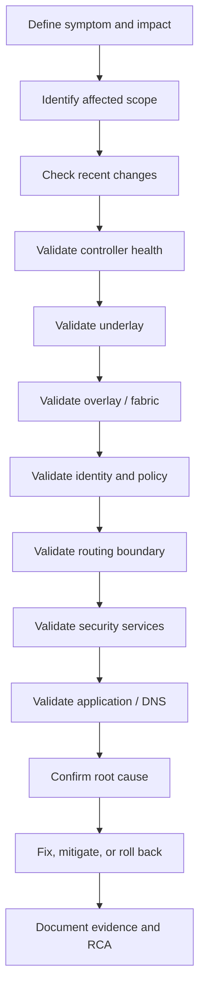
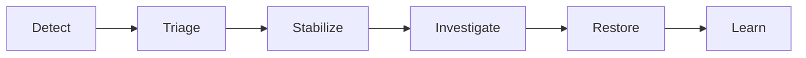

# Chapter 4 - SDN Operations, Monitoring, Assurance, and Troubleshooting

## 1. Chapter Introduction and Positioning

Chapter 1 introduced SDN concepts and architecture. Chapter 2 defined SDN design. Chapter 3 explained how to implement and migrate SDN safely in brownfield environments.

Chapter 4 focuses on operations:

> How do we keep an SDN environment healthy, observable, secure, and supportable after deployment?

Operating SDN is different from operating a traditional device-by-device network. The operations team must understand not only interfaces, routing tables, and device logs, but also controllers, policy objects, identity systems, overlays, telemetry, assurance scores, task history, and cross-domain dependencies.

The goal of this chapter is to build an operational model that can detect issues early, isolate root cause quickly, validate service restoration, and feed lessons learned back into design and implementation.

## 2. Learning Objectives

After completing this chapter, participants should be able to:

- Build an SDN operations model that covers controller, underlay, overlay, policy, identity, security services, and application experience.
- Define monitoring requirements for SDN domains and brownfield integration boundaries.
- Explain the difference between monitoring, observability, and assurance.
- Interpret health scores, path traces, telemetry, flow records, and policy verification outputs.
- Troubleshoot SDN issues using a structured method across control plane, data plane, underlay, overlay, routing, identity, policy, security, and application layers.
- Create incident response and RCA workflows for SDN environments.
- Define operational dashboards, metrics, and handover requirements for production support.

## 3. SDN Operations Model

SDN operations must be service-oriented rather than only device-oriented. A device can be up while the service is broken. A controller can report a successful task while the data plane still forwards incorrectly. A policy can be deployed while the wrong endpoint identity causes the wrong rule to match.


### 3.1 Operational Domains

| Domain | What operations must watch | Typical evidence |
|---|---|---|
| Controller health | Cluster state, services, database, API, task engine, certificates, backups | Controller dashboard, service status, API health, audit logs |
| Underlay health | Physical links, routing adjacencies, MTU, latency, loss, errors | Interface counters, routing tables, BFD, IP SLA, streaming telemetry |
| Overlay/fabric health | Tunnels, endpoint mappings, VNIs, VRFs, fabric roles, path state | Fabric health, tunnel state, EVPN/LISP/control sessions, path trace |
| Identity and policy | Authentication, group mapping, policy deployment, enforcement | NAC logs, policy hit counters, contracts/ACLs/firewall logs |
| Security services | Firewalls, IDS/IPS, proxy, SASE/SSE, segmentation enforcement | Session table, deny logs, threat events, rule hit count |
| Application experience | User-to-app reachability, latency, transaction success, SaaS performance | Synthetic tests, APM, DNS logs, user experience scores |

### 3.2 Operations Workflow



Operations should not stop at fixing the symptom. A mature SDN operations team captures the evidence, updates the runbook, tunes monitoring, and identifies whether the issue came from design, implementation, configuration drift, or process gaps.

## 4. Operating SDN vs Traditional Networks

| Area | Traditional operations | SDN operations |
|---|---|---|
| Primary view | Device status and CLI output | Service, fabric, controller, policy, and path view |
| Change history | Change tickets and device configs | Change tickets, controller tasks, API calls, policy revisions |
| Troubleshooting | Hop-by-hop packet path | Hop-by-hop plus controller state, identity, policy, and overlay mapping |
| Segmentation evidence | VLAN, VRF, ACL, firewall | VN/VRF/VNI/group/EPG/contract/firewall/cloud policy |
| Monitoring | SNMP, syslog, NetFlow, CLI | Telemetry, events, flow records, API state, assurance correlation |
| Risk | Manual inconsistency | Centralized change with larger blast radius |

### 4.1 Practical Operating Principle

Do not trust a single source of truth during incident triage. Compare:

- Intended state from design, source of truth, or controller policy.
- Deployed state from controller task history.
- Device state from the forwarding infrastructure.
- Observed state from telemetry, flow logs, and packet tests.
- User experience from application transactions.

When these disagree, the gap is often the clue.

## 5. Monitoring, Observability, and Assurance

These terms are related but not identical.

| Concept | Meaning | SDN example |
|---|---|---|
| Monitoring | Collecting and alerting on known metrics and events | Controller node down, tunnel down, interface errors, firewall deny spike |
| Observability | Ability to understand system behavior from outputs | Correlating user, route, policy, tunnel, and application evidence |
| Assurance | Continuous validation that actual behavior matches intended behavior | Path trace confirms traffic follows intended service path and policy |

Monitoring tells you something happened. Observability helps explain why. Assurance checks whether the network is doing what it was designed to do.

## 6. SDN Telemetry and Assurance Pipeline

Telemetry must cover more than devices. A useful SDN telemetry pipeline collects evidence from infrastructure, controllers, identity platforms, firewalls, cloud, applications, and users.


### 6.1 Telemetry Sources

| Source | Data examples | Operational use |
|---|---|---|
| Devices | Interface counters, CPU, memory, routing state, tunnel state | Detect underlay/data-plane issues |
| Controllers | Task status, fabric health, inventory, policy deployment state | Detect control-plane and orchestration issues |
| Identity systems | Authentication logs, group assignment, posture, profiling | Validate endpoint classification |
| Firewalls/security | Sessions, denies, threat events, NAT, IPS logs | Validate enforcement and inspection |
| Cloud | Flow logs, route tables, security groups, load balancer logs | Validate hybrid/cloud paths |
| Applications | Transaction success, response time, errors | Prove service experience |
| Users/endpoints | Client health, DNS, DHCP, Wi-Fi/wired status | Correlate network with user impact |

### 6.2 Telemetry Methods

| Method | Strengths | Limitations |
|---|---|---|
| SNMP | Widely supported, useful for device metrics | Polling delay; limited context |
| Syslog | Good for events and faults | Unstructured unless normalized |
| NetFlow/IPFIX | Useful flow visibility and traffic patterns | Sampled or metadata-only; no payload |
| Streaming telemetry | Near real-time structured data | Requires collector and schema understanding |
| API polling | Controller-level inventory and task state | Rate limits and API version changes |
| Event streaming | Useful for task, policy, and state changes | Requires correlation with other data |
| Packet capture | High-fidelity evidence | Point-in-time and operationally expensive |

### 6.3 Assurance Outputs

Assurance platforms should produce outputs that operations can act on:

- Health score with contributing factors.
- Path trace with policy and service checkpoints.
- Root-cause candidates with evidence.
- Deviation from baseline.
- SLA/SLO status.
- Compliance evidence.
- Recommended next action.

### 6.4 Health Scores: Useful but Dangerous

Health scores are useful because they summarize complex telemetry. They are dangerous when treated as truth without evidence.

Use health scores to:

- Prioritize triage.
- Identify trends.
- Compare sites or fabrics.
- Detect early warning signs.

Do not use health scores as the only decision input. Always drill into:

- Which metric changed.
- Which domain produced the signal.
- Whether the issue maps to real user impact.
- Whether recent changes explain the score.
- Whether a hidden domain is outside the scoring model.

## 7. Operational Baselines

Troubleshooting is faster when normal behavior is known.

### 7.1 Baseline Categories

| Baseline | Examples |
|---|---|
| Controller | Normal CPU/memory, task duration, API latency, service status |
| Underlay | Normal link utilization, route count, latency, loss, MTU |
| Overlay | Tunnel count, fabric path state, endpoint count, VNI/VRF state |
| Policy | Normal denies, allowed flows, rule hit count, segment membership |
| Identity | Authentication success rate, RADIUS latency, failed posture checks |
| Security | Firewall sessions, IPS events, blocked destinations, NAT pool usage |
| Application | Transaction response time, DNS resolution, server reachability |

### 7.2 Baseline Use Case

If a branch reports poor application performance after migration, a baseline helps distinguish:

- Underlay transport loss.
- Overlay tunnel instability.
- Wrong application path selection.
- Firewall inspection delay.
- DNS resolution to a distant service.
- Application server slowness unrelated to SDN.

Without baseline data, the team may spend the incident proving facts that should already be known.

## 8. Controller Operations

The controller is an operational system, not only a deployment tool.

### 8.1 Controller Health Checklist

- Are all controller nodes reachable?
- Are cluster services healthy?
- Is database replication healthy?
- Are certificates valid?
- Is NTP synchronized?
- Are backups recent and restorable?
- Are API services responding normally?
- Are task queues processing?
- Are device control connections healthy?
- Are there failed tasks or stuck jobs?
- Are software versions in supported combinations?

### 8.2 Controller Security Controls

Controller and API security remain part of operations because compromise or misuse can change the network at scale.

Operational controls:

- Dedicated management access path.
- MFA for human administrators.
- RBAC with least privilege.
- Separate operator, administrator, auditor, and automation roles.
- Service accounts with scoped permissions.
- API token rotation and secure storage.
- Audit log forwarding to SIEM.
- Backup encryption and access control.
- Change approval for high-impact operations.

### 8.3 Controller Task Validation

A controller task can pass at the API layer and fail during device deployment. Operations should validate:

- API response status.
- Task status.
- Device deployment status.
- Actual device state.
- Data-plane behavior.
- User or application outcome.

## 9. Underlay and Overlay Operations

Always separate underlay from overlay during operations.

### 9.1 Underlay Checks

- Physical interface status.
- Link errors and drops.
- Routing adjacency state.
- Route table and next hop.
- ECMP path consistency.
- MTU and fragmentation behavior.
- Latency, loss, jitter.
- Firewall or ACL between tunnel endpoints.

### 9.2 Overlay/Fabric Checks

- Tunnel state.
- Fabric node role and registration.
- Endpoint mapping.
- Overlay route table.
- VNI/VRF/VN state.
- Control sessions.
- Encapsulation and decapsulation counters.
- Border node route exchange.
- Policy enforcement state.

### 9.3 Underlay vs Overlay Decision Flow



## 10. Identity and Policy Operations

Identity and policy issues often appear as network reachability issues.

### 10.1 Identity Symptoms

- User is placed in guest or quarantine unexpectedly.
- Device gets the wrong virtual network or security group.
- IoT device works in one building but not another.
- Wireless user roams and loses access.
- OT engineering workstation fails after reauthentication.

### 10.2 Identity Checks

- Authentication result.
- Authorization profile.
- Assigned VLAN, VN, SGT, EPG, group, or policy tag.
- RADIUS attributes.
- Certificate status.
- Endpoint profiling.
- Device posture.
- User directory group membership.
- Session timeout or reauthentication event.

### 10.3 Policy Troubleshooting Questions

- What is the exact source identity, segment, IP, and location?
- What is the exact destination identity, segment, IP, and application port?
- Which policy object should allow or deny the flow?
- Where is enforcement expected: edge, fabric, firewall, cloud, host, or SASE/SSE?
- Is the policy deployed to the relevant site/domain?
- Is the traffic matching the expected rule?
- Is another policy more specific?
- Is logging enabled at the enforcement point?
- Has any recent change modified group mapping or policy order?

### 10.4 Policy Flow



## 11. Routing Boundary and Security Service Operations

Chapter 3 covered implementation of brownfield boundaries. Chapter 4 focuses on operating them.

### 11.1 Boundary Health Checks

| Area | Operational check |
|---|---|
| Route exchange | Are neighbors up and expected prefixes exchanged? |
| Route filtering | Are denied prefixes still blocked? |
| Summarization | Are summaries stable and specific routes controlled? |
| Default route | Is the correct segment receiving the correct default? |
| Route leaking | Are only approved inter-segment routes present? |
| Symmetry | Does return traffic follow a valid stateful path? |
| Firewall inspection | Are sessions created and logs visible? |
| NAT | Are translations correct and pools healthy? |

### 11.2 Security Service Checks

- Firewall rule hit count.
- Session table.
- NAT translations.
- IPS/IDS events.
- Proxy or SSE/SASE policy logs.
- TLS inspection exceptions.
- Decryption or certificate errors.
- Failover state.
- Service latency.
- Deny spike after policy changes.

Security operations and network operations must share evidence. A fabric path trace without firewall logs is incomplete when the service path includes inspection.

## 12. SDN Troubleshooting Decision Tree

Troubleshooting SDN requires a repeatable decision tree. Jumping directly to a suspected controller or policy issue often wastes time.


### 12.1 General Troubleshooting Method



### 12.2 Do Not Skip

| Step | Why it matters |
|---|---|
| Baseline | Without normal-state data, teams confuse correlation with cause. |
| Recent changes | Most incidents follow a change in config, policy, code, topology, or external service. |
| Time correlation | Align controller logs, device logs, firewall logs, identity logs, and user reports. |
| Packet path | Confirm the real path, not the assumed path. |
| Evidence capture | Save outputs before they age out or are overwritten. |

## 13. Troubleshooting Scenarios

### 13.1 Scenario: User Cannot Reach Application

Symptoms:

- User in a campus fabric cannot access an ERP application in the data center.
- Other users may or may not be affected.

Investigation flow:

1. Identify user, endpoint, source IP, group, location, destination, application port, and time.
2. Check authentication and assigned segment.
3. Check campus fabric edge and path.
4. Check border node routing.
5. Check WAN/core path if involved.
6. Check data center route, endpoint group, and application segment.
7. Check firewall/session logs.
8. Check DNS result and application health.
9. Confirm return path.

Evidence to collect:

- Identity log.
- Endpoint group/segment assignment.
- Route table at border.
- Path trace.
- Firewall session or deny log.
- Application transaction result.

### 13.2 Scenario: Overlay Tunnel or Fabric Path Down

Symptoms:

- Site unreachable.
- Fabric path unavailable.
- Tunnel status down.
- Applications fail over or degrade.

Possible causes:

- Transport outage.
- Firewall blocking control or data ports.
- Certificate issue.
- Time synchronization issue.
- Device not authorized.
- NAT traversal issue.
- Controller unreachable.
- Incorrect template or profile.

Checks:

- Underlay reachability.
- DNS resolution if controller FQDN is used.
- NTP and certificate validity.
- Control connections.
- Firewall/NAT rules.
- Device onboarding state.
- Controller logs and task history.

### 13.3 Scenario: Policy Misconfiguration

Symptoms:

- A group that should be blocked is allowed.
- A group that should be allowed is blocked.
- The issue appears after a policy change.

Possible causes:

- Wrong source or destination group.
- Policy order issue.
- Missing contract or ACL.
- Incorrect firewall object.
- Policy deployed to wrong site.
- Incomplete multi-domain mapping.
- Cached session or stale endpoint state.

Response:

- Identify exact flow.
- Compare intended policy with deployed policy.
- Review recent changes.
- Check enforcement point logs.
- Roll back if business impact is high.
- Update policy documentation after correction.

### 13.4 Scenario: MTU and Encapsulation

Symptoms:

- Ping works but application fails.
- Small packets pass, large packets fail.
- File transfer hangs.
- Tunnel is up but performance is poor.

Cause:

Overlay encapsulation adds headers. If underlay MTU is too small, packets may fragment or be dropped.

Checks:

- Interface MTU.
- Tunnel overhead.
- DF-bit ping.
- Firewall handling of ICMP fragmentation-needed.
- Path MTU discovery.
- TCP MSS.

Remediation:

- Increase underlay MTU where possible.
- Adjust TCP MSS where appropriate.
- Allow required ICMP.
- Validate with application traffic, not only ping.

### 13.5 Scenario: Controller Task Succeeds but Service Fails

Symptoms:

- Controller reports policy or template deployment success.
- User traffic still fails.

Possible causes:

- Task succeeded at controller but not on all devices.
- Device has stale state.
- Wrong scope or site selected.
- Policy deployed but endpoint classified differently.
- Firewall or cloud policy still blocks traffic.
- Application dependency not included in policy.

Response:

- Check per-device deployment result.
- Compare intended object, deployed object, and device state.
- Validate endpoint classification.
- Confirm packet path and enforcement point.
- Check external security services.
- Update validation tests to catch this case in the future.

## 14. Incident Response and RCA

An SDN incident response workflow should stabilize service while preserving evidence.


### 14.1 Incident Workflow



### 14.2 SDN Incident Checklist

- Classify severity and business impact.
- Identify affected users, sites, devices, segments, applications, and time window.
- Freeze risky changes if the incident is active.
- Review recent controller tasks, policy changes, API calls, routing changes, and firewall changes.
- Collect controller, telemetry, device, identity, firewall, cloud, and application evidence.
- Decide whether mitigation, targeted fix, or rollback is appropriate.
- Validate restored service.
- Communicate status and closure.
- Document RCA and preventive actions.

### 14.3 RCA Structure

An RCA should be short, factual, and evidence-based.

| Section | Content |
|---|---|
| Summary | What happened in plain language. |
| Business impact | Users, sites, applications, duration, severity. |
| Timeline | Detection, escalation, mitigation, restoration, closure. |
| Detection method | Alert, user report, assurance system, ticket, synthetic test. |
| Root cause | Primary technical or process cause. |
| Contributing factors | Secondary conditions that made the incident possible or worse. |
| Resolution | What restored service. |
| Validation | Evidence that service was restored. |
| Preventive actions | Design, process, monitoring, automation, or training improvements. |
| Owner and due date | Accountability for each action. |

### 14.4 RCA Scenario

Summary:

- Guest internet access failed in three pilot branches after a centralized policy update.

Root cause:

- The guest segment was omitted from the policy scope applied to the branch group.

Contributing factors:

- Validation checked corporate user traffic only.
- The dashboard had no guest-specific synthetic test.

Resolution:

- Rolled back the policy, added the guest segment to the policy scope, validated internet access, and redeployed.

Prevention:

- Add segment coverage validation before policy changes.
- Add guest internet synthetic test to branch health dashboard.
- Update the policy deployment runbook.

## 15. Dashboard and Alert Design

Dashboards should be designed for roles, not just tool capabilities.

### 15.1 Network Operations Dashboard

- Controller health.
- Device reachability.
- Fabric/overlay status.
- Underlay health.
- Critical alarms.
- Route/tunnel status.
- Change task history.
- Site health.

### 15.2 Security Operations Dashboard

- Policy violations.
- Denied flows.
- Guest, IoT, and OT events.
- Admin actions.
- API calls.
- Firewall and IPS events.
- Quarantine events.
- Segmentation compliance.

### 15.3 Application Experience Dashboard

- Application reachability.
- Transaction success rate.
- Latency, loss, jitter.
- DNS resolution.
- Branch-to-app path.
- SaaS experience.
- User experience score.

### 15.4 Executive or Service Dashboard

- Service availability.
- Site health.
- SLA/SLO compliance.
- Major incidents.
- Risk indicators.
- Migration wave stability.

### 15.5 Alert Quality

Good alerts are actionable. Weak alerts create noise.

| Alert type | Weak version | Strong version |
|---|---|---|
| Controller | Controller warning | Controller node 2 API latency above threshold for 10 minutes; task queue growing |
| Tunnel | Tunnel down | Branch A primary tunnel down; traffic failed over to secondary with 15 ms latency increase |
| Policy | Deny count high | Corporate users denied to ERP TCP 443 after policy change ID 4821 |
| Identity | Auth failures | Building B 802.1X failures increased 40 percent after certificate renewal |
| Application | App slow | ERP transaction response time doubled for users behind border node B1 |

## 16. Operational Metrics

Metrics should support both service operation and continuous improvement.

| Metric | Why it matters |
|---|---|
| Controller availability | Indicates control system health. |
| Device onboarding success rate | Shows platform and process maturity. |
| Policy deployment success rate | Indicates change reliability. |
| Failed task count | Reveals controller, template, or process issues. |
| Tunnel/fabric adjacency stability | Indicates overlay health. |
| Route churn | Detects instability at boundaries. |
| Authentication success rate | Indicates identity platform health. |
| Policy exception count | Reveals policy design drift. |
| Mean time to detect | Measures monitoring effectiveness. |
| Mean time to restore | Measures operational response. |
| Incident recurrence | Shows whether RCA actions are effective. |
| User experience score | Connects network health with business impact. |

## 17. Operating by Domain

### 17.1 Data Center Fabric Operations

Operational focus:

- Controller/APIC or fabric controller health.
- Leaf/spine health.
- Endpoint learning.
- Tenant/VRF/EPG or EVPN/VXLAN state.
- External routing and L3Out or border connectivity.
- Contract/policy hits.
- Service insertion and firewall path.

Common issue patterns:

- Missing endpoint mapping.
- External route not advertised.
- Contract missing or too broad.
- Asymmetric service path.
- MTU issue across overlay.

### 17.2 Campus Fabric Operations

Operational focus:

- Fabric edge, border, and control node health.
- Wired/wireless endpoint onboarding.
- Identity integration.
- Virtual networks and group policy.
- DHCP, DNS, and default route behavior.
- Guest, IoT, and employee segmentation.

Common issue patterns:

- Endpoint assigned to wrong group.
- RADIUS timeout or certificate issue.
- Border route leak missing.
- Wireless and wired policy mismatch.
- Device profiling error.

### 17.3 WAN Overlay Operations

Operational focus:

- Controller/orchestrator health.
- Edge device control connections.
- Tunnel state.
- Transport SLA metrics.
- Application-aware routing policy.
- Site templates and configuration drift.
- Cloud/SASE/SSE on-ramp health.

Common issue patterns:

- Transport brownout.
- Tunnel down due to certificate or NAT issue.
- Application classified incorrectly.
- Direct internet access path missing security inspection.
- Route preference causes unexpected path.

### 17.4 Cloud and Multicloud Operations

Operational focus:

- Route tables and propagation.
- Security groups and cloud firewalls.
- Transit gateway/cloud WAN.
- Private endpoints.
- Flow logs.
- Infrastructure-as-code drift.
- Cloud identity and permissions.

Common issue patterns:

- Overlapping IP space.
- Security group blocks traffic.
- Route table associated with wrong subnet.
- Cloud route propagation delay.
- IaC drift from manual console changes.

### 17.5 IT/OT Operations

Operational focus:

- Zone and conduit policy.
- Passive monitoring.
- Industrial protocol visibility.
- Controlled remote access.
- Firewall allow lists.
- Historian and broker flows.
- Maintenance window discipline.

Common issue patterns:

- Unknown legacy dependency.
- Vendor access path bypasses policy.
- Strict enforcement breaks poorly documented flows.
- Monitoring tool generates unsafe active probes.
- IT change process does not align with OT production windows.

## 18. Operational Governance

SDN operations require clear governance because policy and controller changes can affect many devices and users.

### 18.1 Governance Controls

| Control | Operational purpose |
|---|---|
| RBAC | Limits who can view, change, approve, or audit. |
| Change approval | Reduces uncontrolled high-impact changes. |
| Audit logging | Provides accountability and RCA evidence. |
| Configuration backup | Enables recovery and comparison. |
| Policy review | Prevents broad or stale access. |
| Exception lifecycle | Ensures temporary access does not become permanent. |
| Drift detection | Identifies divergence between intended and actual state. |
| Runbook ownership | Keeps procedures current. |

### 18.2 Change Review Questions

- What domains are affected?
- What policies, routes, templates, or objects will change?
- What is the blast radius?
- What pre-checks and post-checks prove safety?
- What telemetry should be watched during the change?
- What is the rollback trigger?
- Who owns communication?
- How will the change be documented?

## 19. Practical Operations Scenarios

### 19.1 Scenario: Policy Drift After Emergency Change

Situation:

- During an outage, an engineer adds a broad firewall allow rule so an application can recover.
- The application works, but the temporary rule remains for weeks.

Operational response:

- Detect exception through policy review or drift report.
- Identify the original incident and business owner.
- Replace broad allow rule with least-privilege policy.
- Validate application flow.
- Set expiration date for any remaining exception.

Why it matters:

SDN makes policy easier to deploy, but also easier to forget unless exception lifecycle is managed.

### 19.2 Scenario: Authentication Latency Looks Like Network Slowness

Situation:

- Users report slow network access after connecting to wired ports.
- Once connected, application performance is normal.

Likely investigation:

- Check RADIUS response time.
- Check certificate validation.
- Check endpoint profiling.
- Compare access-switch logs with identity server logs.
- Validate whether delay occurs before IP connectivity.

Why it matters:

Not every user experience issue is a forwarding problem. Identity is part of the SDN service path.

### 19.3 Scenario: Health Score Green, Application Still Fails

Situation:

- Fabric health score is green.
- A specific application fails for one user group.

Likely investigation:

- Check whether health score includes the application flow.
- Validate policy matrix for the user group.
- Check firewall logs.
- Check DNS result.
- Run synthetic transaction.

Why it matters:

Health scores summarize platform health. They may not validate every business service.

## 20. Operational Deep Dive

Operating an SDN environment requires engineers to reason about several representations of the same service. A controller stores intended policy, devices hold programmed state, routing and endpoint databases describe reachability, and telemetry reports observed behavior. Application users experience the combined result. Operations becomes effective when these views can be correlated quickly and consistently.

### 20.1 The Five-State Operational Model

An operational investigation should distinguish five states:

| State | Operational question | Typical evidence |
|---|---|---|
| Intended | What should the system do? | Approved policy, source of truth, template, design record |
| Controller | What did the controller calculate and request? | Object relationships, task status, rendered configuration, audit log |
| Device | What was installed locally? | Running state, route and adjacency tables, policy entries, hardware counters |
| Observed | What occurred on the network? | Telemetry, flows, packet captures, syslog, authentication and firewall logs |
| Experienced | Did the business service work? | Synthetic transaction, application monitoring, user experience, service SLO |

The model is useful because a fault can exist between any two states. An approved contract may not be deployed. A deployed route may not be installed in hardware. A permitted flow may fail at a firewall or application server. A healthy packet path may still provide unacceptable application response because DNS, authentication, or the application is slow.

Operations should avoid beginning every incident at the device CLI. The first task is to identify which state diverged and at what time.

### 20.2 Time Correlation and Event Integrity

SDN incidents produce evidence across controllers, switches, routers, wireless systems, identity services, firewalls, hypervisors, cloud platforms, and applications. If timestamps are inconsistent, the event sequence can be misread.

Time synchronization is therefore an operational control. The team should verify:

- All infrastructure uses approved NTP sources.
- Time zones are documented and logs use a consistent representation, preferably UTC for centralized analysis.
- Clock offset is monitored.
- Controller, device, identity, and security logs retain sufficient precision.
- Automation jobs include request IDs and timestamps.
- Telemetry pipelines preserve event time as well as ingestion time.

Event integrity also requires stable identifiers. Useful correlation keys include username, endpoint MAC and IP address, security group, fabric node, interface, VRF or VN, tunnel identifier, application name, controller task ID, and change record. A dashboard that cannot pivot between these identifiers may display health but still be poor for investigation.

### 20.3 Telemetry Pipeline Engineering

A telemetry pipeline has more stages than collection. Each stage can introduce loss or distortion:

1. A device or controller generates a metric, event, log, flow record, or trace.
2. A collector subscribes, polls, or receives the data.
3. The pipeline normalizes names, units, labels, and timestamps.
4. Data is enriched with topology, ownership, site, policy, and service context.
5. Storage applies retention and indexing.
6. Analytics calculates baselines, correlations, health, and anomalies.
7. Dashboards and alerts present conclusions to operators.

Pipeline monitoring should track collection gaps, dropped messages, queue depth, parsing errors, stale subscriptions, storage delay, and cardinality. An assurance system cannot be trusted if its own data freshness is unknown.

SNMP polling remains useful for stable counters and broad device coverage. Streaming telemetry is better suited to frequent state changes and high-resolution measurements. Syslog provides event narratives but may be inconsistent across platforms. Flow telemetry summarizes conversations. Packet capture offers exact evidence for a limited observation point. A complete design combines sources rather than expecting one method to answer every question.

### 20.4 Baselines, Thresholds, and Anomalies

Static thresholds are easy to understand but often create noise. An interface at 80 percent utilization may be normal during a nightly backup and critical during interactive production hours. A baseline describes expected behavior by time, site, service, and condition.

Useful baselines include:

- Authentication success rate and response time by access method.
- Endpoint count and movement rate by site.
- Fabric and overlay tunnel count.
- Control-plane adjacency and route count.
- Link utilization, loss, latency, and error rate.
- Application transaction time by user population.
- Policy deny rate and top denied relationships.
- Controller task duration and failure rate.
- Telemetry freshness and collector delay.

An anomaly indicates deviation, not necessarily a fault. Operations should combine anomaly magnitude with service impact, duration, confidence, and recent change context. Automated remediation should not act on a single weak signal.

### 20.5 Health Scores and Confidence

Health scores compress multiple conditions into one number or category. They help prioritize investigation, but the calculation must be understood. A score can remain green because the failed application flow is not part of the model, because telemetry is stale, or because component health is weighted more heavily than service outcome.

When using a health score, ask:

- Which objects and signals contribute to the score?
- How recent is the data?
- Are missing signals treated as healthy, unknown, or unhealthy?
- Which dependencies are excluded?
- Does the score measure component health or service assurance?
- What threshold and weighting changed the displayed status?

A health score should link to evidence. Operators need to drill from a service to sites, endpoints, paths, devices, policies, and events rather than accepting the summary as a conclusion.

### 20.6 Layered Troubleshooting Method

A repeatable troubleshooting method reduces random command execution. The following sequence is suitable for user-to-application incidents:

1. **Define scope.** Identify affected users, devices, sites, applications, protocols, and start time.
2. **Check change context.** Review controller tasks, automation runs, policy changes, upgrades, and security events near the start time.
3. **Validate endpoint identity.** Confirm authentication result, assigned group, IP address, gateway, and attachment point.
4. **Validate source policy.** Confirm VN or VRF, EPG, security group, and applicable contracts or ACLs.
5. **Validate underlay.** Check interface state, routing adjacency, MTU, loss, errors, and reachability between tunnel endpoints.
6. **Validate overlay.** Check endpoint mappings, tunnel state, control-plane entries, and destination resolution.
7. **Validate boundaries.** Check route import/export, default route, next hop, service insertion, firewall session, NAT, and return path.
8. **Validate the destination.** Confirm server route, listening service, DNS result, load balancer, and application health.
9. **Test the transaction.** Reproduce the actual protocol and record timestamps and path evidence.
10. **Restore and learn.** Stabilize service, preserve evidence, correct monitoring, and update the runbook.

The sequence can be adapted, but skipping identity, policy, or return-path validation is a common source of delay in SDN environments.

### 20.7 Control-Plane Troubleshooting

Control-plane troubleshooting asks whether the system has enough correct state to build forwarding entries. Important checks include:

- Controller cluster membership, service health, and database consistency.
- Device registration and controller connectivity.
- Routing protocol neighbor state.
- Endpoint location and mapping databases.
- Route, MAC, and policy distribution.
- Task queues and failed configuration deployments.
- Certificate, DNS, NTP, and AAA dependencies.

A controller fault may be local to one service. For example, the GUI can be reachable while a task engine, telemetry service, or policy-distribution process is unhealthy. Operations should use service-level health, not only node reachability.

When a route is missing, determine where it should originate, how it should be advertised, which policy permits import, and where it disappears. This hop-by-hop control-plane trace is more reliable than repeatedly refreshing a dashboard.

### 20.8 Data-Plane Troubleshooting

Data-plane troubleshooting verifies actual forwarding. Useful evidence includes:

- FIB and adjacency entries.
- MAC and endpoint learning.
- Tunnel encapsulation and decapsulation counters.
- Interface and queue counters.
- Policy hit counters and deny logs.
- Firewall session and NAT tables.
- Packet capture at source, boundary, and destination.
- Synthetic application transactions.

Packet capture remains valuable in SDN, but observation points must be chosen carefully. Capturing only the inner packet on one side of an overlay may not reveal whether encapsulation, underlay transport, or decapsulation failed. The engineer may need captures before encapsulation, on the underlay, and after decapsulation, together with tunnel and endpoint state.

### 20.9 ACI Operational Investigation

For an ACI workload incident, the operator should correlate tenant policy with fabric state. A structured investigation includes:

1. Identify tenant, VRF, bridge domain, EPG, endpoint IP and MAC, and leaf/interface location.
2. Confirm the endpoint is learned in the expected EPG and has not moved unexpectedly.
3. Confirm the destination endpoint or external prefix is resolved.
4. Verify the consumer and provider relationship and the contract subject/filter.
5. Check bridge-domain subnet and route behavior.
6. For external traffic, verify L3Out node profile, interface profile, BGP state, imported/exported prefixes, external EPG classification, and contract.
7. Check fabric faults, drops, interface counters, and atomic counters where available.
8. Validate the application transaction and return path.

During brownfield coexistence, add checks for duplicate gateways, Layer 2 trunk state, spanning-tree behavior, stale ARP, and whether the endpoint is learned on the legacy or ACI side.

### 20.10 Catalyst Center Assurance Investigation

Catalyst Center can correlate users, clients, network devices, sites, paths, and assurance issues. A useful investigation begins with the affected client or service rather than a generic device alarm.

For a wired client, inspect:

- Client identity and onboarding status.
- Switch, port, VLAN, IP address, and authentication method.
- Connectivity timeline and issue events.
- Device health and interface errors.
- Path trace toward the application where supported.
- DNS, DHCP, AAA, and application dependencies.

For a wireless client, also inspect association, authentication, roaming, RSSI, SNR, channel utilization, interference, retransmission, and access-point health. A user report of "the network is slow" may result from RF conditions, delayed authentication, DHCP, DNS, WAN loss, or application response.

Assurance findings should be verified against raw evidence when the business impact is significant. Automated issue classification accelerates triage, but the operator remains responsible for confirming causality.

### 20.11 Policy Troubleshooting by Decision Chain

Policy troubleshooting becomes clearer when expressed as a decision chain:

1. How was the source classified?
2. How was the destination classified?
3. Are both classifications current?
4. Which macrosegment contains each endpoint?
5. Is inter-segment routing permitted?
6. Which policy relation applies?
7. Which enforcement node evaluates it?
8. Did the rule match, and what action was taken?
9. Did a later firewall, proxy, or host control reject the session?

The chain distinguishes policy definition from policy enforcement. A correct policy object attached to the wrong group is ineffective. A permit at the fabric does not guarantee that a firewall or server allows the same traffic. A deny counter can prove enforcement, while the absence of a counter may indicate that traffic never reached the expected point.

### 20.12 Routing and Stateful Service Failures

Stateful firewalls and load balancers require path symmetry unless the platform has a supported method for state sharing or asymmetric processing. SDN path optimization, equal-cost routing, and multiple borders can create an unexpected return path.

When a session fails intermittently, compare:

- Forward and reverse route lookups.
- Equal-cost next-hop selection.
- Firewall cluster ownership and session synchronization.
- NAT translation and return route.
- Policy-based routing or service graph behavior.
- Failure and recovery timing.

A control plane may correctly advertise multiple equal-cost routes while the stateful service design requires one symmetric path. The solution may be route-policy adjustment, service insertion design, state synchronization, or topology correction rather than an overlay change.

### 20.13 Incident Severity and Operational Decisions

Not every fault justifies the same response. Severity should reflect business service impact, affected scope, safety or regulatory implications, and available workaround.

The incident commander should define:

- Current impact and affected services.
- Stabilization objective.
- Evidence collection owner.
- Change freeze or rollback decision.
- Communication interval and stakeholders.
- Escalation criteria.
- Recovery validation.

During an incident, avoid uncontrolled parallel changes. Each action should have a hypothesis, owner, timestamp, expected result, and rollback. SDN controllers can deploy broad changes quickly, so emergency permissions must still preserve accountability.

### 20.14 Root-Cause Analysis Beyond the Failed Component

A useful RCA explains why the organization allowed the failure to reach users and why detection or recovery took as long as it did. It should cover:

- Technical cause and triggering event.
- Contributing design or implementation conditions.
- Monitoring and alert behavior.
- Change and approval context.
- Why redundancy or rollback did not prevent impact.
- Timeline of detection, diagnosis, mitigation, and recovery.
- Corrective actions with owners and due dates.
- Validation that corrective actions are effective.

For example, an application outage after a contract change may have a direct cause of a missing port. Contributing causes may include incomplete dependency mapping, no preproduction test, no policy simulation, weak change review, and no synthetic transaction alert. Correcting only the port leaves the process defect intact.

### 20.15 Operational Readiness for the Next Migration Wave

Before expanding SDN to another site or domain, operations should demonstrate that it can:

- Detect controller, fabric, routing, identity, and policy failures.
- Identify endpoint location and classification.
- Trace a representative user-to-application path.
- Interpret contract or group-policy enforcement.
- Validate external routing and firewall paths.
- Restore controller configuration and access backups.
- Escalate platform defects with an evidence package.
- Measure service outcomes and stabilization trends.
- Maintain current as-built and runbook documentation.

This gate prevents the project from outrunning operational capability.

### 20.16 Counter Interpretation

Cumulative counters must be converted into rates before they can describe current behavior. If an interface byte counter increases from `B1` to `B2` over `T` seconds, approximate utilization is:

```text
bits_per_second = (B2 - B1) * 8 / T
utilization_percent = bits_per_second / interface_speed * 100
```

Counter wrap, device reload, interface reset, and collection gaps must be handled. A negative delta usually indicates a reset or wrap, not negative traffic.

Errors should be interpreted by type:

- CRC or frame-check errors can indicate physical corruption.
- Input drops can indicate buffer or processing pressure.
- Output drops often indicate congestion and queue exhaustion.
- Pause frames can indicate Ethernet flow-control behavior.
- Discards can result from policy, MTU, malformed frames, or platform-specific conditions.

A rising counter proves occurrence at an observation point, not root cause. Correlate it with traffic rate, peer counters, optics, queue statistics, and service impact.

### 20.17 Latency, Loss, and Jitter Measurement

Round-trip latency contains forward path, destination processing, and return path. It does not prove that both directions use the same route. One-way measurement requires synchronized clocks.

Packet loss percentage is meaningful only with the sample count and interval. One lost packet in ten is not equivalent evidence to one lost packet in ten thousand. Bursty loss can harm real-time applications more than the same average loss distributed evenly.

Jitter describes variation in delay. Voice, video, industrial control, and transactional applications can be sensitive to different patterns. Monitoring should align with application requirements rather than use one universal threshold.

### 20.18 MTU Troubleshooting Procedure

An MTU problem often appears as partial reachability. TCP handshakes and small requests succeed, while large transfers, TLS negotiation, or database responses stall.

A structured test is:

1. Identify the expected inner MTU.
2. Calculate overlay and transport overhead.
3. Test underlay reachability between tunnel endpoints with the required size.
4. Set Don't Fragment for IPv4 where supported.
5. Verify ICMP fragmentation-needed or ICMPv6 Packet Too Big messages are not blocked.
6. Compare ingress and egress counters around the tunnel path.
7. Capture before encapsulation and after decapsulation.

TCP Maximum Segment Size adjustment can hide some path-MTU defects for TCP, but it does not fix non-TCP traffic and should not replace a correct underlay MTU design.

### 20.19 ACI Intra-VRF Packet Investigation

For traffic between two ACI endpoints in different bridge domains but the same VRF:

1. Confirm the source endpoint IP and MAC are learned in the expected EPG and leaf.
2. Confirm the destination endpoint is present in the endpoint database.
3. Verify both bridge domains are associated with the same intended VRF.
4. Verify unicast routing and subnet gateway configuration.
5. Identify the source EPG as contract consumer and destination EPG as provider for the initiated service.
6. Confirm the contract subject and filter match protocol and destination port.
7. Check whether policy is installed on the ingress leaf.
8. Check ingress, tunnel, and egress drop counters.
9. Validate the server listens on the expected port and has a return route.

If the endpoints are on different leafs, verify the remote tunnel endpoint route in the underlay and the overlay endpoint mapping. If the destination moved recently, investigate stale or duplicate endpoint location.

### 20.20 ACI External Packet Investigation

For ACI-to-external traffic, add these checks:

- Source endpoint and EPG classification.
- Internal subnet route in the VRF.
- L3Out association with the same VRF.
- External destination route and next hop.
- External EPG subnet classification.
- Contract between internal and external EPGs.
- Border leaf interface and eBGP state.
- External router return route.
- Firewall session, NAT, and symmetry where present.

The external EPG subnet used for policy does not necessarily create a route. Likewise, a BGP route does not create a contract. Both routing and policy must be present.

### 20.21 Endpoint Move and Duplicate Detection

Endpoint movement is normal for virtual machines and mobile clients but suspicious for fixed servers or OT devices. Rapid movement between interfaces can indicate:

- A Layer 2 loop.
- Duplicate MAC address.
- Misconfigured port channel.
- Active/active attachment without the required multi-homing design.
- Incorrect VLAN extension.
- Virtualization or clustering behavior.

Correlate move timestamps with interface state, spanning-tree changes, vPC consistency, and virtualization events. Suppressing the fault without resolving the source can leave intermittent traffic loss.

### 20.22 Catalyst Wired Client Timeline

A wired client connection can be decomposed into stages:

1. Physical link and switch-port initialization.
2. 802.1X or MAC Authentication Bypass exchange.
3. RADIUS request and identity lookup.
4. Authorization result, VLAN or VN assignment, and security-group assignment.
5. DHCP address acquisition.
6. DNS and application access.

If the delay occurs before authentication completes, investigate supplicant, certificate, RADIUS, directory, and policy services. If authentication is fast but no address is assigned, inspect DHCP relay, scope, and path. If IP connectivity works but applications fail, continue through DNS, policy, WAN, and server checks.

A client assurance page should be read as a timeline. A current green status can hide a failure that occurred during initial connection.

### 20.23 Wireless Troubleshooting Mechanics

Wireless adds a radio-frequency and mobility layer. Important measurements include:

- RSSI: received signal strength.
- SNR: signal relative to the noise floor.
- Channel utilization: airtime already consumed.
- Retry rate: frames retransmitted because acknowledgments were not received.
- Data rate and modulation: negotiated physical-layer behavior.
- Roaming time: interval between leaving one AP and establishing service on another.

Strong RSSI does not guarantee good service when interference or channel utilization is high. A high retry rate can produce low throughput even when the wired uplink is healthy.

Correlate client, access point, controller, RADIUS, DHCP, DNS, and application timelines. Roaming problems can involve RF coverage, authentication method, key caching, controller mobility state, or policy reassignment.

### 20.24 BGP Troubleshooting State Machine

A BGP session progressing through Idle, Connect, Active, OpenSent, OpenConfirm, and Established states provides diagnostic information.

- Repeated Idle or Active state can indicate IP reachability, TCP port, source address, or peer configuration failure.
- Failure after OpenSent can indicate AS number, capability, authentication, or protocol negotiation mismatch.
- Established with no routes points toward address-family activation, import policy, or peer advertisement.
- Routes received but not selected require best-path and policy analysis.

After session establishment, verify prefix counts, rejected routes, next-hop reachability, best-path reason, and installation in the forwarding table. A healthy neighbor count alone is insufficient.

### 20.25 OSPF Troubleshooting State Machine

OSPF neighbor states include Down, Init, 2-Way, ExStart, Exchange, Loading, and Full. The stuck state narrows the investigation.

- Init can indicate one-way hello reception.
- 2-Way is normal on multiaccess networks for non-DR/BDR neighbors but not for a point-to-point adjacency expected to become Full.
- ExStart or Exchange often indicates MTU, duplicate router ID, or database-description negotiation problems.
- Loading can indicate link-state request or database synchronization issues.

Check area, authentication, timers, network type, MTU, router ID, and filtering. After Full state, verify the expected LSAs and selected routes.

### 20.26 Policy Counter Correlation

A policy counter should be tied to a test transaction. Record source, destination, protocol, port, timestamp, and expected rule. Capture counter values before and after the test.

If the expected permit counter does not increase:

- The source or destination may be classified differently.
- Traffic may take another enforcement point.
- Routing may fail before policy evaluation.
- The test may use a different address or port.

If a deny counter increases, identify the exact policy and direction. A broad deny log without endpoint context creates noise. Enrichment with group, application, site, and owner makes the event actionable.

### 20.27 Telemetry Freshness and Missing Data

No data is not the same as healthy data. Every dashboard should expose freshness.

For each source, operations should know:

- Expected reporting interval.
- Last successful sample.
- Collector and subscription status.
- Ingestion delay.
- Missing-sample policy.
- Retention interval.

If a device stops reporting during an outage, a naive average can improve because the worst source disappeared. Analytics should treat missing data as unknown and alert on the collection failure.

### 20.28 Synthetic Transaction Design

Synthetic tests should reproduce meaningful service behavior. A ping tests ICMP reachability, while an application transaction can test DNS resolution, TCP connection, TLS negotiation, authentication, request, and response content.

For each synthetic test, define:

- Source site and policy group.
- Destination service.
- Expected DNS answer.
- Protocol and request.
- Success condition and timeout.
- Frequency and maintenance suppression.
- Evidence retained on failure.

Tests from multiple source groups can validate segmentation. One transaction should succeed from authorized users, while the same transaction is expected to fail from guest or contractor groups.

### 20.29 Chapter Conclusion

SDN operations is the practice of proving that intent becomes a working service over time. Controllers and assurance platforms improve visibility, but they do not replace disciplined correlation, protocol knowledge, packet-path reasoning, and application validation.

The mature operator moves fluently from service impact to identity, policy, overlay, underlay, routing boundary, and destination. Evidence from each layer is tied to a common timeline and change context. Chapter 5 builds on this operational foundation by showing how automation and agentic systems can assist safely without obscuring accountability.

## 21. Review Questions

1. What is the difference between monitoring, observability, and assurance?
2. Why should SDN operations compare intended, deployed, device, observed, and user-experience state?
3. What telemetry sources are required for end-to-end SDN operations?
4. Why are health scores useful but insufficient by themselves?
5. What should be checked before assuming an overlay problem is caused by the controller?
6. Why do identity issues often appear as network reachability issues?
7. What evidence is needed to troubleshoot a policy issue?
8. What operational checks are required at routing and security service boundaries?
9. What makes an alert actionable?
10. What should be included in an SDN RCA?
11. Which operational metrics indicate policy drift or process weakness?
12. Why is governance especially important in SDN operations?

## 22. Key Takeaways

- SDN operations must cover controller, underlay, overlay, identity, policy, security services, and application experience.
- Monitoring detects symptoms; observability explains behavior; assurance validates intent.
- Troubleshooting should follow a structured path from scope and recent changes through controller, underlay, overlay, identity, policy, routing, security, and application checks.
- Health scores are helpful entry points, not final evidence.
- Identity and policy are part of the network service path in SDN.
- Incident response should stabilize service while preserving evidence for RCA.
- Mature operations feed lessons learned back into design, implementation, automation, and governance.

## 23. References for Further Study

- Cisco, Catalyst Center product page: https://www.cisco.com/site/us/en/products/networking/dna-center-platform/index.html
- Cisco, Cisco Catalyst Center Assurance User Guide: https://www.cisco.com/c/en/us/support/cloud-systems-management/dna-center/products-user-guide-list.html
- Cisco, Nexus Dashboard product page: https://www.cisco.com/site/us/en/products/networking/data-center-networking/nexus-dashboard/index.html
- Cisco, Application Centric Infrastructure overview: https://www.cisco.com/site/us/en/products/networking/cloud-networking/application-centric-infrastructure/index.html
- Cisco, Identity Services Engine product page: https://www.cisco.com/site/us/en/products/security/identity-services-engine/index.html
- Cisco, Zero Trust overview: https://www.cisco.com/site/us/en/solutions/security/zero-trust/index.html
- Juniper, Mist AI documentation: https://www.juniper.net/documentation/product/us/en/mist/
- Juniper, Apstra documentation: https://www.juniper.net/documentation/product/us/en/apstra/
- Arista, CloudVision: https://www.arista.com/en/products/eos/eos-cloudvision
- OpenTelemetry project: https://opentelemetry.io/
