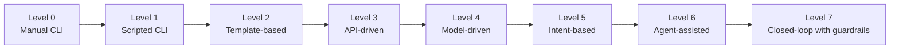
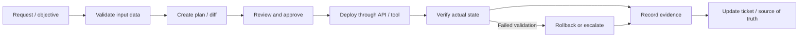
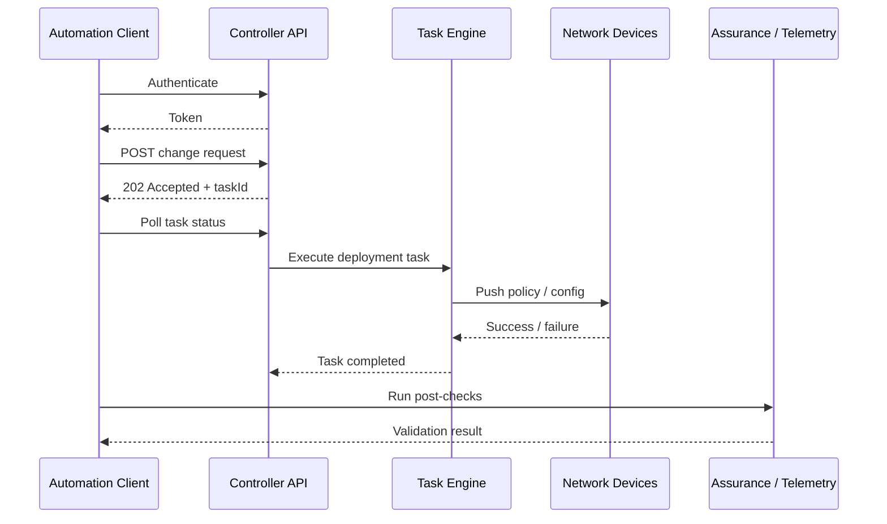
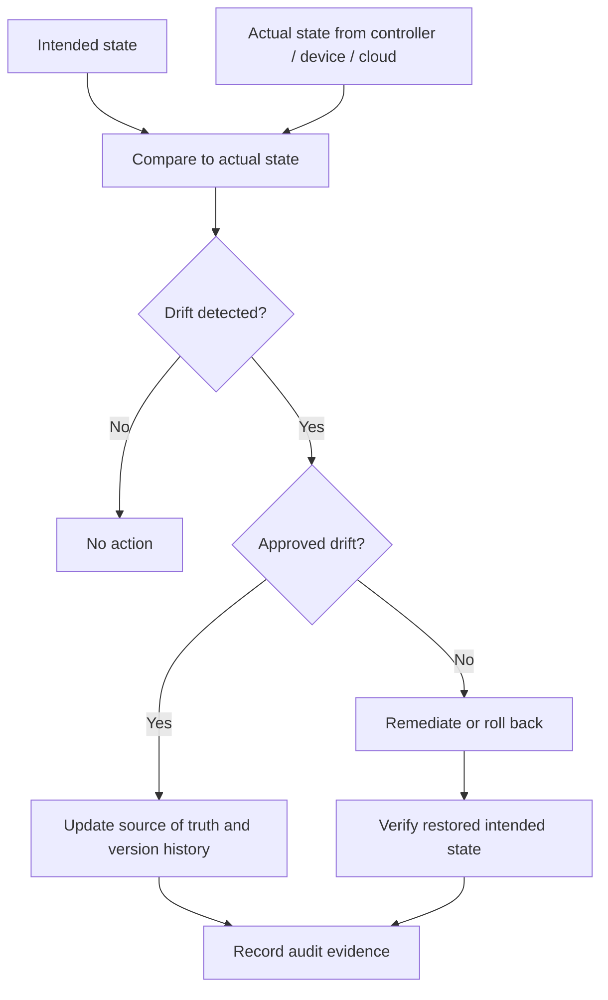
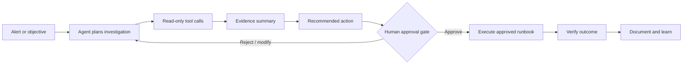
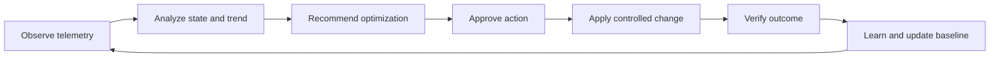

# Chapter 5 - SDN Automation, Agentic Operations, and Optimization

## 1. Chapter Introduction and Positioning

Chapter 1 introduced SDN concepts and architecture. Chapter 2 covered SDN design. Chapter 3 covered implementation and migration. Chapter 4 covered operations, monitoring, assurance, and troubleshooting.

Chapter 5 focuses on automation and optimization:

> How do we use APIs, source-of-truth data, infrastructure as code, workflow automation, agentic operations, and closed-loop optimization to improve SDN operations without creating uncontrolled risk?

Automation is not the final step after the network is deployed. It is an operating capability that must be designed, governed, tested, monitored, and improved. In SDN, automation can operate against controllers, fabrics, cloud APIs, firewalls, identity platforms, monitoring systems, and ITSM workflows. That power creates speed, consistency, and scale, but it also increases blast radius when data, policy, or approval controls are weak.

## 2. Learning Objectives

After completing this chapter, participants should be able to:

- Explain the difference between scripting, automation, orchestration, infrastructure as code, intent-based workflows, and agentic operations.
- Design an SDN automation architecture with source of truth, validation, approval, deployment, verification, rollback, and audit.
- Compare CLI automation, controller API automation, NETCONF/RESTCONF/YANG, gNMI, Ansible, and Terraform.
- Build safe automation patterns using idempotency, pre-checks, post-checks, blast-radius control, and change governance.
- Explain how agentic operations can assist investigation, recommendation, runbook execution, and documentation.
- Define guardrails for AI/agentic workflows in production network operations.
- Identify SDN optimization opportunities for path selection, policy cleanup, capacity planning, application experience, security posture, and cost.

## 3. Automation Is Not Just Scripting

Many network teams begin by writing scripts that push CLI commands. This can be useful, but scripting alone is not enough for production SDN operations.

| Capability | Question it answers | Example |
|---|---|---|
| Scripting | How do I make this task faster? | Python script collects interface status. |
| Automation | How do I make this task repeatable and validated? | Workflow backs up configs, checks compliance, and reports results. |
| Orchestration | How do I coordinate multiple systems? | ITSM approval triggers controller API, firewall update, and monitoring registration. |
| Infrastructure as Code | How do I manage network intent as versioned code/data? | Terraform manages cloud network resources or controller objects. |
| Intent-based workflow | How do I declare the desired outcome? | Create a segment and policy; controller translates to implementation. |
| Agentic operations | How do I let an assistant investigate, reason, recommend, and execute approved runbooks? | Agent queries telemetry, summarizes evidence, proposes action, waits for approval. |
| Closed-loop optimization | How do I continuously improve based on telemetry and policy? | System detects path degradation, recommends path change, verifies SLO recovery. |

### 3.1 Automation Maturity Model



The target is not always the highest level. Many enterprises gain major value from read-only inventory, compliance reporting, backup validation, and safe controller API workflows. Automation maturity should increase only as data quality, monitoring, approval process, and rollback maturity improve.

## 4. SDN Automation Architecture

An SDN automation architecture should connect business process, source-of-truth data, automation tools, controller APIs, validation, telemetry, and audit evidence.


### 4.1 Automation Workflow



### 4.2 Required Architecture Components

| Component | Purpose |
|---|---|
| ITSM/change system | Governs requests, approvals, maintenance windows, and incident linkage. |
| Source of truth | Stores intended state: sites, devices, IPs, circuits, segments, policy, owners. |
| Git repository | Provides version control for templates, code, data, and policy definitions. |
| Automation runner | Executes workflows through Ansible, Terraform, Python, CI/CD, or orchestration tools. |
| Secrets vault | Stores credentials, tokens, keys, and certificates securely. |
| Controller APIs | Provide structured interaction with SDN controllers and policy systems. |
| Model-driven interfaces | Provide device-level structured configuration and telemetry where appropriate. |
| Monitoring/assurance | Validates results after change and feeds optimization workflows. |
| Audit store | Preserves who changed what, when, why, and with what result. |

### 4.3 Guardrails

Guardrails are mandatory in SDN automation because a single workflow can affect many devices, segments, or users.

- Use read-only automation first.
- Use least-privilege service accounts.
- Separate development, staging, and production credentials.
- Validate schema, dependencies, and policy before deployment.
- Require approval for high-impact or write-capable changes.
- Limit blast radius by site, segment, device group, or application.
- Run pre-checks and post-checks.
- Log every action and response.
- Design rollback before deployment.
- Treat automation output as evidence, not just console text.

## 5. Core API Concepts for SDN Automation

Most SDN controllers expose northbound APIs. REST APIs are common, but automation teams must also understand asynchronous tasks, authentication, rate limits, pagination, schema changes, and error handling.

### 5.1 REST API Basics

| Method | Meaning | SDN example |
|---|---|---|
| GET | Retrieve data | Get device inventory or fabric health. |
| POST | Create or trigger | Create site, deploy template, start path trace. |
| PUT | Replace object | Replace a full policy object. |
| PATCH | Modify part of object | Update site attributes or description. |
| DELETE | Remove object | Delete a test policy or temporary object. |

Common status codes:

| Code | Meaning | Automation implication |
|---|---|---|
| 200 | OK | Request completed. |
| 201 | Created | Object created. |
| 202 | Accepted | Task accepted; poll task status. |
| 204 | No content | Request succeeded, no body. |
| 400 | Bad request | Payload or parameter issue. |
| 401 | Unauthorized | Authentication problem. |
| 403 | Forbidden | Permission problem. |
| 404 | Not found | Wrong ID or endpoint. |
| 409 | Conflict | Object already exists or state conflict. |
| 429 | Too many requests | Rate limit; backoff required. |
| 500 | Server error | Controller-side failure; retry only with care. |

### 5.2 API Task Flow



A successful HTTP response is not enough. A safe workflow checks the API response, task status, device state, and service outcome.

### 5.3 Authentication and Authorization

API automation must treat credentials as privileged infrastructure.

Good practice:

- Use service accounts instead of personal accounts.
- Scope service accounts by function.
- Store secrets in a vault.
- Rotate tokens and keys.
- Use short-lived credentials where supported.
- Validate TLS certificates.
- Log API calls.
- Protect CI/CD runners and automation hosts.
- Separate read-only and write-capable integrations.

Bad practice:

- Hardcoding credentials in scripts.
- Storing tokens in Git.
- Reusing personal administrator accounts.
- Giving automation global administrator access by default.
- Running production automation from an engineer laptop with no audit trail.

## 6. Model-Driven Management and Telemetry

Traditional CLI automation is text-oriented. Model-driven management uses structured data models to reduce ambiguity.

### 6.1 YANG

YANG is a data modeling language used to describe configuration and operational state. A YANG model defines what objects exist, their hierarchy, data types, constraints, and relationships.

Why it matters:

- Configuration becomes structured.
- Operational data can be queried consistently.
- Tools can validate schema before deployment.
- Vendor-neutral and vendor-specific models can coexist.

### 6.2 NETCONF

NETCONF is a protocol for installing, manipulating, and deleting configuration. It typically runs over SSH and uses XML-encoded data.

Key concepts:

- Candidate and running datastores.
- Locking.
- Edit-config operations.
- Commit and rollback behavior where supported.
- Structured operational state retrieval.

### 6.3 RESTCONF

RESTCONF exposes YANG-modeled data through HTTP methods. It is easier for many developers to consume than NETCONF because it uses REST-style operations and can use JSON.

### 6.4 gNMI and Streaming Telemetry

gNMI is commonly used for model-driven telemetry and configuration operations. Streaming telemetry is especially useful for assurance and optimization because it can provide near real-time data without slow polling.

Common uses:

- Interface counters.
- Routing state.
- CPU and memory.
- Queue drops.
- Tunnel health.
- Event-driven optimization triggers.

## 7. Ansible and Terraform in SDN

Ansible and Terraform solve different problems. Both can be useful, but they should not be used interchangeably without understanding their operating models.

### 7.1 Ansible

Ansible is widely used for network automation because it is readable, agentless, and workflow-friendly.

Good use cases:

- Configuration backup.
- Compliance checks.
- Device facts collection.
- Template rendering.
- Controller API orchestration.
- Multi-step operational workflows.
- Pre-check and post-check execution.

Strengths:

- Human-readable playbooks.
- Good for procedural workflows.
- Easy to integrate with existing scripts.
- Useful in brownfield environments.

Risks:

- Module behavior varies by platform.
- Poor inventory data creates poor automation.
- Playbooks can become difficult to maintain without standards.
- Idempotency must be tested.

### 7.2 Terraform

Terraform is a declarative infrastructure-as-code tool. It is strongest when the provider accurately models the target platform and lifecycle.

Good use cases:

- Cloud network resources.
- Repeatable controller objects where provider support is mature.
- Environment lifecycle management.
- Versioned desired state and change planning.

Strengths:

- Plan/apply workflow.
- State-driven lifecycle.
- Strong fit for cloud infrastructure.
- Clear diff before change.

Risks:

- Terraform state becomes sensitive.
- Manual changes create drift.
- Some network platforms do not map cleanly to declarative resources.
- Provider bugs or gaps can block operations.

### 7.3 Ansible vs Terraform

| Area | Ansible | Terraform |
|---|---|---|
| Operating model | Procedural and task-oriented | Declarative desired state |
| State | Usually discovers or acts at runtime | Maintains state file |
| Strength | Workflows, checks, orchestration | Resource lifecycle management |
| Common network use | Backups, validation, controller workflows | Cloud networks, controller resources |
| Risk | Playbook sprawl, weak idempotency | State drift, provider limitations |

Use Ansible for operational workflows and Terraform for lifecycle-managed resources where provider maturity is strong.

## 8. Source of Truth and Drift Control

Automation without trusted data is just faster inconsistency.


### 8.1 Source-of-Truth Data

| Data type | Examples |
|---|---|
| Site | Site ID, region, address, timezone, change window, support owner |
| Device | Hostname, role, platform, serial, software, management IP |
| Connectivity | Circuit ID, transport type, provider, bandwidth, peer IPs |
| Addressing | Prefix, VLAN, VRF, pool, gateway, allocation status |
| Segmentation | Segment name, VRF/VN/VNI/group, owner, allowed destinations |
| Policy | Source, destination, protocol, action, enforcement point, logging |
| Application | App owner, ports, dependencies, SLO, criticality |
| Security | zone, compliance scope, exception expiry, approval record |

### 8.2 Drift Control Workflow



### 8.3 Drift Categories

| Drift type | Example | Response |
|---|---|---|
| Emergency-approved drift | Temporary firewall rule added during incident | Add expiry, owner, and review date to source of truth. |
| Unauthorized drift | Manual route or policy change outside workflow | Investigate, remediate, and review access controls. |
| Tool drift | Controller state differs from Terraform state | Reconcile state before further changes. |
| Documentation drift | Network changed correctly but records not updated | Update source of truth and close process gap. |
| Compliance drift | Policy no longer matches approved standard | Remediate or file approved exception. |

## 9. Safe Automation Patterns

### 9.1 Idempotency

Idempotency means running the same automation multiple times produces the same final state without unintended side effects.

Non-idempotent pattern:

```text
Add a new ACL line every time the script runs.
```

Idempotent pattern:

```text
Check whether the intended ACL entry exists. Add it only if missing. Update it only if different.
```

Why idempotency matters:

- Automation can be rerun safely.
- Partial failures are easier to recover.
- Scheduled compliance workflows do not create duplicates.
- Drift remediation is more predictable.

### 9.2 Pre-Checks and Post-Checks

| Workflow stage | Checks |
|---|---|
| Pre-check | Controller health, device reachability, backup present, route state, policy scope, maintenance window, ticket approval |
| Change | Apply only to approved scope, capture task ID, monitor deployment status |
| Post-check | Desired state present, routes correct, policy enforced, application transaction passes, logs available |
| Failure handling | Rollback or escalate based on trigger and timebox |

### 9.3 Blast-Radius Control

Limit automation impact by:

- Site.
- Device group.
- Segment.
- Application.
- Policy object.
- User group.
- Maintenance window.
- Change type.

Do not run a new write-capable workflow against all production sites on its first execution.

### 9.4 Rollback and Recovery

Automation rollback should define:

- What can be automatically reverted.
- What requires manual action.
- What state is backed up.
- Who approves rollback.
- How restored service is validated.
- What evidence is captured.

## 10. Agentic SDN Operations

Agentic operations use an AI-enabled assistant or agent to plan, investigate, call tools, summarize evidence, recommend actions, and in approved cases execute runbooks.

The key point is governance: the agent assists; humans remain accountable for high-impact production decisions.


### 10.1 Agentic Workflow



### 10.2 Useful Agentic Operations Use Cases

| Use case | Agent role | Human role |
|---|---|---|
| Incident triage | Collect logs, telemetry, recent changes, and affected scope | Confirm severity and response path |
| RCA drafting | Build timeline and evidence summary | Validate root cause and approve final RCA |
| Change impact review | Compare intended change against topology, policy, and dependencies | Approve, reject, or modify change |
| Policy cleanup | Find unused, duplicate, or broad rules | Decide whether to remove or narrow rules |
| Drift review | Detect differences between intended and actual state | Approve reconciliation or exception |
| Capacity planning | Identify growth trends and saturation risk | Approve budget and architecture changes |
| Runbook execution | Execute approved low-risk steps | Approve write actions and rollback |

### 10.3 Agentic Guardrails

Agentic operations require stricter guardrails than normal scripts because the agent can reason across tools and propose actions.

Mandatory controls:

- Read-only by default.
- Explicit approval for write actions.
- Tool permissions scoped by task.
- Least-privilege service accounts.
- Change-ticket binding for production changes.
- Blast-radius limits.
- Rollback plan before execution.
- Full audit trail of prompts, tool calls, outputs, approvals, and actions.
- Clear confidence and evidence reporting.
- Human review of recommendations affecting security, routing, segmentation, or critical services.

### 10.4 What Agents Should Not Do Initially

Avoid early agent autonomy for:

- Broad production policy changes.
- Route redistribution or default route changes.
- Firewall rule deletion.
- OT access policy changes.
- Identity group remapping.
- Certificate lifecycle actions.
- Controller upgrades.
- Multi-domain change execution without explicit approval.

Start with investigation, summarization, documentation, and low-risk read-only analysis.

## 11. Closed-Loop SDN Optimization

Closed-loop optimization uses telemetry and assurance feedback to improve the network continuously.


### 11.1 Closed-Loop Workflow



### 11.2 Optimization Domains

| Domain | Optimization examples | Required guardrail |
|---|---|---|
| Path optimization | Change WAN path preference, rebalance traffic, avoid degraded transport | SLO target, failback rule, rollback |
| Policy cleanup | Remove unused rules, narrow broad permits, expire exceptions | Security owner approval |
| Capacity planning | Forecast link, device, controller, or license saturation | Budget and architecture review |
| Application experience | Improve SaaS path, DNS policy, QoS, service insertion | User-impact validation |
| Security posture | Identify risky access, unused exceptions, policy violations | Compliance and security review |
| Cost optimization | Reduce unused circuits, licenses, cloud egress, overprovisioning | Business and resilience review |

### 11.3 WAN Path Optimization Scenario

Observation:

- Telemetry shows packet loss on the primary internet transport for several branches.
- Application experience score drops for collaboration traffic.

Analysis:

- Underlay loss correlates with application degradation.
- Secondary transport has lower loss but higher cost.

Recommendation:

- Move collaboration traffic to secondary transport for affected branches until loss returns below threshold.

Approval:

- Operations approves temporary policy change for affected sites only.

Verification:

- Application latency and loss improve.
- No unexpected traffic shifts occur.

Learning:

- Update policy to use dynamic threshold and alert earlier.

### 11.4 Policy Cleanup Scenario

Observation:

- Flow logs show a broad temporary allow rule has had no hits for 45 days.

Analysis:

- Rule was created during an incident and should have expired.
- Application owner confirms it is no longer required.

Recommendation:

- Remove the rule in the next change window.

Approval:

- Security owner approves removal.

Verification:

- No application failures after removal.
- Deny logs monitored for the retired flow.

Learning:

- Add expiration metadata to future temporary exceptions.

## 12. AI/ML in SDN Operations

AI/ML can support SDN operations when there is sufficient data quality, topology context, and human validation.

Useful use cases:

- Anomaly detection.
- Event correlation.
- Root-cause candidate generation.
- Capacity forecasting.
- Application experience prediction.
- Policy cleanup recommendations.
- Security behavior analytics.
- Natural language operational summaries.

Limits:

- AI/ML depends on data quality.
- Bad timestamps break correlation.
- Missing topology context creates weak recommendations.
- Rare incidents may not have enough training examples.
- Models can produce plausible but wrong explanations.
- Automated remediation must be constrained by guardrails.

Practical rule: use AI/ML first to assist detection, triage, summarization, and recommendation. Add approved action execution only after evidence quality and operational trust are mature.

## 13. Automation Security

Automation systems are high-value targets.

### 13.1 Threats

- Stolen API token.
- Hardcoded credentials.
- Overprivileged service account.
- Malicious pipeline change.
- Compromised automation runner.
- Unauthorized production workflow.
- Secrets exposed in logs.
- Drift introduced by manual emergency changes.

### 13.2 Controls

- Vault-based secrets.
- MFA for human users.
- Service-account least privilege.
- Token rotation.
- Signed commits or protected branches.
- Required code review.
- Pipeline approval gates.
- Runtime isolation.
- Audit logs.
- Read-only roles for discovery workflows.
- Separate production and non-production credentials.

## 14. Automation Anti-Patterns

Avoid these:

- Automating a broken manual process.
- Treating the controller API as a faster CLI.
- Building scripts that only one engineer understands.
- Running write workflows without pre-checks.
- Ignoring task status after API calls.
- Using production as the test environment.
- Keeping source-of-truth data in spreadsheets with no ownership.
- Allowing manual changes without drift detection.
- Giving automation global admin permission.
- Deploying closed-loop remediation before monitoring is trustworthy.
- Allowing agentic tools to modify production without explicit approval and audit.

## 15. Practical Automation Scenarios

### 15.1 Scenario: Read-Only Inventory and Compliance

Goal:

- Build trust in automation without changing production.

Workflow:

1. Pull inventory from controllers and devices.
2. Compare software versions and platform roles against standards.
3. Validate NTP, DNS, syslog, AAA, and backup status.
4. Generate report.
5. Open tickets for non-compliant items.

Why this is a good first workflow:

- Low risk.
- High visibility value.
- Improves data quality for future automation.

### 15.2 Scenario: Site Onboarding

Goal:

- Onboard a new branch or campus site using approved standards.

Workflow:

1. Create site record in source of truth.
2. Validate required fields.
3. Generate templates or controller objects.
4. Run pre-checks.
5. Deploy through controller API or automation tool.
6. Verify device onboarding, tunnel/fabric health, routing, and monitoring.
7. Update ticket with evidence.

Risk controls:

- Start with one site.
- Require approval before deployment.
- Use standardized rollback.
- Validate user/application flows.

### 15.3 Scenario: Policy Exception Expiry

Goal:

- Prevent temporary security exceptions from becoming permanent.

Workflow:

1. Query policy catalog for exceptions expiring soon.
2. Check flow logs for recent usage.
3. Notify owner.
4. Recommend extension, narrowing, or removal.
5. Require security approval.
6. Apply approved action.
7. Monitor denied flows after removal.

### 15.4 Scenario: Agent-Assisted Incident Triage

Goal:

- Reduce time to collect and correlate evidence.

Workflow:

1. Alert indicates application failure for a user group.
2. Agent identifies affected source group, destination, time window, and recent changes.
3. Agent performs read-only queries: controller health, path trace, route table, firewall logs, identity logs, application status.
4. Agent summarizes likely fault domain and confidence.
5. Engineer approves next diagnostic step or remediation runbook.
6. Final evidence is attached to the incident record.

## 16. Implementation Roadmap for Automation and Agentic Operations

| Phase | Scope | Exit criteria |
|---|---|---|
| Phase 0 | Standards and data cleanup | Source-of-truth ownership, naming, schemas, and RBAC defined. |
| Phase 1 | Read-only automation | Inventory, backup, compliance, and reporting workflows trusted. |
| Phase 2 | Controlled write automation | Limited site, segment, or policy workflows with approval and rollback. |
| Phase 3 | Workflow orchestration | ITSM, source of truth, controller, monitoring, and security tools integrated. |
| Phase 4 | Agent-assisted operations | Agents support triage, evidence collection, RCA drafts, and recommendations. |
| Phase 5 | Approved closed-loop actions | Low-risk actions executed with guardrails, verification, and rollback. |
| Phase 6 | Continuous optimization | Telemetry-driven improvement backlog and recurring optimization reviews. |

## 17. Automation Readiness Checklist

| Category | Readiness question |
|---|---|
| Data | Is source-of-truth data owned, validated, and current? |
| APIs | Are API capabilities, limits, and versions documented? |
| Credentials | Are secrets stored in a vault with least privilege? |
| Testing | Is there a staging environment or safe test scope? |
| Idempotency | Can workflows be rerun safely? |
| Change control | Are approvals and maintenance windows integrated? |
| Validation | Are pre-checks and post-checks defined? |
| Rollback | Is rollback possible and tested? |
| Observability | Can telemetry prove success or failure? |
| Audit | Are all actions logged and traceable? |
| Skills | Can more than one person operate and maintain the workflow? |
| Governance | Are agentic and closed-loop actions constrained by policy? |

## 18. Cisco and Industry Automation Context

| Area | Cisco examples | Industry examples |
|---|---|---|
| Controller APIs | Catalyst Center APIs, ACI/APIC APIs, SD-WAN Manager APIs, Meraki Dashboard APIs | NSX APIs, Juniper Apstra APIs, Arista CloudVision APIs, Fortinet/Palo Alto APIs |
| Network automation | Cisco NSO, pyATS/Genie, Ansible collections, Terraform providers where available | Ansible, Terraform, Nornir, Nautobot/NetBox, custom Python, GitOps workflows |
| Assurance/telemetry | Catalyst Center Assurance, Nexus Dashboard, ThousandEyes integrations | Juniper Mist AI, Apstra assurance, Arista CloudVision telemetry, OpenTelemetry-based pipelines |
| Security automation | ISE APIs, firewall manager APIs, SecureX/SOAR-style integrations | SIEM/SOAR platforms, firewall APIs, SASE/SSE APIs, cloud security automation |

Product names differ, but the automation principles remain the same: trusted data, scoped permissions, validation, approval, rollback, observability, and audit.

## 19. Technical Deep Dive: Reliable Automation and Agentic Operations

Automation changes the failure model of network operations. A manual error may affect one device; an automation error can affect every device selected by the workflow. The value of automation therefore comes from repeatability, validation, and evidence rather than speed alone.

### 19.1 The Automation Control Loop

A reliable automation system implements a control loop:

1. Read approved intent from a source of truth.
2. Discover actual state through APIs or telemetry.
3. Normalize both states into comparable data models.
4. Calculate the required change.
5. Validate syntax, policy, dependencies, and blast radius.
6. Obtain the required approval.
7. Apply the change through a supported interface.
8. Verify controller, device, and service outcomes.
9. Record evidence and update operational systems.
10. Reconcile or roll back when the result differs from intent.

This loop is more important than the choice of programming language. A short script that performs all ten stages can be safer than a large platform that performs only deployment.

### 19.2 Data Modeling Before Coding

Automation should begin with a data model. The model defines the facts needed to create or evaluate network state. For a site, the model might include site code, role, address blocks, routing domain, WAN transports, device inventory, policy groups, monitoring profile, and business owner.

Good data models have these properties:

- Required fields and accepted values are explicit.
- Identifiers are stable and unique.
- Relationships are represented directly rather than inferred from names.
- Secrets are referenced, not stored in plain text.
- Defaults are documented.
- Validation rejects ambiguous or incomplete records.
- Schema versions can evolve without silently changing meaning.

A controller object model and an enterprise source-of-truth model serve different purposes. The enterprise model should describe business intent and reusable network facts. A translation layer maps those facts into ACI, campus, WAN, firewall, cloud, or monitoring objects. Copying a vendor API schema directly into the source of truth creates tight coupling and makes future integration difficult.

### 19.3 REST API Transaction Semantics

REST APIs commonly use HTTP methods, structured payloads, status codes, and resource identifiers. Operators must understand transaction behavior beyond issuing a request.

| Concern | Questions to answer |
|---|---|
| Authentication | Is access based on session cookie, bearer token, certificate, OAuth flow, or basic credentials? |
| Authorization | Which role can read, create, modify, delete, or approve the object? |
| Task model | Does the request complete immediately or return an asynchronous task ID? |
| Idempotency | Will repeating the request produce the same desired state or duplicate objects? |
| Concurrency | How are conflicting updates detected? Is an ETag, revision, or lock available? |
| Pagination | How are large result sets traversed without missing or duplicating records? |
| Rate limiting | How should the client back off and retry? |
| Errors | Are validation, conflict, dependency, device, and timeout failures distinguishable? |
| Audit | Can the request be correlated with the resulting controller and device change? |

A robust client uses bounded timeouts, validates TLS certificates, handles token renewal, respects rate limits, and records request correlation without logging secrets. Retries should be selective. Retrying a read after a timeout is generally safer than blindly repeating a non-idempotent create operation.

### 19.4 Authentication, Secrets, and Service Accounts

Automation should use dedicated service identities with least privilege. Personal administrator accounts make ownership and rotation difficult. Shared static passwords create unacceptable exposure.

The security design should include:

- A secrets vault or equivalent protected store.
- Short-lived tokens where supported.
- Certificate-based authentication where appropriate.
- Separate identities for development, testing, and production.
- Role separation between planning, approving, and applying changes.
- Credential rotation and revocation procedures.
- Audit logs that identify the workflow and human approver.
- Controls preventing secrets from appearing in source code, state files, console output, or tickets.

The automation host is a privileged management system. It requires hardening, patching, endpoint protection, restricted network access, backup, and monitoring just like a controller.

### 19.5 YANG as a Contract for Structured State

YANG describes configuration and operational data as a typed hierarchy. It can define containers, lists, leaf values, constraints, defaults, identities, and actions. The model allows clients and servers to agree on structure and validation.

An engineer reading a YANG model should identify:

- Configuration data versus operational state.
- Keys that uniquely identify list entries.
- Data types, ranges, patterns, and mandatory fields.
- References between objects.
- Feature flags and deviations supported by the platform.
- RPCs, actions, and notifications.

Standards-based models improve portability, but platform support varies. OpenConfig, IETF, and vendor-native models may expose different depth. Automation should detect capabilities rather than assuming every target implements the same modules and paths.

### 19.6 NETCONF Transaction Behavior

NETCONF operates over a secure transport and manipulates structured datastores. Its value is not merely XML syntax. It can support candidate configuration, validation, locking, confirmed commit, and rollback depending on server capabilities.

A safe transaction can follow this pattern:

1. Establish the authenticated session and inspect capabilities.
2. Lock the candidate datastore if supported and appropriate.
3. Edit the candidate configuration.
4. Validate the candidate.
5. Review the intended diff.
6. Commit with confirmation when supported.
7. Verify operational state and service behavior.
8. Confirm the commit or allow automatic rollback.
9. Unlock and close the session.

Not all devices support every datastore or operation. The workflow must branch according to advertised capabilities. Locking can protect consistency but can also block other operators if sessions are not released correctly.

### 19.7 RESTCONF and gNMI Operational Use

RESTCONF exposes YANG-modeled data through HTTP operations. It is approachable for systems already using REST tooling, while retaining structured models. The client must still understand datastore behavior, content selection, patch semantics, and error responses.

gNMI commonly supports structured Get, Set, and Subscribe operations. Subscription modes allow the collector to receive updates on change or at a defined interval. For streaming telemetry, the design should control subscription scope and frequency. Collecting every path at maximum frequency increases device, network, collector, and storage load without necessarily improving operations.

Telemetry subscriptions should be tied to operational questions. Interface counters, routing adjacency, environmental status, tunnel health, and policy counters have different useful cadences. Critical event streams may require immediate delivery, while inventory data may change rarely.

### 19.8 Ansible Execution Model

Ansible is useful for orchestrating procedural tasks across multiple systems. Network modules and collections can call structured APIs, NETCONF, or CLI interfaces. A playbook should separate inventory, variables, roles, tasks, validation, and secrets.

Safe Ansible practices include:

- Use platform modules instead of raw CLI when the module exposes the needed behavior reliably.
- Pin collection versions and test upgrades.
- Use check mode only when the module accurately supports it.
- Register results and fail explicitly on unexpected state.
- Limit the host batch size with `serial` for production changes.
- Use pre-tasks and post-tasks for health validation.
- Store secrets in a protected vault or external secret manager.
- Make roles reusable and keep site-specific data outside task logic.

Idempotency depends on the module and target. A playbook that sends the same CLI block on every run may report changed state repeatedly and obscure drift. Operators should test the actual behavior rather than assuming the framework guarantees idempotency.

### 19.9 Terraform State and Ownership

Terraform compares configuration with state and provider observations to create a plan. It works well for durable infrastructure objects such as ACI tenants, VRFs, bridge domains, EPGs, contracts, and L3Out components.

The state file is central to Terraform's behavior. Production use requires:

- Protected remote state storage.
- Encryption and strict access control.
- Locking to prevent concurrent modification.
- Backup and recovery.
- Separation of environments and ownership boundaries.
- Review of sensitive values.
- A process for import, state movement, and object retirement.

The plan must be reviewed for deletes and replacements. A small input change can force recreation of a resource depending on provider behavior. Provider and module versions should be pinned, and upgrades should be tested against a representative environment.

The organization must define an ownership rule: an object managed by Terraform should not be modified casually through the GUI. Emergency changes require a reconciliation process so that the next plan does not overwrite them unexpectedly.

### 19.10 CI/CD Pipeline for Network Change

Network infrastructure as code benefits from a controlled delivery pipeline. A typical pipeline contains:

1. Linting and formatting.
2. Schema validation for input data.
3. Static policy checks.
4. Unit tests for transformation logic.
5. Plan or diff generation.
6. Peer review and approval.
7. Deployment to simulator or staging.
8. Integration and service tests.
9. Bounded production deployment.
10. Post-change assurance and evidence retention.

The pipeline should promote the same reviewed artifact between environments rather than regenerating it from unversioned inputs. Production credentials are introduced only at the deployment stage. Failed validation stops the pipeline; it should not be converted into a warning merely to meet a schedule.

### 19.11 Source of Truth and Reconciliation

A source of truth is authoritative only when ownership and reconciliation are defined. Multiple systems may hold valid information: an IPAM system owns address allocations, an identity platform owns user groups, a CMDB owns application relationships, and a controller owns observed fabric state.

The automation architecture should identify the system of record for each attribute. It should also define conflict behavior. If the controller reports a subnet that does not exist in IPAM, the workflow should not silently choose one. It should classify the discrepancy, assess risk, and route it to the correct owner.

Reconciliation modes include:

- **Report only:** identify drift without changing state.
- **Ticket creation:** create a work item with evidence and owner.
- **Approval required:** generate a remediation plan for human approval.
- **Automatic correction:** restore approved state for low-risk, well-tested conditions.

Organizations should begin with report-only reconciliation and earn higher autonomy through measured accuracy.

### 19.12 Testing Strategy for Network Automation

Testing should cover logic, integration, and service outcome.

| Test level | Purpose | Illustration |
|---|---|---|
| Schema test | Reject invalid source data | Missing VRF, overlapping prefix, unknown site code |
| Unit test | Validate transformation logic | Business group maps to the expected EPG and contract set |
| Static policy test | Enforce organizational rules | No unrestricted management access; no route export without owner |
| Integration test | Validate platform interaction | Controller accepts object hierarchy and returns expected task state |
| State test | Confirm programmed result | EPG, route, or security group exists with expected attributes |
| Service test | Confirm business outcome | Approved transaction succeeds and prohibited transaction fails |
| Failure test | Confirm recovery | Timeout, partial device failure, token expiry, or rollback |

Negative testing is essential. The workflow must prove that prohibited traffic remains blocked and that invalid data is rejected before deployment.

### 19.13 Agentic System Architecture

An agentic operations system adds reasoning and tool selection to the automation architecture. It may interpret an incident, retrieve relevant knowledge, query live systems, form hypotheses, recommend actions, and execute approved tools.

The architecture should separate these components:

- **User or event interface** that begins the task.
- **Orchestrator** that manages the workflow and state.
- **Model** that performs language understanding and reasoning.
- **Retrieval layer** that supplies runbooks, designs, policies, and prior incidents.
- **Tool layer** that exposes read or change operations through constrained interfaces.
- **Policy engine** that evaluates permissions, risk, scope, and approval.
- **Evidence store** that records inputs, observations, decisions, and results.
- **Human approval point** for consequential actions.

The model should not receive unrestricted shell or controller access. Tools should expose narrow, typed operations such as `get_client_health`, `read_bgp_neighbors`, `compare_contract_state`, or `create_change_plan`. Narrow tools improve validation and auditability.

### 19.14 Grounding and Retrieval Quality

Agent recommendations depend on context quality. Retrieval should prioritize authoritative, current sources: approved design documents, as-built records, runbooks, source-of-truth data, vendor documentation, live telemetry, and change history.

The system should preserve source metadata and timestamps. A superseded runbook or design draft can be dangerous. Retrieval evaluation should measure whether the correct documents are found, whether critical constraints are included, and whether conflicting sources are identified.

The agent should distinguish observed facts from inference. For example:

- Fact: BGP neighbor `192.0.2.2` changed from Established to Idle at 14:03 UTC.
- Fact: Interface errors increased on the connected port at 14:02 UTC.
- Inference: Physical link degradation is a likely contributor.
- Missing evidence: Optical power and provider circuit status have not yet been checked.

This structure prevents a plausible narrative from being mistaken for proof.

### 19.15 Agent Guardrails and Approval

Agentic systems require controls at identity, data, tool, workflow, and outcome layers.

Key guardrails include:

- Read-only access by default.
- Explicit allow lists for tools and targets.
- Separate development and production environments.
- Maximum scope for devices, sites, policies, or transactions.
- Change windows and maintenance-state checks.
- Human approval for writes, deletes, route changes, segmentation changes, or security policy changes.
- Independent pre-check and post-check functions.
- Automatic stop when evidence is incomplete or contradictory.
- Complete audit of prompts, retrieved sources, tool calls, approvals, and results.
- Protection against instructions embedded in untrusted logs, tickets, or documents.

Approval should present a concrete diff, expected impact, evidence, rollback, and validation plan. Asking a human to approve a vague statement such as "optimize the network" is not meaningful control.

### 19.16 Evaluation of Agentic Operations

An agent should be evaluated before it is trusted. Useful measures include:

- Accuracy of fact extraction.
- Correctness of tool selection and parameters.
- Quality of source citation and evidence linkage.
- Rate of unsupported conclusions.
- Detection of missing information.
- Correct risk classification.
- Compliance with approval and scope rules.
- Success of recommended validation and rollback.
- Operator time saved without increased incident rate.

Evaluation sets should include normal operations, ambiguous symptoms, stale documentation, conflicting telemetry, unavailable tools, and adversarial content. A system that performs well only on clean demonstrations is not production-ready.

### 19.17 Closed-Loop Optimization with Safety Boundaries

A closed loop observes a condition, decides on an action, applies it, and measures the result. Safe loops use hysteresis, confidence thresholds, hold-down timers, and bounded actions to avoid oscillation.

Consider WAN path optimization. A single latency spike should not move traffic immediately. The system can require sustained SLA violation across several samples, confirm that an alternate path meets policy, limit the change to one application class, and observe recovery before further action. It should revert or escalate if the new path does not improve the service.

Closed-loop policy cleanup can begin in recommendation mode. The system identifies rules with no hits, confirms that telemetry coverage is complete, checks owner and application records, proposes expiration, and waits for approval. Automatic deletion should come only after the organization has demonstrated reliable evidence and rollback.

### 19.18 Worked Automation Roadmap for the Corporation

The petroleum corporation should increase automation maturity in phases.

**Phase 1: Read-only evidence.** Collect ACI inventory, faults, endpoints, contracts, L3Out routes, and configuration backups. Generate compliance and drift reports without changing production.

**Phase 2: Controlled object creation.** Use Terraform to create reviewed tenant objects in the ACI simulator and then in bounded production batches. Protect state and require plan approval.

**Phase 3: Change orchestration.** Connect source-of-truth data, ITSM approval, Terraform or Ansible execution, and post-change assurance. Use pilot EPGs and contracts before broad deployment.

**Phase 4: Cross-domain correlation.** Correlate identity, campus assurance, WAN path, ACI policy, and application telemetry. Automate evidence gathering for incidents.

**Phase 5: Agent-assisted operations.** Allow an agent to summarize incidents, query approved read-only tools, compare live state with design, and recommend a runbook. Human operators validate all conclusions.

**Phase 6: Bounded closed loop.** Automate low-risk remediation such as restarting a failed telemetry subscription or opening a ticket for drift. Network path or security policy changes remain approval-controlled until accuracy and governance are proven.

### 19.19 Pagination, Filtering, and Large Inventories

Controller APIs rarely return an unlimited inventory in one response. They commonly divide results into pages by using an offset and limit, page number, continuation token, cursor, or link to the next result set. An automation client that reads only the first page can produce a dangerously incomplete view while still receiving a successful HTTP response.

A correct inventory loop must preserve the controller's ordering rules, request every page, and stop only when the controller indicates completion. The client should also detect a repeated continuation token, an empty page before the advertised total is reached, or a change in result count during collection. Those conditions can indicate an API defect, an expiring session, or a rapidly changing dataset.

Server-side filtering is preferable when the API supports it because it reduces transfer and parsing load. However, a filter is part of the correctness boundary. The client should record the exact filter, scope, timestamp, and controller identity with the result. A query for faults with severity `critical` is not equivalent to an unfiltered fault inventory from which critical records are selected later if severity changes during pagination.

For large collections, use this sequence:

1. Define the authoritative scope, such as one fabric, site, tenant, or device family.
2. Apply a stable sort key when the API supports one.
3. Fetch pages with bounded timeouts and a maximum page count.
4. Deduplicate records by immutable object identifier rather than display name.
5. Compare the collected count with any total count supplied by the server.
6. Record the collection interval because the result is a time-bounded snapshot, not timeless truth.

### 19.20 Idempotency and Concurrency Control

Idempotency means that repeating an operation results in the same intended state. It does not necessarily mean that the controller returns the same status code or performs no internal work. A `PUT` that declares the complete desired representation is usually easier to make idempotent than a `POST` that asks the server to create a new child object on every call.

Before selecting a method, determine the identity rule for the resource. If the object is identified by a stable distinguished name, UUID, or composite key, the client can read that identity first and decide whether to create or update. Searching by a non-unique display name is unsafe.

Concurrency creates a different risk. Two operators can read revision 10, make different changes, and then write revision 11. Without protection, the later write can silently erase the earlier one. APIs may expose an `ETag`, revision number, generation, or lock. A client can send `If-Match` with the version it read and require the server to reject a stale update with a conflict response.

The desired transaction is:

1. Read the current object and version.
2. Calculate a minimal, explicit change.
3. Validate that the current version still matches.
4. Submit the update with a version precondition.
5. On conflict, stop and re-read; do not automatically overwrite the other change.
6. Verify the final object and its downstream realization.

An idempotency key can help a server recognize a retried create request, but only when the API explicitly supports that behavior. Client-generated names that contain timestamps are not a substitute; they often create duplicate objects that are difficult to reconcile.

### 19.21 Retry, Backoff, and Asynchronous Tasks

Retries should be based on failure semantics. A connection timeout before any response does not prove whether the server processed the request. Repeating a non-idempotent request can therefore create a duplicate. By contrast, a read request that fails with a transient `503 Service Unavailable` can usually be retried safely.

Use exponential backoff with jitter so that many workers do not retry at the same instant. The workflow also needs a total retry budget. A bounded sequence such as 1, 2, 4, and 8 seconds is operationally different from an unbounded loop that can hide an outage for hours.

Many controllers return an asynchronous task identifier. An HTTP `202 Accepted` means that the controller accepted work for processing; it does not mean that the device configuration or policy programming succeeded. The client must poll the task endpoint or consume task events until it reaches a terminal state. Terminal states should be classified as success, failure, partial success, cancelled, or expired rather than reduced to a Boolean result.

After task success, perform an independent state read and a service check. The task may confirm that a template was rendered, while a device can still reject the configuration or remain unreachable. Evidence should link the change request, API correlation ID, asynchronous task, target object, device result, and post-change test.

### 19.22 Practical Python REST Client Pattern

The following pattern illustrates the mechanics of a controlled API client. Endpoint names and response schemas vary by controller, so the code must be adapted to the target's official API contract.

```python
import os
import time
import requests


BASE_URL = os.environ["CONTROLLER_URL"].rstrip("/")
TOKEN = os.environ["CONTROLLER_TOKEN"]

session = requests.Session()
session.headers.update({
    "Authorization": f"Bearer {TOKEN}",
    "Accept": "application/json",
    "Content-Type": "application/json",
})


def request(method, path, **kwargs):
    response = session.request(
        method,
        f"{BASE_URL}{path}",
        timeout=(5, 30),
        verify=True,
        **kwargs,
    )
    response.raise_for_status()
    return response


def wait_for_task(task_id, timeout_seconds=180):
    deadline = time.monotonic() + timeout_seconds
    delay = 1.0
    while time.monotonic() < deadline:
        task = request("GET", f"/api/tasks/{task_id}").json()
        state = task["state"]
        if state == "SUCCEEDED":
            return task
        if state in {"FAILED", "CANCELLED", "PARTIAL"}:
            raise RuntimeError(f"Task ended in state {state}")
        time.sleep(delay)
        delay = min(delay * 2, 10)
    raise TimeoutError(f"Task {task_id} did not complete in time")
```

The connection and read timeouts are separate. TLS verification remains enabled. The token comes from the process environment for illustration, although a production system should retrieve it from an approved secret manager and avoid exposing it through process inspection or logs. `raise_for_status()` prevents an HTML error page or authorization failure from being parsed as a valid data response.

This example intentionally does not retry write operations. A production wrapper can retry selected reads and explicitly idempotent writes, but should classify status codes and methods rather than retrying every exception. Logging should include method, sanitized path, status, duration, correlation ID, and task ID without including authorization headers or confidential payload fields.

### 19.23 NETCONF RPC and Transaction Detail

NETCONF messages are XML RPCs exchanged over a secure session. The client begins with a `<hello>` message, and the server returns its capabilities. These capabilities determine whether candidate configuration, confirmed commit, validation, writable running configuration, rollback-on-error, and other features are available.

A minimal configuration edit identifies a target datastore and supplies model-structured content:

```xml
<rpc message-id="101"
     xmlns="urn:ietf:params:xml:ns:netconf:base:1.0">
  <edit-config>
    <target><candidate/></target>
    <default-operation>merge</default-operation>
    <test-option>test-then-set</test-option>
    <error-option>rollback-on-error</error-option>
    <config>
      <interfaces xmlns="urn:ietf:params:xml:ns:yang:ietf-interfaces">
        <interface>
          <name>Loopback100</name>
          <description>Managed by automation</description>
          <type xmlns:ianaift="urn:ietf:params:xml:ns:yang:iana-if-type">
            ianaift:softwareLoopback
          </type>
          <enabled>true</enabled>
        </interface>
      </interfaces>
    </config>
  </edit-config>
</rpc>
```

Namespace correctness matters because the same XML element name can belong to different YANG modules. The `merge` default operation modifies specified nodes while retaining unspecified siblings. `replace` has broader effect and can delete data that is absent from the supplied representation. The client should use the narrowest operation that expresses intent.

For a supported candidate datastore, the client can lock candidate, edit, validate, inspect the diff, and issue a confirmed commit. A confirmed commit starts a timer. If the client does not send the confirming commit before expiry, the server reverts the change. This protects against loss of management reachability, but it does not replace service validation. A syntactically valid routing change can still violate business reachability.

Every `<rpc-reply>` must be parsed for `<rpc-error>` elements. Error type, tag, severity, path, and message can distinguish malformed XML, invalid value, missing dependency, access denial, lock conflict, and resource exhaustion. Treating any returned XML as success is a serious client defect.

### 19.24 RESTCONF Request Mechanics

RESTCONF maps YANG-modeled data to HTTP resources. Content types identify YANG data encoding, commonly JSON or XML. A read can retrieve configuration, operational state, or both depending on server implementation and query parameters.

```http
GET /restconf/data/ietf-interfaces:interfaces/interface=GigabitEthernet1%2F0%2F1
Accept: application/yang-data+json
Authorization: Bearer <token>
```

A complete-resource update normally uses `PUT`, while `PATCH` can express a partial update when the server supports the relevant patch format. `POST` is generally used to create a child resource or invoke an operation, but the precise behavior comes from the model and implementation. The response status must be interpreted with the method: `200`, `201`, and `204` can all indicate success in different cases.

RESTCONF paths encode module and list-key information. Special characters in interface names and other keys must be URL encoded correctly. The client should not construct paths through casual string concatenation when a URL library can encode path components safely.

After a write, read the modeled state back and compare selected attributes. Then verify operational realization. For example, an interface configuration may be present while line protocol remains down. Configuration equality and service success are different checks.

### 19.25 gNMI Subscription Engineering

gNMI uses typed paths and Protocol Buffers over gRPC. A collector can issue `Get` for a point-in-time read, `Set` for supported configuration operations, or `Subscribe` for telemetry. Subscription design determines the load and the meaning of the data.

Common subscription modes include:

- **ONCE:** Return a finite snapshot and end the subscription.
- **POLL:** Return data when the client requests a new sample.
- **STREAM:** Maintain a stream using sample, on-change, or target-defined behavior.

`ON_CHANGE` is efficient for state such as an adjacency transition, but counters may need `SAMPLE` because their numeric value changes continuously. A 1-second interface-counter interval across thousands of ports can create substantial serialization, transport, collector, and storage load. The design should start from the operational question and required detection time.

A telemetry record needs more than a value. Preserve target identity, path, source timestamp, collection timestamp, encoding, subscription identifier, and synchronization state. When a stream reconnects, the collector should know whether it has received a complete synchronization point. Otherwise, stale values may be mistaken for current state.

Counter processing must account for resets, wrap, discontinuity timestamps, and missing samples. A negative delta after a reboot is not negative traffic. Rate calculations should use the actual time interval between source timestamps and reject intervals with uncertain continuity.

### 19.26 Ansible Playbook with Bounded Deployment

The example below demonstrates sequencing and validation rather than a platform-specific configuration. The production module should be selected from a tested collection for the target platform.

```yaml
---
- name: Deploy a bounded interface-policy change
  hosts: pilot_switches
  gather_facts: false
  serial: 1
  any_errors_fatal: true

  pre_tasks:
    - name: Collect pre-change state
      ansible.builtin.include_role:
        name: interface_health_check

    - name: Stop when baseline is unhealthy
      ansible.builtin.assert:
        that:
          - interface_errors == 0
          - critical_neighbors_up

  roles:
    - role: approved_interface_policy

  post_tasks:
    - name: Collect post-change state
      ansible.builtin.include_role:
        name: interface_health_check

    - name: Validate service outcome
      ansible.builtin.assert:
        that:
          - intended_policy_present
          - critical_neighbors_up
          - packet_loss_percent < 0.1
```

`serial: 1` limits the immediate scope to one pilot device. `any_errors_fatal` stops later batches when a target fails. The pre-check establishes that the workflow is not changing an already degraded device, while the post-check validates both state and service indicators.

The playbook should also archive the rendered commands or API diff, task result, device timestamps, and health evidence. A rescue block may restore a known configuration for a proven failure mode, but a generic rollback should not be assumed safe. Some changes are not cleanly reversible after endpoint moves, route convergence, or dependent policy updates.

### 19.27 Terraform Plan, State, and Resource Iteration

Terraform is strongest when one workflow owns durable objects over time. Repeated objects should be driven by keyed data so identity remains stable:

```hcl
variable "epgs" {
  type = map(object({
    vlan_id       = number
    bridge_domain = string
    description   = string
  }))
}

resource "aci_application_epg" "this" {
  for_each               = var.epgs
  application_profile_dn = aci_application_profile.corp.id
  name                   = each.key
  description            = each.value.description
  relation_fv_rs_bd       = aci_bridge_domain.this[each.value.bridge_domain].name
}
```

Using a map keyed by a stable EPG name is safer than using a positional list with `count`. In a positional list, inserting one item can shift indexes and make the plan appear to replace multiple resources. The plan must still be reviewed because a renamed key is normally interpreted as one deletion and one creation unless state is moved deliberately.

Existing APIC objects should be imported before Terraform is allowed to manage them. Import associates a remote identity with a state address; it does not automatically produce correct configuration code. After import, write the resource definition, run `plan`, and reconcile every difference until the plan is intentionally empty. Applying an unreviewed post-import plan can overwrite attributes that were not modeled correctly.

State must be treated as sensitive operational data. It can contain object identifiers, topology details, and provider-returned values. Use encrypted remote storage, locking, version recovery, narrowly scoped access, and separate state boundaries so a plan for one tenant cannot accidentally control another.

### 19.28 Source-of-Truth Schema and Validation

A source-of-truth record should express enterprise intent without embedding controller click paths. The following YAML describes a policy object in business and network terms:

```yaml
schema_version: 2
policy_id: corp-historian-read
owner: ot-data-services
consumer_group: corp-analytics
provider_group: ot-historian
services:
  - protocol: tcp
    destination_ports: [443]
environments: [production]
approval:
  ticket: CHG-2026-1842
  expires: null
constraints:
  logging: true
  direction: consumer_to_provider
```

Schema validation should reject unknown protocols, invalid port ranges, missing owners, duplicate identifiers, and references to groups that do not exist. Semantic validation goes further: it can detect that the consumer and provider belong to incompatible security zones, that a policy duplicates an existing rule, or that production use requires a security approval not present in the record.

Version the schema and migration logic. A new required field should not silently receive a permissive default across thousands of existing records. The pipeline should either migrate old data explicitly or reject it with a clear remediation message.

### 19.29 CI/CD Validation and Promotion

A network delivery pipeline should produce one immutable change artifact. The artifact can contain normalized input, rendered configuration, Terraform plan, policy-test results, dependency graph, and cryptographic digest. That same reviewed artifact is promoted to staging and production; it is not regenerated from a mutable branch after approval.

Useful gates include:

1. **Syntax gate:** Parse YAML, JSON, XML, HCL, templates, and code.
2. **Schema gate:** Enforce types, required fields, ranges, and references.
3. **Policy gate:** Reject prohibited prefixes, broad contracts, unrestricted management access, or unapproved route export.
4. **Topology gate:** Validate peer addresses, autonomous systems, VLAN uniqueness, endpoint-group bindings, and redundancy assumptions.
5. **Plan gate:** Highlight creates, updates, deletes, replacements, and ownership changes.
6. **Simulation gate:** Apply to a simulator or representative staging system.
7. **Service gate:** Test approved and denied traffic, routing state, telemetry, and management reachability.
8. **Approval gate:** Present scope, risk, evidence, rollback, and maintenance window.
9. **Production gate:** Enforce batch size and stop conditions.
10. **Assurance gate:** Compare expected and observed outcomes before closing the change.

Pipeline logs are evidence, but they can contain secrets or sensitive topology. Apply retention, access control, and redaction. A failed production gate should preserve enough context for investigation while preventing a later job from resuming at an unsafe step without a new approval.

### 19.30 Drift Detection Algorithm

Drift detection compares intended and observed state after normalization. Raw JSON comparison is usually noisy because APIs may reorder lists, return defaults, add timestamps, or expose read-only fields. A normalization function should remove volatile fields, canonicalize addresses and protocol names, sort unordered collections, and map platform-specific values into the enterprise model.

The comparison result should classify differences:

- **Missing:** Intended object does not exist.
- **Unexpected:** Observed object has no approved intent record.
- **Changed:** An owned attribute differs.
- **Unmanaged:** Difference is outside the automation ownership boundary.
- **Unknown:** Collection or translation was incomplete.

Unknown must not be treated as compliant. If the controller API timed out halfway through a tenant, the workflow should report incomplete evidence, not thousands of missing objects and not a clean result.

Each actionable drift item should include object identity, intended value, observed value, owner, first-seen time, last-seen time, confidence, likely source, and remediation mode. Automatic reconciliation should be limited to low-risk owned attributes for which the correction and rollback have been tested.

### 19.31 Agent Tool Contracts and Execution Boundaries

An operations agent should call typed tools rather than construct unrestricted commands. A tool contract defines required parameters, accepted values, authorization scope, maximum result size, and whether the operation is read-only or changes state.

For example, `get_aci_endpoint_history` can require `fabric_id`, `tenant`, and a validated MAC or IP address. It can limit history to 24 hours and return normalized observations with timestamps. The model cannot change the query into an arbitrary APIC request or access another fabric without the policy layer authorizing that target.

Write-capable tools should separate planning from execution. A planning tool returns a deterministic diff and validation result. An execution tool accepts the approved artifact identifier, not a fresh natural-language instruction. This prevents the action from changing between human review and execution.

Tool outputs are untrusted data. A syslog message, ticket, device description, or retrieved document can contain text that resembles an instruction to the model. The orchestrator must label provenance and prevent retrieved content from modifying tool permissions, approval requirements, system rules, or target scope. The agent may summarize such content as evidence, but it must not obey embedded instructions.

### 19.32 Grounded Incident Reasoning Workflow

A disciplined agent-assisted investigation can use the following evidence chain:

1. Parse the incident statement into affected service, users, location, time, and symptoms.
2. Query authoritative inventory and topology to determine expected dependencies.
3. Establish a time-aligned baseline before and during the incident.
4. Identify the first correlated state transition rather than the largest current alarm.
5. Form multiple hypotheses with predicted evidence for each.
6. Use read-only tools to test those predictions.
7. Separate confirmed facts, inferences, contradictions, and missing evidence.
8. Recommend a runbook step or bounded change with validation and rollback.
9. Require approval for consequential action.
10. Measure the service outcome and update the incident record.

Suppose campus clients cannot reach an application in ACI. Endpoint visibility in Catalyst Center does not prove that the ACI contract permits the flow. An ACI contract hit does not prove that the return route exists. The agent should correlate authentication, address assignment, campus path, WAN reachability, L3Out routes, endpoint learning, contract counters, and application health. A single-domain conclusion would be premature.

### 19.33 Evaluating Agent Accuracy and Safety

Agent evaluation should use repeatable cases with known evidence and expected behavior. Score fact extraction, source selection, time alignment, hypothesis quality, tool parameters, risk classification, and policy compliance separately. A final answer can sound correct while being based on the wrong device or stale evidence.

Safety tests should include:

- A ticket containing an instruction to bypass approval.
- A stale runbook that conflicts with the current approved design.
- Two devices with similar names in different environments.
- Missing telemetry during the incident interval.
- A read tool that returns a partial result.
- A suggested action outside the maintenance window.
- A low-confidence hypothesis paired with a high-impact change.

The expected behavior is often to stop, disclose uncertainty, and request the missing evidence. Refusal to act under insufficient evidence is a successful safety outcome, not an agent failure.

For closed-loop use, define service-level objectives and stop conditions before activation. Measure false-positive remediation rate, failed-action rate, mean time to detect adverse effects, rollback success, and incidents caused by automation. Autonomy should expand only when these measures demonstrate sustained reliability.

### 19.34 Chapter Conclusion

Automation is dependable when intent, data, tools, validation, approval, and evidence form one controlled system. APIs and infrastructure-as-code make change repeatable, but they also demand stronger ownership and testing. Agentic operations adds useful reasoning and orchestration, yet it must remain grounded in authoritative data and constrained by explicit tools and policy.

The appropriate goal is not maximum autonomy. It is the highest level of automation that the organization's data quality, observability, recovery, and governance can safely support. A mature SDN program increases autonomy only after lower-risk workflows have demonstrated consistent outcomes.

## 20. Review Questions

1. What is the difference between scripting, automation, orchestration, infrastructure as code, and agentic operations?
2. Why is source-of-truth quality more important than tool selection?
3. Why is a successful API response not enough evidence of a successful network change?
4. When should Ansible be preferred over Terraform, and when should Terraform be preferred?
5. Why is idempotency important in network automation?
6. What guardrails are required before write-capable automation is used in production?
7. What should be included in a drift control workflow?
8. What are safe first use cases for agentic operations?
9. Why should agents be read-only by default?
10. What is the difference between AI-assisted recommendation and closed-loop remediation?
11. Which optimization domains are realistic for SDN operations?
12. Why must closed-loop optimization include human approval, SLOs, compliance rules, and rollback?

## 21. Key Takeaways

- SDN automation is an operating capability, not just a scripting exercise.
- Source of truth, validation, rollback, and audit are more important than the automation tool itself.
- Controller APIs increase speed and consistency, but also increase blast radius.
- Ansible is strong for workflows; Terraform is strong for lifecycle-managed resources with mature providers.
- Drift control is essential when humans, controllers, cloud consoles, and automation tools can all change state.
- Agentic operations should begin with read-only investigation, evidence summaries, RCA drafts, and recommendations.
- Production write actions require explicit approval, least privilege, blast-radius limits, verification, and rollback.
- Closed-loop optimization is valuable only when telemetry quality, guardrails, and operational trust are mature.

## 22. References for Further Study

- Cisco, Catalyst Center APIs: https://developer.cisco.com/docs/dna-center/
- Cisco, Cisco ACI Programmability Guide: https://developer.cisco.com/site/aci/
- Cisco, Catalyst SD-WAN APIs: https://developer.cisco.com/docs/sdwan/
- Cisco, Meraki Dashboard API: https://developer.cisco.com/meraki/api-v1/
- Cisco, pyATS and Genie: https://developer.cisco.com/pyats/
- Ansible Network Automation: https://docs.ansible.com/ansible/latest/network/index.html
- Terraform Documentation: https://developer.hashicorp.com/terraform/docs
- IETF NETCONF RFC 6241: https://datatracker.ietf.org/doc/html/rfc6241
- IETF RESTCONF RFC 8040: https://datatracker.ietf.org/doc/html/rfc8040
- OpenConfig and gNMI: https://www.openconfig.net/
- OpenTelemetry project: https://opentelemetry.io/
