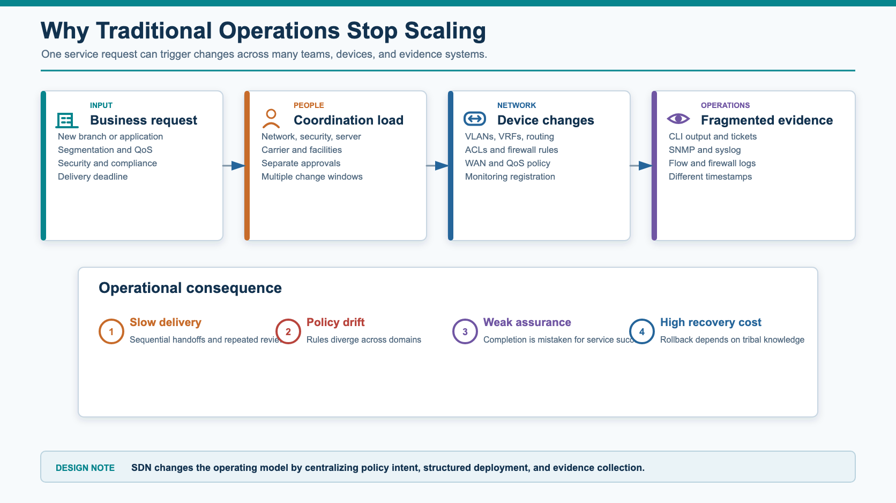
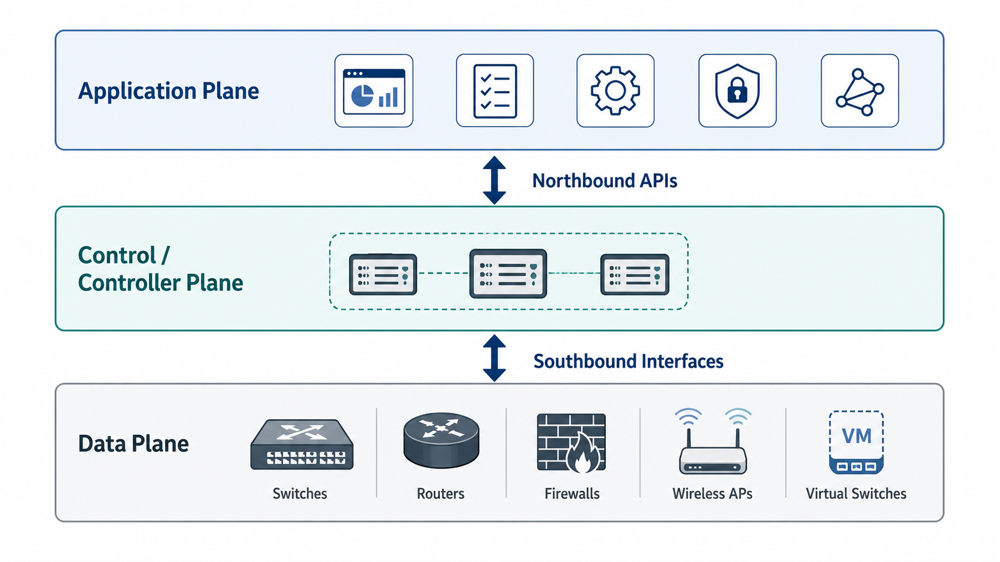
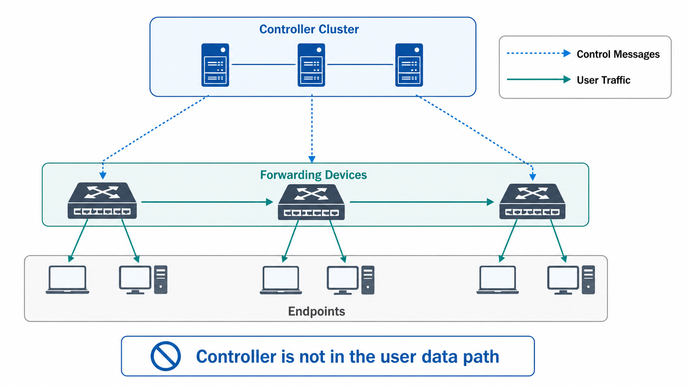
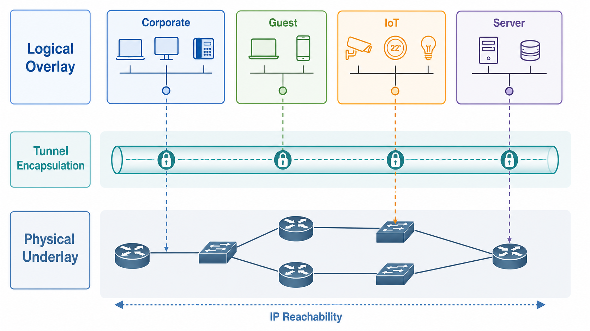
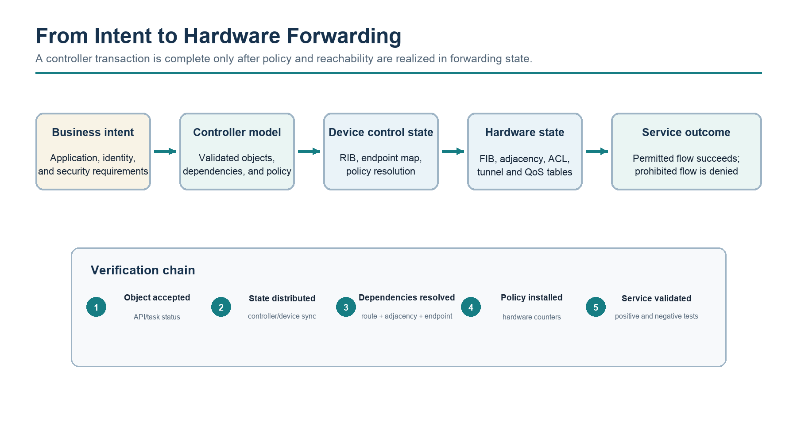
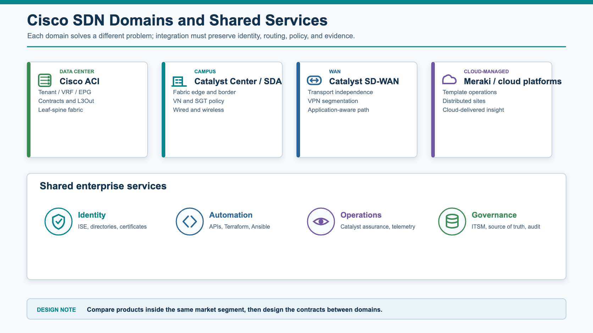
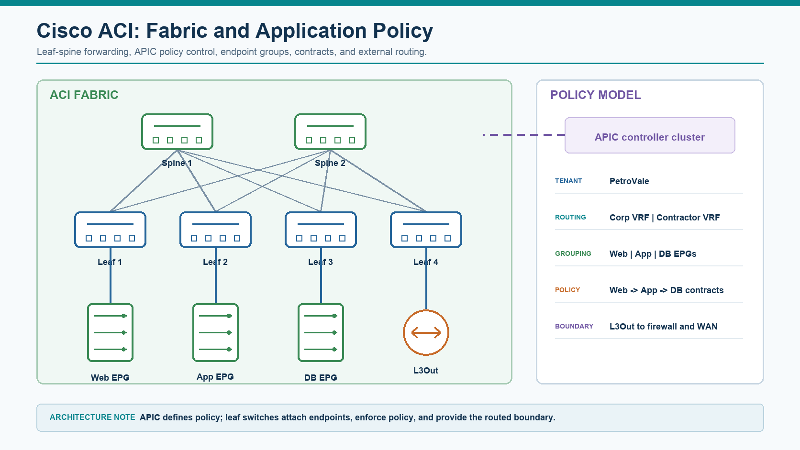
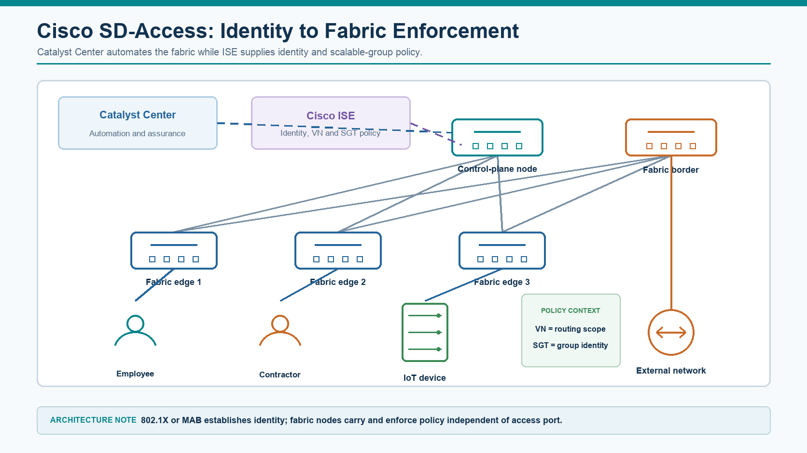
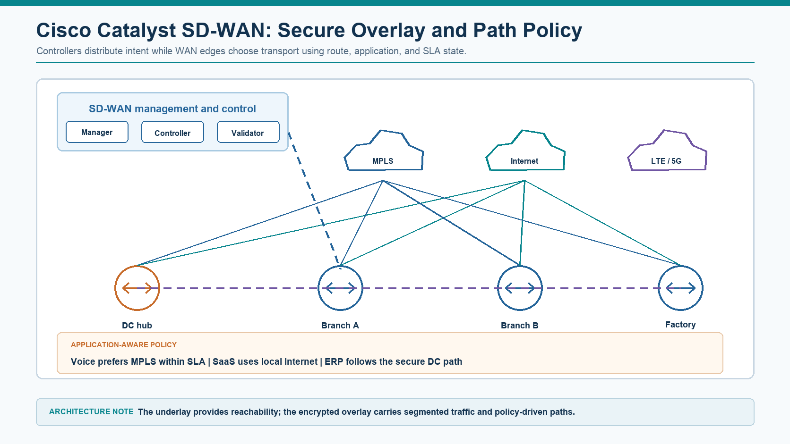
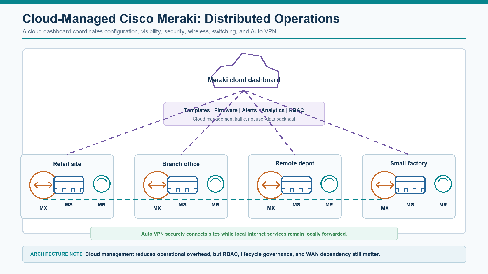

# Chapter 1 - SDN Architecture and Concepts

## 1 Chapter Overview

Software-defined networking (SDN) changes how network intent, policy, lifecycle, and evidence are coordinated; it does not replace routing, switching, or packet-forwarding fundamentals. This chapter establishes the architectural vocabulary used throughout the guide and separates generic SDN principles from domain-specific product implementations.

The engineering focus is the relationship among distributed protocols, controller services, policy systems, APIs, forwarding devices, and assurance. Each concept is evaluated by ownership of state, behavior during failure, and the evidence required to prove an end-to-end service.

- How control, forwarding, policy, automation, management and telemetry are separated.
- How SDN changes the operating model, not just the product stack.
- How controller-based networking, overlays, fabrics, policy, automation, and telemetry fit into an SDN architecture.
- How to recognize the benefits and risks introduced by controller-based networking.

## 2 Learning Objectives

After completing this chapter, you should be able to:

- Explain SDN as an architectural model, not a single protocol or vendor product.
- Compare traditional distributed control with controller-driven and intent-based networking.
- Describe the roles of the data plane, control plane, management plane, and application plane.
- Explain northbound and southbound APIs.
- Distinguish underlay, overlay, fabric, controller, policy, and telemetry.
- Explain how WAN overlays, campus fabrics, and data center fabrics are practical SDN use cases.
- Compare major Cisco SDN domains across data center, campus, WAN overlay, and cloud-managed branch environments.
- Recognize operational and security risks introduced by SDN.

## 3 Prerequisite Knowledge

Readers should be comfortable with Ethernet switching, IP routing, OSPF, BGP, first-hop redundancy, VLANs, virtual routing and forwarding (VRF), access control lists (ACLs), quality of service (QoS), Network Address Translation (NAT), firewalls, and common network-management protocols.

## 4 Why Traditional Networks Became Difficult to Operate

Traditional enterprise networks were built around device-level control. Routers run routing protocols, switches learn MAC addresses, firewalls enforce rules, and engineers configure each platform using CLI, templates, or vendor-specific tools.

*Figure 1-1. Traditional operations coordination and evidence friction.*

This model works and remains technically valid. SDN does not make OSPF, BGP, STP, VLANs, VRFs, QoS, or firewalls obsolete. Instead, SDN addresses operational scaling problems that appear when networks become larger, more dynamic, more security-sensitive, and more application-driven.

Common pain points in traditional environments:

- Configuration is repeated across many devices.
- Policy is distributed across VLANs, ACLs, VRFs, firewall rules, route maps, and QoS policies.
- Network intent is embedded in device-level configuration, so engineers must manually translate service and policy requirements into coordinated device changes.
- Changes are slow because impact analysis, technical review, and approval often require several manual steps.
- Visibility is fragmented across CLI output, SNMP, syslog, flow records, firewall logs, and ticket history.
- Brownfield networks accumulate inconsistent naming, addressing, and policy conventions.
- Adding new sites or segments often requires many coordinated changes.
- Security segmentation is difficult to keep consistent across wired/wireless campus, WAN, data center, and cloud.

### 4.1 Branch Rollout Operational View

A new branch may require:

- WAN router configuration.
- IP addressing and VLANs.
- Routing protocol updates.
- Firewall object and rule updates.
- QoS policy changes.
- Monitoring registration.
- DHCP, DNS, NTP, SNMP, syslog configuration.
- Documentation updates.

In a mature organization, this may involve several teams and several change windows (and several steps to get approval). The technical tasks are not individually difficult, but the coordination cost and error probability are high.

### 4.2 Brownfield Segmentation Challenge

Assume an enterprise wants to separate:

- Corporate users.
- Guest users.
- Cameras.
- IoT devices.
- OT systems.
- Server workloads.
- Management interfaces.

In a traditional design, this usually maps to VLANs, subnets, VRFs, firewall zones, ACLs, and route leaking. Over time, exceptions are added:

- A camera server needs access from a security workstation.
- OT needs access to a historian server.
- Guest needs Internet only.
- IT admins need privileged access to multiple zones.
- Remote users need controlled access to selected applications.

The challenge is not only creating the first version of the policy. The challenge is keeping the policy consistent for years while sites, users, applications, and devices change.

## 5 SDN Architectural Definition

Software-Defined Networking is an architecture that makes the network more programmable, centrally coordinated, policy-driven, and automation-friendly by abstracting control from individual forwarding devices.

An SDN architecture introduces explicit software interfaces and control services between approved intent and network behavior. The implementation may centralize policy and lifecycle operations while retaining distributed protocol computation and local forwarding on the network devices.

- Network behavior can be defined through a controller, orchestrator, or policy system.
- Network state can be discovered and monitored through structured interfaces.
- Configuration can be generated from templates, models, or intent.
- Devices are still responsible for forwarding traffic, but policy and lifecycle operations are coordinated centrally.
- APIs become first-class operational interfaces.

SDN does not always mean:

- OpenFlow.
- One controller for the entire enterprise.
- Replacing all existing devices.
- Removing all distributed protocols.
- Fully autonomous networking.
- No CLI.

SDN is best understood as a spectrum. Some environments use only API-based automation. Some use overlay fabrics. Some use complete controller-driven policy. Some integrate multiple domains such as campus fabric, data center fabric, WAN overlay, cloud networking, and security platforms.

## 6 Distributed Control and Controller-Driven Coordination

The comparison below separates architectural changes from product terminology. Focus on ownership of control, policy expression, state visibility, and the operational evidence available after a change.

| **Area** | **Traditional Model** | **SDN-Oriented Model** |
| --- | --- | --- |
| Primary unit of operation | Individual device | Fabric, site, segment, policy, application |
| Control logic | Distributed across devices | Centralized or logically centralized |
| Configuration | CLI, templates, manual workflows | API, controller, templates, intent, automation |
| Policy expression | VLAN, ACL, route map, VRF, firewall rule | Segment, group, contract, intent, service policy |
| Visibility | Device-centric | System/fabric/application-centric |
| Change validation | Manual review and testing | Pre-checks, compliance checks, controller validation |
| Scale model | Repeat configuration per device | Apply policy across a domain |
| Troubleshooting | Hop-by-hop CLI | Controller view plus packet-path verification |
| Integration | SNMP, syslog, CLI scraping | REST API, NETCONF, RESTCONF, gNMI, event streams |

> **KEY POINT**  
> SDN centralizes selected control, policy, and lifecycle functions logically; it does not require one physical controller or remove distributed routing and failure-detection protocols.

*SDN does not remove the need for strong network fundamentals. It moves the engineer's focus from "configure every box correctly" to "define the intended behavior and verify that the system implements it correctly."*

## 7 Network Fundamentals Within SDN

Controller-driven architectures still depend on deterministic packet forwarding. OSPF, IS-IS, and BGP can provide underlay reachability or external route exchange; VLANs, VRFs, and VXLAN network identifiers define forwarding and isolation scopes; LISP, EVPN, or controller-specific databases distribute endpoint or reachability information; IPsec protects selected overlays; ACLs, QoS, NAT, and firewalls continue to enforce packet-level behavior. SDN changes how these mechanisms are modeled, coordinated, deployed, and verified.

> **DESIGN CONSIDERATION**  
> Document which functions require controller availability and which functions continue locally. Depending on the architecture, established forwarding may continue during a management or controller outage while onboarding, policy changes, path recomputation, assurance, or configuration transactions are restricted.

## 8 High-Level SDN Architecture

Start with the plane model before examining individual products. The first view establishes the three principal planes; the second adds management, assurance, and interface relationships that appear in production systems.

*Figure 1-2. High-level SDN architecture.*

The arrows show interfaces and control relationships; they do not represent the forwarding path followed by every packet. After the required state has been programmed, production traffic normally remains in the data plane.

An operational SDN architecture also depends on sources of truth, automation, identity, security, telemetry, and assurance. These functions may remain on separate platforms even when a product exposes them through a unified interface.

### 8.1 Architectural Roles and Naming Discipline

A controller calculates or distributes domain control and policy state. A manager provides lifecycle, inventory, configuration, and user-facing administration. An orchestrator coordinates workflows across multiple systems or domains. A policy engine evaluates desired relationships and compiles enforceable outcomes. An assurance platform correlates topology, telemetry, events, and service tests. One product may implement several roles, but the roles remain architecturally distinct and should not be used as interchangeable labels.

### 8.2 Data Plane

Figure 1-3 separates controller services from forwarding devices. The operational boundary is not absolute: devices retain local forwarding, protocol, adjacency, and failure-detection functions while controllers may supply policy, topology, or reachability state.

*Figure 1-3. SDN control-plane and data-plane separation.*

The controller supplies policy or forwarding state, while the network devices continue to switch and route traffic. A loss of controller connectivity must therefore be analyzed separately from a loss of local forwarding state.

The data plane is responsible for forwarding traffic. It performs the actual movement of packets or frames.

Examples:

- Physical switches.
- Routers.
- WAN edge and tunnel endpoint devices.
- Wireless access points.
- Firewalls.
- Load balancers.
- Virtual switches.
- Cloud gateways.

Typical data plane functions:

- MAC learning and Layer 2 forwarding.
- IP routing and next-hop lookup.
- Encapsulation and decapsulation.
- ACL enforcement.
- QoS marking and queuing.
- Tunnel forwarding.
- NAT.
- Packet replication for multicast or broadcast.

In an SDN architecture, the data plane may still run local protocols and local forwarding logic. The difference is that a controller or orchestrator influences how the forwarding tables, policies, tunnels, and security rules are created.

In a campus or data center fabric, switches and routers continue to forward packets at line rate. The SDN controller does not normally forward user traffic itself; it programs or coordinates the forwarding behavior by distributing policy, endpoint information, overlay mappings, and configuration intent to the infrastructure.

#### 8.2.1 Advantages

- Existing high-performance ASIC forwarding is preserved.
- Traffic forwarding can continue even if the controller is temporarily unavailable, depending on the architecture.
- Policy can be pre-programmed into devices.

#### 8.2.2 Risks

- If the controller programs incorrect policy, the data plane can enforce incorrect behavior at scale.
- Troubleshooting requires understanding both controller state and device state.
- Hardware support matters. Not all devices support the same encapsulation, telemetry, or policy features.

### 8.3 Control Plane

The control plane determines how traffic should be forwarded. In traditional routing, each router runs protocols such as OSPF, IS-IS, or BGP to build routing tables. In SDN, some control decisions may be centralized, abstracted, or coordinated by a controller.

Control plane responsibilities may include:

- Topology discovery.
- Endpoint location tracking.
- Route and tunnel control.
- Policy calculation.
- Path selection.
- Device onboarding.
- Template deployment.
- Failure detection.
- Consistency checking.

#### 8.3.1 Centralized vs Logically Centralized

SDN literature often says "centralized control." In production, this usually means logically centralized, not physically single-box.

Production SDN controllers are commonly deployed as clusters. The administrator experiences one control system, while the backend may consist of multiple nodes for high availability, scale, and disaster recovery.

> **DESIGN CONSIDERATION**  
> For each control function, identify the authoritative state, cluster or quorum dependency, local fallback behavior, reconciliation process, and operational evidence after recovery.

For any SDN solution, ask:

- Is the controller in the data path?
- If the controller fails, does existing traffic continue?
- Can new endpoints join?
- Can new tunnels form?
- Can policies be changed?
- Is the controller cluster local, remote, or cloud-hosted?
- What is the backup and restore model?
- What is the disaster recovery model?

> **DESIGN CONSIDERATION**  
> Logically centralized control does not remove distributed routing and failure-detection protocols. Document which functions continue locally, which require controller connectivity or cluster quorum, and how state is reconciled after recovery.

### 8.4 Management Plane

Many discussions simplify SDN into control plane and data plane. For production design, the management plane must be considered separately.

The management plane includes:

- Device administration.
- Logging.
- Monitoring.
- Backup and restore.
- User access control.
- Configuration lifecycle.
- Licensing.
- Certificate management.
- Software upgrades.
- Audit trails.

In SDN, the management plane becomes more critical because the controller becomes a high-value operational system. If an attacker gains administrator access to the controller, the attacker may be able to change policy across the fabric.

#### 8.4.1 Management Plane Best Practices

- Use dedicated management networks where possible.
- Enforce MFA and RBAC.
- Integrate with TACACS+, RADIUS, SSO, or identity providers.
- Protect API tokens and certificates.
- Back up controller configuration and policy databases.
- Monitor controller health and audit logs.
- Separate admin roles: network operator, security operator, auditor, automation account.

### 8.5 Application Plane

The application plane represents business logic and operational workflows above the controller.

Examples:

- A portal that lets a team request a new network segment.
- An automation workflow that creates a branch site.
- A security tool that updates group policy.
- A monitoring platform that consumes telemetry and raises incidents.
- A CMDB/source of truth that defines expected devices, sites, and circuits.

This is where SDN becomes operationally powerful. Instead of manually configuring each device, the organization builds a controlled workflow around intent, validation, deployment, and evidence.

### 8.6 Northbound and Southbound Interfaces

Interface direction is defined relative to the controller. Northbound interfaces connect applications and operational systems to controller services, while southbound interfaces connect the controller to network elements. A production implementation may use several protocols in either direction.

#### 8.6.1 Northbound API

Northbound APIs expose controller capabilities to applications, automation platforms, and operations workflows.

Common use cases:

- Retrieve inventory.
- Retrieve device health.
- Create sites.
- Create segments.
- Create policies.
- Deploy templates.
- Track deployment tasks.
- Integrate with change management.

REST APIs are common because they are easy to consume from tools such as Postman, Python, Ansible, Terraform, and ITSM platforms.

#### 8.6.2 Southbound API

Southbound interfaces connect the controller to network devices.

Possible southbound mechanisms:

- OpenFlow.
- NETCONF.
- RESTCONF.
- gNMI.
- SSH/CLI.
- SNMP/syslog for legacy monitoring.
- Vendor-specific protocols.
- BGP/EVPN/LISP/control sessions depending on architecture.

> **OPERATIONAL NOTE**  
> Northbound and southbound describe direction relative to the controller, not a mandatory protocol. A controller may expose REST northbound while using NETCONF, gNMI, BGP, CLI, or a proprietary control channel southbound.

Do not assume northbound and southbound APIs use the same protocol. A controller may expose REST northbound while using NETCONF, CLI, gNMI, OpenFlow, or proprietary mechanisms southbound.

Treat the API as an operational contract. A successful response may only mean that a request was accepted; reliable automation also checks asynchronous task status, object state, device realization, rate limits, idempotency, partial failure, and the resulting service behavior.

*Figure 1-4. Controller interface direction and operational verification chain.*

### 8.7 OpenFlow and the Historical SDN Model

OpenFlow is often associated with early SDN because it gave controllers a way to program forwarding behavior in switches.

Basic OpenFlow model:

- A switch contains flow tables.
- A flow entry matches packet fields.
- The flow entry defines actions.
- The controller can add, modify, or remove flows.

Common match fields:

- Source MAC.
- Destination MAC.
- VLAN ID.
- Source IP.
- Destination IP.
- TCP/UDP port.
- Protocol.
- Ingress port.

Common actions:

- Forward to port.
- Drop.
- Modify header.
- Push/pop VLAN.
- Send to controller.

#### 8.7.1 Advantages of OpenFlow

- Excellent for teaching separation of control and data plane.
- Allows explicit flow programming.
- Useful in research and lab environments.
- Works well with Mininet and Open vSwitch for learning.

#### 8.7.2 Limitations in Enterprise Production

- Many enterprise SDN systems do not rely primarily on OpenFlow.
- Hardware support and scale vary.
- Operational tooling may be less mature than vendor-integrated SDN platforms.
- Policy models in production often need higher-level abstractions than raw flow programming.

*Figure 1-5. OpenFlow flow-table processing, table-miss handling, and controller interaction.*

### 8.8 Underlay and Overlay

Underlay and overlay are central concepts in modern SDN.

*Figure 1-6. Underlay and overlay relationship.*

#### 8.8.1 Underlay

The underlay is the transport network that provides basic reachability between fabric nodes or tunnel endpoints.

Underlay design requirements:

- Stable IP connectivity.
- Predictable routing convergence.
- Proper MTU.
- Redundancy.
- ECMP where appropriate.
- Clear failure domains.
- Monitoring and alerting.

Examples:

- Leaf-spine IP fabric in a data center.
- Routed campus core and distribution.
- MPLS, Internet, LTE/5G, or private WAN transport for WAN overlays.
- Cloud VPC/VNet network infrastructure.

#### 8.8.2 Overlay

The overlay is the logical network built on top of the underlay.

Overlay functions:

- Tenant separation.
- Network virtualization.
- Segment mobility.
- Policy abstraction.
- Tunnel-based transport.
- Logical topology independent of physical topology.

Common overlay technologies:

- VXLAN.
- EVPN-VXLAN.
- LISP.
- GRE.
- IPsec.
- WAN overlay tunnels.

> **OPERATIONAL NOTE**  
> Verify the underlay before attributing a failure to the overlay. Tunnel state cannot compensate for missing reachability, insufficient MTU, unstable adjacencies, or path loss between tunnel endpoints.

Always validate underlay before overlay.

If overlay tunnels are down, do not immediately assume a controller or policy issue. Check:

- IP reachability between tunnel endpoints.
- Routing table.
- MTU and fragmentation.
- Firewall rules between endpoints.
- NAT traversal.
- Certificates.
- Time synchronization.
- Control connections.

> **DESIGN CONSIDERATION**  
> Encapsulation creates an underlay contract: tunnel endpoints require stable reachability, sufficient end-to-end MTU, predictable ECMP behavior, appropriate failure detection, and path telemetry. A healthy overlay control session cannot compensate for an underlay that drops the encapsulated packet.

### 8.9 Fabric

A fabric is a network domain operated as a coordinated system rather than as isolated devices.

Fabric components commonly include:

- Fabric nodes.
- Controller.
- Underlay.
- Overlay.
- Endpoint database.
- Policy model.
- Border/gateway functions.
- Telemetry and assurance.

Examples:

- Cisco ACI fabric for data center.
- Cisco SD-Access fabric for campus.
- WAN overlay fabric.
- EVPN-VXLAN fabric.

#### 8.9.1 Fabric Boundary

Every fabric has a boundary. Boundary design is critical because this is where SDN meets non-SDN or another SDN domain.

Typical boundary functions:

- Routing exchange.
- Firewall insertion.
- NAT.
- Route leaking.
- Policy translation.
- External connectivity.
- Internet breakout.
- Cloud connectivity.

In real designs, many incidents happen at fabric boundaries because routing, policy, segmentation, NAT, and firewall behavior meet there.

### 8.10 Policy-Based Networking

Traditional networks often express policy through device-level constructs:

- ACLs.
- VLANs.
- Subnets.
- VRFs.
- Route maps.
- Firewall rules.
- NAT rules.

SDN systems try to express policy closer to business intent:

- Users in Finance can access ERP.
- Guest devices can access Internet only.
- OT systems can reach historian servers but not corporate user networks.
- Cameras can send video to recording servers only.
- Voice traffic prefers low-latency transport.
- SaaS traffic may use direct Internet or cloud security access.

#### 8.10.1 From Business Intent to Enforcement

Policy abstraction translates business intent into reusable objects such as VRFs, endpoint or security groups, contracts, firewall rules, application policies, and QoS classes. The design must state where identity is resolved, how policy context is carried, and which device enforces each decision.

#### 8.10.2 Policy Matrix

A policy matrix makes an abstract segmentation model testable. Each row should identify a source, destination, required service, enforcement point, owner, and evidence of both permit and deny behavior.

| **Source Segment** | **Destination Segment** | **Required Access** | **Enforcement Example** |
| --- | --- | --- | --- |
| Guest | Internet | Allow web only | Firewall / Internet edge |
| Guest | Internal servers | Deny | Fabric policy / firewall |
| Corporate users | ERP | Allow HTTPS | SD-Access policy + firewall |
| OT | Historian | Allow specific ports | Firewall + segmentation |
| Cameras | Video recorder | Allow video stream | ACL / fabric policy |
| IoT | Management | Deny | Fabric or firewall policy |
| Network admin | Management | Allow SSH/HTTPS | RBAC + firewall + TACACS |

#### 8.10.3 Benefits

- Policy is easier to discuss with security and business teams.
- Segmentation can become more consistent across sites.
- Repeated policy can be applied at scale.
- Policy changes can be audited and automated.

#### 8.10.4 Risks

- High-level policy may hide low-level dependencies.
- Poorly designed groups can become too broad.
- Exception handling can become complex.
- Integration between SDN domains may require policy translation.
- Controller GUI may show intended policy while device-level enforcement differs due to deployment failure.

A complete policy design identifies the source of identity, the treatment of unknown endpoints, the macrosegment, the enforcement point, service insertion, policy precedence, and evidence showing which rule matched.

### 8.11 Intent-Based Networking

Intent-based networking is a higher-level evolution of SDN. Instead of telling the network every low-level command, the operator declares the desired outcome.

Intent example:

- "Create a guest segment at all branches with Internet-only access."
- "Allow OT sensors to send data to the historian but block lateral access."
- "Prefer MPLS for voice unless latency exceeds threshold."

The system then:

- Translates intent into configuration.
- Deploys configuration.
- Monitors state.
- Validates whether the network matches intent.
- Reports drift or anomalies.

> **CAUTION**  
> Most production environments implement bounded intent and closed-loop functions. Human approval, change control, independent verification, and rollback remain necessary for material changes.

Most production networks are not fully autonomous. They use partial intent-based workflows. Human approval, change windows, and validation remain important.

#### 8.11.1 From Intent to Forwarding State

An intent is complete only when it has passed through validation, policy compilation, state distribution, device programming, and service verification. Controller acceptance confirms the start of this chain, not the packet-forwarding outcome.

A packet walk should therefore correlate the policy object with the selected route, adjacency, endpoint or tunnel state, hardware forwarding entry, enforcement rule, and observed application transaction.

*Figure 1-7. Intent-to-hardware forwarding realization and verification chain.*

> **STUDY NOTE**  
> Validate one permitted transaction and one prohibited transaction. Together they prove reachability, policy selection, enforcement, and the expected service outcome.

### 8.12 Automation in SDN

Automation is often the first practical step toward SDN transformation.

*Figure 1-8. Intent, API deployment, and assurance workflow.*

Automation maturity levels:

| **Level** | **Description** | **Example** |
| --- | --- | --- |
| 0 | Manual CLI | Engineer configures each device |
| 1 | Scripted CLI | Python or shell pushes commands |
| 2 | Template-based | Jinja2, Ansible templates, controller templates |
| 3 | API-driven | REST API creates sites, policies, segments |
| 4 | Model-driven | NETCONF/RESTCONF/gNMI/YANG |
| 5 | Intent-driven | Declare desired state; system translates |
| 6 | Closed-loop | Telemetry triggers remediation or recommendation |

#### 8.12.1 Good Automation Requires More Than Scripts

Required elements:

- Source of truth.
- Naming standards.
- IP address management.
- Credential management.
- Pre-checks.
- Post-checks.
- Idempotency.
- Rollback.
- Logging.
- Approval workflow.
- Test environment.

#### 8.12.2 Branch Site Onboarding Workflow

Traditional approach:

- Engineer copies configuration from previous branch.
- Edits hostname, IPs, VLANs, routing, ACLs, QoS.
- Pastes configuration into devices.
- Manually updates monitoring and documentation.

SDN/automation approach:

- Site parameters are entered in a source of truth.
- Automation validates IP ranges, naming, and policy.
- Controller API creates site, device templates, segments, and policy.
- Devices are onboarded using zero-touch provisioning.
- Monitoring is automatically updated.
- Validation tests are attached to the change ticket.

### 8.13 Telemetry and Assurance

Traditional monitoring often relies on polling:

- SNMP.
- ICMP.
- Syslog.
- NetFlow.
- Manual CLI checks.

SDN environments can provide richer telemetry:

- Controller state.
- Fabric health.
- Tunnel status.
- Endpoint movement.
- Policy deployment status.
- Application experience.
- Device health.
- Path tracing.
- Event correlation.

#### 8.13.1 Telemetry Data Path

Treat telemetry as an evidence pipeline rather than a collection of monitoring products. Collection, timestamps, identity correlation, normalization, retention, and query integrity all influence whether an assurance conclusion can be trusted.

#### 8.13.2 Benefits

- Faster troubleshooting.
- Better baseline of normal behavior.
- Easier compliance reporting.
- Improved visibility into fabric-wide state.

#### 8.13.3 Risks

- Telemetry volume can be large.
- Health scores can hide detail.
- Operators may trust dashboards without validating device state.
- Time synchronization and data quality matter.

#### 8.13.4 Intended, Programmed, and Operational State

Assurance compares what was approved, what the controller believes it deployed, and what devices and traffic are actually doing. These states can diverge even when the dashboard reports a successful task.

| State | Engineering question | Typical evidence |
| --- | --- | --- |
| Intended state | What behavior was approved? | Source of truth, policy record, template, design decision, approved change |
| Controller-programmed state | What did the controller calculate and request? | Object relationships, rendered configuration, task state, audit record |
| Device-realized state | What state was installed on the device? | Running configuration, RIB/FIB, adjacency, endpoint, tunnel, policy, or hardware state |
| Forwarding-observed state | What happened to the packet or flow? | Counters, flow telemetry, packet capture, path trace, authentication and firewall logs |
| Service outcome | Did the application or business transaction meet its objective? | Synthetic transaction, application telemetry, user experience, service-level objective |

Troubleshooting should establish whether the correct intent was defined, whether it was rendered and distributed successfully, and whether the data plane exercised the expected behavior.

### 8.14 Security Implications of SDN

SDN improves security by enabling centralized segmentation and policy, but it also introduces new attack surfaces.

#### 8.14.1 Security Benefits

- Centralized policy definition.
- Consistent segmentation.
- Identity-based access.
- Faster policy deployment.
- Better audit trail.
- Integration with security platforms.
- Easier quarantine or dynamic policy response.

#### 8.14.2 New Risks

- Controller compromise can have broad impact.
- API token leakage can enable unauthorized changes.
- Automation account misuse can bypass manual controls.
- Misconfigured intent can deploy incorrect policy at scale.
- Weak RBAC can allow excessive administrative access.
- Controller backup files may contain sensitive policy or credentials.

#### 8.14.3 Security Controls

- MFA for administrators.
- RBAC with least privilege.
- Separate human and automation accounts.
- API token rotation.
- Certificate lifecycle management.
- Controller management network isolation.
- Audit logging.
- Configuration backup encryption.
- Change approval and validation.
- Regular policy review.

## 9 Cisco Implementations by Network Domain

Cisco has several SDN-oriented architectures, each optimized for a different domain.

*Figure 1-9. Cisco SDN domains and shared enterprise services.*

| Network domain | Cisco implementation | Management, control, and policy components | Primary architectural role |
| --- | --- | --- | --- |
| Data center | Cisco Application Centric Infrastructure (ACI) | Cisco APIC; ACI leaf and spine fabric; Cisco Nexus Dashboard for supported operations and analytics functions | Fabric policy, workload connectivity, segmentation, and external routing boundaries |
| Campus | Cisco Software-Defined Access (SD-Access) | Cisco Catalyst Center; Cisco ISE; fabric control-plane, border, and edge nodes | Campus automation, LISP/VXLAN fabric services, identity, and group-based policy |
| WAN overlay | Cisco Catalyst SD-WAN | Cisco SD-WAN Manager; Cisco SD-WAN Controller; Cisco SD-WAN Validator; WAN edge routers | Secure WAN overlay, route and policy distribution, transport independence, and application-aware path control |
| Cloud-managed branch | Cisco Meraki cloud-managed networking | Meraki Dashboard and managed branch, wireless, switching, and security platforms | Centralized lifecycle and policy administration with distributed site forwarding |
| Cross-domain | Architecture-specific integration | Independent domain systems coordinated through APIs, identity, security, ITSM, source-of-truth, and telemetry services | Policy translation, workflow orchestration, and evidence correlation without one universal controller |

Cisco describes SDN as an architecture that centralizes management by abstracting the control plane from forwarding functions. Cisco ACI is positioned as an SDN solution for data centers. Cisco SD-Access uses Catalyst Center to automate and apply policy across wired and wireless campus fabrics. Cisco Validated guidance includes cross-architectural integration involving Catalyst Center for SD-Access, SD-WAN Manager for WAN overlays, APIC for ACI, and firewall management platforms.

### 9.1 Cisco Application Centric Infrastructure

Cisco ACI is a data center SDN architecture based on an application-centric policy model.

*Figure 1-10. Cisco ACI fabric roles and application-policy model.*

Key components:

- Cisco Application Policy Infrastructure Controller (APIC): policy and management controller cluster for the ACI fabric.
- Spine switches: fabric core.
- Leaf switches: endpoint attachment and policy enforcement.
- Tenant: administrative/policy container.
- VRF: Layer 3 routing context.
- Bridge Domain: Layer 2 forwarding domain.
- EPG: Endpoint Group.
- Contract: policy controlling communication between EPGs.

#### 9.1.1 ACI Policy Example

Application tiers:

- Web EPG.
- App EPG.
- DB EPG.

Policy/Contract:

- Web can talk to App on TCP 8443.
- App can talk to DB on TCP 1521.
- Web cannot talk directly to DB.
- Admin jump host can access Web/App/DB management ports.

Traditional design may implement this with VLANs, ACLs, firewall zones, and VRFs. ACI expresses it through EPGs and contracts.

#### 9.1.2 Failure and Operational Behavior

During loss of APIC cluster availability, leaf and spine switches use their installed forwarding and policy state. Normal policy changes, fabric lifecycle operations, fault correlation, and some endpoint or object updates are constrained until controller services recover. Recovery validation should compare cluster health and object reconciliation with endpoint learning, route state, contract enforcement, and representative application transactions.

#### 9.1.3 Strengths

- Strong data center fabric model.
- Good fit for application-tier segmentation.
- Policy abstraction via EPG and contracts.
- Integration with physical and virtual workloads.
- API-driven operations.
- Supports automation and multi-fabric/multicloud operational models through the broader Cisco ecosystem.

#### 9.1.4 Design Considerations

- Requires good application dependency mapping.
- EPG design can become complex if every exception becomes a new group.
- Operations team must learn ACI object model.
- Brownfield migration requires careful L2/L3 boundary planning.
- Integration with firewalls and external networks must be designed deliberately.

### 9.2 Cisco Software-Defined Access

Cisco Software-Defined Access (SD-Access) applies controller-driven automation, a LISP-based overlay control plane, VXLAN data-plane encapsulation, and Cisco TrustSec group-based policy to wired and wireless campus environments.

*Figure 1-11. Cisco SD-Access identity, fabric roles, and policy enforcement.*

Key components:

- Cisco Catalyst Center: management, automation, assurance, and SD-Access fabric lifecycle workflows.
- Cisco Identity Services Engine (ISE): authentication, authorization, profiling, Security Group Tag (SGT) administration, and group-based policy context.
- Fabric edge: endpoint attachment.
- Fabric border: external connectivity.
- Control plane node: endpoint location mapping.
- VXLAN: data plane encapsulation.
- LISP: endpoint mapping/control-plane function.
- VN: Virtual Network.
- SGT: Scalable Group Tag.

#### 9.2.1 SD-Access Policy Example

Segmentations;

- Corporate users.
- Contractors.
- Guest.
- IoT.
- OT.
- Management.

Policy examples:

- Guest can access Internet only.
- IoT can access defined application servers only.
- Contractors can access project systems, not internal admin systems.
- OT can reach historian and jump host only.
- Management can access infrastructure devices.

#### 9.2.2 Strengths

- Identity-based segmentation.
- Consistent wired and wireless policy.
- Reduced dependence on physical location for access policy.
- Catalyst Center provides automation and assurance.
- Strong fit for campus modernization and zero-trust access initiatives.

#### 9.2.3 Failure and Operational Behavior

Cisco Catalyst Center provides management, automation, and assurance, while SD-Access control-plane and data-plane functions run on fabric nodes. Loss of Catalyst Center reachability can restrict provisioning, policy workflows, assurance, and inventory updates without necessarily removing established fabric forwarding. Control-plane-node, border-node, identity, and underlay failures have different effects and must be tested separately.

#### 9.2.4 Design Considerations

- Requires identity design, often with Cisco ISE.
- Brownfield campus migration needs careful device readiness assessment.
- Operational teams must understand fabric roles and boundary behavior.
- Policy matrix must be designed before broad rollout.
- Integration with non-fabric areas must be planned carefully.

### 9.3 Cisco Catalyst SD-WAN

WAN overlays are one implementation pattern within SDN. Cisco Catalyst SD-WAN is used here as a reference architecture because it clearly illustrates underlay/overlay separation, controller-based policy, centralized templates, secure tunnels, and application-aware routing.

*Figure 1-12. Cisco Catalyst SD-WAN control, transport, overlay, and application-aware policy.*

The WAN overlay model demonstrates:

- Underlay and overlay separation.
- Controller-based policy.
- Centralized templates.
- Zero-touch provisioning.
- Application-aware routing.
- Secure tunnels.
- Centralized monitoring.
- API-driven management.

#### 9.3.1 WAN Overlay Policy

Business requirement:

- Voice prefers MPLS if latency is below 100 ms.
- Microsoft 365 should use local Internet breakout.
- ERP should go to data center.
- Guest traffic should go directly to Internet.
- If MPLS fails, critical traffic can use Internet tunnel.

SDN interpretation:

- The desired behavior is policy.
- The controller distributes policy.
- Edges enforce forwarding.
- Telemetry validates SLA.

#### 9.3.2 Strengths

- Strong business case: WAN cost, agility, application experience.
- Excellent example of overlay networking.
- Mature operational model for branch connectivity.
- Useful first SDN transformation domain.

#### 9.3.3 Failure and Operational Behavior

Cisco SD-WAN Manager, Cisco SD-WAN Controller, and Cisco SD-WAN Validator perform different management, control, and onboarding roles. A Manager outage primarily affects administration and deployment; Controller or Validator loss affects control-session establishment and state distribution according to surviving sessions and redundancy. Verify established and new tunnel behavior, route and policy distribution, certificate state, and application-path outcomes for each failure scenario.

#### 9.3.4 Design Considerations

- Transport quality still matters.
- Local Internet breakout changes security architecture.
- Policy complexity can grow quickly.
- Cloud/SaaS routing requires careful DNS and security design.
- Controller reachability and certificate lifecycle matter.

### 9.4 Cisco Meraki Cloud-Managed Networking

Meraki represents a cloud-managed approach to SDN-style operations.

*Figure 1-13. Cisco Meraki cloud management and distributed-site architecture.*

Typical value:

- Simple branch management.
- Cloud dashboard.
- Auto VPN.
- Integrated wireless, switching, security, and SD-WAN.
- Reduced operational overhead.

Best fit:

- Lean IT.
- Distributed retail.
- Small and medium branches.
- Fast deployment requirements.

Considerations:

- Less low-level control than some enterprise platforms.
- Cloud dashboard dependency must be understood.
- Feature depth and customization may differ from enterprise WAN overlay platforms.
- Governance and admin RBAC remain important.

### 9.5 Failure and Operational Behavior

Cloud-management reachability and local forwarding are separate dependencies. Depending on the device family and configured function, established local forwarding may continue while configuration changes, cloud visibility, and selected services are unavailable or stale. [TECHNICAL VERIFICATION REQUIRED] Validate product-specific fail-safe behavior, local status access, configuration retention, and recovery for the deployed Meraki platform and software release.

## 10 Industry Solutions by Network Domain

The SDN market is not a single product category. Different vendors compete in different domains: data center fabric, campus automation, SD-WAN, cloud networking, network virtualization, and assurance. Cisco solutions should therefore be compared by segment, not as one monolithic "SDN product."

### 10.1 Data Center SDN and Fabric Automation

For the data center, compare how each solution builds the fabric, represents tenants and application policy, learns endpoints, and connects to external routing and L4-L7 services. Give particular weight to leaf-spine operations, VXLAN/EVPN behavior, east-west segmentation, hardware and hypervisor integration, brownfield VLAN and gateway migration, failure isolation, and the evidence available for troubleshooting an application path.

| **Segment** | **Cisco Position** | **Other Industry Solutions** | **Practical Comparison** |
| --- | --- | --- | --- |
| Data center fabric and policy | Cisco ACI with APIC, leaf-spine fabric, tenants, VRFs, bridge domains, EPGs, contracts | VMware NSX, Juniper Apstra, Arista CloudVision with EVPN/VXLAN designs | ACI provides an integrated fabric and policy model. NSX focuses strongly on software network virtualization and distributed security for virtualized workloads. Apstra emphasizes intent-based, multi-vendor data center fabric operations. CloudVision emphasizes Arista EOS automation, state streaming, and telemetry. |
| Data center assurance | Nexus Dashboard ecosystem, ACI telemetry, policy visibility | Juniper Apstra assurance, Arista CloudVision telemetry, VMware NSX operations integrations | Cisco is strongest when the data center is built around Cisco fabric and policy objects. Apstra is attractive when multi-vendor fabric intent and validation are priorities. CloudVision is attractive in Arista environments with strong telemetry requirements. |

### 10.2 Campus and Branch Access

For campus access, compare how each solution combines wired and wireless assurance with identity-based admission and policy. Evaluate 802.1X and MAB workflows, directory and NAC integration, user and device classification, macro- and microsegmentation, edge and border roles, roaming behavior, brownfield coexistence, and the operator's ability to trace authentication, policy download, and endpoint experience.

| **Segment** | **Cisco Position** | **Other Industry Solutions** | **Practical Comparison** |
| --- | --- | --- | --- |
| Campus automation and assurance | Cisco Catalyst Center, SD-Access, Catalyst switching, Cisco ISE integration | HPE Aruba Central, Juniper Mist AI, ExtremeCloud IQ | Catalyst Center and SD-Access focus on Cisco campus fabric, automation, and identity-based segmentation. Aruba Central and Juniper Mist are strong cloud-managed campus platforms with AI/assurance features. ExtremeCloud IQ provides cloud management across wired, wireless, and SD-WAN-oriented operations. |
| Identity-based access | Cisco ISE with SGT and TrustSec-style policy integration | Aruba ClearPass, Juniper Access Assurance, cloud NAC options | Cisco ISE is central to SD-Access identity and group-based policy. Competing solutions may be stronger in heterogeneous access environments depending on installed base and operations model. |

### 10.3 WAN Overlay and SD-WAN

For SD-WAN, compare controller and manager architecture, transport independence, routing exchange, VPN or segment isolation, application-aware path selection, local Internet breakout, security-service insertion, and survivability when control connectivity is lost. Migration fit depends on how the platform introduces overlay edges beside existing MPLS and Internet paths while preserving route control, service reachability, and operational visibility.

| **Segment** | **Cisco Position** | **Other Industry Solutions** | **Practical Comparison** |
| --- | --- | --- | --- |
| Enterprise SD-WAN | Cisco Catalyst SD-WAN, Cisco Meraki SD-WAN | Fortinet Secure SD-WAN, Palo Alto Prisma SD-WAN, HPE Aruba Networking EdgeConnect, VMware/Arista VeloCloud SD-WAN, Versa | Cisco Catalyst SD-WAN is strong for enterprise WAN overlays, routing policy, templates, and Cisco ecosystem integration. Meraki is strong for cloud-managed branch simplicity. Fortinet emphasizes security and SD-WAN convergence in FortiOS. Prisma SD-WAN aligns with Zero Trust Branch and Prisma SASE. EdgeConnect emphasizes WAN optimization, centralized orchestration, and business intent overlays. VeloCloud is a well-known cloud-orchestrated SD-WAN architecture. |
| SASE/SSE integration | Cisco Secure Access and third-party integrations with Catalyst SD-WAN | Palo Alto Prisma Access, Fortinet, HPE Aruba integrations, Netskope, Zscaler, Cato | SD-WAN selection increasingly depends on how branch traffic is secured, not only how tunnels are built. Evaluate security service integration, tunnel automation, identity, logging, and operations workflows. |

## 11 Open-Source SDN Platforms

Open-source tools are extremely useful for understanding SDN principles.

| **Tool** | **Purpose** | **Best Use in Training** |
| --- | --- | --- |
| Mininet | Emulates hosts, switches, links | Build quick SDN topologies |
| Open vSwitch | Virtual switch with OpenFlow support | Inspect flow tables and forwarding |
| Ryu | Python SDN controller framework | Write simple controller applications |
| OpenDaylight | SDN controller platform | Explore controller architecture |
| ONOS | Network operating system | Study carrier/service-provider SDN concepts |

Mininet allows learners to see:

- Hosts.
- Virtual switches.
- Links.
- Controller interaction.
- Flow installation.
- Packet behavior when controller logic changes.

This makes abstract SDN concepts visible.

## 12 Adoption Drivers, Constraints, and Readiness

### 12.1 Advantages

- Centralized policy and governance.
- Faster deployment of network services.
- Better automation.
- Better segmentation.
- Improved visibility and assurance.
- Reduced manual configuration errors.
- Easier integration with IT workflows.
- Better support for cloud and distributed applications.
- More consistent operations across sites.

### 12.2 Disadvantages and Risks

- Controller dependency.
- New skills required.
- API and automation security risks.
- Higher initial design complexity.
- Vendor-specific object models.
- Migration complexity in brownfield networks.
- Troubleshooting requires both traditional and SDN skills.
- Poorly planned policy can be deployed at scale.

### 12.3 When SDN Is a Strong Fit

- Many similar sites.
- Frequent network changes.
- Need for segmentation.
- Need for centralized policy.
- Hybrid cloud connectivity.
- Application-aware WAN requirements.
- Desire for network automation.
- Need for better assurance and telemetry.

### 12.4 When SDN May Not Be the First Priority

- Very small stable network.
- Poor basic documentation.
- Severe underlay instability.
- No change management discipline.
- No ownership model for controller operations.
- No security model for API access.
- Team not ready for automation workflows.

## 13 Chapter Review

### 13.1 Chapter Summary

SDN is an architectural and operational model that coordinates intent, policy, lifecycle, and assurance while preserving distributed forwarding and proven networking protocols. Controllers improve abstraction and consistency, but service correctness is established in the data plane.

### 13.2 Key Takeaways

- SDN coordinates intent, policy, lifecycle, and evidence while preserving distributed forwarding and established network protocols.
- Controller, manager, orchestrator, policy-engine, and assurance roles must be distinguished even when one product implements several roles.
- Controller task success is an intermediate state; service acceptance requires controller, device, forwarding, and application evidence.

### 13.3 Review Questions

- Which control and forwarding functions remain distributed in a controller-driven architecture?
- How do northbound and southbound interfaces differ, and why are they not tied to one protocol?
- What evidence distinguishes intended, controller-programmed, device-realized, forwarding-observed, and service-outcome state?

### 13.4 Scenario and Design Exercise

Classify the following brownfield conditions: slow branch provisioning, inconsistent ACLs, limited east-west visibility, and a flat OT network. Identify which conditions require architectural change, which require operational standardization, and which network fundamentals must be stabilized before an SDN program begins.

### 13.5 Further Reading

Use the current Cisco design guides and product documentation listed in later chapters for implementation-specific behavior. Validate release-dependent support, scale, licensing, and API behavior against the target software release.
