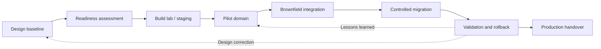
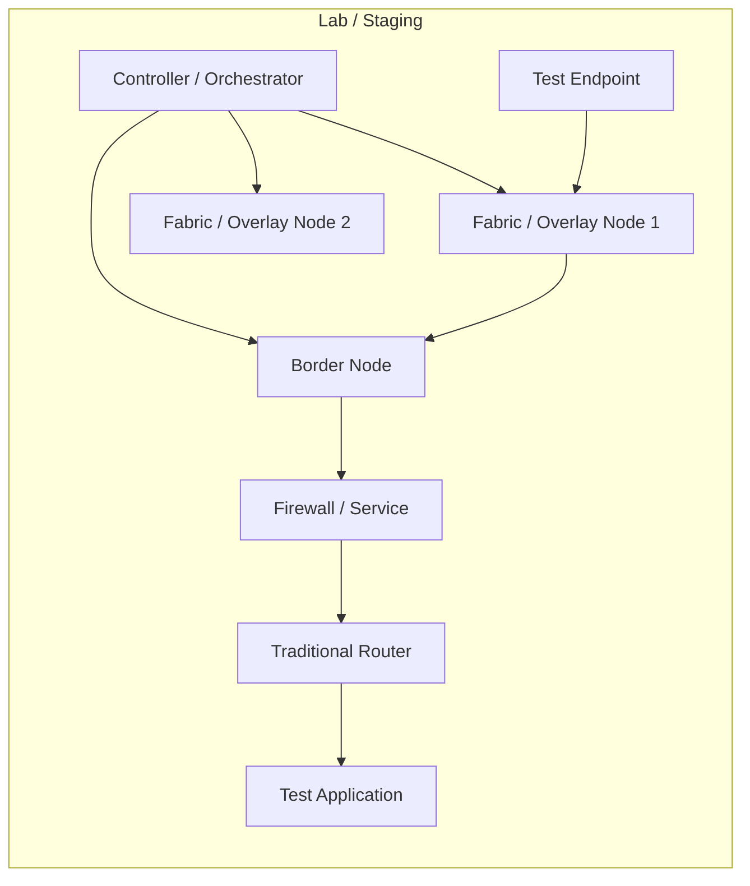
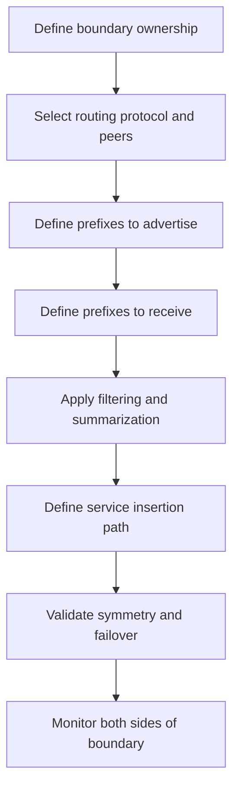
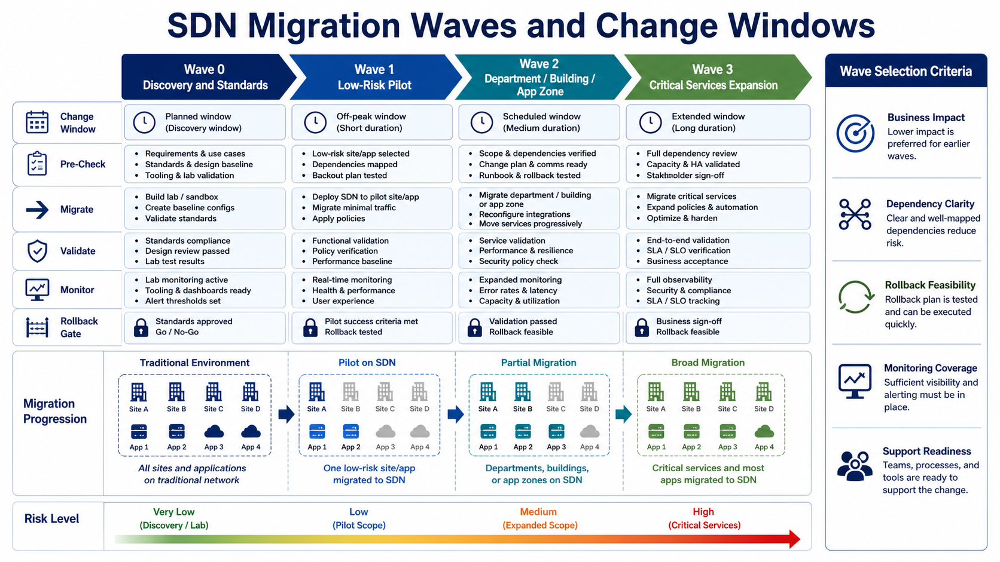
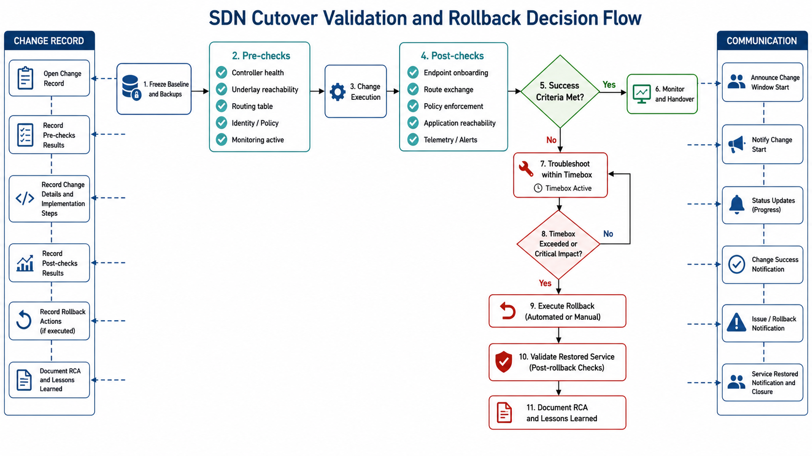
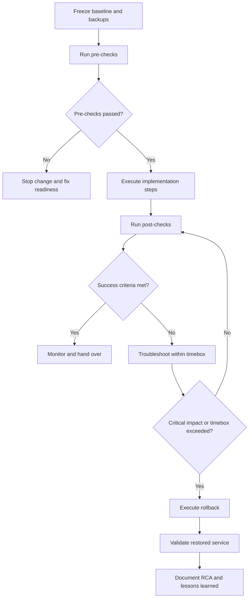

# Chapter 3 - SDN Implementation and Migration

## 1. Chapter Positioning

Chapter 1 established SDN concepts and architecture. Chapter 2 translated those concepts into design decisions: domains, underlay, overlay, segmentation, routing boundaries, service insertion, identity, resiliency, and design trade-offs.

Chapter 3 focuses on implementation and migration:

> How do we move from an approved SDN design to a production deployment without losing control of reachability, policy, visibility, rollback, or operational ownership?

This chapter is written for experienced network engineers and architects who need a practical implementation playbook for brownfield enterprise environments. It does not assume a greenfield network. Most real SDN projects must coexist with existing routing, VLANs, VRFs, firewalls, monitoring tools, IP addressing, operational processes, and business change windows.

## 2. Learning Objectives

After completing this chapter, participants should be able to:

- Convert an SDN high-level design into implementation work packages.
- Build a readiness checklist for underlay, controller, identity, policy, routing, security, and telemetry.
- Explain phased SDN migration approaches for campus, data center, WAN overlay, cloud, and IT/OT environments.
- Implement safe brownfield integration boundaries between SDN and traditional networks.
- Plan migration waves based on dependency clarity, rollback feasibility, support readiness, and business risk.
- Define pre-checks, post-checks, success criteria, rollback triggers, and handover artifacts.
- Identify common implementation failure modes and reduce risk before production cutover.

## 3. Implementation and Migration Lifecycle

An SDN implementation should be treated as a controlled lifecycle, not a single installation activity. The same lifecycle applies whether the first domain is a campus fabric, data center fabric, WAN overlay, cloud network, or OT segmentation project.

### 3.1 Lifecycle Workflow

### 3.2 Implementation Principle

The goal is not to make the first cutover impressive. The goal is to make it boring.

A strong implementation has these properties:

- The scope is clear.
- The current state is baselined.
- The change steps are reversible or at least recoverable.
- Pre-checks prove that the environment is ready.
- Post-checks prove that the intended outcome works.
- Monitoring is active before the cutover starts.
- The rollback trigger is agreed before the change window.
- The operations team receives usable documentation, not only a project closure note.

## 4. From Design to Implementation Work Packages

The approved design from Chapter 2 should be decomposed into work packages. Each work package should have an owner, prerequisite, validation method, and rollback approach.

| Work package | Typical owner | Implementation output |
|---|---|---|
| Controller platform | Network platform team | Installed controller cluster, certificates, backups, RBAC, system health validation. |
| Underlay readiness | Routing/switching team | Routed reachability, MTU validation, NTP/DNS/AAA/SNMP/syslog, software baseline. |
| Fabric or overlay | SDN implementation team | Fabric nodes onboarded, overlay tunnels established, endpoint discovery working. |
| Identity integration | Security/access team | NAC/AAA integration, group mappings, fallback behavior, test identities. |
| Segmentation policy | Network/security architects | VRFs/VNs/EPGs/groups/contracts/firewall rules mapped to approved policy matrix. |
| Routing boundary | Network architecture team | BGP/OSPF/static route exchange, summarization, route leaking, default route behavior. |
| Security services | Security operations | Firewall/service insertion, NAT, inspection, logging, failover behavior. |
| Telemetry and monitoring | NOC/operations | Dashboards, alerts, flow logs, controller health, service baselines. |
| Change and rollback | Project/change manager | Runbook, maintenance window, communication plan, rollback criteria. |
| Handover | Operations and architecture | As-built diagrams, operational procedures, known limitations, escalation paths. |

### 4.1 Implementation Readiness Gate

Do not start production migration until these questions can be answered:

- What exact devices, sites, users, segments, or applications are in scope?
- Which existing services must continue during the change?
- Which routes will be advertised, withdrawn, filtered, or leaked?
- Which policies will be enforced by the fabric, firewall, cloud, or identity platform?
- Which telemetry confirms success?
- Which alarms are expected during the change?
- Who can approve rollback?
- How long can troubleshooting continue before rollback is mandatory?
- Which team owns the system after handover?

## 5. Readiness Assessment

Readiness assessment confirms that the target environment can support the implementation. It is different from design discovery. Discovery asks, "What exists?" Readiness asks, "Can this environment safely accept the new SDN behavior?"

### 5.1 Technical Readiness Checklist

| Area | Readiness questions | Risk if skipped |
|---|---|---|
| Hardware | Are platforms supported for the required SDN role? | Unsupported features or unstable behavior. |
| Software | Are versions aligned with validated release guidance? | Controller/device compatibility problems. |
| Licensing | Are required features licensed before cutover? | Deployment blocked during change window. |
| Underlay | Is IP reachability stable between nodes and controllers? | Overlay instability and false controller troubleshooting. |
| MTU | Has encapsulation overhead been tested end to end? | Intermittent application failure or fragmentation. |
| Time/DNS | Are NTP and DNS reliable? | Certificate, logging, authentication, and telemetry issues. |
| AAA/RBAC | Are admin roles and service accounts defined? | Excessive privilege or blocked operations. |
| Identity | Are user/device groups accurate and tested? | Incorrect segmentation and access policy. |
| Addressing | Are IP pools, loopbacks, transport blocks, and summaries reserved? | Overlap, route churn, or later renumbering. |
| Monitoring | Are baseline dashboards and alerts active before change? | No evidence during failure analysis. |

### 5.2 Operational Readiness Checklist

| Area | Required evidence |
|---|---|
| Change process | Approved change record with implementation and rollback steps. |
| Support model | Named owners for controller, fabric, identity, firewall, routing, and monitoring. |
| Escalation | Contact list and bridge process for the change window. |
| Documentation | Current-state and target-state diagrams. |
| Backups | Controller, device, firewall, and policy backups completed and restorable. |
| Training | Operations team can perform basic health checks and first-level triage. |
| Tool access | Engineers have working access to controller, CLI, monitoring, identity, firewall, and logging tools. |

## 6. Lab, Staging, and Proof of Implementation

Production cutovers should not be the first time the implementation steps are executed.

### 6.1 Staging Goals

- Validate controller installation and clustering.
- Validate device onboarding.
- Validate certificates and secure control channels.
- Validate templates, profiles, sites, pools, VNIs, VRFs, endpoint groups, and policy objects.
- Validate route exchange between SDN and traditional routing.
- Validate security service insertion.
- Validate monitoring, logs, events, and telemetry.
- Measure how long implementation and rollback steps take.

### 6.2 Staging Topology Pattern

### 6.3 What to Prove Before Production

| Test | Success criteria |
|---|---|
| Controller health | Cluster healthy, backups configured, time synchronized, certificates valid. |
| Device onboarding | Devices appear in inventory with correct role and software state. |
| Underlay | Nodes reach each other and controller with expected MTU and routing. |
| Overlay | Tunnels or fabric adjacencies form and recover after failure. |
| Segmentation | Users/workloads enter intended segment and cannot access denied segments. |
| Boundary routing | Routes are exchanged, filtered, summarized, and withdrawn as expected. |
| Security insertion | Required flows traverse firewall/services with logging. |
| Failure | Link/node/controller/service failure behavior matches design assumptions. |
| Rollback | Rollback steps restore the known-good state within the allowed time. |

## 7. Brownfield SDN Integration Boundary

Most SDN projects begin beside an existing network. The integration boundary is where the new SDN domain exchanges traffic, routes, policy, and operational responsibility with the traditional network.

### 7.1 Boundary Implementation Workflow

### 7.2 Boundary Controls

| Control | Implementation guidance |
|---|---|
| Route scope | Advertise only required prefixes; avoid leaking broad internal routes into early pilots. |
| Route filtering | Use prefix lists, route maps, tags, communities, or controller policy where supported. |
| Default route | Be explicit about which segment receives which default route. |
| Route leaking | Implement only approved inter-segment flows; document each leak. |
| Firewall path | Keep stateful inspection symmetric. Validate active/standby and active/active behavior. |
| NAT | Use NAT only where needed; document translation ownership and logging. |
| DNS | Validate that endpoints resolve destinations appropriate for their new segment and location. |
| Monitoring | Collect controller, device, firewall, routing, and application evidence. |

### 7.3 Common Boundary Failure Modes

| Failure mode | Typical cause | Prevention |
|---|---|---|
| One-way traffic | Asymmetric routing through firewall | Validate forward and return path before cutover. |
| Unexpected access | Overbroad route leak or firewall rule | Use policy matrix and least-prefix advertisement. |
| Application timeout | MTU issue across overlay/service path | Test payload size and PMTUD behavior. |
| Endpoint unreachable | Missing default route or route filter | Compare pre/post routing table and endpoint path. |
| Wrong policy | Incorrect identity or group mapping | Test identity cases before production users move. |
| No useful telemetry | Monitoring configured after cutover | Enable dashboards and logs before migration. |

## 8. Migration Strategy

SDN migration is usually gradual. A phased approach reduces business risk and gives operations teams time to build confidence.

```mermaid
flowchart LR
    A["Assess current network"] --> B["Standardize inventory, naming, IP plan"]
    B --> C["Improve visibility and backups"]
    C --> D["Build staging environment"]
    D --> E["Pilot one SDN domain"]
    E --> F["Validate operations and security"]
    F --> G["Expand by site, segment, or application"]
    G --> H["Integrate multiple domains"]
    H --> I["Optimize and automate deeper workflows"]
```

### 8.1 Phase 0: Assessment and Baseline

Collect and verify:

- Device inventory and software versions.
- Hardware capability and support status.
- Topology and cabling.
- IP plan and summarization.
- VLAN, VRF, and security-zone mapping.
- Routing protocols, redistribution, default routes, and route filters.
- Firewall policies, NAT, proxies, and service insertion.
- WAN circuits and cloud connectivity.
- Application dependencies.
- Identity sources and group mappings.
- Existing monitoring and logging.
- Known pain points and incident history.

### 8.2 Phase 1: Standardization

Before SDN, clean up the basics:

- Naming conventions.
- Site codes.
- Device role definitions.
- IP address management.
- VLAN and VRF standards.
- Loopback and transport addressing.
- NTP, DNS, AAA, SNMP/syslog, certificates.
- Configuration backup process.
- Monitoring registration.
- Change templates and runbook format.

This phase is not glamorous, but it prevents expensive troubleshooting later.

### 8.3 Phase 2: Staging and Pilot

Good pilot candidates:

- A new site or building.
- A small non-critical application zone.
- A lab data center pod.
- Guest access segmentation.
- A limited IoT group.
- A small branch or representative remote site.

Avoid starting with:

- Core production data center migration.
- Safety-critical OT systems with unclear dependencies.
- Highly customized legacy sites.
- Environments with poor documentation.
- Applications whose owners cannot validate behavior during the change window.

### 8.4 Phase 3: Controlled Expansion

Expand only after the pilot has proven:

- The implementation runbook is accurate.
- The rollback process is tested.
- Operations can monitor the new domain.
- Security policy behaves as intended.
- Routing boundaries are predictable.
- Application owners can validate success.
- Support teams understand escalation paths.

### 8.5 Phase 4: Multi-Domain Integration

After one domain is stable, integrate additional domains deliberately:

- Campus fabric to data center fabric.
- Campus or branch to WAN overlay.
- Data center fabric to cloud transit.
- Fabric segmentation to firewalls.
- Identity platform to access and security policy.
- Telemetry to assurance and SIEM/SOAR.

The implementation risk increases when multiple controllers, teams, and policy models interact. Add one integration at a time when possible.

## 9. Migration Waves and Change Windows

Migration waves group changes by risk, dependency, and operational readiness.

### 9.1 Wave Selection Criteria

| Criterion | Why it matters |
|---|---|
| Business impact | Low-impact services are better for early waves. |
| Dependency clarity | Unknown dependencies create surprise outages. |
| Rollback feasibility | Early waves should have simple and fast rollback. |
| Monitoring coverage | Teams need evidence during and after change. |
| Support readiness | Operations must be ready before production users are moved. |
| Representative value | A pilot should teach something useful for later waves. |

### 9.2 Migration Wave Template

| Wave | Scope | Primary goal | Exit criteria |
|---|---|---|---|
| Wave 0 | Discovery, standards, staging | Prepare environment and process | Readiness gate passed. |
| Wave 1 | Low-risk pilot | Validate implementation method | Pilot success criteria met; rollback tested. |
| Wave 2 | Department, building, app zone, or selected site group | Expand pattern under controlled risk | Service validation passed; operations comfortable. |
| Wave 3 | Critical service expansion | Move important services with mature process | Business sign-off and stable operations. |

### 9.3 Change Window Structure

```mermaid
gantt
    title Example SDN Migration Change Window
    dateFormat  HH:mm
    axisFormat  %H:%M
    section Prepare
    Open bridge and confirm owners      :a1, 20:00, 15m
    Freeze baseline and backups         :a2, after a1, 20m
    Run pre-checks                      :a3, after a2, 25m
    section Execute
    Apply SDN change                    :b1, after a3, 45m
    Validate routing and policy         :b2, after b1, 30m
    Application validation              :b3, after b2, 30m
    section Decide
    Go / rollback decision              :c1, after b3, 15m
    section Stabilize
    Monitor and communicate             :d1, after c1, 60m
```

## 10. Implementation Patterns by SDN Domain

### 10.1 Data Center Fabric Implementation

Common implementation sequence:

1. Build controller cluster and management connectivity.
2. Prepare underlay addressing, routing, NTP, DNS, AAA, and MTU.
3. Onboard leaf and spine switches.
4. Create tenants, VRFs, bridge domains, endpoint groups, contracts, or equivalent policy objects.
5. Configure external connectivity and route exchange.
6. Integrate firewalls, load balancers, or service chains.
7. Migrate non-critical workloads or application tiers.
8. Validate endpoint learning, routing, policy, and application flows.

Practical trade-offs:

- L2 extension can simplify workload migration but extends failure domains.
- L3 migration is cleaner but may require application or DNS changes.
- Policy-first deployment improves security but requires dependency discovery.
- Monitor-first deployment reduces outage risk but delays strict enforcement.

### 10.2 Campus Fabric Implementation

Common implementation sequence:

1. Prepare controller, identity platform, sites, hierarchy, and credentials.
2. Validate access switch hardware and software support.
3. Define IP pools, virtual networks, scalable groups, and border roles.
4. Integrate AAA/NAC and test endpoint classification.
5. Onboard a limited fabric area or building.
6. Migrate test users, guest users, or a limited device group.
7. Validate wired and wireless behavior, policy, roaming, DHCP, DNS, and internet access.
8. Expand by building, floor, or user/device group.

Practical trade-offs:

- Identity-based segmentation is powerful, but only if identity data is accurate.
- A limited pilot should include real endpoint diversity: laptops, phones, printers, cameras, and unmanaged devices.
- Guest and IoT are often good early use cases because the expected policy is clear.

### 10.3 WAN Overlay Implementation

Common implementation sequence:

1. Prepare controller/orchestrator access, certificates, organization/site structure, and templates.
2. Validate transport circuits and underlay reachability.
3. Install edge devices in parallel where possible.
4. Build secure overlay tunnels.
5. Advertise a limited set of prefixes.
6. Apply application and segmentation policies.
7. Move selected traffic classes first.
8. Expand to additional sites and cloud/security on-ramps.

Practical trade-offs:

- Parallel deployment reduces risk but increases temporary complexity.
- Full site cutover is simpler operationally but has higher blast radius.
- Direct internet access improves SaaS performance but requires strong security inspection and logging.

### 10.4 Cloud Network Implementation

Common implementation sequence:

1. Define account/subscription/project structure.
2. Build hub, spoke, transit, or cloud WAN model.
3. Implement IP addressing, route tables, security groups, firewalls, and private endpoints.
4. Connect to enterprise network through controlled transit.
5. Validate route propagation and segmentation.
6. Implement infrastructure-as-code for repeatability.
7. Enable cloud flow logs and security logging.

Practical trade-offs:

- Cloud-native controls are fast and flexible, but each cloud has different constructs.
- Third-party cloud networking can improve consistency but adds platform dependency.
- Infrastructure-as-code is valuable, but state management and review process must be controlled.

### 10.5 IT/OT Implementation

Common implementation sequence:

1. Perform passive discovery of assets and flows.
2. Define zones, conduits, and critical services.
3. Build monitoring before enforcement.
4. Implement controlled boundary firewalls or gateways.
5. Allow required historian, engineering workstation, and vendor-access flows.
6. Validate with OT owners during approved maintenance windows.
7. Expand enforcement slowly.

Practical trade-offs:

- Strict allow lists improve security but can disrupt poorly documented processes.
- Passive monitoring should precede active enforcement.
- Safety and availability must override aggressive automation goals.

## 11. Cutover Validation and Rollback

Rollback is not a sign of failure. Rollback is a safety control that makes controlled change possible.

### 11.1 Cutover Decision Flow

### 11.2 Pre-Check Examples

| Area | Pre-check |
|---|---|
| Controller | Cluster healthy, database healthy, certificate status normal, backups complete. |
| Devices | Target devices reachable, correct software, correct role, no critical alarms. |
| Underlay | Required loopbacks and transport paths reachable with correct MTU. |
| Routing | Current route table and default route captured; expected neighbors up. |
| Identity | Test user/device maps to expected group or segment. |
| Security | Firewall policy staged, NAT ready, logging enabled. |
| Monitoring | Dashboards active, alert routing confirmed, baseline captured. |
| Application | Application owner available; baseline transaction tested. |

### 11.3 Post-Check Examples

| Area | Post-check |
|---|---|
| Endpoint | Endpoint onboarded into correct segment/group. |
| Routing | Expected routes advertised and received; unexpected routes absent. |
| Policy | Allowed flows work; denied flows fail as expected. |
| Firewall | Traffic uses intended firewall/service path; logs confirm rule hit. |
| Application | Critical transactions succeed from migrated endpoint/site/workload. |
| Performance | Latency, loss, jitter, CPU, memory, and interface counters within threshold. |
| Telemetry | Controller, device, flow, firewall, and application evidence available. |
| User experience | Pilot users confirm expected access and performance. |

### 11.4 Rollback Types

| Rollback type | Description | Use when |
|---|---|---|
| Configuration rollback | Restore previous controller/device/firewall configuration. | Change is configuration-only and previous state is known. |
| Routing rollback | Withdraw new routes or restore old route preference. | Traffic can be moved back through routing control. |
| Physical rollback | Move cable, gateway, or service attachment back. | Migration used physical path changes. |
| Policy rollback | Disable or revert new policy enforcement. | Policy blocks required traffic. |
| DNS or application rollback | Restore previous destination or service endpoint. | Application cutover changed name resolution or service mapping. |
| Operational rollback | Stop migration wave and return to monitoring-only mode. | The system is stable but not ready for more migration. |

### 11.5 Rollback Triggers

Rollback should be triggered when:

- Critical application transactions fail and cannot be restored within the timebox.
- A security policy exposes access that should be denied.
- Routing instability affects users outside the migration scope.
- Firewall or service insertion causes widespread asymmetric traffic.
- Monitoring cannot confirm the actual state.
- The support team cannot isolate the issue before the decision deadline.

## 12. Validation Matrix

A validation matrix connects requirements, technical checks, and evidence.

| Requirement | Validation method | Evidence |
|---|---|---|
| Corporate users reach ERP | Test transaction from migrated endpoint | Screenshot/log of successful login and transaction. |
| Guest cannot reach internal network | Attempt access to internal test prefix | Denied flow log and failed reachability test. |
| OT PLC reaches historian only | Protocol-specific test | Firewall log and historian event. |
| Routes are scoped | Compare route table before and after | Captured prefixes and neighbor state. |
| Firewall inspection active | Confirm rule hit and session table | Firewall logs and session output. |
| Overlay stable | Check tunnel/fabric health | Controller health and path trace. |
| Performance acceptable | Compare baseline and post-change metrics | Latency/loss/jitter/application response dashboard. |

## 13. Change Runbook Structure

An SDN implementation runbook should be concise enough to execute under pressure and detailed enough to avoid improvisation.

### 13.1 Runbook Sections

| Section | Content |
|---|---|
| Scope | Sites, devices, users, workloads, segments, routes, policies in scope. |
| Out of scope | Explicitly list systems that must not be changed. |
| Prerequisites | Readiness items, approvals, backups, access, support contacts. |
| Current state | Diagrams, routes, policies, monitoring baseline. |
| Target state | Expected routes, segments, policies, traffic paths, dashboards. |
| Implementation steps | Ordered commands, controller actions, or workflow tasks. |
| Pre-checks | Tests that must pass before change execution. |
| Post-checks | Tests that prove success. |
| Rollback plan | Steps, owner, trigger, estimated duration. |
| Communication | Stakeholders, status update times, escalation bridge. |
| Handover | As-built updates, known issues, monitoring ownership. |

### 13.2 Change Record Quality

Weak change record:

> Migrate building to SDN fabric.

Strong change record:

> Migrate Building A floor 2 employee wired VLANs from traditional access switching to campus fabric. Scope includes access switches A2-01 to A2-06, Corporate virtual network, employee identity group, DHCP relay update, route advertisement from fabric border to core, and firewall path for internal applications. Guest and IoT are out of scope. Rollback is restoring uplinks to traditional distribution and disabling fabric edge onboarding for the target switches.

The strong version states scope, boundary, policy, route behavior, exclusions, and rollback.

## 14. Implementation Risk Register

| Risk | Early warning sign | Mitigation |
|---|---|---|
| Underlay instability | Packet loss, flapping links, inconsistent MTU | Fix underlay before overlay migration. |
| Policy misclassification | Endpoint appears in wrong group | Test identity mappings and fallback behavior. |
| Route leakage | Unexpected prefixes appear in another segment | Apply route filters and compare route tables. |
| Asymmetric firewall path | Sessions appear half-open or reset | Validate forward/return path and routing preference. |
| Controller task failure | API or GUI task accepted but device state unchanged | Track task status and perform post-change device validation. |
| Monitoring blind spot | No logs from new SDN domain | Integrate telemetry before cutover. |
| Application dependency unknown | App fails despite basic ping working | Baseline real application transactions and flows. |
| Rollback too slow | Steps are manual and untested | Rehearse rollback in staging. |

## 15. Implementation Anti-Patterns

Avoid these common mistakes:

- Treating controller installation as the same thing as production readiness.
- Migrating critical users or workloads before telemetry is active.
- Advertising broad route summaries from a pilot domain.
- Reusing old VLAN names as the new policy model without reviewing intent.
- Enforcing strict policy before application dependencies are understood.
- Using personal admin accounts for controller or API actions.
- Assuming a successful controller task means the data plane changed correctly.
- Writing a rollback plan that nobody has tested.
- Expanding to the second domain before the first domain is operationally stable.

## 16. Production Handover

Implementation is not complete when traffic passes. It is complete when operations can support the system.

### 16.1 Handover Artifacts

| Artifact | Purpose |
|---|---|
| As-built topology | Shows actual deployed nodes, links, roles, and boundaries. |
| Segment and policy matrix | Explains who can communicate with what and where enforcement happens. |
| Routing table summary | Documents advertised and received prefixes at each boundary. |
| Controller operations guide | Covers health checks, backups, certificates, RBAC, and common tasks. |
| Monitoring dashboard map | Shows where to view health, traffic, policy, and alerts. |
| Troubleshooting flow | Helps NOC isolate underlay, overlay, policy, identity, and service issues. |
| Known limitations | Lists exceptions, deferred items, and operational caveats. |
| Support ownership | Defines who owns controller, fabric, identity, firewall, cloud, and automation. |

### 16.2 Initial Stabilization Period After Migration

Monitor closely for:

- Authentication failures.
- Endpoint classification changes.
- Route churn.
- Tunnel or fabric instability.
- Firewall denies for expected application flows.
- Application latency changes.
- Controller task failures.
- Configuration drift.
- Helpdesk ticket patterns.

Early operational feedback should improve the next migration wave.

## 17. Cisco and Industry Implementation Notes

| Segment | Cisco implementation focus | Comparable industry implementation focus |
|---|---|---|
| Data center fabric | APIC/Nexus Dashboard readiness, leaf-spine onboarding, tenants/VRFs/EPGs/contracts, L3Out, service insertion | VMware NSX transport nodes and distributed firewall, Juniper Apstra blueprint deployment, Arista CloudVision EVPN/VXLAN provisioning |
| Campus fabric | Catalyst Center, fabric roles, IP pools, virtual networks, ISE integration, border/control/edge readiness | Aruba Central/NetConductor policy, Juniper Mist campus operations, ExtremeCloud IQ onboarding and policy |
| WAN overlay | Controller reachability, templates, certificates, secure tunnels, route advertisements, application policy | Fortinet, Prisma SD-WAN, EdgeConnect, VeloCloud, Versa template and overlay deployment models |
| Cloud networking | Cisco cloud networking integrations where used, enterprise route/security policy alignment | AWS/Azure/GCP native networking, Terraform providers, cloud firewalls, transit gateways/cloud WAN |
| Security integration | ISE, firewalls, security analytics, logging, and segmentation policy consistency | ClearPass, FortiNAC, Palo Alto, Zscaler/Netskope/Cato, SIEM/SOAR integrations |

The implementation method differs by platform, but the migration controls stay consistent: baseline, stage, pilot, validate, rollback, document, hand over.

## 18. Review Questions

1. Why should SDN implementation begin with a readiness gate rather than controller installation?
2. What is the difference between discovery and readiness assessment?
3. Why is the underlay still a critical implementation dependency in SDN?
4. What must be validated at the boundary between an SDN domain and a traditional network?
5. Why should early migration waves have low business impact and strong rollback feasibility?
6. What are examples of useful SDN pre-checks and post-checks?
7. Why is a successful controller task not enough evidence of implementation success?
8. What can cause asymmetric traffic during brownfield SDN integration?
9. When should rollback be triggered?
10. What artifacts should be included in production handover?
11. Why is application transaction testing more useful than ping alone?
12. Which implementation risks increase when multiple SDN domains are integrated?

## 19. Key Takeaways

- SDN implementation is a controlled lifecycle: baseline, readiness, staging, pilot, integration, migration, validation, and handover.
- Brownfield boundaries require explicit routing, segmentation, security, monitoring, and ownership controls.
- Migration waves should be selected by risk, dependency clarity, rollback feasibility, monitoring coverage, and support readiness.
- Pre-checks and post-checks convert assumptions into evidence.
- Rollback must be designed and rehearsed before production cutover.
- Early pilots should prove both technology and operational support.
- Implementation is complete only when operations can monitor, troubleshoot, and own the deployed SDN domain.

## 20. References for Further Study

- Cisco, Software-Defined Access solution overview: https://www.cisco.com/site/us/en/solutions/networking/software-defined-access/index.html
- Cisco, Cisco SD-Access Solution Design Guide: https://www.cisco.com/c/en/us/td/docs/solutions/CVD/Campus/cisco-sda-design-guide.html
- Cisco, Application Centric Infrastructure overview: https://www.cisco.com/site/us/en/products/networking/cloud-networking/application-centric-infrastructure/index.html
- Cisco, Nexus Dashboard product page: https://www.cisco.com/site/us/en/products/networking/data-center-networking/nexus-dashboard/index.html
- Cisco, Catalyst SD-WAN product page: https://www.cisco.com/site/us/en/solutions/networking/sdwan/catalyst/index.html
- Cisco, Identity Services Engine product page: https://www.cisco.com/site/us/en/products/security/identity-services-engine/index.html
- VMware, NSX documentation: https://docs.vmware.com/en/VMware-NSX/index.html
- Juniper, Apstra documentation: https://www.juniper.net/documentation/product/us/en/apstra/
- Arista, CloudVision: https://www.arista.com/en/products/eos/eos-cloudvision
- Fortinet, Secure SD-WAN: https://www.fortinet.com/products/sd-wan
