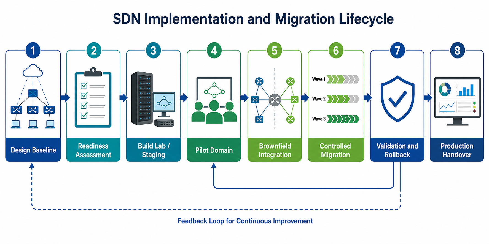
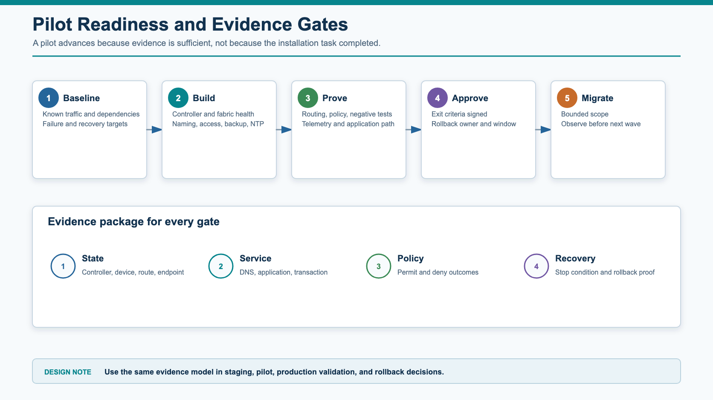
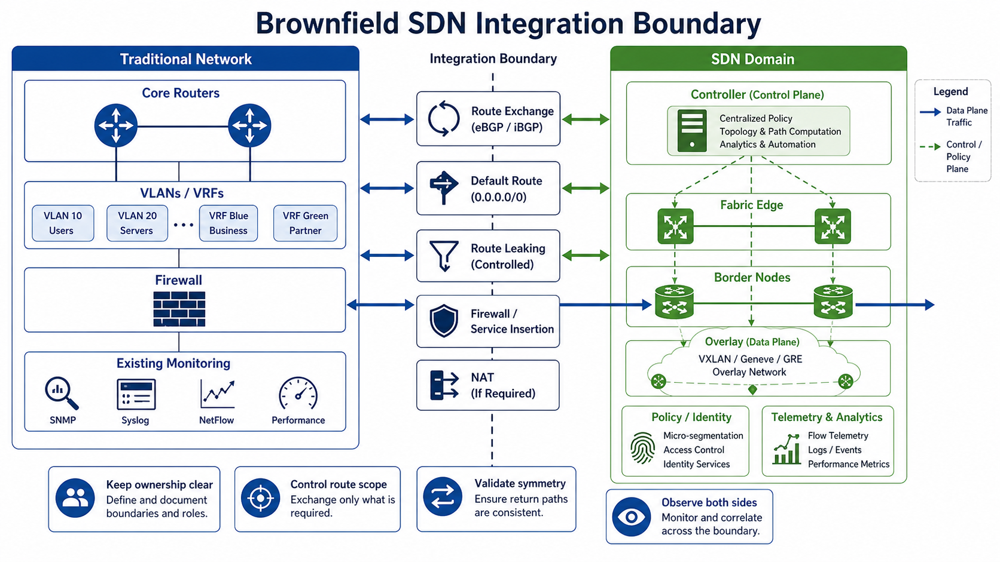
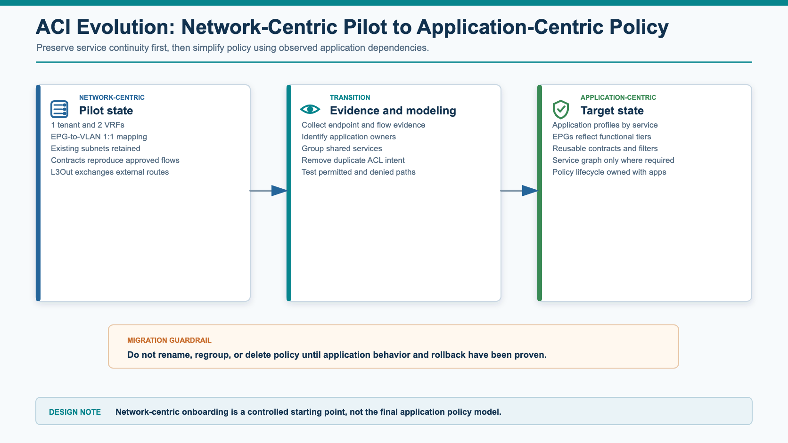
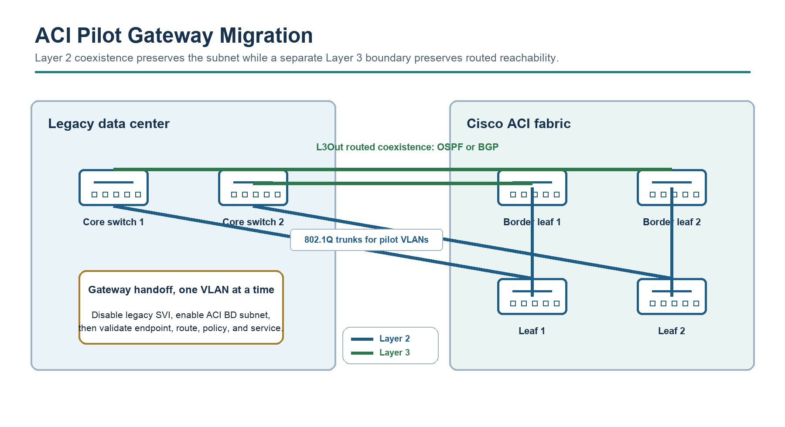

# Chapter 3 - SDN Implementation and Migration

## 1 Chapter Overview

Implementation begins when the approved architecture can be decomposed into bounded work packages with explicit dependencies, acceptance evidence, stop conditions, and recovery actions. Brownfield migration adds a coexistence period in which legacy and software-defined control models must remain unambiguous.

Brownfield implementation must preserve explicit ownership of routing, VLANs, VRFs, firewalls, monitoring, addressing, and change controls while the legacy and software-defined domains coexist. The implementation method is therefore organized around readiness, bounded migration waves, deterministic validation, and recoverable cutovers.

## 2 Learning Objectives

After completing this chapter, you should be able to:

- Convert an SDN high-level design into implementation work packages.
- Build a readiness checklist for underlay, controller, identity, policy, routing, security, and telemetry.
- Explain phased SDN migration approaches for campus, data center, WAN overlay, cloud, and IT/OT environments.
- Implement safe brownfield integration boundaries between SDN and traditional networks.
- Plan migration waves based on dependency clarity, rollback feasibility, support readiness, and business risk.
- Define pre-checks, post-checks, success criteria, rollback triggers, and handover artifacts.
- Identify common implementation failure modes and reduce risk before production cutover.

> **STUDY NOTE**  
> Configuration completion is not acceptance. Each wave requires a baseline, dependency map, bounded scope, stop condition, service validation, recovery path, and retained evidence.

## 3 Prerequisite Knowledge

An approved high-level and low-level design, baseline routing and switching knowledge, change and rollback procedures, controller administration, and the ability to validate application transactions across security and routing boundaries.

## 4 Implementation Governance and Readiness

### 4.1 Implementation and Migration Lifecycle

An SDN implementation should be treated as a controlled lifecycle, not a single installation activity. The same lifecycle applies whether the first domain is a campus fabric, data center fabric, WAN overlay, cloud network, or OT segmentation project.

#### 4.1.1 Lifecycle Workflow

The implementation lifecycle begins with a design baseline and readiness assessment, then moves through staging, pilot deployment, brownfield integration, controlled migration, validation, rollback readiness, and operational handover. Each phase must produce evidence that becomes an entry condition for the next phase.

*Figure 3-1. SDN Implementation and Migration Lifecycle.*

#### 4.1.2 Implementation Principle

The first cutover should minimize novelty, scope, and decision pressure. Predictable execution, explicit evidence, and a rehearsed recovery path are more valuable than an ambitious pilot.

A strong implementation has these properties:

- The scope is clear.
- The current state is baselined.
- The change steps are reversible or at least recoverable.
- Pre-checks prove that the environment is ready.
- Post-checks prove that the intended outcome works.
- Monitoring is active before the cutover starts.
- The rollback trigger is agreed before the change window.
- The operations team receives usable documentation, not only a project closure note.

### 4.2 From Design to Implementation Work Packages

The approved design from Chapter 2 should be decomposed into work packages. Each work package should have an owner, prerequisite, validation method, and rollback approach.

| **Work package** | **Typical owner** | **Implementation output** |
| --- | --- | --- |
| Controller platform | Network platform team | Installed controller cluster, certificates, backups, RBAC, system health validation. |
| Underlay readiness | Routing/switching team | Routed reachability, MTU validation, NTP/DNS/AAA/SNMP/syslog, software baseline. |
| Fabric or overlay | SDN implementation team | Fabric nodes onboarded, overlay tunnels established, endpoint discovery working. |
| Identity integration | Security/access team | NAC/AAA integration, group mappings, fallback behavior, test identities. |
| Segmentation policy | Network/security architects | VRFs/VNs/EPGs/groups/contracts/firewall rules mapped to approved policy matrix. |
| Routing boundary | Network architecture team | BGP/OSPF/static route exchange, summarization, route leaking, default route behavior. |
| Security services | Security operations | Firewall/service insertion, NAT, inspection, logging, failover behavior. |
| Telemetry and monitoring | NOC/operations | Dashboards, alerts, flow logs, controller health, service baselines. |
| Change and rollback | Project/change manager | Runbook, maintenance window, communication plan, rollback criteria. |
| Handover | Operations and architecture | As-built diagrams, operational procedures, known limitations, escalation paths. |

#### 4.2.1 Implementation Readiness Gate

Do not start production migration until these questions can be answered:

- What exact devices, sites, users, segments, or applications are in scope?
- Which existing services must continue during the change?
- Which routes will be advertised, withdrawn, filtered, or leaked?
- Which policies will be enforced by the fabric, firewall, cloud, or identity platform?
- Which telemetry confirms success?
- Which alarms are expected during the change?
- Who can approve rollback?
- How long can troubleshooting continue before rollback is mandatory?
- Which team owns the system after handover?

### 4.3 Readiness Assessment

Readiness assessment confirms that the target environment can support the implementation. It is different from design discovery. Discovery asks, "What exists?" Readiness asks, "Can this environment safely accept the new SDN behavior?"

*Figure 3-2. Pilot readiness and evidence gates.*

#### 4.3.1 Technical Readiness Checklist

| **Area** | **Readiness questions** | **Risk if skipped** |
| --- | --- | --- |
| Hardware | Are platforms supported for the required SDN role? | Unsupported features or unstable behavior. |
| Software | Are versions aligned with validated release guidance? | Controller/device compatibility problems. |
| Licensing | Are required features licensed before cutover? | Deployment blocked during change window. |
| Underlay | Is IP reachability stable between nodes and controllers? | Overlay instability and false controller troubleshooting. |
| MTU | Has encapsulation overhead been tested end to end? | Intermittent application failure or fragmentation. |
| Time/DNS | Are NTP and DNS reliable? | Certificate, logging, authentication, and telemetry issues. |
| AAA/RBAC | Are admin roles and service accounts defined? | Excessive privilege or blocked operations. |
| Identity | Are user/device groups accurate and tested? | Incorrect segmentation and access policy. |
| Addressing | Are IP pools, loopbacks, transport blocks, and summaries reserved? | Overlap, route churn, or later renumbering. |
| Monitoring | Are baseline dashboards and alerts active before change? | No evidence during failure analysis. |

#### 4.3.2 Operational Readiness Checklist

| **Area** | **Required evidence** |
| --- | --- |
| Change process | Approved change record with implementation and rollback steps. |
| Support model | Named owners for controller, fabric, identity, firewall, routing, and monitoring. |
| Escalation | Contact list and bridge process for the change window. |
| Documentation | Current-state and target-state diagrams. |
| Backups | Controller, device, firewall, and policy backups completed and restorable. |
| Training | Operations team can perform basic health checks and first-level triage. |
| Tool access | Engineers have working access to controller, CLI, monitoring, identity, firewall, and logging tools. |

### 4.4 Lab, Staging, and Proof of Implementation

Production cutovers should not be the first time the implementation steps are executed.

#### 4.4.1 Staging Goals

- Validate controller installation and clustering.
- Validate device onboarding.
- Validate certificates and secure control channels.
- Validate templates, profiles, sites, pools, VNIs, VRFs, endpoint groups, and policy objects.
- Validate route exchange between SDN and traditional routing.
- Validate security service insertion.
- Validate monitoring, logs, events, and telemetry.
- Measure how long implementation and rollback steps take.

#### 4.4.2 Staging Environment Design

The staging environment should reproduce the controller release, fabric or overlay node roles, external routing boundary, security insertion point, and representative application path planned for production. It does not need production scale, but it must reproduce the dependencies and failure behaviors that determine whether the migration is safe.

#### 4.4.3 What to Prove Before Production

| **Test** | **Success criteria** |
| --- | --- |
| Controller health | Cluster healthy, backups configured, time synchronized, certificates valid. |
| Device onboarding | Devices appear in inventory with correct role and software state. |
| Underlay | Nodes reach each other and controller with expected MTU and routing. |
| Overlay | Tunnels or fabric adjacencies form and recover after failure. |
| Segmentation | Users/workloads enter intended segment and cannot access denied segments. |
| Boundary routing | Routes are exchanged, filtered, summarized, and withdrawn as expected. |
| Security insertion | Required flows traverse firewall/services with logging. |
| Failure | Link/node/controller/service failure behavior matches design assumptions. |
| Rollback | Rollback steps restore the known-good state within the allowed time. |

## 5 Brownfield Coexistence and Migration Strategy

### 5.1 Integration Boundary

Most SDN projects begin beside an existing network. The integration boundary is where the new SDN domain exchanges traffic, routes, policy, and operational responsibility with the traditional network.

#### 5.1.1 Boundary Implementation Workflow

A brownfield boundary workflow must establish routing ownership, VLAN or segment coexistence, policy responsibility, security inspection, failure detection, monitoring, and rollback before traffic is moved. The handoff should proceed in bounded waves so that each migrated service can be validated independently.

*Figure 3-3. Brownfield SDN Integration Boundary.*

#### 5.1.2 Boundary Controls

The controls below convert the design boundary into enforceable implementation and governance requirements. Each control needs an owner and a verification method.

| **Control** | **Implementation guidance** |
| --- | --- |
| Route scope | Advertise only required prefixes; avoid leaking broad internal routes into early pilots. |
| Route filtering | Use prefix lists, route maps, tags, communities, or controller policy where supported. |
| Default route | Be explicit about which segment receives which default route. |
| Route leaking | Implement only approved inter-segment flows; document each leak. |
| Firewall path | Keep stateful inspection symmetric. Validate active/standby and active/active behavior. |
| NAT | Use NAT only where needed; document translation ownership and logging. |
| DNS | Validate that endpoints resolve destinations appropriate for their new segment and location. |
| Monitoring | Collect controller, device, firewall, routing, and application evidence. |

#### 5.1.3 Common Boundary Failure Modes

The table should be reviewed before the change window so that warning signs and responses are agreed in advance. Discovery during an outage is too late to design the control.

| **Failure mode** | **Typical cause** | **Prevention** |
| --- | --- | --- |
| One-way traffic | Asymmetric routing through firewall | Validate forward and return path before cutover. |
| Unexpected access | Overbroad route leak or firewall rule | Use policy matrix and least-prefix advertisement. |
| Application timeout | MTU issue across overlay/service path | Test payload size and PMTUD behavior. |
| Endpoint unreachable | Missing default route or route filter | Compare pre/post routing table and endpoint path. |
| Wrong policy | Incorrect identity or group mapping | Test identity cases before production users move. |
| No useful telemetry | Monitoring configured after cutover | Enable dashboards and logs before migration. |

### 5.2 Migration Strategy

SDN migration is usually gradual. A phased approach reduces business risk and gives operations teams time to build confidence.

#### 5.2.1 Phase 0: Assessment and Baseline

Collect and verify:

- Device inventory and software versions.
- Hardware capability and support status.
- Topology and cabling.
- IP plan and summarization.
- VLAN, VRF, and security-zone mapping.
- Routing protocols, redistribution, default routes, and route filters.
- Firewall policies, NAT, proxies, and service insertion.
- WAN circuits and cloud connectivity.
- Application dependencies.
- Identity sources and group mappings.
- Existing monitoring and logging.
- Known pain points and incident history.

#### 5.2.2 Phase 1: Standardization

Before SDN, clean up the basics:

- Naming conventions.
- Site codes.
- Device role definitions.
- IP address management.
- VLAN and VRF standards.
- Loopback and transport addressing.
- NTP, DNS, AAA, SNMP/syslog, certificates.
- Configuration backup process.
- Monitoring registration.
- Change templates and runbook format.

This phase is not glamorous, but it prevents expensive troubleshooting later.

#### 5.2.3 Phase 2: Staging and Pilot

Good pilot candidates:

- A new site or building.
- A small non-critical application zone.
- A lab data center pod.
- Guest access segmentation.
- A limited IoT group.
- A small branch or representative remote site.

Avoid starting with:

- Core production data center migration.
- Safety-critical OT systems with unclear dependencies.
- Highly customized legacy sites.
- Environments with poor documentation.
- Applications whose owners cannot validate behavior during the change window.

#### 5.2.4 Phase 3: Controlled Expansion

Expand only after the pilot has proven:

- The implementation runbook is accurate.
- The rollback process is tested.
- Operations can monitor the new domain.
- Security policy behaves as intended.
- Routing boundaries are predictable.
- Application owners can validate success.
- Support teams understand escalation paths.

#### 5.2.5 Phase 4: Multi-Domain Integration

After one domain is stable, integrate additional domains deliberately:

- Campus fabric to data center fabric.
- Campus or branch to WAN overlay.
- Data center fabric to cloud transit.
- Fabric segmentation to firewalls.
- Identity platform to access and security policy.
- Telemetry to assurance and SIEM/SOAR.

The implementation risk increases when multiple controllers, teams, and policy models interact. Add one integration at a time when possible.

### 5.3 Migration Waves and Change Windows

Migration waves group changes by risk, dependency, and operational readiness.

*Figure 3-4. SDN migration waves and change windows.*

A migration wave should advance only after its exit criteria have been satisfied. Each subsequent wave should incorporate the evidence and lessons from earlier migrations instead of expanding scope simply because the preceding change completed.

#### 5.3.1 Wave Selection Criteria

Migration waves should be selected by dependency clarity and recoverability rather than by device count alone. The table provides the evidence needed to bound risk and decide whether to continue.

| **Criterion** | **Why it matters** |
| --- | --- |
| Business impact | Low-impact services are better for early waves. |
| Dependency clarity | Unknown dependencies create surprise outages. |
| Rollback feasibility | Early waves should have simple and fast rollback. |
| Monitoring coverage | Teams need evidence during and after change. |
| Support readiness | Operations must be ready before production users are moved. |
| Representative value | A pilot should teach something useful for later waves. |

#### 5.3.2 Migration Wave Template

The wave template records approved scope, dependencies, entry criteria, execution owner, service tests, stop conditions, rollback state, and exit evidence. Reuse the structure while changing the technical checks for each domain.

| **Wave** | **Scope** | **Primary goal** | **Exit criteria** |
| --- | --- | --- | --- |
| Wave 0 | Discovery, standards, staging | Prepare environment and process | Readiness gate passed. |
| Wave 1 | Low-risk pilot | Validate implementation method | Pilot success criteria met; rollback tested. |
| Wave 2 | Department, building, app zone, or selected site group | Expand pattern under controlled risk | Service validation passed; operations comfortable. |
| Wave 3 | Critical service expansion | Move important services with mature process | Business sign-off and stable operations. |

## 6 Domain Implementation Patterns

### 6.1 Implementation by SDN Domain

#### 6.1.1 Data Center Fabric Implementation

Common implementation sequence:

- Build controller cluster and management connectivity.
- Prepare underlay addressing, routing, NTP, DNS, AAA, and MTU.
- Onboard leaf and spine switches.
- Create tenants, VRFs, bridge domains, endpoint groups, contracts, or equivalent policy objects.
- Configure external connectivity and route exchange.
- Integrate firewalls, load balancers, or service chains.
- Migrate non-critical workloads or application tiers.
- Validate endpoint learning, routing, policy, and application flows.

Practical trade-offs:

- L2 extension can simplify workload migration but extends failure domains.
- L3 migration is cleaner but may require application or DNS changes.
- Policy-first deployment improves security but requires dependency discovery.
- Monitor-first deployment reduces outage risk but delays strict enforcement.

#### 6.1.2 Campus Fabric Implementation

Common implementation sequence:

- Prepare controller, identity platform, sites, hierarchy, and credentials.
- Validate access switch hardware and software support.
- Define IP pools, virtual networks, scalable groups, and border roles.
- Integrate AAA/NAC and test endpoint classification.
- Onboard a limited fabric area or building.
- Migrate test users, guest users, or a limited device group.
- Validate wired and wireless behavior, policy, roaming, DHCP, DNS, and internet access.
- Expand by building, floor, or user/device group.

Practical trade-offs:

- Identity-based segmentation is powerful, but only if identity data is accurate.
- A limited pilot should include real endpoint diversity: laptops, phones, printers, cameras, and unmanaged devices.
- Guest and IoT are often good early use cases because the expected policy is clear.

#### 6.1.3 WAN Overlay Implementation

Common implementation sequence:

- Prepare controller/orchestrator access, certificates, organization/site structure, and templates.
- Validate transport circuits and underlay reachability.
- Install edge devices in parallel where possible.
- Build secure overlay tunnels.
- Advertise a limited set of prefixes.
- Apply application and segmentation policies.
- Move selected traffic classes first.
- Expand to additional sites and cloud/security on-ramps.

Practical trade-offs:

- Parallel deployment reduces risk but increases temporary complexity.
- Full site cutover is simpler operationally but has higher blast radius.
- Direct internet access improves SaaS performance but requires strong security inspection and logging.

#### 6.1.4 Cloud Network Implementation

Common implementation sequence:

- Define account/subscription/project structure.
- Build hub, spoke, transit, or cloud WAN model.
- Implement IP addressing, route tables, security groups, firewalls, and private endpoints.
- Connect to enterprise network through controlled transit.
- Validate route propagation and segmentation.
- Implement infrastructure-as-code for repeatability.
- Enable cloud flow logs and security logging.

Practical trade-offs:

- Cloud-native controls are fast and flexible, but each cloud has different constructs.
- Third-party cloud networking can improve consistency but adds platform dependency.
- Infrastructure-as-code is valuable, but state management and review process must be controlled.

#### 6.1.5 IT/OT Implementation

IT/OT implementation is a dependency-discovery and risk-reduction exercise before it is a policy deployment. A brownfield plant often contains unmanaged switches, static addressing, unsupported operating systems, protocol behaviors that do not tolerate scanning, and production dependencies that are known only to controls engineers or vendors.

##### 6.1.5.1 Discover and Baseline

- Collect switch forwarding tables, ARP/ND state, routing tables, firewall logs, controller inventories, and passive packet metadata without actively probing fragile devices.
- Map each asset to process cell, owner, vendor, model, firmware, criticality, communication peers, maintenance window, and recovery method.
- Observe at least one representative production cycle, including startup, shutdown, batch transition, maintenance, backup, and vendor-support periods.
- Record latency, jitter, multicast, broadcast, redundancy, and time-synchronization behavior before changing topology or enforcement.

##### 6.1.5.2 Build the Boundary Before Tightening Policy

Introduce routed and firewall boundaries in monitor or permissive mode first. Establish redundant management, logging, time, and backup services. Prove that the industrial DMZ can broker historian replication, update staging, and remote access without creating direct IT-to-control reachability.

- Create zone and conduit objects from the approved dependency model, not by translating every legacy VLAN into a permanent security zone.
- Preserve existing subnets during early migration when address changes would increase risk, but stop extending those VLANs beyond the bounded coexistence period.
- Validate route advertisement and default-route behavior so that OT segments do not inherit unapproved enterprise or internet exits.
- Use observation-only identity classification before dynamic authorization for devices that lack reliable 802.1X or certificate support.

##### 6.1.5.3 Activate Policy by Cell and Conduit

Move from visibility to enforcement one cell, line, or service conduit at a time. Start with high-confidence flows, maintain an explicit temporary-exception register, and monitor both process state and network evidence during the change window.

- Pre-stage policy and verify the exact candidate diff before activation.
- Test required flows, prohibited lateral flows, failover, return-path symmetry, and controller-disconnected behavior.
- Define stop conditions in operational language, such as loss of historian updates, PLC communication alarms, excessive retransmission, or redundancy degradation.
- Keep rollback locally executable even if the central automation platform is unavailable.

##### 6.1.5.4 Acceptance and Handover

Acceptance requires evidence from network operations, cybersecurity, controls engineering, and the production owner. The handover package should include as-built zones and conduits, policy owners, expired and temporary rules, asset inventory confidence, controller and firewall backups, monitoring coverage, known blind spots, degraded-mode behavior, runbooks, and the next policy-review date.

A technically successful change is not accepted if the process cannot be operated, diagnosed, and recovered safely by the teams on shift.

## 7 Cutover, Validation, and Risk Control

### 7.1 Cutover Validation and Rollback

#### 7.1.1 Cutover Decision Flow

A cutover decision sequence separates technical completion from service acceptance. Pre-checks establish the baseline and stop conditions; execution is limited to the approved scope; post-checks verify routing, policy, stateful services, application behavior, and recovery readiness before the change is accepted.

*Figure 3-5. SDN cutover validation and rollback decision flow.*

#### 7.1.2 Pre-Check Examples

Pre-checks capture the approved baseline and confirm that dependencies, monitoring, rollback access, and stop conditions are valid before the first production action.

| **Area** | **Pre-check** |
| --- | --- |
| Controller | Cluster healthy, database healthy, certificate status normal, backups complete. |
| Devices | Target devices reachable, correct software, correct role, no critical alarms. |
| Underlay | Required loopbacks and transport paths reachable with correct MTU. |
| Routing | Current route table and default route captured; expected neighbors up. |
| Identity | Test user/device maps to expected group or segment. |
| Security | Firewall policy staged, NAT ready, logging enabled. |
| Monitoring | Dashboards active, alert routing confirmed, baseline captured. |
| Application | Application owner available; baseline transaction tested. |

#### 7.1.3 Post-Check Examples

Post-checks compare the same evidence after the change and add representative permitted, denied, and application-level transactions before service acceptance.

| **Area** | **Post-check** |
| --- | --- |
| Endpoint | Endpoint onboarded into correct segment/group. |
| Routing | Expected routes advertised and received; unexpected routes absent. |
| Policy | Allowed flows work; denied flows fail as expected. |
| Firewall | Traffic uses intended firewall/service path; logs confirm rule hit. |
| Application | Critical transactions succeed from migrated endpoint/site/workload. |
| Performance | Latency, loss, jitter, CPU, memory, and interface counters within threshold. |
| Telemetry | Controller, device, flow, firewall, and application evidence available. |
| User experience | Pilot users confirm expected access and performance. |

#### 7.1.4 Rollback Types

Rollback may restore configuration, topology, route ownership, gateway ownership, policy, software, or an entire migration wave. Select the method according to the state changed and the time available for safe recovery.

| **Rollback type** | **Description** | **Use when** |
| --- | --- | --- |
| Configuration rollback | Restore previous controller/device/firewall configuration. | Change is configuration-only and previous state is known. |
| Routing rollback | Withdraw new routes or restore old route preference. | Traffic can be moved back through routing control. |
| Physical rollback | Move cable, gateway, or service attachment back. | Migration used physical path changes. |
| Policy rollback | Disable or revert new policy enforcement. | Policy blocks required traffic. |
| DNS or application rollback | Restore previous destination or service endpoint. | Application cutover changed name resolution or service mapping. |
| Operational rollback | Stop migration wave and return to monitoring-only mode. | The system is stable but not ready for more migration. |

#### 7.1.5 Rollback Triggers

Rollback should be triggered when:

- Critical application transactions fail and cannot be restored within the timebox.
- A security policy exposes access that should be denied.
- Routing instability affects users outside the migration scope.
- Firewall or service insertion causes widespread asymmetric traffic.
- Monitoring cannot confirm the actual state.
- The support team cannot isolate the issue before the decision deadline.

### 7.2 Validation Matrix

A validation matrix connects requirements, technical checks, and evidence.

| **Requirement** | **Validation method** | **Evidence** |
| --- | --- | --- |
| Corporate users reach ERP | Test transaction from migrated endpoint | Screenshot/log of successful login and transaction. |
| Guest cannot reach internal network | Attempt access to internal test prefix | Denied flow log and failed reachability test. |
| OT PLC reaches historian only | Protocol-specific test | Firewall log and historian event. |
| Routes are scoped | Compare route table before and after | Captured prefixes and neighbor state. |
| Firewall inspection active | Confirm rule hit and session table | Firewall logs and session output. |
| Overlay stable | Check tunnel/fabric health | Controller health and path trace. |
| Performance acceptable | Compare baseline and post-change metrics | Latency/loss/jitter/application response dashboard. |

### 7.3 Change Runbook Structure

An SDN implementation runbook should be concise enough to execute under pressure and detailed enough to avoid improvisation.

#### 7.3.1 Runbook Sections

A runbook must let an engineer who did not author the design execute, pause, validate, and recover the change without relying on undocumented assumptions.

| **Section** | **Content** |
| --- | --- |
| Scope | Sites, devices, users, workloads, segments, routes, policies in scope. |
| Out of scope | Explicitly list systems that must not be changed. |
| Prerequisites | Readiness items, approvals, backups, access, support contacts. |
| Current state | Diagrams, routes, policies, monitoring baseline. |
| Target state | Expected routes, segments, policies, traffic paths, dashboards. |
| Implementation steps | Ordered commands, controller actions, or workflow tasks. |
| Pre-checks | Tests that must pass before change execution. |
| Post-checks | Tests that prove success. |
| Rollback plan | Steps, owner, trigger, estimated duration. |
| Communication | Stakeholders, status update times, escalation bridge. |
| Handover | As-built updates, known issues, monitoring ownership. |

#### 7.3.2 Change Record Quality

Weak change record:

> **STUDY NOTE**  
> Example change objective: migrate a bounded set of employee access ports to the approved campus-fabric design.

Strong change record:

Migrate Building A floor 2 employee wired VLANs from traditional access switching to campus fabric. Scope includes access switches A2-01 to A2-06, Corporate virtual network, employee identity group, DHCP relay update, route advertisement from fabric border to core, and firewall path for internal applications. Guest and IoT are out of scope. Rollback is restoring uplinks to traditional distribution and disabling fabric edge onboarding for the target switches.

The strong version states scope, boundary, policy, route behavior, exclusions, and rollback.

### 7.4 Implementation Risk Register

The risk register binds each failure condition to an early indicator, preventive control, response owner, and migration decision. Review it before the change window, not during an outage.

| **Risk** | **Early warning sign** | **Mitigation** |
| --- | --- | --- |
| Underlay instability | Packet loss, flapping links, inconsistent MTU | Fix underlay before overlay migration. |
| Policy misclassification | Endpoint appears in wrong group | Test identity mappings and fallback behavior. |
| Route leakage | Unexpected prefixes appear in another segment | Apply route filters and compare route tables. |
| Asymmetric firewall path | Sessions appear half-open or reset | Validate forward/return path and routing preference. |
| Controller task failure | API or GUI task accepted but device state unchanged | Track task status and perform post-change device validation. |
| Monitoring blind spot | No logs from new SDN domain | Integrate telemetry before cutover. |
| Application dependency unknown | App fails despite basic ping working | Baseline real application transactions and flows. |
| Rollback too slow | Steps are manual and untested | Rehearse rollback in staging. |

### 7.5 Implementation Anti-Patterns

Avoid these common mistakes:

- Treating controller installation as the same thing as production readiness.
- Migrating critical users or workloads before telemetry is active.
- Advertising broad route summaries from a pilot domain.
- Reusing old VLAN names as the new policy model without reviewing intent.
- Enforcing strict policy before application dependencies are understood.
- Using personal admin accounts for controller or API actions.
- Assuming a successful controller task means the data plane changed correctly.
- Writing a rollback plan that nobody has tested.
- Expanding to the second domain before the first domain is operationally stable.

## 8 Production Handover and Platform Dependencies

### 8.1 Production Handover

Implementation is not complete when traffic passes. It is complete when operations can support the system.

#### 8.1.1 Handover Artifacts

Handover artifacts describe the as-built state, operational dependencies, access model, expected alarms, recovery procedures, and known residual risk for engineers who did not participate in the migration.

| **Artifact** | **Purpose** |
| --- | --- |
| As-built topology | Shows actual deployed nodes, links, roles, and boundaries. |
| Segment and policy matrix | Explains who can communicate with what and where enforcement happens. |
| Routing table summary | Documents advertised and received prefixes at each boundary. |
| Controller operations guide | Covers health checks, backups, certificates, RBAC, and common tasks. |
| Monitoring dashboard map | Shows where to view health, traffic, policy, and alerts. |
| Troubleshooting flow | Helps NOC isolate underlay, overlay, policy, identity, and service issues. |
| Known limitations | Lists exceptions, deferred items, and operational caveats. |
| Support ownership | Defines who owns controller, fabric, identity, firewall, cloud, and automation. |

#### 8.1.2 Initial Stabilization Period After Migration

Monitor closely for:

- Authentication failures.
- Endpoint classification changes.
- Route churn.
- Tunnel or fabric instability.
- Firewall denies for expected application flows.
- Application latency changes.
- Controller task failures.
- Configuration drift.
- Helpdesk ticket patterns.

Early operational feedback should improve the next migration wave.

### 8.2 Cisco and Industry Implementation Notes

Implementation risk differs by domain. ACI implementation centers on fabric discovery, access-policy dependencies, L3Out routing, contracts, and controlled gateway migration. Campus implementation centers on AAA readiness, identity classification, edge and border onboarding, and wired/wireless policy validation. SD-WAN implementation centers on controller reachability, certificate and edge onboarding, route exchange, VPN topology, application-policy activation, and coexistence with existing transports. The acceptance plan should test these domain-specific dependencies rather than apply one generic SDN checklist.

| **Segment** | **Cisco implementation focus** | **Comparable industry implementation focus** |
| --- | --- | --- |
| Data center fabric | APIC/Nexus Dashboard readiness, leaf-spine onboarding, tenants/VRFs/EPGs/contracts, L3Out, service insertion | VMware NSX transport nodes and distributed firewall, Juniper Apstra blueprint deployment, Arista CloudVision EVPN/VXLAN provisioning |
| Campus fabric | Catalyst Center, fabric roles, IP pools, virtual networks, ISE integration, border/control/edge readiness | Aruba Central/NetConductor policy, Juniper Mist campus operations, ExtremeCloud IQ onboarding and policy |
| WAN overlay | Controller reachability, templates, certificates, secure tunnels, route advertisements, application policy | Fortinet, Prisma SD-WAN, EdgeConnect, VeloCloud, Versa template and overlay deployment models |
| Cloud networking | Cisco cloud networking integrations where used, enterprise route/security policy alignment | AWS/Azure/GCP native networking, Terraform providers, cloud firewalls, transit gateways/cloud WAN |
| Security integration | ISE, firewalls, security analytics, logging, and segmentation policy consistency | ClearPass, FortiNAC, Palo Alto, Zscaler/Netskope/Cato, SIEM/SOAR integrations |

The implementation method differs by platform, but the migration controls stay consistent: baseline, stage, pilot, validate, rollback, document, hand over.

## 9 Data Center Migration Case Study

### 9.1 ACI Migration from Greenfield Validation to Pilot Cutover

This case study deploys Cisco ACI in two data centers, beginning with the first site. The initial phase uses one tenant, Corporate and Contractor VRFs, approximately 100 network-centric endpoint groups (EPGs) with one EPG per VLAN, an external Layer 3 network (L3Out) using eBGP, and more than 200 candidate contracts. New test subnets validate the greenfield fabric before two existing VLANs enter the pilot migration.

*Figure 3-6. ACI evolution from a network-centric pilot to application-centric policy.*

#### 9.1.1 Why the First Production Model Is Network-Centric

An application-centric policy model groups endpoints according to application role and expresses allowed service relationships through contracts. It offers strong long-term value, but it depends on accurate application dependency data and clear ownership. Use a network-centric migration model when those prerequisites are not yet available for all existing workloads.

The network-centric starting model maps each existing VLAN to an EPG. This does not deliver the full application-centric outcome, but it provides several implementation advantages:

- Existing operational boundaries are preserved during the first migration.
- VLAN membership and default-gateway behavior remain easy to compare with the legacy network.
- Rollback can be defined per VLAN.
- Unknown application dependencies are less likely to be broken by immediate microsegmentation.
- Operations can learn the ACI object model without simultaneously redesigning every application policy.

The trade-off is policy scale. One hundred EPGs and more than 200 contracts can reproduce historical complexity if the team simply translates every ACL entry. The migration should therefore classify each contract as baseline, shared service, application dependency, external access, administrative access, or temporary exception. This classification prepares the later application-centric phase.

#### 9.1.2 Greenfield Fabric Bring-Up Sequence

The fabric should be built and validated independently before it carries migrated workloads. A disciplined sequence is:

- Verify rack, power, cabling, out-of-band management, console access, and hardware inventory.
- Establish management dependencies including DNS, NTP, SMTP where used, remote logging, AAA, certificates, and backup destinations.
- Initialize the APIC cluster and verify node discovery.
- Register leaf and spine switches with the correct node IDs, names, roles, and pod assignment.
- Confirm all expected fabric links and investigate unexpected or missing adjacencies.
- Configure infrastructure access policies, interface policy groups, switch profiles, and attachment profiles.
- Create the tenant, VRFs, bridge domains, application profiles, and test EPGs.
- Configure the L3Out and establish eBGP with the external routers.
- Deploy a small set of new test subnets that do not depend on legacy gateway migration.
- Validate endpoint learning, intra-EPG behavior, contract enforcement, external routing, MTU, failure convergence, monitoring, and backup.

The sequence deliberately separates physical-fabric validation from tenant-policy validation. If both are introduced at once, a basic cabling or underlay problem can be mistaken for a policy failure.

#### 9.1.3 Management and Operational Foundation

The APIC management network is a production dependency and must be treated as such. Before workload onboarding, the implementation team should verify:

- All APIC nodes have resilient management reachability.
- DNS forward and reverse resolution behave as required.
- NTP is synchronized and consistent with identity and logging systems.
- Administrative access uses named accounts and role-based authorization.
- Break-glass access is controlled, tested, and audited.
- Backups are scheduled and a restore procedure is documented.
- Certificates and expiration ownership are recorded.
- Syslog, SNMP, streaming telemetry, or Nexus Dashboard integrations are operational.
- Configuration changes and faults can be correlated to a common time source.

Management-plane validation should include loss of one APIC node and loss of one management path. The objective is to prove that operations retain control and evidence under failure, not only during steady state.

#### 9.1.4 Tenant Object Construction

ACI tenant policy has a hierarchy. The implementation team should understand the purpose of each object rather than treating the GUI as a sequence of forms.

| **Object** | **Implementation responsibility** |
| --- | --- |
| Tenant | Administrative and policy container for a data center environment |
| VRF | Independent Layer 3 forwarding and route-control domain; Corporate and Contractor are isolated here |
| Bridge domain | Layer 2 forwarding and subnet/gateway context associated with one VRF |
| Subnet | Anycast gateway and routing advertisement behavior for the bridge domain |
| Application profile | Organizational container for related EPGs |
| EPG | Endpoint classification and policy attachment point; initially aligned one-to-one with a VLAN |
| Contract | Permitted relationship between provider and consumer EPGs or external networks |
| L3Out | External routed connection, protocol policy, external EPG classification, and route exchange |

Naming should encode meaning without embedding transient details. Names should be predictable for humans and automation. For example, VRF names may represent trust domains, while EPG names combine service role and current network identifier. Object descriptions should record owners, purpose, and migration state.

#### 9.1.5 Bridge Domain and Subnet Decisions

Each pilot VLAN is mapped to a bridge domain and EPG. The bridge domain design must specify:

- Associated VRF.
- Whether unicast routing is enabled.
- The preserved anycast gateway address.
- ARP flooding and unknown-unicast behavior appropriate to endpoint characteristics.
- Endpoint retention and movement considerations.
- Whether the subnet is advertised externally.
- DHCP relay and other gateway-adjacent services.

Preserving the subnet reduces endpoint changes, but preserving the subnet does not mean preserving every legacy behavior. The implementation team must compare SVI ACLs, helper addresses, first-hop redundancy configuration, gratuitous ARP behavior, multicast dependencies, and monitoring. Anything attached to the old SVI must either be recreated, replaced by ACI policy, or explicitly retired.

#### 9.1.6 L3Out and eBGP Implementation

The external routed boundary connects the new fabric to the existing data center core, WAN, firewalls, and shared infrastructure. eBGP provides a clear policy boundary, but it must be implemented conservatively.

The implementation package should define:

- ACI leaf nodes and interfaces providing the routed attachment.
- Point-to-point addressing and VLAN encapsulation where subinterfaces are used.
- Local and peer autonomous system numbers.
- BGP password or other session protection where required.
- Prefixes imported into each VRF.
- Tenant prefixes exported from each VRF.
- Default route handling.
- Route-control profiles and communities.
- Maximum-prefix thresholds.
- BFD and timer settings when supported and justified.
- External EPG subnet classification and contracts.

Route exchange is validated in both directions. Seeing the peer in Established state is only the first check. The team must verify the expected received and advertised prefixes, next hops, route preference, route installation, return path, and behavior after peer or link failure.

Broad external EPG definitions such as 0.0.0.0/0 simplify early testing but can unintentionally make every external destination part of the same policy group. If used, the contract scope and route-control behavior must be understood. More specific external classification may be necessary for sensitive services.

#### 9.1.7 Contract Engineering at Scale

More than 200 contracts cannot be managed safely as anonymous one-off rules. The implementation should establish a contract model before bulk creation.

A contract consists of subjects and filters that define permitted protocols and ports. Provider and consumer relationships define direction of service use. The policy team should decide when contracts are reusable and when an application requires a dedicated contract.

Useful categories include:

- Shared infrastructure services such as DNS, NTP, directory, backup, and monitoring.
- Common web or application service patterns.
- Application-specific east-west dependencies.
- Management access from controlled administrative groups.
- External north-south access.
- Temporary migration or discovery permits with expiration dates.

Contract names should not use only port numbers. A name such as ct-web-to-app-https8443 communicates relationship and service better than allow-8443. Filters should avoid unnecessary ranges. Logging and counters should be enabled where they provide operational value without overwhelming the platform.

Before enforcing the final set, the team should compare the contract matrix with observed traffic and application-owner confirmation. A temporary permit-and-observe phase may be justified for poorly documented applications, but it must have a defined duration and conversion plan.

#### 9.1.8 Pilot Subnets and Proof of Fabric Behavior

New test subnets provide a controlled way to validate ACI before brownfield migration. Test endpoints should exercise more than same-subnet ping.

The pilot test plan should include:

- Endpoint learning on expected leaf interfaces.
- Default-gateway reachability.
- Communication within an EPG according to the chosen isolation behavior.
- Communication between EPGs with and without a contract.
- DNS, NTP, DHCP relay, and management services.
- External reachability through the L3Out.
- Return-path symmetry through stateful services.
- Failure of one leaf uplink, one border link, and one BGP peer.
- Packet sizes that validate encapsulation MTU.
- Telemetry and fault visibility in the operational tools.
- Configuration backup and audit logging.

The test endpoints should generate known transactions so that policy counters and packet captures can be interpreted. Random traffic produces poor evidence.

#### 9.1.9 Brownfield Layer 2 Coexistence

To preserve existing subnets while endpoints move in waves, selected VLANs are extended between the legacy core/access environment and ACI through a controlled Layer 2 trunk. This link is a migration mechanism, not the target architecture.

The trunk design must define:

- Exactly which pilot VLANs are allowed.
- Which legacy and ACI interfaces participate.
- Spanning-tree interoperability and loop prevention.
- Native VLAN behavior.
- vPC or port-channel configuration where used.
- Fault monitoring and ownership.
- Removal criteria after migration.

A separate Layer 3 path between the legacy network and ACI maintains reachability for subnets whose gateways are on different sides. Mixing the Layer 2 extension and routed boundary without a clear model can create loops, duplicate gateways, or asymmetric paths.

#### 9.1.10 Gateway Handoff for a Pilot VLAN

Gateway migration must prevent two active devices from answering for the same IP address. The runbook for each pilot VLAN should identify the legacy SVI, HSRP state where applicable, ACI bridge-domain subnet, DHCP relay, ACL replacement, static routes, and rollback commands.

A controlled handoff sequence is:

- Freeze unrelated changes and capture current route, ARP, MAC, HSRP, interface, and application state.
- Verify the Layer 2 trunk carries the pilot VLAN and does not create an unintended spanning-tree topology.
- Verify the ACI bridge domain, EPG, static path or domain attachment, contracts, and L3Out reachability.
- Confirm that the ACI gateway is not active before the handoff.
- Shut down the legacy SVI according to the approved device sequence and confirm that no legacy node continues answering for the gateway.
- Enable the preserved gateway address on the ACI bridge-domain subnet.
- Clear or refresh stale ARP and neighbor state only when needed and according to the rollback plan.
- Verify endpoint learning, default-gateway resolution, internal routes, external routes, contracts, firewall sessions, and application transactions.
- Observe the environment for the defined stabilization interval.
- Continue, pause, or roll back based on objective criteria.

Rollback reverses gateway ownership in a controlled order. The team disables the ACI gateway, confirms it is inactive, restores the legacy SVI and first-hop state, validates routing and applications, and records the reason for rollback. The runbook should not rely on simultaneous changes performed by uncoordinated engineers.

The coexistence topology requires two distinct relationships. An 802.1Q Layer 2 trunk carries the pilot VLAN between the legacy switching domain and ACI so endpoints can move without changing their addresses. A separate routed relationship between the legacy core and ACI L3Out preserves reachability for subnets whose gateways have already moved and for subnets that remain on the legacy core.

For each VLAN, verify the absence of duplicate gateway addresses, shut down the legacy SVI, enable the matching ACI bridge-domain subnet, and confirm endpoint learning before progressing. Validate routes in both directions, contracts to internal and external EPGs, firewall state where present, and the application transaction. Re-enable the legacy SVI only through the approved recovery procedure.

*Figure 3-7. ACI pilot Layer 2 coexistence and Layer 3 routed migration boundary.*

The Layer 2 coexistence link preserves VLAN adjacency only for approved pilot VLANs; the routed boundary exchanges reachability between migrated and nonmigrated subnets. Validate, monitor, and remove these transitional dependencies independently.

#### 9.1.11 Automation and Terraform for Repeated Objects

Creating 100 EPGs and hundreds of related objects manually increases inconsistency. Terraform can model repeated ACI resources declaratively, but it should be introduced after the team understands the object relationships and has validated a small set manually.

The workflow should include:

- Store approved object data in structured variables or a controlled source of truth.
- Pin provider versions and protect credentials outside the configuration files.
- Import or otherwise account for existing objects before Terraform assumes ownership.
- Run formatting and syntax validation.
- Generate a plan and review every create, update, and delete action.
- Apply first to the simulator or staging environment.
- Validate APIC objects and resulting policy behavior.
- Apply to production in bounded batches.
- Store state securely with locking, access control, backup, and audit history.

Terraform state is sensitive because it can contain infrastructure identifiers and values. Concurrent writers, lost state, or unmanaged GUI changes can cause drift. The governance model must define whether an object is managed by Terraform, by another automation system, or manually. Shared ownership of the same object is unsafe.

#### 9.1.12 Cutover Evidence Package

For each migration wave, the implementation team should retain:

- Approved runbook and change record.
- Timestamped pre-check and post-check results.
- Controller task IDs and audit records.
- Before-and-after route, endpoint, and policy state.
- Application transaction results.
- Relevant fault, event, and firewall records.
- Decision log for proceed, pause, or rollback.
- Deviations from the runbook.
- Updated as-built and migration tracker.

This evidence supports operations, audit, and root-cause analysis. It also improves the next wave by revealing which checks were useful and which assumptions were wrong.

## 10 Chapter Review

### 10.1 Chapter Summary

Implementation succeeds when a correct design is converted into repeatable work packages, validated dependencies, controlled changes, and operational evidence. The controller installation is only one component. Routing, identity, policy, management services, monitoring, and people must all be ready.

The ACI pilot demonstrates the central migration principle: introduce the new control system in a bounded domain, prove it with new test networks, integrate it explicitly with the brownfield environment, and transfer production services in reversible waves. Chapter 4 begins where implementation ends by showing how the organization operates and troubleshoots the resulting system.

### 10.2 Review Questions

- Why should SDN implementation begin with a readiness gate rather than controller installation?
- What is the difference between discovery and readiness assessment?
- Why is the underlay still a critical implementation dependency in SDN?
- What must be validated at the boundary between an SDN domain and a traditional network?
- Why should early migration waves have low business impact and strong rollback feasibility?
- What are examples of useful SDN pre-checks and post-checks?
- Why is a successful controller task not enough evidence of implementation success?
- What can cause asymmetric traffic during brownfield SDN integration?
- When should rollback be triggered?
- What artifacts should be included in production handover?
- Why is application transaction testing more useful than ping alone?
- Which implementation risks increase when multiple SDN domains are integrated?

### 10.3 Scenario and Design Exercise

Prepare a migration-wave decision for the first production VLAN in a Cisco ACI migration. Specify the Layer 2 trunk scope, routed coexistence, gateway transfer sequence, pre-checks, stop conditions, rollback trigger, application transaction, and retained evidence.

### 10.4 Key Takeaways

- SDN implementation is a controlled lifecycle: baseline, readiness, staging, pilot, integration, migration, validation, and handover.
- Brownfield boundaries require explicit routing, segmentation, security, monitoring, and ownership controls.
- Migration waves should be selected by risk, dependency clarity, rollback feasibility, monitoring coverage, and support readiness.
- Pre-checks and post-checks convert assumptions into evidence.
- Rollback must be designed and rehearsed before production cutover.
- Early pilots should prove both technology and operational support.
- Implementation is complete only when operations can monitor, troubleshoot, and own the deployed SDN domain.

### 10.5 References for Further Study

- Cisco, Software-Defined Access solution overview: https://www.cisco.com/site/us/en/solutions/networking/software-defined-access/index.html

- Cisco, Cisco SD-Access Solution Design Guide: https://www.cisco.com/c/en/us/td/docs/solutions/CVD/Campus/cisco-sda-design-guide.html

- Cisco, Application Centric Infrastructure overview: https://www.cisco.com/site/us/en/products/networking/cloud-networking/application-centric-infrastructure/index.html

- Cisco, Nexus Dashboard product page: https://www.cisco.com/site/us/en/products/networking/data-center-networking/nexus-dashboard/index.html

- Cisco, Catalyst SD-WAN product page: https://www.cisco.com/site/us/en/solutions/networking/sdwan/catalyst/index.html

- Cisco, Identity Services Engine product page: https://www.cisco.com/site/us/en/products/security/identity-services-engine/index.html

- VMware, NSX documentation: https://docs.vmware.com/en/VMware-NSX/index.html

- Juniper, Apstra documentation: https://www.juniper.net/documentation/product/us/en/apstra/

- Arista, CloudVision: https://www.arista.com/en/products/eos/eos-cloudvision

- Fortinet, Secure SD-WAN: https://www.fortinet.com/products/sd-wan
