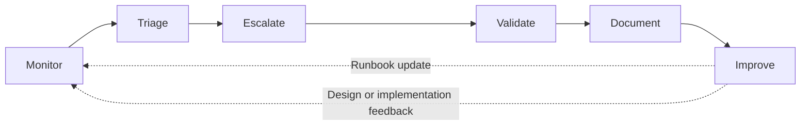
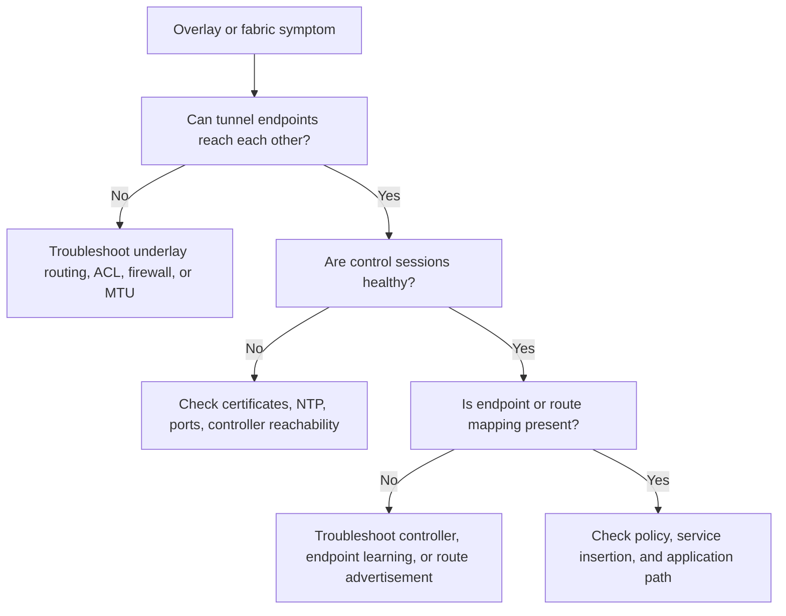
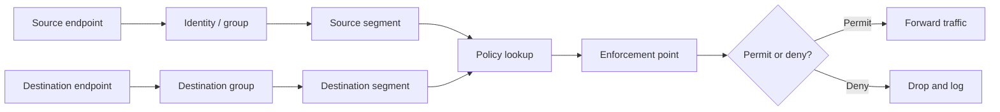
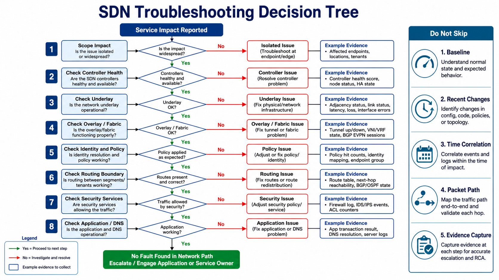
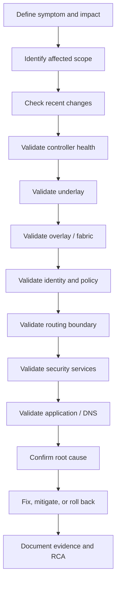
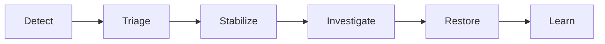

# Chapter 4 - SDN Operations, Monitoring, Assurance, and Troubleshooting

## 1. Chapter Positioning

Chapter 1 introduced SDN concepts and architecture. Chapter 2 defined SDN design. Chapter 3 explained how to implement and migrate SDN safely in brownfield environments.

Chapter 4 focuses on operations:

> How do we keep an SDN environment healthy, observable, secure, and supportable after deployment?

Operating SDN is different from operating a traditional device-by-device network. The operations team must understand not only interfaces, routing tables, and device logs, but also controllers, policy objects, identity systems, overlays, telemetry, assurance scores, task history, and cross-domain dependencies.

The goal of this chapter is to build an operational model that can detect issues early, isolate root cause quickly, validate service restoration, and feed lessons learned back into design and implementation.

## 2. Learning Objectives

After completing this chapter, participants should be able to:

- Build an SDN operations model that covers controller, underlay, overlay, policy, identity, security services, and application experience.
- Define monitoring requirements for SDN domains and brownfield integration boundaries.
- Explain the difference between monitoring, observability, and assurance.
- Interpret health scores, path traces, telemetry, flow records, and policy verification outputs.
- Troubleshoot SDN issues using a structured method across control plane, data plane, underlay, overlay, routing, identity, policy, security, and application layers.
- Create incident response and RCA workflows for SDN environments.
- Define operational dashboards, metrics, and handover requirements for production support.

## 3. SDN Operations Model

SDN operations must be service-oriented rather than only device-oriented. A device can be up while the service is broken. A controller can report a successful task while the data plane still forwards incorrectly. A policy can be deployed while the wrong endpoint identity causes the wrong rule to match.

### 3.1 Operational Domains

| Domain | What operations must watch | Typical evidence |
|---|---|---|
| Controller health | Cluster state, services, database, API, task engine, certificates, backups | Controller dashboard, service status, API health, audit logs |
| Underlay health | Physical links, routing adjacencies, MTU, latency, loss, errors | Interface counters, routing tables, BFD, IP SLA, streaming telemetry |
| Overlay/fabric health | Tunnels, endpoint mappings, VNIs, VRFs, fabric roles, path state | Fabric health, tunnel state, EVPN/LISP/control sessions, path trace |
| Identity and policy | Authentication, group mapping, policy deployment, enforcement | NAC logs, policy hit counters, contracts/ACLs/firewall logs |
| Security services | Firewalls, IDS/IPS, proxy, SASE/SSE, segmentation enforcement | Session table, deny logs, threat events, rule hit count |
| Application experience | User-to-app reachability, latency, transaction success, SaaS performance | Synthetic tests, APM, DNS logs, user experience scores |

### 3.2 Operations Workflow

Operations should not stop at fixing the symptom. A mature SDN operations team captures the evidence, updates the runbook, tunes monitoring, and identifies whether the issue came from design, implementation, configuration drift, or process gaps.

## 4. Operating SDN vs Traditional Networks

| Area | Traditional operations | SDN operations |
|---|---|---|
| Primary view | Device status and CLI output | Service, fabric, controller, policy, and path view |
| Change history | Change tickets and device configs | Change tickets, controller tasks, API calls, policy revisions |
| Troubleshooting | Hop-by-hop packet path | Hop-by-hop plus controller state, identity, policy, and overlay mapping |
| Segmentation evidence | VLAN, VRF, ACL, firewall | VN/VRF/VNI/group/EPG/contract/firewall/cloud policy |
| Monitoring | SNMP, syslog, NetFlow, CLI | Telemetry, events, flow records, API state, assurance correlation |
| Risk | Manual inconsistency | Centralized change with larger blast radius |

### 4.1 Practical Operating Principle

Do not trust a single source of truth during incident triage. Compare:

- Intended state from design, source of truth, or controller policy.
- Deployed state from controller task history.
- Device state from the forwarding infrastructure.
- Observed state from telemetry, flow logs, and packet tests.
- User experience from application transactions.

When these disagree, the gap is often the clue.

## 5. Monitoring, Observability, and Assurance

These terms are related but not identical.

| Concept | Meaning | SDN example |
|---|---|---|
| Monitoring | Collecting and alerting on known metrics and events | Controller node down, tunnel down, interface errors, firewall deny spike |
| Observability | Ability to understand system behavior from outputs | Correlating user, route, policy, tunnel, and application evidence |
| Assurance | Continuous validation that actual behavior matches intended behavior | Path trace confirms traffic follows intended service path and policy |

Monitoring tells you something happened. Observability helps explain why. Assurance checks whether the network is doing what it was designed to do.

## 6. SDN Telemetry and Assurance Pipeline

Telemetry must cover more than devices. A useful SDN telemetry pipeline collects evidence from infrastructure, controllers, identity platforms, firewalls, cloud, applications, and users.

### 6.1 Telemetry Sources

| Source | Data examples | Operational use |
|---|---|---|
| Devices | Interface counters, CPU, memory, routing state, tunnel state | Detect underlay/data-plane issues |
| Controllers | Task status, fabric health, inventory, policy deployment state | Detect control-plane and orchestration issues |
| Identity systems | Authentication logs, group assignment, posture, profiling | Validate endpoint classification |
| Firewalls/security | Sessions, denies, threat events, NAT, IPS logs | Validate enforcement and inspection |
| Cloud | Flow logs, route tables, security groups, load balancer logs | Validate hybrid/cloud paths |
| Applications | Transaction success, response time, errors | Prove service experience |
| Users/endpoints | Client health, DNS, DHCP, Wi-Fi/wired status | Correlate network with user impact |

### 6.2 Telemetry Methods

| Method | Strengths | Limitations |
|---|---|---|
| SNMP | Widely supported, useful for device metrics | Polling delay; limited context |
| Syslog | Good for events and faults | Unstructured unless normalized |
| NetFlow/IPFIX | Useful flow visibility and traffic patterns | Sampled or metadata-only; no payload |
| Streaming telemetry | Near real-time structured data | Requires collector and schema understanding |
| API polling | Controller-level inventory and task state | Rate limits and API version changes |
| Event streaming | Useful for task, policy, and state changes | Requires correlation with other data |
| Packet capture | High-fidelity evidence | Point-in-time and operationally expensive |

### 6.3 Assurance Outputs

Assurance platforms should produce outputs that operations can act on:

- Health score with contributing factors.
- Path trace with policy and service checkpoints.
- Root-cause candidates with evidence.
- Deviation from baseline.
- SLA/SLO status.
- Compliance evidence.
- Recommended next action.

### 6.4 Health Scores: Useful but Dangerous

Health scores are useful because they summarize complex telemetry. They are dangerous when treated as truth without evidence.

Use health scores to:

- Prioritize triage.
- Identify trends.
- Compare sites or fabrics.
- Detect early warning signs.

Do not use health scores as the only decision input. Always drill into:

- Which metric changed.
- Which domain produced the signal.
- Whether the issue maps to real user impact.
- Whether recent changes explain the score.
- Whether a hidden domain is outside the scoring model.

## 7. Operational Baselines

Troubleshooting is faster when normal behavior is known.

### 7.1 Baseline Categories

| Baseline | Examples |
|---|---|
| Controller | Normal CPU/memory, task duration, API latency, service status |
| Underlay | Normal link utilization, route count, latency, loss, MTU |
| Overlay | Tunnel count, fabric path state, endpoint count, VNI/VRF state |
| Policy | Normal denies, allowed flows, rule hit count, segment membership |
| Identity | Authentication success rate, RADIUS latency, failed posture checks |
| Security | Firewall sessions, IPS events, blocked destinations, NAT pool usage |
| Application | Transaction response time, DNS resolution, server reachability |

### 7.2 Baseline Use Case

If a branch reports poor application performance after migration, a baseline helps distinguish:

- Underlay transport loss.
- Overlay tunnel instability.
- Wrong application path selection.
- Firewall inspection delay.
- DNS resolution to a distant service.
- Application server slowness unrelated to SDN.

Without baseline data, the team may spend the incident proving facts that should already be known.

## 8. Controller Operations

The controller is an operational system, not only a deployment tool.

### 8.1 Controller Health Checklist

- Are all controller nodes reachable?
- Are cluster services healthy?
- Is database replication healthy?
- Are certificates valid?
- Is NTP synchronized?
- Are backups recent and restorable?
- Are API services responding normally?
- Are task queues processing?
- Are device control connections healthy?
- Are there failed tasks or stuck jobs?
- Are software versions in supported combinations?

### 8.2 Controller Security Controls

Controller and API security remain part of operations because compromise or misuse can change the network at scale.

Operational controls:

- Dedicated management access path.
- MFA for human administrators.
- RBAC with least privilege.
- Separate operator, administrator, auditor, and automation roles.
- Service accounts with scoped permissions.
- API token rotation and secure storage.
- Audit log forwarding to SIEM.
- Backup encryption and access control.
- Change approval for high-impact operations.

### 8.3 Controller Task Validation

A controller task can pass at the API layer and fail during device deployment. Operations should validate:

- API response status.
- Task status.
- Device deployment status.
- Actual device state.
- Data-plane behavior.
- User or application outcome.

## 9. Underlay and Overlay Operations

Always separate underlay from overlay during operations.

### 9.1 Underlay Checks

- Physical interface status.
- Link errors and drops.
- Routing adjacency state.
- Route table and next hop.
- ECMP path consistency.
- MTU and fragmentation behavior.
- Latency, loss, jitter.
- Firewall or ACL between tunnel endpoints.

### 9.2 Overlay/Fabric Checks

- Tunnel state.
- Fabric node role and registration.
- Endpoint mapping.
- Overlay route table.
- VNI/VRF/VN state.
- Control sessions.
- Encapsulation and decapsulation counters.
- Border node route exchange.
- Policy enforcement state.

### 9.3 Underlay vs Overlay Decision Flow

## 10. Identity and Policy Operations

Identity and policy issues often appear as network reachability issues.

### 10.1 Identity Symptoms

- User is placed in guest or quarantine unexpectedly.
- Device gets the wrong virtual network or security group.
- IoT device works in one building but not another.
- Wireless user roams and loses access.
- OT engineering workstation fails after reauthentication.

### 10.2 Identity Checks

- Authentication result.
- Authorization profile.
- Assigned VLAN, VN, SGT, EPG, group, or policy tag.
- RADIUS attributes.
- Certificate status.
- Endpoint profiling.
- Device posture.
- User directory group membership.
- Session timeout or reauthentication event.

### 10.3 Policy Troubleshooting Questions

- What is the exact source identity, segment, IP, and location?
- What is the exact destination identity, segment, IP, and application port?
- Which policy object should allow or deny the flow?
- Where is enforcement expected: edge, fabric, firewall, cloud, host, or SASE/SSE?
- Is the policy deployed to the relevant site/domain?
- Is the traffic matching the expected rule?
- Is another policy more specific?
- Is logging enabled at the enforcement point?
- Has any recent change modified group mapping or policy order?

### 10.4 Policy Flow

## 11. Routing Boundary and Security Service Operations

Chapter 3 covered implementation of brownfield boundaries. Chapter 4 focuses on operating them.

### 11.1 Boundary Health Checks

| Area | Operational check |
|---|---|
| Route exchange | Are neighbors up and expected prefixes exchanged? |
| Route filtering | Are denied prefixes still blocked? |
| Summarization | Are summaries stable and specific routes controlled? |
| Default route | Is the correct segment receiving the correct default? |
| Route leaking | Are only approved inter-segment routes present? |
| Symmetry | Does return traffic follow a valid stateful path? |
| Firewall inspection | Are sessions created and logs visible? |
| NAT | Are translations correct and pools healthy? |

### 11.2 Security Service Checks

- Firewall rule hit count.
- Session table.
- NAT translations.
- IPS/IDS events.
- Proxy or SSE/SASE policy logs.
- TLS inspection exceptions.
- Decryption or certificate errors.
- Failover state.
- Service latency.
- Deny spike after policy changes.

Security operations and network operations must share evidence. A fabric path trace without firewall logs is incomplete when the service path includes inspection.

## 12. SDN Troubleshooting Decision Tree

Troubleshooting SDN requires a repeatable decision tree. Jumping directly to a suspected controller or policy issue often wastes time.

### 12.1 General Troubleshooting Method

### 12.2 Do Not Skip

| Step | Why it matters |
|---|---|
| Baseline | Without normal-state data, teams confuse correlation with cause. |
| Recent changes | Most incidents follow a change in config, policy, code, topology, or external service. |
| Time correlation | Align controller logs, device logs, firewall logs, identity logs, and user reports. |
| Packet path | Confirm the real path, not the assumed path. |
| Evidence capture | Save outputs before they age out or are overwritten. |

## 13. Troubleshooting Scenarios

### 13.1 Scenario: User Cannot Reach Application

Symptoms:

- User in a campus fabric cannot access an ERP application in the data center.
- Other users may or may not be affected.

Investigation flow:

1. Identify user, endpoint, source IP, group, location, destination, application port, and time.
2. Check authentication and assigned segment.
3. Check campus fabric edge and path.
4. Check border node routing.
5. Check WAN/core path if involved.
6. Check data center route, endpoint group, and application segment.
7. Check firewall/session logs.
8. Check DNS result and application health.
9. Confirm return path.

Evidence to collect:

- Identity log.
- Endpoint group/segment assignment.
- Route table at border.
- Path trace.
- Firewall session or deny log.
- Application transaction result.

### 13.2 Scenario: Overlay Tunnel or Fabric Path Down

Symptoms:

- Site unreachable.
- Fabric path unavailable.
- Tunnel status down.
- Applications fail over or degrade.

Possible causes:

- Transport outage.
- Firewall blocking control or data ports.
- Certificate issue.
- Time synchronization issue.
- Device not authorized.
- NAT traversal issue.
- Controller unreachable.
- Incorrect template or profile.

Checks:

- Underlay reachability.
- DNS resolution if controller FQDN is used.
- NTP and certificate validity.
- Control connections.
- Firewall/NAT rules.
- Device onboarding state.
- Controller logs and task history.

### 13.3 Scenario: Policy Misconfiguration

Symptoms:

- A group that should be blocked is allowed.
- A group that should be allowed is blocked.
- The issue appears after a policy change.

Possible causes:

- Wrong source or destination group.
- Policy order issue.
- Missing contract or ACL.
- Incorrect firewall object.
- Policy deployed to wrong site.
- Incomplete multi-domain mapping.
- Cached session or stale endpoint state.

Response:

- Identify exact flow.
- Compare intended policy with deployed policy.
- Review recent changes.
- Check enforcement point logs.
- Roll back if business impact is high.
- Update policy documentation after correction.

### 13.4 Scenario: MTU and Encapsulation

Symptoms:

- Ping works but application fails.
- Small packets pass, large packets fail.
- File transfer hangs.
- Tunnel is up but performance is poor.

Cause:

Overlay encapsulation adds headers. If underlay MTU is too small, packets may fragment or be dropped.

Checks:

- Interface MTU.
- Tunnel overhead.
- DF-bit ping.
- Firewall handling of ICMP fragmentation-needed.
- Path MTU discovery.
- TCP MSS.

Remediation:

- Increase underlay MTU where possible.
- Adjust TCP MSS where appropriate.
- Allow required ICMP.
- Validate with application traffic, not only ping.

### 13.5 Scenario: Controller Task Succeeds but Service Fails

Symptoms:

- Controller reports policy or template deployment success.
- User traffic still fails.

Possible causes:

- Task succeeded at controller but not on all devices.
- Device has stale state.
- Wrong scope or site selected.
- Policy deployed but endpoint classified differently.
- Firewall or cloud policy still blocks traffic.
- Application dependency not included in policy.

Response:

- Check per-device deployment result.
- Compare intended object, deployed object, and device state.
- Validate endpoint classification.
- Confirm packet path and enforcement point.
- Check external security services.
- Update validation tests to catch this case in the future.

## 14. Incident Response and RCA

An SDN incident response workflow should stabilize service while preserving evidence.

### 14.1 Incident Workflow

### 14.2 SDN Incident Checklist

- Classify severity and business impact.
- Identify affected users, sites, devices, segments, applications, and time window.
- Freeze risky changes if the incident is active.
- Review recent controller tasks, policy changes, API calls, routing changes, and firewall changes.
- Collect controller, telemetry, device, identity, firewall, cloud, and application evidence.
- Decide whether mitigation, targeted fix, or rollback is appropriate.
- Validate restored service.
- Communicate status and closure.
- Document RCA and preventive actions.

### 14.3 RCA Structure

An RCA should be short, factual, and evidence-based.

| Section | Content |
|---|---|
| Summary | What happened in plain language. |
| Business impact | Users, sites, applications, duration, severity. |
| Timeline | Detection, escalation, mitigation, restoration, closure. |
| Detection method | Alert, user report, assurance system, ticket, synthetic test. |
| Root cause | Primary technical or process cause. |
| Contributing factors | Secondary conditions that made the incident possible or worse. |
| Resolution | What restored service. |
| Validation | Evidence that service was restored. |
| Preventive actions | Design, process, monitoring, automation, or training improvements. |
| Owner and due date | Accountability for each action. |

### 14.4 RCA Scenario

Summary:

- Guest internet access failed in three pilot branches after a centralized policy update.

Root cause:

- The guest segment was omitted from the policy scope applied to the branch group.

Contributing factors:

- Validation checked corporate user traffic only.
- The dashboard had no guest-specific synthetic test.

Resolution:

- Rolled back the policy, added the guest segment to the policy scope, validated internet access, and redeployed.

Prevention:

- Add segment coverage validation before policy changes.
- Add guest internet synthetic test to branch health dashboard.
- Update the policy deployment runbook.

## 15. Dashboard and Alert Design

Dashboards should be designed for roles, not just tool capabilities.

### 15.1 Network Operations Dashboard

- Controller health.
- Device reachability.
- Fabric/overlay status.
- Underlay health.
- Critical alarms.
- Route/tunnel status.
- Change task history.
- Site health.

### 15.2 Security Operations Dashboard

- Policy violations.
- Denied flows.
- Guest, IoT, and OT events.
- Admin actions.
- API calls.
- Firewall and IPS events.
- Quarantine events.
- Segmentation compliance.

### 15.3 Application Experience Dashboard

- Application reachability.
- Transaction success rate.
- Latency, loss, jitter.
- DNS resolution.
- Branch-to-app path.
- SaaS experience.
- User experience score.

### 15.4 Executive or Service Dashboard

- Service availability.
- Site health.
- SLA/SLO compliance.
- Major incidents.
- Risk indicators.
- Migration wave stability.

### 15.5 Alert Quality

Good alerts are actionable. Weak alerts create noise.

| Alert type | Weak version | Strong version |
|---|---|---|
| Controller | Controller warning | Controller node 2 API latency above threshold for 10 minutes; task queue growing |
| Tunnel | Tunnel down | Branch A primary tunnel down; traffic failed over to secondary with 15 ms latency increase |
| Policy | Deny count high | Corporate users denied to ERP TCP 443 after policy change ID 4821 |
| Identity | Auth failures | Building B 802.1X failures increased 40 percent after certificate renewal |
| Application | App slow | ERP transaction response time doubled for users behind border node B1 |

## 16. Operational Metrics

Metrics should support both service operation and continuous improvement.

| Metric | Why it matters |
|---|---|
| Controller availability | Indicates control system health. |
| Device onboarding success rate | Shows platform and process maturity. |
| Policy deployment success rate | Indicates change reliability. |
| Failed task count | Reveals controller, template, or process issues. |
| Tunnel/fabric adjacency stability | Indicates overlay health. |
| Route churn | Detects instability at boundaries. |
| Authentication success rate | Indicates identity platform health. |
| Policy exception count | Reveals policy design drift. |
| Mean time to detect | Measures monitoring effectiveness. |
| Mean time to restore | Measures operational response. |
| Incident recurrence | Shows whether RCA actions are effective. |
| User experience score | Connects network health with business impact. |

## 17. Operating by Domain

### 17.1 Data Center Fabric Operations

Operational focus:

- Controller/APIC or fabric controller health.
- Leaf/spine health.
- Endpoint learning.
- Tenant/VRF/EPG or EVPN/VXLAN state.
- External routing and L3Out or border connectivity.
- Contract/policy hits.
- Service insertion and firewall path.

Common issue patterns:

- Missing endpoint mapping.
- External route not advertised.
- Contract missing or too broad.
- Asymmetric service path.
- MTU issue across overlay.

### 17.2 Campus Fabric Operations

Operational focus:

- Fabric edge, border, and control node health.
- Wired/wireless endpoint onboarding.
- Identity integration.
- Virtual networks and group policy.
- DHCP, DNS, and default route behavior.
- Guest, IoT, and employee segmentation.

Common issue patterns:

- Endpoint assigned to wrong group.
- RADIUS timeout or certificate issue.
- Border route leak missing.
- Wireless and wired policy mismatch.
- Device profiling error.

### 17.3 WAN Overlay Operations

Operational focus:

- Controller/orchestrator health.
- Edge device control connections.
- Tunnel state.
- Transport SLA metrics.
- Application-aware routing policy.
- Site templates and configuration drift.
- Cloud/SASE/SSE on-ramp health.

Common issue patterns:

- Transport brownout.
- Tunnel down due to certificate or NAT issue.
- Application classified incorrectly.
- Direct internet access path missing security inspection.
- Route preference causes unexpected path.

### 17.4 Cloud and Multicloud Operations

Operational focus:

- Route tables and propagation.
- Security groups and cloud firewalls.
- Transit gateway/cloud WAN.
- Private endpoints.
- Flow logs.
- Infrastructure-as-code drift.
- Cloud identity and permissions.

Common issue patterns:

- Overlapping IP space.
- Security group blocks traffic.
- Route table associated with wrong subnet.
- Cloud route propagation delay.
- IaC drift from manual console changes.

### 17.5 IT/OT Operations

Operational focus:

- Zone and conduit policy.
- Passive monitoring.
- Industrial protocol visibility.
- Controlled remote access.
- Firewall allow lists.
- Historian and broker flows.
- Maintenance window discipline.

Common issue patterns:

- Unknown legacy dependency.
- Vendor access path bypasses policy.
- Strict enforcement breaks poorly documented flows.
- Monitoring tool generates unsafe active probes.
- IT change process does not align with OT production windows.

## 18. Operational Governance

SDN operations require clear governance because policy and controller changes can affect many devices and users.

### 18.1 Governance Controls

| Control | Operational purpose |
|---|---|
| RBAC | Limits who can view, change, approve, or audit. |
| Change approval | Reduces uncontrolled high-impact changes. |
| Audit logging | Provides accountability and RCA evidence. |
| Configuration backup | Enables recovery and comparison. |
| Policy review | Prevents broad or stale access. |
| Exception lifecycle | Ensures temporary access does not become permanent. |
| Drift detection | Identifies divergence between intended and actual state. |
| Runbook ownership | Keeps procedures current. |

### 18.2 Change Review Questions

- What domains are affected?
- What policies, routes, templates, or objects will change?
- What is the blast radius?
- What pre-checks and post-checks prove safety?
- What telemetry should be watched during the change?
- What is the rollback trigger?
- Who owns communication?
- How will the change be documented?

## 19. Practical Operations Scenarios

### 19.1 Scenario: Policy Drift After Emergency Change

Situation:

- During an outage, an engineer adds a broad firewall allow rule so an application can recover.
- The application works, but the temporary rule remains for weeks.

Operational response:

- Detect exception through policy review or drift report.
- Identify the original incident and business owner.
- Replace broad allow rule with least-privilege policy.
- Validate application flow.
- Set expiration date for any remaining exception.

Why it matters:

SDN makes policy easier to deploy, but also easier to forget unless exception lifecycle is managed.

### 19.2 Scenario: Authentication Latency Looks Like Network Slowness

Situation:

- Users report slow network access after connecting to wired ports.
- Once connected, application performance is normal.

Likely investigation:

- Check RADIUS response time.
- Check certificate validation.
- Check endpoint profiling.
- Compare access-switch logs with identity server logs.
- Validate whether delay occurs before IP connectivity.

Why it matters:

Not every user experience issue is a forwarding problem. Identity is part of the SDN service path.

### 19.3 Scenario: Health Score Green, Application Still Fails

Situation:

- Fabric health score is green.
- A specific application fails for one user group.

Likely investigation:

- Check whether health score includes the application flow.
- Validate policy matrix for the user group.
- Check firewall logs.
- Check DNS result.
- Run synthetic transaction.

Why it matters:

Health scores summarize platform health. They may not validate every business service.

## 20. Review Questions

1. What is the difference between monitoring, observability, and assurance?
2. Why should SDN operations compare intended, deployed, device, observed, and user-experience state?
3. What telemetry sources are required for end-to-end SDN operations?
4. Why are health scores useful but insufficient by themselves?
5. What should be checked before assuming an overlay problem is caused by the controller?
6. Why do identity issues often appear as network reachability issues?
7. What evidence is needed to troubleshoot a policy issue?
8. What operational checks are required at routing and security service boundaries?
9. What makes an alert actionable?
10. What should be included in an SDN RCA?
11. Which operational metrics indicate policy drift or process weakness?
12. Why is governance especially important in SDN operations?

## 21. Key Takeaways

- SDN operations must cover controller, underlay, overlay, identity, policy, security services, and application experience.
- Monitoring detects symptoms; observability explains behavior; assurance validates intent.
- Troubleshooting should follow a structured path from scope and recent changes through controller, underlay, overlay, identity, policy, routing, security, and application checks.
- Health scores are helpful entry points, not final evidence.
- Identity and policy are part of the network service path in SDN.
- Incident response should stabilize service while preserving evidence for RCA.
- Mature operations feed lessons learned back into design, implementation, automation, and governance.

## 22. References for Further Study

- Cisco, Catalyst Center product page: https://www.cisco.com/site/us/en/products/networking/dna-center-platform/index.html
- Cisco, Cisco Catalyst Center Assurance User Guide: https://www.cisco.com/c/en/us/support/cloud-systems-management/dna-center/products-user-guide-list.html
- Cisco, Nexus Dashboard product page: https://www.cisco.com/site/us/en/products/networking/data-center-networking/nexus-dashboard/index.html
- Cisco, Application Centric Infrastructure overview: https://www.cisco.com/site/us/en/products/networking/cloud-networking/application-centric-infrastructure/index.html
- Cisco, Identity Services Engine product page: https://www.cisco.com/site/us/en/products/security/identity-services-engine/index.html
- Cisco, Zero Trust overview: https://www.cisco.com/site/us/en/solutions/security/zero-trust/index.html
- Juniper, Mist AI documentation: https://www.juniper.net/documentation/product/us/en/mist/
- Juniper, Apstra documentation: https://www.juniper.net/documentation/product/us/en/apstra/
- Arista, CloudVision: https://www.arista.com/en/products/eos/eos-cloudvision
- OpenTelemetry project: https://opentelemetry.io/
