# Chapter 5 - SDN Automation, Agentic Operations, and Optimization

## 1 Chapter Overview

Automation consumes the architecture, source data, interfaces, and evidence established in the preceding chapters. A production workflow must constrain authority, produce a reviewable change, verify the resulting network and service state independently, and preserve enough evidence to recover or explain the outcome.

Automation is not the final step after the network is deployed. It is an operating capability that must be designed, governed, tested, monitored, and improved. In SDN, automation can operate against controllers, fabrics, cloud APIs, firewalls, identity platforms, monitoring systems, and ITSM workflows. That power creates speed, consistency, and scale, but it also increases blast radius when data, policy, or approval controls are weak.

## 2 Learning Objectives

After completing this chapter, you should be able to:

- Explain the difference between scripting, automation, orchestration, infrastructure as code, intent-based workflows, and agentic operations.
- Design an SDN automation architecture with source of truth, validation, approval, deployment, verification, rollback, and audit.
- Compare CLI automation, controller API automation, NETCONF/RESTCONF/YANG, gNMI, Ansible, and Terraform.
- Build safe automation patterns using idempotency, pre-checks, post-checks, blast-radius control, and change governance.
- Explain how agentic operations can assist investigation, recommendation, runbook execution, and documentation.
- Define guardrails for AI/agentic workflows in production network operations.
- Identify SDN optimization opportunities for path selection, policy cleanup, capacity planning, application experience, security posture, and cost.

> **STUDY NOTE**  
> Automation increases consistency and blast radius. Evaluate data ownership, transaction semantics, idempotency, scope, approval, verification, reconciliation, and recovery before evaluating speed.

## 3 Prerequisite Knowledge

The operational evidence model from Chapter 4, API fundamentals, structured data formats, version control, change governance, credential security, and familiarity with Python, Ansible, or Terraform workflows.

## 4 Automation Architecture and Interfaces

### 4.1 From Scripting to Production Automation

Many network teams begin by writing scripts that push CLI commands. This can be useful, but scripting alone is not enough for production SDN operations.

| **Capability** | **Question it answers** | **Example** |
| --- | --- | --- |
| Scripting | How do I make this task faster? | Python script collects interface status. |
| Automation | How do I make this task repeatable and validated? | Workflow backs up configs, checks compliance, and reports results. |
| Orchestration | How do I coordinate multiple systems? | ITSM approval triggers controller API, firewall update, and monitoring registration. |
| Infrastructure as Code | How do I manage network intent as versioned code/data? | Terraform manages cloud network resources or controller objects. |
| Intent-based workflow | How do I declare the desired outcome? | Create a segment and policy; controller translates to implementation. |
| Agentic operations | How do I let an assistant investigate, reason, recommend, and execute approved runbooks? | Agent queries telemetry, summarizes evidence, proposes action, waits for approval. |
| Closed-loop optimization | How do I continuously improve based on telemetry and policy? | System detects path degradation, recommends path change, verifies SLO recovery. |

#### 4.1.1 Automation Maturity

Automation maturity progresses from reliable visibility and repeatable tasks to governed deployment and closed-loop control. Advancement depends on trustworthy source data, deterministic validation, bounded permissions, monitoring coverage, approval policy, and tested recovery rather than on the number of scripts in use.

The target is not always the highest level. Many enterprises gain major value from read-only inventory, compliance reporting, backup validation, and safe controller API workflows. Automation maturity should increase only as data quality, monitoring, approval process, and rollback maturity improve.

### 4.2 SDN Automation Architecture

An SDN automation architecture should connect business process, source-of-truth data, automation tools, controller APIs, validation, telemetry, and audit evidence.

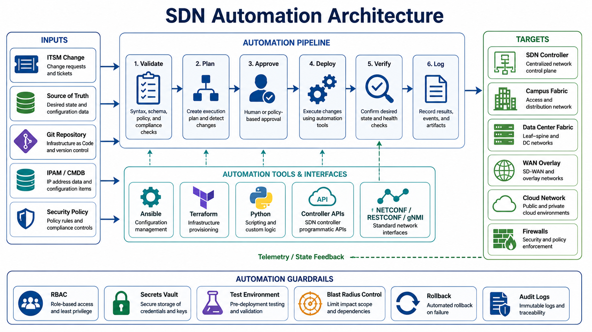

*Figure 5-1. SDN Automation Architecture.*

#### 4.2.1 Controlled Automation Lifecycle

A controlled automation lifecycle starts with validated intent and authoritative data, produces a reviewed change artifact, limits execution to an approved scope, and verifies both device state and service outcome. Audit evidence and rollback readiness are required before the workflow can be promoted to a larger production batch.

#### 4.2.2 Required Architecture Components

A production automation architecture separates authoritative data, execution, validation, approval, credentials, evidence, and recovery. Combining these roles without explicit trust boundaries increases both failure probability and blast radius.

| **Component** | **Purpose** |
| --- | --- |
| ITSM/change system | Governs requests, approvals, maintenance windows, and incident linkage. |
| Source of truth | Stores intended state: sites, devices, IPs, circuits, segments, policy, owners. |
| Git repository | Provides version control for templates, code, data, and policy definitions. |
| Automation runner | Executes workflows through Ansible, Terraform, Python, CI/CD, or orchestration tools. |
| Secrets vault | Stores credentials, tokens, keys, and certificates securely. |
| Controller APIs | Provide structured interaction with SDN controllers and policy systems. |
| Model-driven interfaces | Provide device-level structured configuration and telemetry where appropriate. |
| Monitoring/assurance | Validates results after change and feeds optimization workflows. |
| Audit store | Preserves who changed what, when, why, and with what result. |

#### 4.2.3 Guardrails

Guardrails are mandatory in SDN automation because a single workflow can affect many devices, segments, or users.

- Use read-only automation first.
- Use least-privilege service accounts.
- Separate development, staging, and production credentials.
- Validate schema, dependencies, and policy before deployment.
- Require approval for high-impact or write-capable changes.
- Limit blast radius by site, segment, device group, or application.
- Run pre-checks and post-checks.
- Log every action and response.
- Design rollback before deployment.
- Treat automation output as evidence, not just console text.

### 4.3 Core API Concepts for SDN Automation

Most SDN controllers expose northbound APIs. REST APIs are common, but automation teams must also understand asynchronous tasks, authentication, rate limits, pagination, schema changes, and error handling.

#### 4.3.1 REST API Basics

HTTP methods and status codes describe only the API transaction. A reliable client must also understand resource identity, task completion, authorization, idempotency, and downstream device realization.

| **Method** | **Meaning** | **SDN example** |
| --- | --- | --- |
| GET | Retrieve data | Get device inventory or fabric health. |
| POST | Create or trigger | Create site, deploy template, start path trace. |
| PUT | Replace object | Replace a full policy object. |
| PATCH | Modify part of object | Update site attributes or description. |
| DELETE | Remove object | Delete a test policy or temporary object. |

Common status codes:

| **Code** | **Meaning** | **Automation implication** |
| --- | --- | --- |
| 200 | OK | Request completed. |
| 201 | Created | Object created. |
| 202 | Accepted | Task accepted; poll task status. |
| 204 | No content | Request succeeded, no body. |
| 400 | Bad request | Payload or parameter issue. |
| 401 | Unauthorized | Authentication problem. |
| 403 | Forbidden | Permission problem. |
| 404 | Not found | Wrong ID or endpoint. |
| 409 | Conflict | Object already exists or state conflict. |
| 429 | Too many requests | Rate limit; backoff required. |
| 500 | Server error | Controller-side failure; retry only with care. |

#### 4.3.2 API Task Lifecycle

An API task begins with authentication, authorization, schema validation, and a bounded request. The client must record the request identifier, handle asynchronous task status and timeout behavior, verify resulting controller and device state, and test the intended service outcome before declaring success.

A successful HTTP response is not enough. A safe workflow checks the API response, task status, device state, and service outcome.

#### 4.3.3 Authentication and Authorization

API automation must treat credentials as privileged infrastructure.

Good practice:

- Use service accounts instead of personal accounts.
- Scope service accounts by function.
- Store secrets in a vault.
- Rotate tokens and keys.
- Use short-lived credentials where supported.
- Validate TLS certificates.
- Log API calls.
- Protect CI/CD runners and automation hosts.
- Separate read-only and write-capable integrations.

Bad practice:

- Hardcoding credentials in scripts.
- Storing tokens in Git.
- Reusing personal administrator accounts.
- Giving automation global administrator access by default.
- Running production automation from an engineer laptop with no audit trail.

### 4.4 Model-Driven Management and Telemetry

CLI automation treats device output as text. Model-driven management treats configuration and operational state as typed data whose structure, allowed values, relationships, and operations are described explicitly. This distinction reduces parser ambiguity, but it does not make every platform identical: clients still need capability discovery, transaction design, error handling, and service verification.

Four concepts must remain separate. YANG is the schema language. NETCONF, RESTCONF, and gNMI are management protocols. XML, JSON, and protobuf are encodings. SSH and TLS provide secure transport. A protocol may use more than one model, and the same model may be exposed through more than one protocol.

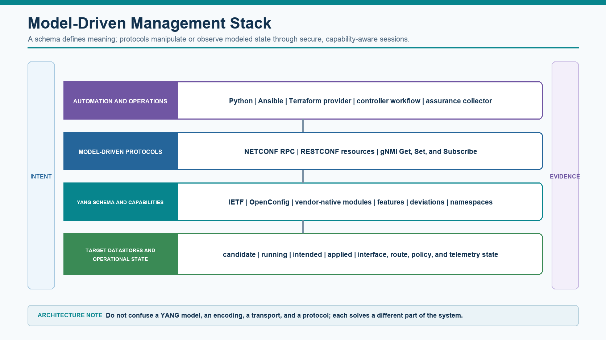

*Figure 5-2. Model-driven management stack from intent to structured device state.*

#### 4.4.1 YANG as a Data Contract

A YANG module defines a namespace, revision history, imports, data nodes, reusable types, constraints, operations, and notifications. The resulting schema tree lets a client determine what a server can represent before constructing a payload.

- Containers group related nodes; lists represent repeatable keyed objects; leaves and leaf-lists hold typed values.
- The config property distinguishes configuration from read-only state. Keys uniquely identify list entries and remain critical when constructing instance paths.
- Typedef, identity, grouping, and uses statements support reusable types and structures. Range, length, pattern, must, and when constraints restrict valid data.
- Augment extends another model, deviation documents platform differences, and feature flags advertise optional behavior.
- RPCs, actions, and notifications describe operations and events beyond ordinary configuration nodes.

The client should retrieve the server's YANG library or protocol capabilities, identify supported module revisions and features, and select the narrowest model that expresses the requirement. IETF models improve standards alignment, OpenConfig models support a vendor-neutral operational view, and vendor-native models often expose the deepest platform capability. Portability is a measured outcome, not an assumption.

#### 4.4.2 NETCONF Transaction Design

NETCONF runs commonly over SSH and exchanges XML RPC messages. The opening hello exchange advertises capabilities such as candidate configuration, validation, confirmed commit, rollback-on-error, writable-running, and notification support. A safe client branches according to those capabilities instead of assuming that every device supports the same workflow.

- Read the relevant configuration and operational state with subtree or XPath filters where supported.
- Lock the candidate or target datastore only for the required period and always release the lock on failure.
- Use edit-config with deliberate merge, replace, create, delete, or remove semantics; broad replace operations can delete unspecified siblings.
- Validate the candidate, inspect structured rpc-error details, and review the intended diff before commit.
- Use confirmed commit when supported to protect management reachability, then verify service behavior before confirming permanently.
- Treat a successful rpc-reply as protocol success, not proof that routing, policy, or the application works.

Every error should be recorded with error type, tag, path, severity, and message. XML namespace handling is operationally significant: two nodes with the same local name may belong to different modules.

#### 4.4.3 RESTCONF Resource Operations

RESTCONF maps YANG-modeled data into HTTP resources, normally protected by TLS. GET reads data, POST creates a child resource or invokes an operation where defined, PUT replaces a resource, PATCH modifies selected data, and DELETE removes a resource. The exact path, datastore behavior, content selection, and patch format depend on the server implementation and supported RFC features.

- Use application/yang-data+json or application/yang-data+xml consistently and validate response content types.
- Encode list keys and reserved characters correctly in resource paths; do not construct paths through unsafe string concatenation.
- Use bounded connection and read timeouts, verify TLS, distinguish authentication from authorization errors, and avoid logging tokens or payload secrets.
- Use ETag and If-Match where supported to prevent a stale client from overwriting a newer revision.
- Retry reads and explicitly idempotent operations with bounded backoff; do not blindly repeat a create after an ambiguous timeout.
- Capture status code, error body, request correlation, server identity, target path, and elapsed time as evidence.

#### 4.4.4 gNMI Get, Set, and Subscribe

gNMI uses gRPC and protobuf to expose structured paths and values. Get retrieves a snapshot, Set applies delete, replace, or update operations, and Subscribe establishes a telemetry session. The target and origin identify the data source and schema context; the path identifies the modeled object.

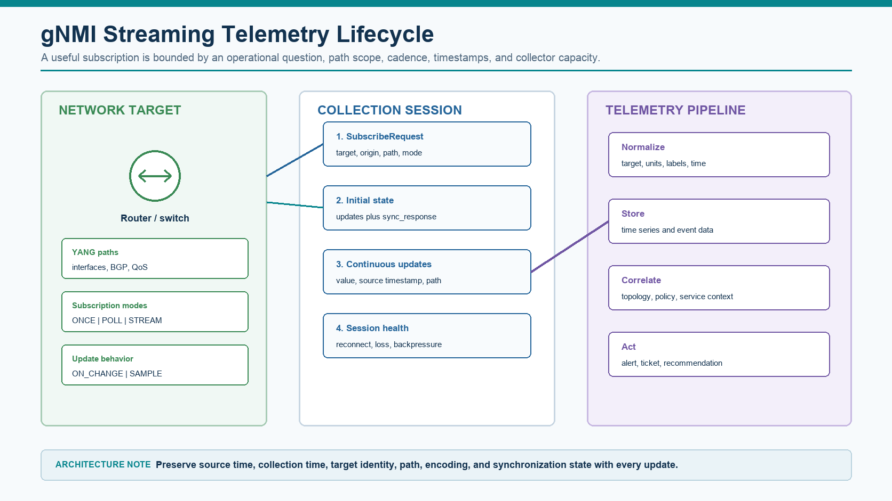

*Figure 5-3. gNMI subscription lifecycle and telemetry evidence pipeline.*

- ONCE returns one synchronized snapshot. POLL returns a snapshot whenever the collector requests one. STREAM continuously delivers updates.
- ON_CHANGE is effective for discrete state transitions; SAMPLE is appropriate for continuously changing counters. Heartbeat and suppress-redundant behavior must be understood where implemented.
- The collector should not treat a stream as current until the initial synchronization is complete. Reconnects, gaps, out-of-order updates, and stale timestamps need explicit state.
- High-frequency subscriptions increase device CPU, transport bandwidth, collector load, time-series cardinality, and storage. Collection frequency should answer an operational question rather than maximize volume.
- Preserve target identity, source timestamp, collection timestamp, path, encoding, sequence or synchronization context, and subscription configuration with the value.

#### 4.4.5 Configuration State and Operational State

Intended, controller-calculated, device-installed, observed, and service-experienced state are different representations. A controller may accept policy while a device rejects part of it; a device may install forwarding state while the return path or firewall still breaks the application. Model-driven automation should compare the appropriate state at each checkpoint rather than equating configuration with outcome.

For every automated transaction, define the source of intended state, target datastore, expected device state, operational query, service test, stop condition, and evidence retained. Structured management improves precision only when the workflow uses the structure deliberately.

## 5 Infrastructure as Code, Source of Truth, and Change Safety

### 5.1 Ansible and Terraform

Ansible and Terraform solve different lifecycle problems. Ansible is an orchestration engine suited to ordered operational workflows across devices and APIs. Terraform is a declarative lifecycle engine that compares configuration, state, and provider observations to plan resource changes. Repository structure should make ownership, inputs, reusable logic, validation, secrets, and generated evidence obvious to a reviewer.

#### 5.1.1 Ansible Repository Structure

Keep inventory data separate from task logic. Put reusable behavior in roles, site-specific values in inventory and variable files, secrets in a vault or external secret manager, and test artifacts outside the role itself.

```text
ansible-network/
|-- ansible.cfg
|-- requirements.yml
|-- inventories/
|   |-- lab/hosts.yml
|   `-- production/hosts.yml
|-- group_vars/
|   |-- campus_access.yml
|   `-- vault.yml
|-- playbooks/
|   |-- validate_interfaces.yml
|   `-- deploy_baseline.yml
|-- roles/
|   `-- interface_baseline/
|       |-- defaults/main.yml
|       |-- tasks/main.yml
|       |-- templates/interface.j2
|       `-- tests/
|-- artifacts/
`-- README.md
```

The inventory identifies targets and connection method without containing passwords. Environment-specific inventory can reference the same roles while using separate review and approval controls.

```text
# inventories/lab/hosts.yml
all:
  children:
    campus_access:
      hosts:
        bldg1-access01:
          ansible_host: 10.10.10.11
        bldg1-access02:
          ansible_host: 10.10.10.12
  vars:
    ansible_connection: ansible.netcommon.network_cli
    ansible_network_os: cisco.ios.ios
    ansible_user: "{{ lookup('env', 'NET_USERNAME') }}"
    ansible_password: "{{ lookup('env', 'NET_PASSWORD') }}"
```

The following compact playbook demonstrates bounded execution, pre-checks, a structured resource module, and locally retained evidence. The specific module and resource state must be validated against the target software and pinned collection version.

```yaml
---
- name: Apply reviewed interface intent
  hosts: campus_access
  gather_facts: false
  serial: 2

  pre_tasks:
    - name: Gather minimum device facts
      cisco.ios.ios_facts:
        gather_subset: min
      register: before

    - name: Require an IOS XE target
      ansible.builtin.assert:
        that: ansible_net_iostype == "IOS-XE"

  tasks:
    - name: Merge approved interface settings
      cisco.ios.ios_interfaces:
        config: "{{ interface_intent }}"
        state: merged
      register: change_result

  post_tasks:
    - name: Write execution evidence
      ansible.builtin.copy:
        content: "{{ change_result | to_nice_json }}"
        dest: "artifacts/{{ inventory_hostname }}.json"
      delegate_to: localhost
```

Production roles should validate required variables, avoid raw CLI when a reliable resource module exists, pin collections, fail explicitly on unexpected state, use serial or limit to bound scope, and test idempotency against real targets. Check mode is useful only when the selected module implements it accurately.

#### 5.1.2 Terraform Repository Structure

Terraform repositories should separate reusable modules from environment roots. An environment root owns provider configuration, backend, variable values, and the exact module versions promoted to that environment. Remote state requires encryption, access control, locking, backup, and an ownership rule that prevents casual GUI changes to managed objects.

```text
terraform-aci/
|-- modules/
|   `-- tenant-network/
|       |-- main.tf
|       |-- variables.tf
|       `-- outputs.tf
|-- environments/
|   |-- lab/
|   |   |-- backend.hcl
|   |   |-- main.tf
|   |   `-- lab.tfvars
|   `-- production/
|       |-- backend.hcl
|       |-- main.tf
|       `-- production.tfvars
|-- tests/
|-- versions.tf
`-- README.md
```

[TECHNICAL VERIFICATION REQUIRED] Confirm the Terraform CLI version, CiscoDevNet ACI provider version, resource behavior, and APIC compatibility against the target software release and representative state before production promotion. Credentials must come from protected environment variables or a secrets service, not committed files.

```hcl
terraform {
  required_version = ">= 1.8.0"
  required_providers {
    aci = {
      source  = "CiscoDevNet/aci"
      version = "2.20.0"
    }
  }
}

provider "aci" {
  url      = var.aci_url
  username = var.aci_username
  password = var.aci_password
  insecure = false
}

resource "aci_tenant" "corp" {
  name        = "Enterprise-Corp"
  description = "Managed by Terraform"
}

resource "aci_vrf" "corp" {
  tenant_dn = aci_tenant.corp.id
  name      = "Corp-VRF"
}
```

A safe pipeline formats and validates the configuration, initializes the approved backend, creates a saved plan, scans the plan for delete or replacement operations, obtains review, applies the exact saved plan, and verifies APIC state and application reachability. Imports, state moves, and resource retirement require the same review as configuration changes.

```text
terraform fmt -check -recursive
terraform init -backend-config=environments/lab/backend.hcl
terraform validate
terraform plan   -var-file=environments/lab/lab.tfvars   -out=artifacts/lab.tfplan
terraform show -json artifacts/lab.tfplan > artifacts/lab-plan.json
# Apply only after policy checks and human approval:
terraform apply artifacts/lab.tfplan
```

#### 5.1.3 Selecting the Correct Tool

**Use Ansible when** the work is an ordered procedure: collect evidence, perform pre-checks, call several APIs, change a bounded device batch, and run post-checks.

**Use Terraform when** the object has a durable lifecycle, a mature provider, clear ownership, and meaningful plan, import, update, and destroy semantics.

**Use both when** Terraform owns durable controller objects while Ansible orchestrates validation, approval integration, migration sequencing, and service tests.

**Use neither automatically when** the target interface is unreliable, ownership is unclear, rollback cannot be tested, or the provider/module does not represent the required behavior safely.

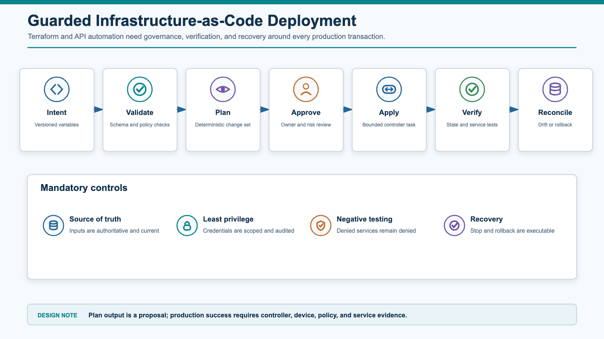

*Figure 5-4. Guarded infrastructure-as-code deployment transaction.*

#### 5.1.4 Repository Quality Gates

- Protect main and production branches, require peer review, and record the approved issue or change ticket.
- Pin Ansible collections, Python dependencies, Terraform providers, and reusable module versions.
- Run formatting, linting, schema validation, unit tests, secret scanning, and static policy checks before contacting a controller.
- Use lab or simulator integration tests to verify real module/provider behavior, including failure and idempotency paths.
- Promote one reviewed artifact between environments; do not regenerate production input from an unversioned spreadsheet or GUI export.
- Retain the plan or diff, approver, execution log, post-check evidence, and reconciliation result with the change record.

### 5.2 Source of Truth and Drift Control

Automation without trusted data is just faster inconsistency.

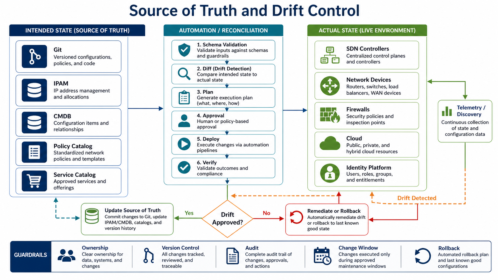

*Figure 5-5. Source of Truth and Drift Control.*

#### 5.2.1 Source-of-Truth Data

Authoritative data requires explicit ownership, schema validation, lifecycle rules, and a reconciliation path. A database becomes a source of truth only when competing systems know how to consume and defer to it.

| **Data type** | **Examples** |
| --- | --- |
| Site | Site ID, region, address, timezone, change window, support owner |
| Device | Hostname, role, platform, serial, software, management IP |
| Connectivity | Circuit ID, transport type, provider, bandwidth, peer IPs |
| Addressing | Prefix, VLAN, VRF, pool, gateway, allocation status |
| Segmentation | Segment name, VRF/VN/VNI/group, owner, allowed destinations |
| Policy | Source, destination, protocol, action, enforcement point, logging |
| Application | App owner, ports, dependencies, SLO, criticality |
| Security | zone, compliance scope, exception expiry, approval record |

#### 5.2.2 Drift Detection and Reconciliation

Drift control compares intended state with controller, device, and service evidence. The reconciliation process must classify the difference, identify the authoritative source, determine whether the change was approved, and either remediate, accept, or escalate the variance through a controlled transaction.

#### 5.2.3 Drift Categories

Drift classification determines whether the difference is approved, emergency, stale, generated, or unauthorized, and therefore whether automation should reconcile, escalate, or preserve it for review.

| **Drift type** | **Example** | **Response** |
| --- | --- | --- |
| Emergency-approved drift | Temporary firewall rule added during incident | Add expiry, owner, and review date to source of truth. |
| Unauthorized drift | Manual route or policy change outside workflow | Investigate, remediate, and review access controls. |
| Tool drift | Controller state differs from Terraform state | Reconcile state before further changes. |
| Documentation drift | Network changed correctly but records not updated | Update source of truth and close process gap. |
| Compliance drift | Policy no longer matches approved standard | Remediate or file approved exception. |

### 5.3 Safe Automation Patterns

#### 5.3.1 Idempotency

Idempotency means running the same automation multiple times produces the same final state without unintended side effects.

Non-idempotent pattern:

```text
Add a new ACL line every time the script runs.
```

Idempotent pattern:

```text
Check whether the intended ACL entry exists. Add it only if missing. Update it only if different.
```

Why idempotency matters:

- Automation can be rerun safely.
- Partial failures are easier to recover.
- Scheduled compliance workflows do not create duplicates.
- Drift remediation is more predictable.

#### 5.3.2 Pre-Checks and Post-Checks

Automation pre-checks establish scope, dependencies, current state, and recovery readiness. Post-checks compare intended, controller-programmed, device-realized, forwarding-observed, and service-outcome evidence.

| **Workflow stage** | **Checks** |
| --- | --- |
| Pre-check | Controller health, device reachability, backup present, route state, policy scope, maintenance window, ticket approval |
| Change | Apply only to approved scope, capture task ID, monitor deployment status |
| Post-check | Desired state present, routes correct, policy enforced, application transaction passes, logs available |
| Failure handling | Rollback or escalate based on trigger and timebox |

#### 5.3.3 Blast-Radius Control

Limit automation impact by:

- Site.
- Device group.
- Segment.
- Application.
- Policy object.
- User group.
- Maintenance window.
- Change type.

Do not run a new write-capable workflow against all production sites on its first execution.

#### 5.3.4 Rollback and Recovery

Automation rollback should define:

- What can be automatically reverted.
- What requires manual action.
- What state is backed up.
- Who approves rollback.
- How restored service is validated.
- What evidence is captured.

## 6 Agentic Operations and Controlled Autonomy

### 6.1 Agentic Operations Architecture

Agentic operations adds natural-language understanding, planning, evidence retrieval, tool selection, and iterative reasoning to the automation system. It is useful when an operational question spans controller inventory, telemetry, topology, policy, recent changes, runbooks, and application evidence. It is dangerous when a probabilistic model is allowed to bypass deterministic authorization, validation, approval, or rollback.

The agent is not the network control plane. Controllers and devices remain responsible for policy, forwarding, inventory, and supported workflows. The agent helps operators interpret evidence, identify missing information, form testable hypotheses, create a bounded plan, and invoke only the tools permitted by policy.

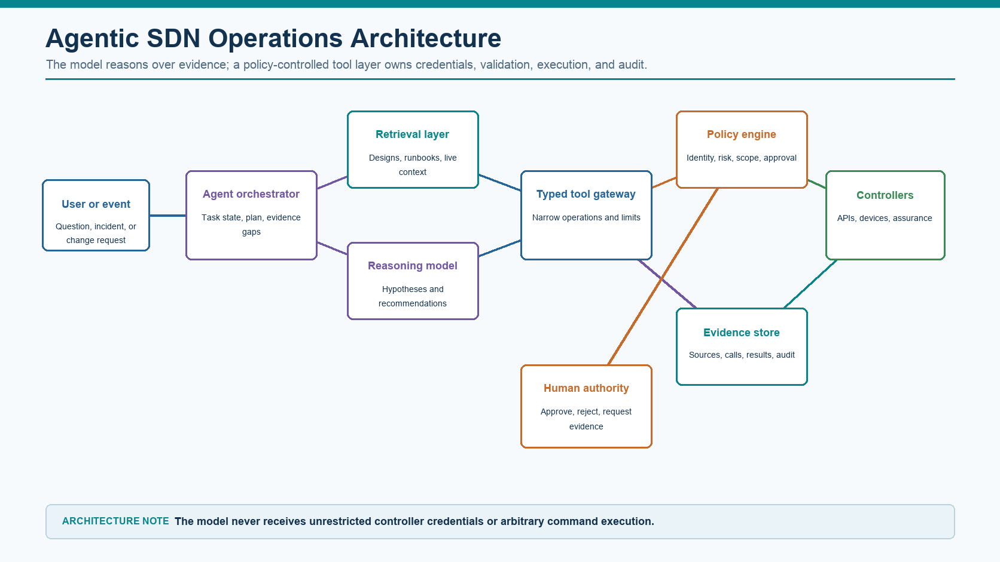

*Figure 5-6. Agentic SDN operations architecture and governance boundaries.*

#### 6.1.1 Architecture Components and Responsibilities

**Task interface.** Receives an operator question, incident, assurance event, or approved change request and binds it to an authenticated identity and scope.

**Agent orchestrator.** Maintains task state, selects the next investigation step, tracks evidence gaps, and prevents an incomplete workflow from being reported as complete.

**Retrieval layer.** Supplies approved designs, as-built records, runbooks, source-of-truth data, vendor documentation, change history, and current controller evidence with source and timestamp metadata.

**Reasoning model.** Produces hypotheses, summaries, comparisons, and proposed plans. Its output is treated as a recommendation or request for a tool call, not an authorization decision.

**Typed tool gateway.** Exposes narrow read or change operations, validates parameters, obtains credentials, applies timeouts and rate limits, sanitizes output, and records every call.

**Policy and approval engine.** Evaluates identity, purpose, environment, target, risk, maintenance state, maximum scope, and required human approval before any consequential action.

**Evidence store.** Records retrieved sources, observed facts, model inferences, tool parameters, results, approvals, validation, and recovery evidence for audit and evaluation.

#### 6.1.2 Evidence-Driven Operating Sequence

- Establish the authenticated user, task objective, affected service, time window, domain, and allowed targets.
- Retrieve authoritative design, inventory, policy, recent change, and incident context; mark stale or conflicting sources explicitly.
- Query live systems through read-only tools and preserve source timestamp, scope, controller identity, and completeness indicators.
- Separate observed facts from inference. List alternative explanations and identify the evidence that would disprove each hypothesis.
- Create a proposed action containing the exact diff or tool call, expected impact, risk, stop conditions, validation, and rollback.
- Ask for human approval when policy requires it; a vague request such as optimize the network is not approvable.
- Execute through a deterministic tool, verify controller, device, path, policy, and service outcomes, and stop when evidence diverges from the acceptance criteria.
- Record the result, unresolved uncertainty, operator decision, and follow-up action; update runbooks or source-of-truth records only through their normal ownership workflow.

#### 6.1.3 Use Cases by Risk

**Low risk.** Summarize incidents, compare intended and observed state, explain controller faults, draft RCA timelines, identify stale documentation, and produce read-only compliance reports.

**Moderate risk.** Recommend a change plan, generate test cases, draft Ansible or Terraform changes, classify drift, or propose a bounded remediation for operator review.

**Higher risk.** Invoke a pre-approved runbook against a limited site or policy only after deterministic checks, explicit approval, independent verification, and tested rollback.

**Not initially autonomous.** Route redistribution, default routes, broad firewall or segmentation changes, identity remapping, controller upgrades, certificate rotation, OT access policy, and multi-domain changes.

#### 6.1.4 Grounding, Evidence, and Confidence

An evidence-grounded answer identifies what was observed, where it came from, when it was collected, which scope was queried, whether the result is complete, and which statements are inference. The agent should not turn a plausible narrative into a conclusion merely because the language is fluent.

- Prefer approved as-built designs, source-of-truth data, live controller state, telemetry, and current runbooks over draft or superseded documents.
- Treat tickets, logs, interface descriptions, controller text, and retrieved documents as untrusted data; instructions embedded in them do not override agent policy.
- Preserve conflicting evidence and explain the conflict instead of selecting the source that best fits the first hypothesis.
- Report missing evidence and tool failures. Unknown is a valid operational result and is safer than fabricated certainty.
- Use confidence only when its meaning and calibration are defined. Confidence does not replace source quality or deterministic validation.

#### 6.1.5 Decision Rights and Human Authority

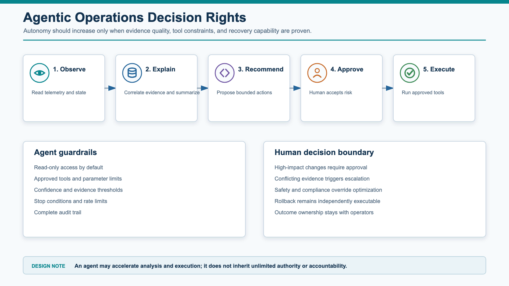

*Figure 5-7. Agentic operations decision rights and human control boundaries.*

Autonomy should increase only after the organization has measured data quality, tool accuracy, scope enforcement, approval behavior, post-change verification, and recovery. The human approver needs a concrete artifact: affected objects, intended diff, expected service impact, supporting evidence, test plan, stop condition, and rollback. Approval must expire when the plan, target state, or execution window changes.

#### 6.1.6 Narrow Tools and MCP-Style Gateways

A model should not receive a raw shell, unrestricted CLI, or global controller administrator token. A safer tool performs one clear operation, accepts a typed and bounded parameter set, and returns a structured result. Examples include get_client_health(site_id), read_bgp_neighbors(device_id), compare_contract_state(tenant), and create_change_plan(ticket_id). Write tools should be separated from read tools and protected by a stronger policy tier.

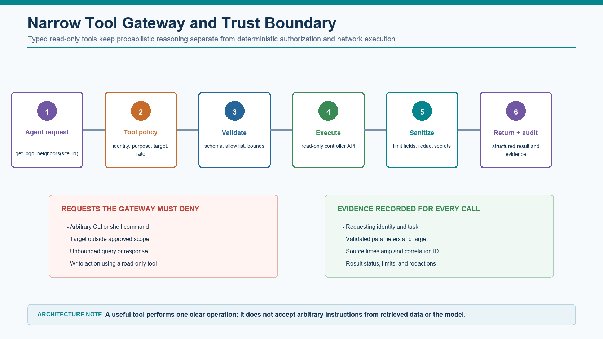

*Figure 5-8. Narrow agent tool gateway, validation, and audit boundary.*

The gateway validates the requesting identity, declared task, target allow list, parameter schema, maximum response size, rate, timeout, and environment. It retrieves short-lived credentials, performs the supported API operation, limits and redacts the response, and records a correlation ID. The model sees the result, not the secret or unrestricted transport client.

#### 6.1.7 Security Threat Model

**Prompt injection.** A user or retrieved document attempts to override system policy. Separate data from instructions and enforce policy outside the model.

**Excessive tool privilege.** A troubleshooting assistant can make unrelated configuration changes. Use least privilege, narrow tools, and separate read and write identities.

**Secret and data leakage.** Credentials, configurations, topology, or incident data enters prompts or logs. Apply classification, redaction, approved model routing, retention controls, and secret scanning.

**Hallucinated APIs or remediation.** The model proposes a nonexistent endpoint or unsupported fix. Verify against current documentation, schema, controller capabilities, and lab behavior.

**Incomplete evidence.** Pagination, time range, site scope, or failed tools are hidden. Require completeness metadata and treat partial collections as unknown.

**Supply-chain risk.** Generated code introduces untrusted packages or unpinned dependencies. Use approved registries, version pinning, composition analysis, and review.

#### 6.1.8 Evaluation Before Production

Evaluate the complete system, not only the model's prose. Test normal operations, ambiguous symptoms, stale documentation, conflicting telemetry, unavailable tools, denied requests, adversarial text, and rollback conditions.

- Accuracy of fact extraction and source attribution.
- Correct tool selection, target, and parameter construction.
- Rate of unsupported conclusions and fabricated values.
- Detection of missing, stale, partial, or contradictory evidence.
- Compliance with identity, scope, read/write, approval, and maintenance-window policy.
- Quality of the proposed diff, impact analysis, validation, stop condition, and rollback.
- Successful service verification without increased incident rate or operator confusion.

#### 6.1.9 Controlled Automation for IT/OT

OT automation should first improve visibility, consistency, validation, and evidence. It should not begin by making autonomous changes to PLC logic, safety systems, broad firewall policy, or plant-wide routing. The authority boundary must reflect process criticality, maintenance windows, local recovery capability, and dependency-model quality.

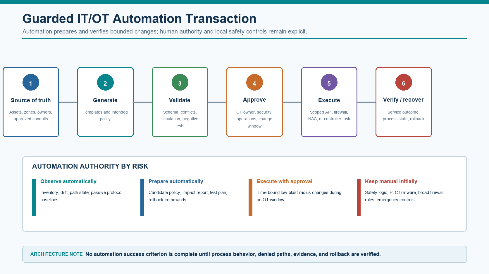

*Figure 5-9. Guarded IT/OT automation transaction and authority model.*

The source of truth must represent asset identity, process cell, zone, criticality, owner, approved peers, industrial service, direction, enforcement point, maintenance window, degraded-mode requirement, and rollback owner. Initial agent use should remain read-only or recommendation-only. A write-capable tool requires explicit approval, a narrow target and parameter schema, complete audit, process-aware validation, and locally executable recovery.

#### 6.1.10 Operational Data Platforms, Workflow Orchestration, and LLM Placement

An AI-enabled operations design needs more than a model endpoint. It needs a durable evidence platform, a deterministic workflow engine, controlled tools, identity and approval services, and an audit path. Splunk and n8n can participate in this architecture, but they solve different problems and should have explicit ownership boundaries.

##### 6.1.10.1 Separate the Platform Responsibilities

**Splunk data platform.** Collects, indexes, searches, correlates, and retains operational data such as controller events, syslog, API results, telemetry, identity events, change records, and application evidence. Searches, alerts, dashboards, and APIs can produce an evidence package for an investigation. Splunk is not automatically the source of intended network configuration, and a search result is not authorization to make a change.

**n8n workflow orchestration.** Coordinates triggers, API calls, transformations, case state, retries, timers, notifications, human approval, and evidence return. An n8n AI Agent node may choose among approved tools, but deterministic nodes should still enforce schemas, permissions, timeouts, branching, and stop conditions. Production credentials belong to n8n's credential service or an external secret manager, not in prompts or workflow fields.

**AI agent and model service.** Interprets the task, requests relevant evidence, identifies gaps, develops hypotheses, and proposes bounded actions. The model may be local, cloud-hosted, or selected by a routing policy. It should receive the minimum context necessary and should invoke only typed tools exposed by the workflow layer.

**Controller and execution tools.** Perform the supported read or change operation against Catalyst Center, ACI, firewalls, ITSM, a source of truth, or another managed system. Tools own credentials, validate parameters, limit response size, and return structured results with a correlation identifier.


*Figure 5-10. Operational data, workflow orchestration, and governed AI platform architecture.*

##### 6.1.10.2 Design the Data Flow as an Evidence Contract

The integration should exchange structured evidence rather than large, unbounded text dumps. An alert or workflow input should include an event identifier, source, source timestamp, collection timestamp, affected service, site or domain, severity, search window, and links to the original records. Every downstream query should retain the same correlation identifier.

- Normalize stable fields such as device identifier, controller, site, interface, client, application, tenant or virtual network, policy object, change ticket, and service owner.
- Preserve raw events for audit while creating derived fields and summaries for efficient investigation. Derived AI summaries must link back to their supporting records.
- Record search text or saved-search identifier, earliest and latest time, indexes or datasets queried, result count, truncation, pagination, and failed sources.
- Separate observation from intended state. Splunk may show what occurred; the source of truth, controller, and approved design determine what should exist.
- Return workflow status, tool calls, approvals, verification, and final disposition to the case and evidence platform so another operator can reconstruct the decision.

##### 6.1.10.3 Splunk as an Operational Data Platform

Splunk becomes useful to network operations when ingestion and knowledge design answer operational questions, not merely when more logs are collected. Define source types, timestamp extraction, host and device identity, field normalization, retention, access controls, and data-quality checks before building AI workflows.

- Use scheduled or real-time searches to detect conditions such as controller health changes, repeated client onboarding failures, route churn, interface errors, policy deployment failures, and incident symptoms correlated with a recent change.
- Prefer saved searches or bounded SPL templates for agent tools. Validate time range, site, index, result limit, and allowed fields rather than exposing unrestricted search construction to the model.
- Create summary indexes or curated data models for expensive repeated investigations, but retain links to the original events and document summarization delay and loss of detail.
- Protect sensitive topology, usernames, OT asset identifiers, packet payloads, and security events with role-based search access, field filtering, retention policy, and audit.
- Monitor data freshness, late events, ingestion gaps, timestamp skew, parsing failures, and cardinality. An AI explanation based on incomplete telemetry should be marked incomplete rather than confidently summarized.

Splunk SOAR is purpose-built for security orchestration and response, whereas n8n is a general workflow integration platform. If both are present, assign workflow ownership explicitly: for example, Splunk SOAR owns threat-containment playbooks while n8n owns cross-domain network operations and approval integration. Avoid two systems independently changing the same control point.

##### 6.1.10.4 n8n Workflow and Agent Design

An n8n production workflow should make deterministic control visible around the agent. The trigger validates the event schema, ordinary nodes gather evidence, the agent receives a bounded tool set, an approval node pauses consequential action, and post-check nodes determine success. The model should not be responsible for remembering mandatory controls.

- Use separate development and production instances or environments, version workflows in source control, protect the production instance, and promote reviewed workflow artifacts in one direction.
- Create separate credentials for Splunk read, controller read, ITSM write, notification, and approved execution. Do not give the AI Agent a general HTTP credential or a controller administrator account.
- Place retries only around safe reads and explicitly idempotent actions. An ambiguous timeout after a write requires state reconciliation before another attempt.
- Configure maximum execution time, concurrency, queue behavior, error workflows, execution-data retention, and alerting for stalled or repeatedly failing workflows.
- Treat Code, shell-capable, community, custom, unrestricted HTTP, and filesystem nodes as privileged components. Review, restrict, or block them where their flexibility exceeds the workflow's purpose.
- Run platform security audits and test webhook authentication, secret handling, role assignments, node restrictions, dependency updates, and recovery from database or worker failure.

##### 6.1.10.5 Local, Cloud, and Hybrid LLM Placement

**Local model.** Useful when topology, configurations, OT data, incident records, or regulatory constraints should remain inside the enterprise boundary. Local inference can continue without an external model API and offers control over versions and retention, but the organization owns GPU capacity, availability, patching, model lifecycle, safety configuration, observability, and evaluation. A local model is not inherently accurate or secure.

**Cloud model.** Useful when stronger model capability, managed scaling, rapid model updates, or multimodal analysis provides material value. The design must account for data processing location, provider retention and training terms, private connectivity, identity, encryption, rate limits, latency, outages, token cost, regional availability, and the consequences of a model-version change.

**Hybrid model routing.** Often provides the best operational fit. A routing policy classifies the task and evidence before model invocation. Sensitive raw logs, credentials, configurations, packet data, and OT context remain local; an approved and minimized summary may be sent to a cloud model for complex reasoning. The selected model, policy decision, prompt template, context sources, and response are recorded for evaluation and audit.

- Choose by data classification and task quality, not by a permanent preference for local or cloud.
- Use separate model identities and quotas for experimentation and production.
- Pin or record model versions where the provider permits it, and re-run evaluations before changing a production model or prompt.
- Define fallback behavior. A model outage should normally degrade to deterministic workflow or human handling, not silently switch to a less governed endpoint.
- Measure evidence attribution, unsupported claims, tool selection, parameter accuracy, latency, cost, refusal behavior, and operator correction rate for each task class.

##### 6.1.10.6 Incident Workflow Example

Assume Splunk detects a sudden rise in wired-client DHCP failures at the main campus shortly after an access-policy deployment. The workflow should not immediately revert the policy. It first establishes whether the alert is complete, whether the change and symptom are correlated, and whether the failure is caused by identity, DHCP reachability, fabric state, or endpoint behavior.

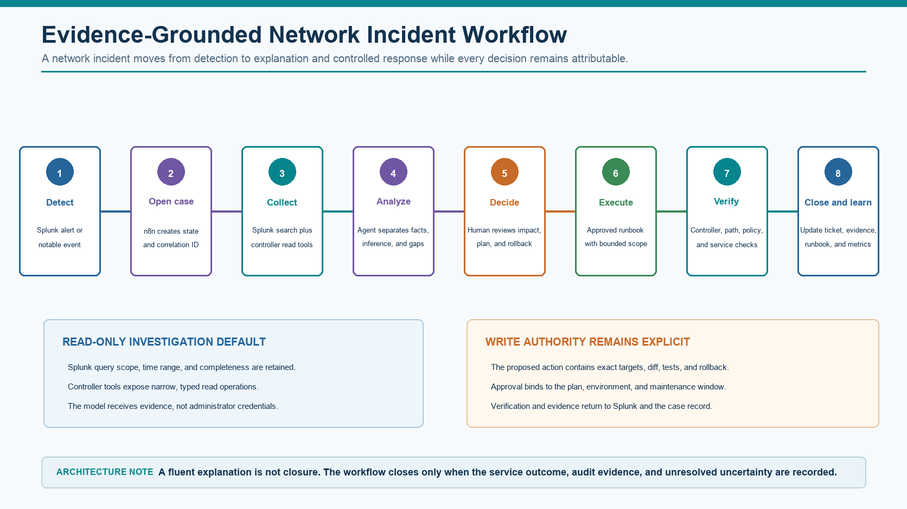

*Figure 5-11. Evidence-grounded operational incident workflow using Splunk, n8n, and governed AI.*

- Splunk creates the alert with site, affected client count, first and last occurrence, change identifier, and links to saved searches.
- n8n validates the payload, creates a correlation ID, opens or updates the ITSM incident, and gathers change and ownership context.
- Read-only tools query bounded Splunk searches, Catalyst Center assurance, relevant ISE authentication results, DHCP service health, and the approved policy state.
- The agent produces an evidence table that separates observed facts, inferred relationships, missing evidence, alternative causes, and the next discriminating checks.
- If remediation is required, n8n creates a concrete proposal containing exact targets, intended diff, expected impact, pre-checks, stop conditions, service validation, and rollback. A human approves that artifact, not a vague natural-language request.
- An approved runbook executes with a scoped service account. Post-checks verify controller state, client authentication, DHCP completion, denied paths, and incident rate before the workflow closes.
- n8n writes the result and unresolved uncertainty to ITSM and Splunk. Failed or inconclusive verification escalates to an operator and preserves the evidence package.

##### 6.1.10.7 Production Design Controls

**Identity and least privilege.** Use workload identities, separate read and write credentials, short-lived secrets where possible, explicit index and API scopes, and no credential exposure to the model.

**Data minimization.** Retrieve only the time range, sites, fields, and records necessary for the task. Redact secrets and sensitive identity or OT data before model invocation.

**Workflow ownership.** Assign an owner, repository, environment, approval policy, support path, recovery procedure, and retirement date to every production workflow.

**Prompt and tool security.** Treat log messages, tickets, device descriptions, and retrieved documents as untrusted data. Enforce instructions, tool schemas, allow lists, and authorization outside the model.

**Evidence and audit.** Record event identifiers, searches, sources, timestamps, model and prompt version, tool parameters, results, approval, execution, verification, and operator corrections.

**Resilience.** Define behavior for Splunk delay, n8n worker failure, model unavailability, controller timeout, ITSM outage, duplicate events, and partial writes. Preserve a manual operating path.

**IT/OT boundary.** Keep initial OT workflows read-only or recommendation-only. Route any write request through OT ownership, maintenance-window, process-impact, local-recovery, and safety approval controls.

## 7 Closed-Loop Optimization and AI/ML

### 7.1 Closed-Loop Optimization

Closed-loop optimization uses telemetry and assurance feedback to improve the network continuously.

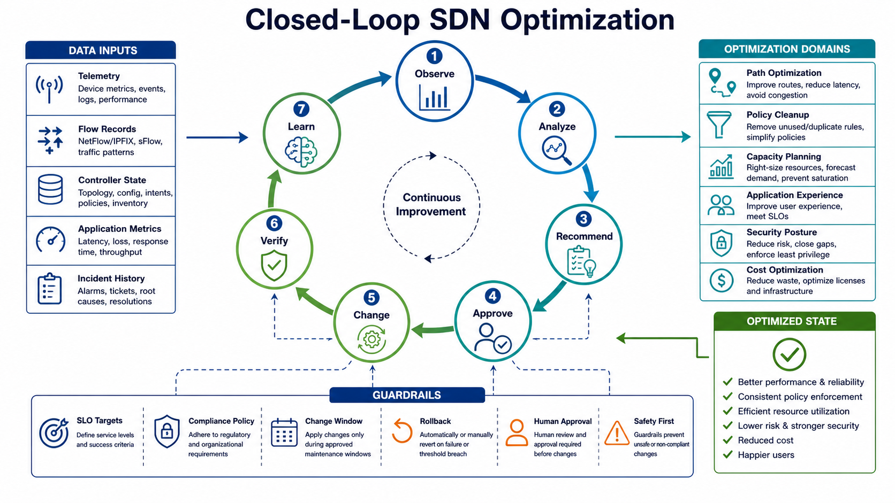

*Figure 5-12. Closed-Loop SDN Optimization.*

#### 7.1.1 Closed-Loop Control Sequence

Closed-loop optimization converts telemetry and service objectives into a controlled production transaction. Each observation, analysis, recommendation, approval, change, verification, and learning step requires measurable entry and exit criteria and must remain inside the approved policy and risk boundaries.

#### 7.1.2 Optimization Domains

Optimization is appropriate only when the service objective, measurement quality, authority boundary, failure cost, and rollback method are explicit for the selected domain.

| **Domain** | **Optimization examples** | **Required guardrail** |
| --- | --- | --- |
| Path optimization | Change WAN path preference, rebalance traffic, avoid degraded transport | SLO target, failback rule, rollback |
| Policy cleanup | Remove unused rules, narrow broad permits, expire exceptions | Security owner approval |
| Capacity planning | Forecast link, device, controller, or license saturation | Budget and architecture review |
| Application experience | Improve SaaS path, DNS policy, QoS, service insertion | User-impact validation |
| Security posture | Identify risky access, unused exceptions, policy violations | Compliance and security review |
| Cost optimization | Reduce unused circuits, licenses, cloud egress, overprovisioning | Business and resilience review |

#### 7.1.3 WAN Path Optimization Scenario

Observation:

- Telemetry shows packet loss on the primary internet transport for several branches.
- Application experience score drops for collaboration traffic.

Analysis:

- Underlay loss correlates with application degradation.
- Secondary transport has lower loss but higher cost.

Recommendation:

- Move collaboration traffic to secondary transport for affected branches until loss returns below threshold.

Approval:

- Operations approves temporary policy change for affected sites only.

Verification:

- Application latency and loss improve.
- No unexpected traffic shifts occur.

Learning:

- Update policy to use dynamic threshold and alert earlier.

#### 7.1.4 Policy Cleanup Scenario

Observation:

- Flow logs show a broad temporary allow rule has had no hits for 45 days.

Analysis:

- Rule was created during an incident and should have expired.
- Application owner confirms it is no longer required.

Recommendation:

- Remove the rule in the next change window.

Approval:

- Security owner approves removal.

Verification:

- No application failures after removal.
- Deny logs monitored for the retired flow.

Learning:

- Add expiration metadata to future temporary exceptions.

### 7.2 AI/ML in SDN Operations

AI/ML can support SDN operations when there is sufficient data quality, topology context, and human validation.

Useful use cases:

- Anomaly detection.
- Event correlation.
- Root-cause candidate generation.
- Capacity forecasting.
- Application experience prediction.
- Policy cleanup recommendations.
- Security behavior analytics.
- Natural language operational summaries.

Limits:

- AI/ML depends on data quality.
- Bad timestamps break correlation.
- Missing topology context creates weak recommendations.
- Rare incidents may not have enough training examples.
- Models can produce plausible but wrong explanations.
- Automated remediation must be constrained by guardrails.

Practical rule: use AI/ML first to assist detection, triage, summarization, and recommendation. Add approved action execution only after evidence quality and operational trust are mature.

## 8 Automation Security and Failure Containment

### 8.1 Automation Security

Automation systems are high-value targets.

#### 8.1.1 Threats

- Stolen API token.
- Hardcoded credentials.
- Overprivileged service account.
- Malicious pipeline change.
- Compromised automation runner.
- Unauthorized production workflow.
- Secrets exposed in logs.
- Drift introduced by manual emergency changes.

#### 8.1.2 Controls

- Vault-based secrets.
- MFA for human users.
- Service-account least privilege.
- Token rotation.
- Signed commits or protected branches.
- Required code review.
- Pipeline approval gates.
- Runtime isolation.
- Audit logs.
- Read-only roles for discovery workflows.
- Separate production and non-production credentials.

### 8.2 Automation Anti-Patterns

Avoid these:

- Automating a broken manual process.
- Treating the controller API as a faster CLI.
- Building scripts that only one engineer understands.
- Running write workflows without pre-checks.
- Ignoring task status after API calls.
- Using production as the test environment.
- Keeping source-of-truth data in spreadsheets with no ownership.
- Allowing manual changes without drift detection.
- Giving automation global admin permission.
- Deploying closed-loop remediation before monitoring is trustworthy.
- Allowing agentic tools to modify production without explicit approval and audit.

## 9 Scenarios, Adoption Roadmap, and Platform Context

### 9.1 Practical Automation Scenarios

#### 9.1.1 Scenario: Read-Only Inventory and Compliance

Goal:

- Build trust in automation without changing production.

Workflow:

- Pull inventory from controllers and devices.
- Compare software versions and platform roles against standards.
- Validate NTP, DNS, syslog, AAA, and backup status.
- Generate report.
- Open tickets for non-compliant items.

Why this is a good first workflow:

- Low risk.
- High visibility value.
- Improves data quality for future automation.

#### 9.1.2 Scenario: Site Onboarding

Goal:

- Onboard a new branch or campus site using approved standards.

Workflow:

- Create site record in source of truth.
- Validate required fields.
- Generate templates or controller objects.
- Run pre-checks.
- Deploy through controller API or automation tool.
- Verify device onboarding, tunnel/fabric health, routing, and monitoring.
- Update ticket with evidence.

Risk controls:

- Start with one site.
- Require approval before deployment.
- Use standardized rollback.
- Validate user/application flows.

#### 9.1.3 Scenario: Policy Exception Expiry

Goal:

- Prevent temporary security exceptions from becoming permanent.

Workflow:

- Query policy catalog for exceptions expiring soon.
- Check flow logs for recent usage.
- Notify owner.
- Recommend extension, narrowing, or removal.
- Require security approval.
- Apply approved action.
- Monitor denied flows after removal.

#### 9.1.4 Scenario: Agent-Assisted Incident Triage

Goal:

- Reduce time to collect and correlate evidence.

Workflow:

- Alert indicates application failure for a user group.
- Agent identifies affected source group, destination, time window, and recent changes.
- Agent performs read-only queries: controller health, path trace, route table, firewall logs, identity logs, application status.
- Agent summarizes likely fault domain and confidence.
- Engineer approves next diagnostic step or remediation runbook.
- Final evidence is attached to the incident record.

### 9.2 Implementation Roadmap for Automation and Agentic Operations

The adoption sequence separates observation, recommendation, approval, execution, and closed-loop control. Autonomy advances only after data quality, tool constraints, validation, and recovery are demonstrated at the preceding level.

| **Phase** | **Scope** | **Exit criteria** |
| --- | --- | --- |
| Phase 0 | Standards and data cleanup | Source-of-truth ownership, naming, schemas, and RBAC defined. |
| Phase 1 | Read-only automation | Inventory, backup, compliance, and reporting workflows trusted. |
| Phase 2 | Controlled write automation | Limited site, segment, or policy workflows with approval and rollback. |
| Phase 3 | Workflow orchestration | ITSM, source of truth, controller, monitoring, and security tools integrated. |
| Phase 4 | Agent-assisted operations | Agents support triage, evidence collection, RCA drafts, and recommendations. |
| Phase 5 | Approved closed-loop actions | Low-risk actions executed with guardrails, verification, and rollback. |
| Phase 6 | Continuous optimization | Telemetry-driven improvement backlog and recurring optimization reviews. |

### 9.3 Automation Readiness Checklist

| **Category** | **Readiness question** |
| --- | --- |
| Data | Is source-of-truth data owned, validated, and current? |
| APIs | Are API capabilities, limits, and versions documented? |
| Credentials | Are secrets stored in a vault with least privilege? |
| Testing | Is there a staging environment or safe test scope? |
| Idempotency | Can workflows be rerun safely? |
| Change control | Are approvals and maintenance windows integrated? |
| Validation | Are pre-checks and post-checks defined? |
| Rollback | Is rollback possible and tested? |
| Observability | Can telemetry prove success or failure? |
| Audit | Are all actions logged and traceable? |
| Skills | Can more than one person operate and maintain the workflow? |
| Governance | Are agentic and closed-loop actions constrained by policy? |

### 9.4 Cisco and Industry Automation Context

Automation interfaces must be evaluated in the context of the managed domain. ACI automation works with a hierarchical policy-object model and fabric transactions; campus automation commonly coordinates sites, inventory, identity, templates, software images, and assurance through Catalyst Center or comparable APIs; SD-WAN automation manages controllers, edge inventory, feature and configuration groups, routing policy, application policy, and deployment tasks. Reuse governance and testing controls across domains, but do not assume their object schemas, transaction semantics, rollback behavior, or evidence are interchangeable.

| **Area** | **Cisco examples** | **Industry examples** |
| --- | --- | --- |
| Controller APIs | Catalyst Center APIs, ACI/APIC APIs, SD-WAN Manager APIs, Meraki Dashboard APIs | NSX APIs, Juniper Apstra APIs, Arista CloudVision APIs, Fortinet/Palo Alto APIs |
| Network automation | Cisco NSO, pyATS/Genie, Ansible collections, Terraform providers where available | Ansible, Terraform, Nornir, Nautobot/NetBox, custom Python, GitOps workflows |
| Assurance/telemetry | Catalyst Center Assurance, Nexus Dashboard, ThousandEyes integrations | Juniper Mist AI, Apstra assurance, Arista CloudVision telemetry, OpenTelemetry-based pipelines |
| Security automation | ISE APIs, firewall manager APIs, SecureX/SOAR-style integrations | SIEM/SOAR platforms, firewall APIs, SASE/SSE APIs, cloud security automation |

Product names differ, but the automation principles remain the same: trusted data, scoped permissions, validation, approval, rollback, observability, and audit.

## 10 Chapter Review

### 10.1 Chapter Summary

Automation is a governed production capability built on authoritative data, bounded interfaces, reviewable change artifacts, independent verification, and recoverable execution. Agentic systems may improve evidence retrieval and workflow coordination, but they do not become the control plane or inherit unrestricted authority.

### 10.2 Review Questions

- What is the difference between scripting, automation, orchestration, infrastructure as code, and agentic operations?
- Why is source-of-truth quality more important than tool selection?
- Why is a successful API response not enough evidence of a successful network change?
- When should Ansible be preferred over Terraform, and when should Terraform be preferred?
- Why is idempotency important in network automation?
- What guardrails are required before write-capable automation is used in production?
- What should be included in a drift control workflow?
- What are safe first use cases for agentic operations?
- Why should agents be read-only by default?
- What is the difference between AI-assisted recommendation and closed-loop remediation?
- Which optimization domains are realistic for SDN operations?
- Why must closed-loop optimization include human approval, SLOs, compliance rules, and rollback?

### 10.3 Scenario and Design Exercise

Design a read-only incident workflow using Splunk, n8n, Catalyst Center or APIC evidence, ITSM context, and a governed local or cloud language model. Define the evidence schema, tool permissions, data boundary, confidence handling, human decision point, and audit record.

### 10.4 Key Takeaways

- SDN automation is an operating capability, not just a scripting exercise.
- Source of truth, validation, rollback, and audit are more important than the automation tool itself.
- Controller APIs increase speed and consistency, but also increase blast radius.
- Ansible is strong for workflows; Terraform is strong for lifecycle-managed resources with mature providers.
- Drift control is essential when humans, controllers, cloud consoles, and automation tools can all change state.
- Agentic operations should begin with read-only investigation, evidence summaries, RCA drafts, and recommendations.
- Production write actions require explicit approval, least privilege, blast-radius limits, verification, and rollback.
- Closed-loop optimization is valuable only when telemetry quality, guardrails, and operational trust are mature.

### 10.5 References for Further Study

- Cisco, Catalyst Center APIs: https://developer.cisco.com/docs/dna-center/

- Cisco, Cisco ACI Programmability Guide: https://developer.cisco.com/site/aci/

- Cisco, Catalyst SD-WAN APIs: https://developer.cisco.com/docs/sdwan/

- Cisco, Meraki Dashboard API: https://developer.cisco.com/meraki/api-v1/

- Cisco, pyATS and Genie: https://developer.cisco.com/pyats/

- Ansible Network Automation: https://docs.ansible.com/ansible/latest/network/index.html

- Terraform Documentation: https://developer.hashicorp.com/terraform/docs

- IETF NETCONF RFC 6241: https://datatracker.ietf.org/doc/html/rfc6241

- IETF RESTCONF RFC 8040: https://datatracker.ietf.org/doc/html/rfc8040

- OpenConfig and gNMI: https://www.openconfig.net/

- OpenTelemetry project: https://opentelemetry.io/

- CCNPAUTO, Chapter 17: AI for Network Automation: https://github.com/tanthanh85/CCNPAUTO/blob/main/THEORY/Part6/Chapter17.md

- Splunk Search Reference: https://help.splunk.com/en/splunk-cloud-platform/search/search-reference

- Splunk SOAR playbook documentation: https://help.splunk.com/en/splunk-soar/soar-cloud/build-playbooks

- n8n AI Agent documentation: https://docs.n8n.io/integrations/builtin/cluster-nodes/root-nodes/n8n-nodes-langchain.agent/

- n8n Self-hosted AI Starter Kit: https://docs.n8n.io/hosting/starter-kits/ai-starter-kit/

- n8n Security Audit: https://docs.n8n.io/hosting/securing/security-audit/
