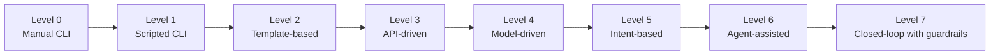
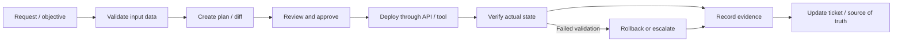
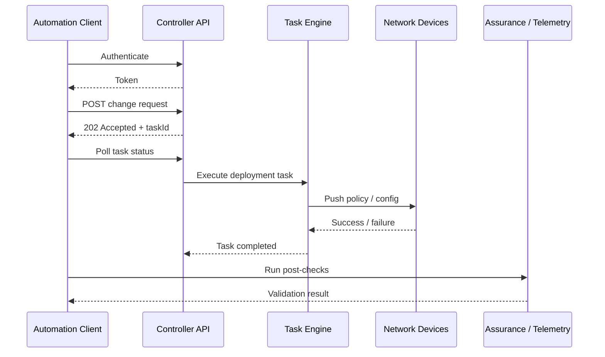
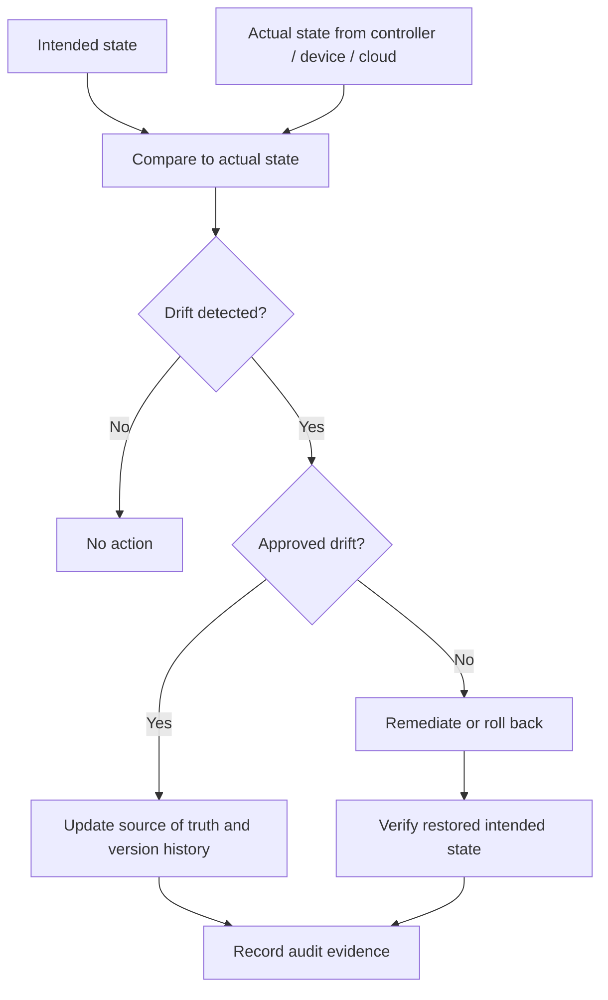
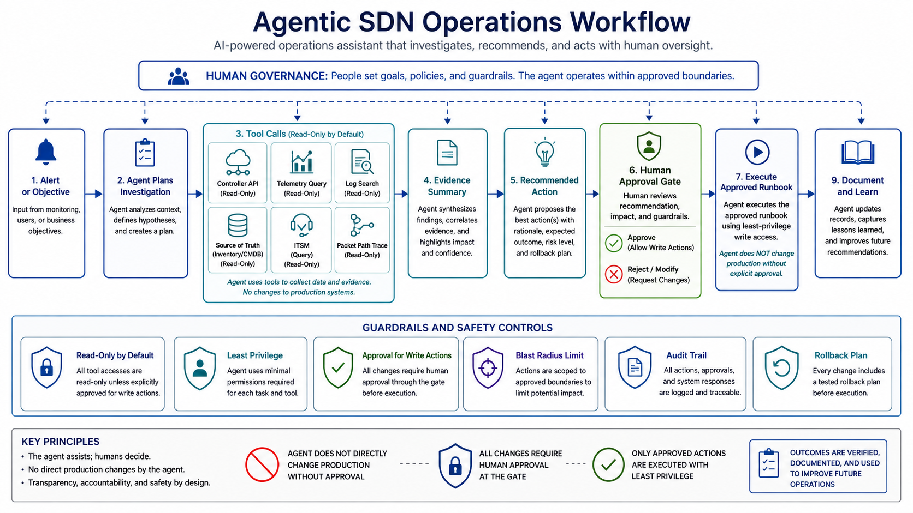
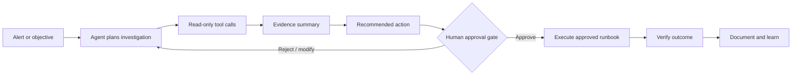
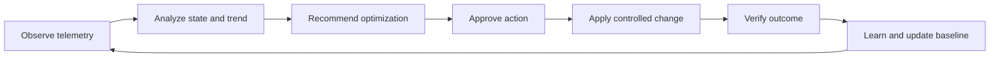

# Chapter 5 - SDN Automation, Agentic Operations, and Optimization

## 1. Chapter Positioning

Chapter 1 introduced SDN concepts and architecture. Chapter 2 covered SDN design. Chapter 3 covered implementation and migration. Chapter 4 covered operations, monitoring, assurance, and troubleshooting.

Chapter 5 focuses on automation and optimization:

> How do we use APIs, source-of-truth data, infrastructure as code, workflow automation, agentic operations, and closed-loop optimization to improve SDN operations without creating uncontrolled risk?

Automation is not the final step after the network is deployed. It is an operating capability that must be designed, governed, tested, monitored, and improved. In SDN, automation can operate against controllers, fabrics, cloud APIs, firewalls, identity platforms, monitoring systems, and ITSM workflows. That power creates speed, consistency, and scale, but it also increases blast radius when data, policy, or approval controls are weak.

## 2. Learning Objectives

After completing this chapter, participants should be able to:

- Explain the difference between scripting, automation, orchestration, infrastructure as code, intent-based workflows, and agentic operations.
- Design an SDN automation architecture with source of truth, validation, approval, deployment, verification, rollback, and audit.
- Compare CLI automation, controller API automation, NETCONF/RESTCONF/YANG, gNMI, Ansible, and Terraform.
- Build safe automation patterns using idempotency, pre-checks, post-checks, blast-radius control, and change governance.
- Explain how agentic operations can assist investigation, recommendation, runbook execution, and documentation.
- Define guardrails for AI/agentic workflows in production network operations.
- Identify SDN optimization opportunities for path selection, policy cleanup, capacity planning, application experience, security posture, and cost.

## 3. Automation Is Not Just Scripting

Many network teams begin by writing scripts that push CLI commands. This can be useful, but scripting alone is not enough for production SDN operations.

| Capability | Question it answers | Example |
|---|---|---|
| Scripting | How do I make this task faster? | Python script collects interface status. |
| Automation | How do I make this task repeatable and validated? | Workflow backs up configs, checks compliance, and reports results. |
| Orchestration | How do I coordinate multiple systems? | ITSM approval triggers controller API, firewall update, and monitoring registration. |
| Infrastructure as Code | How do I manage network intent as versioned code/data? | Terraform manages cloud network resources or controller objects. |
| Intent-based workflow | How do I declare the desired outcome? | Create a segment and policy; controller translates to implementation. |
| Agentic operations | How do I let an assistant investigate, reason, recommend, and execute approved runbooks? | Agent queries telemetry, summarizes evidence, proposes action, waits for approval. |
| Closed-loop optimization | How do I continuously improve based on telemetry and policy? | System detects path degradation, recommends path change, verifies SLO recovery. |

### 3.1 Automation Maturity Model



The target is not always the highest level. Many enterprises gain major value from read-only inventory, compliance reporting, backup validation, and safe controller API workflows. Automation maturity should increase only as data quality, monitoring, approval process, and rollback maturity improve.

## 4. SDN Automation Architecture

An SDN automation architecture should connect business process, source-of-truth data, automation tools, controller APIs, validation, telemetry, and audit evidence.


### 4.1 Automation Workflow



### 4.2 Required Architecture Components

| Component | Purpose |
|---|---|
| ITSM/change system | Governs requests, approvals, maintenance windows, and incident linkage. |
| Source of truth | Stores intended state: sites, devices, IPs, circuits, segments, policy, owners. |
| Git repository | Provides version control for templates, code, data, and policy definitions. |
| Automation runner | Executes workflows through Ansible, Terraform, Python, CI/CD, or orchestration tools. |
| Secrets vault | Stores credentials, tokens, keys, and certificates securely. |
| Controller APIs | Provide structured interaction with SDN controllers and policy systems. |
| Model-driven interfaces | Provide device-level structured configuration and telemetry where appropriate. |
| Monitoring/assurance | Validates results after change and feeds optimization workflows. |
| Audit store | Preserves who changed what, when, why, and with what result. |

### 4.3 Guardrails

Guardrails are mandatory in SDN automation because a single workflow can affect many devices, segments, or users.

- Use read-only automation first.
- Use least-privilege service accounts.
- Separate development, staging, and production credentials.
- Validate schema, dependencies, and policy before deployment.
- Require approval for high-impact or write-capable changes.
- Limit blast radius by site, segment, device group, or application.
- Run pre-checks and post-checks.
- Log every action and response.
- Design rollback before deployment.
- Treat automation output as evidence, not just console text.

## 5. Core API Concepts for SDN Automation

Most SDN controllers expose northbound APIs. REST APIs are common, but automation teams must also understand asynchronous tasks, authentication, rate limits, pagination, schema changes, and error handling.

### 5.1 REST API Basics

| Method | Meaning | SDN example |
|---|---|---|
| GET | Retrieve data | Get device inventory or fabric health. |
| POST | Create or trigger | Create site, deploy template, start path trace. |
| PUT | Replace object | Replace a full policy object. |
| PATCH | Modify part of object | Update site attributes or description. |
| DELETE | Remove object | Delete a test policy or temporary object. |

Common status codes:

| Code | Meaning | Automation implication |
|---|---|---|
| 200 | OK | Request completed. |
| 201 | Created | Object created. |
| 202 | Accepted | Task accepted; poll task status. |
| 204 | No content | Request succeeded, no body. |
| 400 | Bad request | Payload or parameter issue. |
| 401 | Unauthorized | Authentication problem. |
| 403 | Forbidden | Permission problem. |
| 404 | Not found | Wrong ID or endpoint. |
| 409 | Conflict | Object already exists or state conflict. |
| 429 | Too many requests | Rate limit; backoff required. |
| 500 | Server error | Controller-side failure; retry only with care. |

### 5.2 API Task Flow



A successful HTTP response is not enough. A safe workflow checks the API response, task status, device state, and service outcome.

### 5.3 Authentication and Authorization

API automation must treat credentials as privileged infrastructure.

Good practice:

- Use service accounts instead of personal accounts.
- Scope service accounts by function.
- Store secrets in a vault.
- Rotate tokens and keys.
- Use short-lived credentials where supported.
- Validate TLS certificates.
- Log API calls.
- Protect CI/CD runners and automation hosts.
- Separate read-only and write-capable integrations.

Bad practice:

- Hardcoding credentials in scripts.
- Storing tokens in Git.
- Reusing personal administrator accounts.
- Giving automation global administrator access by default.
- Running production automation from an engineer laptop with no audit trail.

## 6. Model-Driven Management and Telemetry

Traditional CLI automation is text-oriented. Model-driven management uses structured data models to reduce ambiguity.

### 6.1 YANG

YANG is a data modeling language used to describe configuration and operational state. A YANG model defines what objects exist, their hierarchy, data types, constraints, and relationships.

Why it matters:

- Configuration becomes structured.
- Operational data can be queried consistently.
- Tools can validate schema before deployment.
- Vendor-neutral and vendor-specific models can coexist.

### 6.2 NETCONF

NETCONF is a protocol for installing, manipulating, and deleting configuration. It typically runs over SSH and uses XML-encoded data.

Key concepts:

- Candidate and running datastores.
- Locking.
- Edit-config operations.
- Commit and rollback behavior where supported.
- Structured operational state retrieval.

### 6.3 RESTCONF

RESTCONF exposes YANG-modeled data through HTTP methods. It is easier for many developers to consume than NETCONF because it uses REST-style operations and can use JSON.

### 6.4 gNMI and Streaming Telemetry

gNMI is commonly used for model-driven telemetry and configuration operations. Streaming telemetry is especially useful for assurance and optimization because it can provide near real-time data without slow polling.

Common uses:

- Interface counters.
- Routing state.
- CPU and memory.
- Queue drops.
- Tunnel health.
- Event-driven optimization triggers.

## 7. Ansible and Terraform in SDN

Ansible and Terraform solve different problems. Both can be useful, but they should not be used interchangeably without understanding their operating models.

### 7.1 Ansible

Ansible is widely used for network automation because it is readable, agentless, and workflow-friendly.

Good use cases:

- Configuration backup.
- Compliance checks.
- Device facts collection.
- Template rendering.
- Controller API orchestration.
- Multi-step operational workflows.
- Pre-check and post-check execution.

Strengths:

- Human-readable playbooks.
- Good for procedural workflows.
- Easy to integrate with existing scripts.
- Useful in brownfield environments.

Risks:

- Module behavior varies by platform.
- Poor inventory data creates poor automation.
- Playbooks can become difficult to maintain without standards.
- Idempotency must be tested.

### 7.2 Terraform

Terraform is a declarative infrastructure-as-code tool. It is strongest when the provider accurately models the target platform and lifecycle.

Good use cases:

- Cloud network resources.
- Repeatable controller objects where provider support is mature.
- Environment lifecycle management.
- Versioned desired state and change planning.

Strengths:

- Plan/apply workflow.
- State-driven lifecycle.
- Strong fit for cloud infrastructure.
- Clear diff before change.

Risks:

- Terraform state becomes sensitive.
- Manual changes create drift.
- Some network platforms do not map cleanly to declarative resources.
- Provider bugs or gaps can block operations.

### 7.3 Ansible vs Terraform

| Area | Ansible | Terraform |
|---|---|---|
| Operating model | Procedural and task-oriented | Declarative desired state |
| State | Usually discovers or acts at runtime | Maintains state file |
| Strength | Workflows, checks, orchestration | Resource lifecycle management |
| Common network use | Backups, validation, controller workflows | Cloud networks, controller resources |
| Risk | Playbook sprawl, weak idempotency | State drift, provider limitations |

Use Ansible for operational workflows and Terraform for lifecycle-managed resources where provider maturity is strong.

## 8. Source of Truth and Drift Control

Automation without trusted data is just faster inconsistency.


### 8.1 Source-of-Truth Data

| Data type | Examples |
|---|---|
| Site | Site ID, region, address, timezone, change window, support owner |
| Device | Hostname, role, platform, serial, software, management IP |
| Connectivity | Circuit ID, transport type, provider, bandwidth, peer IPs |
| Addressing | Prefix, VLAN, VRF, pool, gateway, allocation status |
| Segmentation | Segment name, VRF/VN/VNI/group, owner, allowed destinations |
| Policy | Source, destination, protocol, action, enforcement point, logging |
| Application | App owner, ports, dependencies, SLO, criticality |
| Security | zone, compliance scope, exception expiry, approval record |

### 8.2 Drift Control Workflow



### 8.3 Drift Categories

| Drift type | Example | Response |
|---|---|---|
| Emergency-approved drift | Temporary firewall rule added during incident | Add expiry, owner, and review date to source of truth. |
| Unauthorized drift | Manual route or policy change outside workflow | Investigate, remediate, and review access controls. |
| Tool drift | Controller state differs from Terraform state | Reconcile state before further changes. |
| Documentation drift | Network changed correctly but records not updated | Update source of truth and close process gap. |
| Compliance drift | Policy no longer matches approved standard | Remediate or file approved exception. |

## 9. Safe Automation Patterns

### 9.1 Idempotency

Idempotency means running the same automation multiple times produces the same final state without unintended side effects.

Non-idempotent pattern:

```text
Add a new ACL line every time the script runs.
```

Idempotent pattern:

```text
Check whether the intended ACL entry exists. Add it only if missing. Update it only if different.
```

Why idempotency matters:

- Automation can be rerun safely.
- Partial failures are easier to recover.
- Scheduled compliance workflows do not create duplicates.
- Drift remediation is more predictable.

### 9.2 Pre-Checks and Post-Checks

| Workflow stage | Checks |
|---|---|
| Pre-check | Controller health, device reachability, backup present, route state, policy scope, maintenance window, ticket approval |
| Change | Apply only to approved scope, capture task ID, monitor deployment status |
| Post-check | Desired state present, routes correct, policy enforced, application transaction passes, logs available |
| Failure handling | Rollback or escalate based on trigger and timebox |

### 9.3 Blast-Radius Control

Limit automation impact by:

- Site.
- Device group.
- Segment.
- Application.
- Policy object.
- User group.
- Maintenance window.
- Change type.

Do not run a new write-capable workflow against all production sites on its first execution.

### 9.4 Rollback and Recovery

Automation rollback should define:

- What can be automatically reverted.
- What requires manual action.
- What state is backed up.
- Who approves rollback.
- How restored service is validated.
- What evidence is captured.

## 10. Agentic SDN Operations

Agentic operations use an AI-enabled assistant or agent to plan, investigate, call tools, summarize evidence, recommend actions, and in approved cases execute runbooks.

The key point is governance: the agent assists; humans remain accountable for high-impact production decisions.



### 10.1 Agentic Workflow



### 10.2 Useful Agentic Operations Use Cases

| Use case | Agent role | Human role |
|---|---|---|
| Incident triage | Collect logs, telemetry, recent changes, and affected scope | Confirm severity and response path |
| RCA drafting | Build timeline and evidence summary | Validate root cause and approve final RCA |
| Change impact review | Compare intended change against topology, policy, and dependencies | Approve, reject, or modify change |
| Policy cleanup | Find unused, duplicate, or broad rules | Decide whether to remove or narrow rules |
| Drift review | Detect differences between intended and actual state | Approve reconciliation or exception |
| Capacity planning | Identify growth trends and saturation risk | Approve budget and architecture changes |
| Runbook execution | Execute approved low-risk steps | Approve write actions and rollback |

### 10.3 Agentic Guardrails

Agentic operations require stricter guardrails than normal scripts because the agent can reason across tools and propose actions.

Mandatory controls:

- Read-only by default.
- Explicit approval for write actions.
- Tool permissions scoped by task.
- Least-privilege service accounts.
- Change-ticket binding for production changes.
- Blast-radius limits.
- Rollback plan before execution.
- Full audit trail of prompts, tool calls, outputs, approvals, and actions.
- Clear confidence and evidence reporting.
- Human review of recommendations affecting security, routing, segmentation, or critical services.

### 10.4 What Agents Should Not Do Initially

Avoid early agent autonomy for:

- Broad production policy changes.
- Route redistribution or default route changes.
- Firewall rule deletion.
- OT access policy changes.
- Identity group remapping.
- Certificate lifecycle actions.
- Controller upgrades.
- Multi-domain change execution without explicit approval.

Start with investigation, summarization, documentation, and low-risk read-only analysis.

## 11. Closed-Loop SDN Optimization

Closed-loop optimization uses telemetry and assurance feedback to improve the network continuously.


### 11.1 Closed-Loop Workflow



### 11.2 Optimization Domains

| Domain | Optimization examples | Required guardrail |
|---|---|---|
| Path optimization | Change WAN path preference, rebalance traffic, avoid degraded transport | SLO target, failback rule, rollback |
| Policy cleanup | Remove unused rules, narrow broad permits, expire exceptions | Security owner approval |
| Capacity planning | Forecast link, device, controller, or license saturation | Budget and architecture review |
| Application experience | Improve SaaS path, DNS policy, QoS, service insertion | User-impact validation |
| Security posture | Identify risky access, unused exceptions, policy violations | Compliance and security review |
| Cost optimization | Reduce unused circuits, licenses, cloud egress, overprovisioning | Business and resilience review |

### 11.3 WAN Path Optimization Scenario

Observation:

- Telemetry shows packet loss on the primary internet transport for several branches.
- Application experience score drops for collaboration traffic.

Analysis:

- Underlay loss correlates with application degradation.
- Secondary transport has lower loss but higher cost.

Recommendation:

- Move collaboration traffic to secondary transport for affected branches until loss returns below threshold.

Approval:

- Operations approves temporary policy change for affected sites only.

Verification:

- Application latency and loss improve.
- No unexpected traffic shifts occur.

Learning:

- Update policy to use dynamic threshold and alert earlier.

### 11.4 Policy Cleanup Scenario

Observation:

- Flow logs show a broad temporary allow rule has had no hits for 45 days.

Analysis:

- Rule was created during an incident and should have expired.
- Application owner confirms it is no longer required.

Recommendation:

- Remove the rule in the next change window.

Approval:

- Security owner approves removal.

Verification:

- No application failures after removal.
- Deny logs monitored for the retired flow.

Learning:

- Add expiration metadata to future temporary exceptions.

## 12. AI/ML in SDN Operations

AI/ML can support SDN operations when there is sufficient data quality, topology context, and human validation.

Useful use cases:

- Anomaly detection.
- Event correlation.
- Root-cause candidate generation.
- Capacity forecasting.
- Application experience prediction.
- Policy cleanup recommendations.
- Security behavior analytics.
- Natural language operational summaries.

Limits:

- AI/ML depends on data quality.
- Bad timestamps break correlation.
- Missing topology context creates weak recommendations.
- Rare incidents may not have enough training examples.
- Models can produce plausible but wrong explanations.
- Automated remediation must be constrained by guardrails.

Practical rule: use AI/ML first to assist detection, triage, summarization, and recommendation. Add approved action execution only after evidence quality and operational trust are mature.

## 13. Automation Security

Automation systems are high-value targets.

### 13.1 Threats

- Stolen API token.
- Hardcoded credentials.
- Overprivileged service account.
- Malicious pipeline change.
- Compromised automation runner.
- Unauthorized production workflow.
- Secrets exposed in logs.
- Drift introduced by manual emergency changes.

### 13.2 Controls

- Vault-based secrets.
- MFA for human users.
- Service-account least privilege.
- Token rotation.
- Signed commits or protected branches.
- Required code review.
- Pipeline approval gates.
- Runtime isolation.
- Audit logs.
- Read-only roles for discovery workflows.
- Separate production and non-production credentials.

## 14. Automation Anti-Patterns

Avoid these:

- Automating a broken manual process.
- Treating the controller API as a faster CLI.
- Building scripts that only one engineer understands.
- Running write workflows without pre-checks.
- Ignoring task status after API calls.
- Using production as the test environment.
- Keeping source-of-truth data in spreadsheets with no ownership.
- Allowing manual changes without drift detection.
- Giving automation global admin permission.
- Deploying closed-loop remediation before monitoring is trustworthy.
- Allowing agentic tools to modify production without explicit approval and audit.

## 15. Practical Automation Scenarios

### 15.1 Scenario: Read-Only Inventory and Compliance

Goal:

- Build trust in automation without changing production.

Workflow:

1. Pull inventory from controllers and devices.
2. Compare software versions and platform roles against standards.
3. Validate NTP, DNS, syslog, AAA, and backup status.
4. Generate report.
5. Open tickets for non-compliant items.

Why this is a good first workflow:

- Low risk.
- High visibility value.
- Improves data quality for future automation.

### 15.2 Scenario: Site Onboarding

Goal:

- Onboard a new branch or campus site using approved standards.

Workflow:

1. Create site record in source of truth.
2. Validate required fields.
3. Generate templates or controller objects.
4. Run pre-checks.
5. Deploy through controller API or automation tool.
6. Verify device onboarding, tunnel/fabric health, routing, and monitoring.
7. Update ticket with evidence.

Risk controls:

- Start with one site.
- Require approval before deployment.
- Use standardized rollback.
- Validate user/application flows.

### 15.3 Scenario: Policy Exception Expiry

Goal:

- Prevent temporary security exceptions from becoming permanent.

Workflow:

1. Query policy catalog for exceptions expiring soon.
2. Check flow logs for recent usage.
3. Notify owner.
4. Recommend extension, narrowing, or removal.
5. Require security approval.
6. Apply approved action.
7. Monitor denied flows after removal.

### 15.4 Scenario: Agent-Assisted Incident Triage

Goal:

- Reduce time to collect and correlate evidence.

Workflow:

1. Alert indicates application failure for a user group.
2. Agent identifies affected source group, destination, time window, and recent changes.
3. Agent performs read-only queries: controller health, path trace, route table, firewall logs, identity logs, application status.
4. Agent summarizes likely fault domain and confidence.
5. Engineer approves next diagnostic step or remediation runbook.
6. Final evidence is attached to the incident record.

## 16. Implementation Roadmap for Automation and Agentic Operations

| Phase | Scope | Exit criteria |
|---|---|---|
| Phase 0 | Standards and data cleanup | Source-of-truth ownership, naming, schemas, and RBAC defined. |
| Phase 1 | Read-only automation | Inventory, backup, compliance, and reporting workflows trusted. |
| Phase 2 | Controlled write automation | Limited site, segment, or policy workflows with approval and rollback. |
| Phase 3 | Workflow orchestration | ITSM, source of truth, controller, monitoring, and security tools integrated. |
| Phase 4 | Agent-assisted operations | Agents support triage, evidence collection, RCA drafts, and recommendations. |
| Phase 5 | Approved closed-loop actions | Low-risk actions executed with guardrails, verification, and rollback. |
| Phase 6 | Continuous optimization | Telemetry-driven improvement backlog and recurring optimization reviews. |

## 17. Automation Readiness Checklist

| Category | Readiness question |
|---|---|
| Data | Is source-of-truth data owned, validated, and current? |
| APIs | Are API capabilities, limits, and versions documented? |
| Credentials | Are secrets stored in a vault with least privilege? |
| Testing | Is there a staging environment or safe test scope? |
| Idempotency | Can workflows be rerun safely? |
| Change control | Are approvals and maintenance windows integrated? |
| Validation | Are pre-checks and post-checks defined? |
| Rollback | Is rollback possible and tested? |
| Observability | Can telemetry prove success or failure? |
| Audit | Are all actions logged and traceable? |
| Skills | Can more than one person operate and maintain the workflow? |
| Governance | Are agentic and closed-loop actions constrained by policy? |

## 18. Cisco and Industry Automation Context

| Area | Cisco examples | Industry examples |
|---|---|---|
| Controller APIs | Catalyst Center APIs, ACI/APIC APIs, SD-WAN Manager APIs, Meraki Dashboard APIs | NSX APIs, Juniper Apstra APIs, Arista CloudVision APIs, Fortinet/Palo Alto APIs |
| Network automation | Cisco NSO, pyATS/Genie, Ansible collections, Terraform providers where available | Ansible, Terraform, Nornir, Nautobot/NetBox, custom Python, GitOps workflows |
| Assurance/telemetry | Catalyst Center Assurance, Nexus Dashboard, ThousandEyes integrations | Juniper Mist AI, Apstra assurance, Arista CloudVision telemetry, OpenTelemetry-based pipelines |
| Security automation | ISE APIs, firewall manager APIs, SecureX/SOAR-style integrations | SIEM/SOAR platforms, firewall APIs, SASE/SSE APIs, cloud security automation |

Product names differ, but the automation principles remain the same: trusted data, scoped permissions, validation, approval, rollback, observability, and audit.

## 19. Review Questions

1. What is the difference between scripting, automation, orchestration, infrastructure as code, and agentic operations?
2. Why is source-of-truth quality more important than tool selection?
3. Why is a successful API response not enough evidence of a successful network change?
4. When should Ansible be preferred over Terraform, and when should Terraform be preferred?
5. Why is idempotency important in network automation?
6. What guardrails are required before write-capable automation is used in production?
7. What should be included in a drift control workflow?
8. What are safe first use cases for agentic operations?
9. Why should agents be read-only by default?
10. What is the difference between AI-assisted recommendation and closed-loop remediation?
11. Which optimization domains are realistic for SDN operations?
12. Why must closed-loop optimization include human approval, SLOs, compliance rules, and rollback?

## 20. Key Takeaways

- SDN automation is an operating capability, not just a scripting exercise.
- Source of truth, validation, rollback, and audit are more important than the automation tool itself.
- Controller APIs increase speed and consistency, but also increase blast radius.
- Ansible is strong for workflows; Terraform is strong for lifecycle-managed resources with mature providers.
- Drift control is essential when humans, controllers, cloud consoles, and automation tools can all change state.
- Agentic operations should begin with read-only investigation, evidence summaries, RCA drafts, and recommendations.
- Production write actions require explicit approval, least privilege, blast-radius limits, verification, and rollback.
- Closed-loop optimization is valuable only when telemetry quality, guardrails, and operational trust are mature.

## 21. References for Further Study

- Cisco, Catalyst Center APIs: https://developer.cisco.com/docs/dna-center/
- Cisco, Cisco ACI Programmability Guide: https://developer.cisco.com/site/aci/
- Cisco, Catalyst SD-WAN APIs: https://developer.cisco.com/docs/sdwan/
- Cisco, Meraki Dashboard API: https://developer.cisco.com/meraki/api-v1/
- Cisco, pyATS and Genie: https://developer.cisco.com/pyats/
- Ansible Network Automation: https://docs.ansible.com/ansible/latest/network/index.html
- Terraform Documentation: https://developer.hashicorp.com/terraform/docs
- IETF NETCONF RFC 6241: https://datatracker.ietf.org/doc/html/rfc6241
- IETF RESTCONF RFC 8040: https://datatracker.ietf.org/doc/html/rfc8040
- OpenConfig and gNMI: https://www.openconfig.net/
- OpenTelemetry project: https://opentelemetry.io/
