# Day 1 - SDN Concepts and Architecture Deep Dive

## 1. Audience, Positioning, and Learning Outcomes

This material is designed for experienced network engineers, architects, and operations staff who already understand traditional routing, switching, VLANs, VRFs, ACLs, firewall zones, WAN design, and have prior exposure to Cisco SD-WAN.

The objective is not to teach basic networking again. The objective is to help learners reframe existing network knowledge through a software-defined architecture:

- How control, forwarding, policy, automation, and telemetry are separated.
- How traditional designs can evolve into SDN fabrics.
- How SDN changes the operating model, not just the product stack.
- How Cisco SD-WAN concepts map to broader SDN concepts.
- How to evaluate when SDN is useful, where it is risky, and how to migrate safely.

By the end of Day 1, learners should be able to:

- Explain SDN as an architectural model, not a single protocol or vendor product.
- Compare traditional distributed control with controller-driven and intent-based networking.
- Describe the roles of the data plane, control plane, management plane, and application plane.
- Explain northbound and southbound APIs.
- Distinguish underlay, overlay, fabric, controller, policy, and telemetry.
- Explain why SD-WAN is a practical example of SDN.
- Compare major Cisco SDN domains: ACI, SD-Access, Catalyst SD-WAN, and Meraki.
- Identify SDN migration opportunities in brownfield enterprise networks.
- Recognize operational and security risks introduced by SDN.

## 2. Why Traditional Networks Became Difficult to Operate

Traditional enterprise networks were built around device-level control. Routers run routing protocols, switches learn MAC addresses, firewalls enforce rules, and engineers configure each platform using CLI, templates, or vendor-specific tools.

This model works and remains technically valid. SDN does not make OSPF, BGP, STP, VLANs, VRFs, QoS, or firewalls obsolete. Instead, SDN addresses operational scaling problems that appear when networks become larger, more dynamic, more security-sensitive, and more application-driven.

Common pain points in traditional environments:

- Configuration is repeated across many devices.
- Policy is distributed across VLANs, ACLs, VRFs, firewall rules, route maps, and QoS policies.
- Network intent is hidden inside device configuration.
- Changes are slow because impact analysis is manual.
- Visibility is fragmented across CLI, SNMP, syslog, NetFlow, firewall logs, and ticket notes.
- Brownfield networks accumulate inconsistent naming, addressing, and policy conventions.
- Adding new sites or segments often requires many coordinated changes.
- Security segmentation is difficult to keep consistent across campus, WAN, data center, and cloud.

### Example: Traditional Branch Rollout

A new branch may require:

- WAN router configuration.
- IP addressing and VLANs.
- Routing protocol updates.
- Firewall object and rule updates.
- QoS policy changes.
- Monitoring registration.
- DHCP, DNS, NTP, SNMP, syslog configuration.
- Documentation updates.

In a mature organization, this may involve several teams and several change windows. The technical tasks are not individually difficult, but the coordination cost and error probability are high.

### Example: Traditional Segmentation Problem

Assume an enterprise wants to separate:

- Corporate users.
- Guest users.
- Cameras.
- IoT devices.
- OT systems.
- Server workloads.
- Management interfaces.

In a traditional design, this usually maps to VLANs, subnets, VRFs, firewall zones, ACLs, and route leaking. Over time, exceptions are added:

- A camera server needs access from a security workstation.
- OT needs access to a historian server.
- Guest needs Internet only.
- IT admins need privileged access to multiple zones.
- Remote users need controlled access to selected applications.

The challenge is not only creating the first version of the policy. The challenge is keeping the policy consistent for years while sites, users, applications, and devices change.

## 3. What SDN Really Means

Software-Defined Networking is an architecture that makes the network more programmable, centrally coordinated, policy-driven, and automation-friendly by abstracting control from individual forwarding devices.

In practical terms, SDN means:

- Network behavior can be defined through a controller, orchestrator, or policy system.
- Network state can be discovered and monitored through structured interfaces.
- Configuration can be generated from templates, models, or intent.
- Devices are still responsible for forwarding traffic, but policy and lifecycle operations are coordinated centrally.
- APIs become first-class operational interfaces.

SDN does not always mean:

- OpenFlow.
- One controller for the entire enterprise.
- Replacing all existing devices.
- Removing all distributed protocols.
- Fully autonomous networking.
- No CLI.

SDN is best understood as a spectrum. Some environments use only API-based automation. Some use overlay fabrics. Some use complete controller-driven policy. Some integrate multiple domains such as SD-WAN, campus fabric, data center fabric, and cloud networking.

## 4. Traditional Networking vs SDN

| Area | Traditional Model | SDN-Oriented Model |
|---|---|---|
| Primary unit of operation | Individual device | Fabric, site, segment, policy, application |
| Control logic | Distributed across devices | Centralized or logically centralized |
| Configuration | CLI, templates, manual workflows | API, controller, templates, intent, automation |
| Policy expression | VLAN, ACL, route map, VRF, firewall rule | Segment, group, contract, intent, service policy |
| Visibility | Device-centric | System/fabric/application-centric |
| Change validation | Manual review and testing | Pre-checks, compliance checks, controller validation |
| Scale model | Repeat configuration per device | Apply policy across a domain |
| Troubleshooting | Hop-by-hop CLI | Controller view plus packet-path verification |
| Integration | SNMP, syslog, CLI scraping | REST API, NETCONF, RESTCONF, gNMI, event streams |

### Key Point

SDN does not remove the need for strong network fundamentals. It moves the engineer's focus from "configure every box correctly" to "define the intended behavior and verify that the system implements it correctly."

## 5. High-Level SDN Architecture

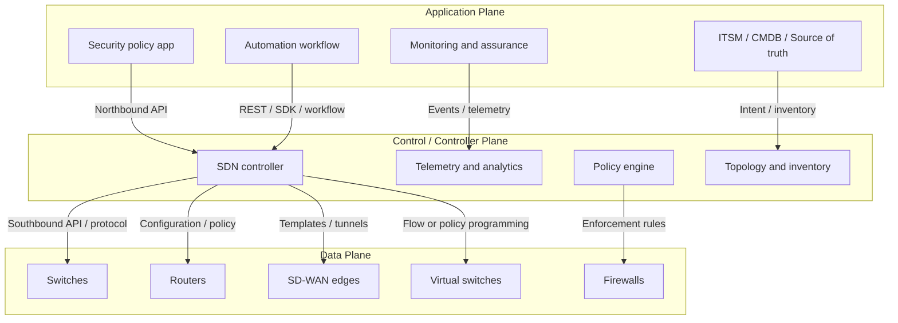

This diagram is intentionally generic. Different vendors implement the architecture differently, but most SDN systems include the same conceptual layers.

## 6. Data Plane

The data plane is responsible for forwarding traffic. It performs the actual movement of packets or frames.

Examples:

- Physical switches.
- Routers.
- SD-WAN edge devices.
- Wireless access points.
- Firewalls.
- Load balancers.
- Virtual switches.
- Cloud gateways.

Typical data plane functions:

- MAC learning and Layer 2 forwarding.
- IP routing and next-hop lookup.
- Encapsulation and decapsulation.
- ACL enforcement.
- QoS marking and queuing.
- Tunnel forwarding.
- NAT.
- Packet replication for multicast or broadcast.

In an SDN architecture, the data plane may still run local protocols and local forwarding logic. The difference is that a controller or orchestrator influences how the forwarding tables, policies, tunnels, and security rules are created.

### Practical Example

In Cisco SD-WAN, WAN Edge routers forward user traffic. They establish tunnels, classify traffic, enforce local policy, and forward packets. The controller does not forward user packets. The controller provides control information, policy, templates, and orchestration.

### Advantages

- Existing high-performance ASIC forwarding is preserved.
- Traffic forwarding can continue even if the controller is temporarily unavailable, depending on the architecture.
- Policy can be pre-programmed into devices.

### Risks

- If the controller programs incorrect policy, the data plane can enforce incorrect behavior at scale.
- Troubleshooting requires understanding both controller state and device state.
- Hardware support matters. Not all devices support the same encapsulation, telemetry, or policy features.

## 7. Control Plane

The control plane determines how traffic should be forwarded. In traditional routing, each router runs protocols such as OSPF, IS-IS, or BGP to build routing tables. In SDN, some control decisions may be centralized, abstracted, or coordinated by a controller.

Control plane responsibilities may include:

- Topology discovery.
- Endpoint location tracking.
- Route and tunnel control.
- Policy calculation.
- Path selection.
- Device onboarding.
- Template deployment.
- Failure detection.
- Consistency checking.

### Centralized vs Logically Centralized

SDN literature often says "centralized control." In production, this usually means logically centralized, not physically single-box.

Production SDN controllers are commonly deployed as clusters. The administrator experiences one control system, while the backend may consist of multiple nodes for high availability, scale, and disaster recovery.

### Important Design Question

For any SDN solution, ask:

- Is the controller in the data path?
- If the controller fails, does existing traffic continue?
- Can new endpoints join?
- Can new tunnels form?
- Can policies be changed?
- Is the controller cluster local, remote, or cloud-hosted?
- What is the backup and restore model?
- What is the disaster recovery model?

## 8. Management Plane

Many discussions simplify SDN into control plane and data plane. For production design, the management plane must be considered separately.

The management plane includes:

- Device administration.
- Logging.
- Monitoring.
- Backup and restore.
- User access control.
- Configuration lifecycle.
- Licensing.
- Certificate management.
- Software upgrades.
- Audit trails.

In SDN, the management plane becomes more critical because the controller becomes a high-value operational system. If an attacker gains administrator access to the controller, the attacker may be able to change policy across the fabric.

### Management Plane Best Practices

- Use dedicated management networks where possible.
- Enforce MFA and RBAC.
- Integrate with TACACS+, RADIUS, SSO, or identity providers.
- Protect API tokens and certificates.
- Back up controller configuration and policy databases.
- Monitor controller health and audit logs.
- Separate admin roles: network operator, security operator, auditor, automation account.

## 9. Application Plane

The application plane represents business logic and operational workflows above the controller.

Examples:

- A portal that lets a team request a new network segment.
- An automation workflow that creates a branch site.
- A security tool that updates group policy.
- A monitoring platform that consumes telemetry and raises incidents.
- A CMDB/source of truth that defines expected devices, sites, and circuits.

### Example Workflow

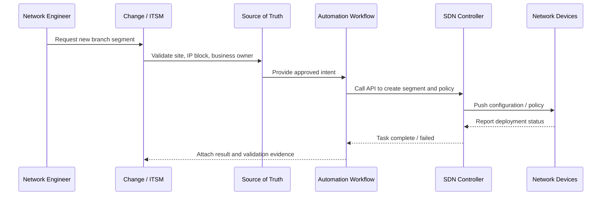

This is where SDN becomes operationally powerful. Instead of manually configuring each device, the organization builds a controlled workflow around intent, validation, deployment, and evidence.

## 10. Northbound and Southbound Interfaces

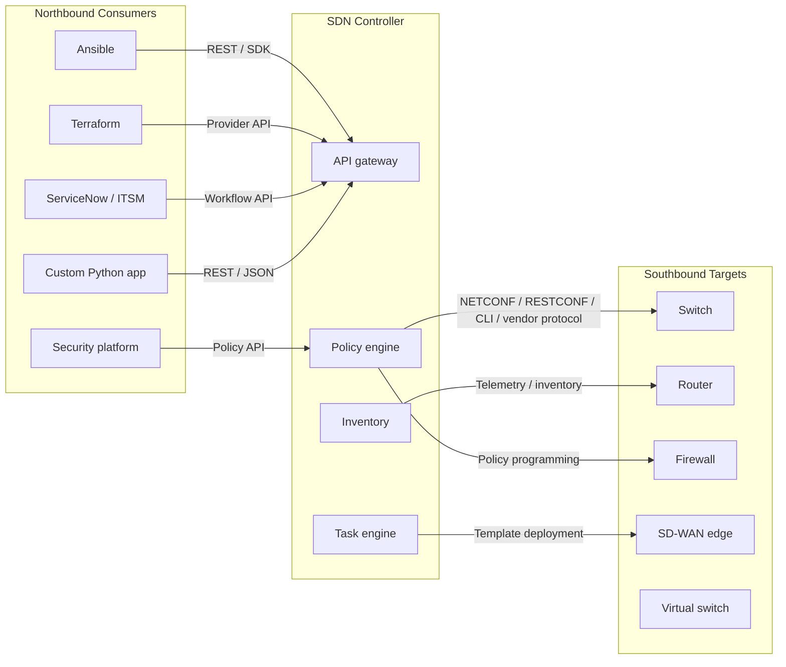

### Northbound API

Northbound APIs expose controller capabilities to applications, automation platforms, and operations workflows.

Common use cases:

- Retrieve inventory.
- Retrieve device health.
- Create sites.
- Create segments.
- Create policies.
- Deploy templates.
- Track deployment tasks.
- Integrate with change management.

REST APIs are common because they are easy to consume from tools such as Postman, Python, Ansible, Terraform, and ITSM platforms.

### Southbound API

Southbound interfaces connect the controller to network devices.

Possible southbound mechanisms:

- OpenFlow.
- NETCONF.
- RESTCONF.
- gNMI.
- SSH/CLI.
- SNMP/syslog for legacy monitoring.
- Vendor-specific protocols.
- BGP/EVPN/LISP/control sessions depending on architecture.

### Technical Note

Do not assume northbound and southbound APIs use the same protocol. A controller may expose REST northbound while using NETCONF, CLI, gNMI, OpenFlow, or proprietary mechanisms southbound.

## 11. OpenFlow and the Historical SDN Model

OpenFlow is often associated with early SDN because it gave controllers a way to program forwarding behavior in switches.

Basic OpenFlow model:

- A switch contains flow tables.
- A flow entry matches packet fields.
- The flow entry defines actions.
- The controller can add, modify, or remove flows.

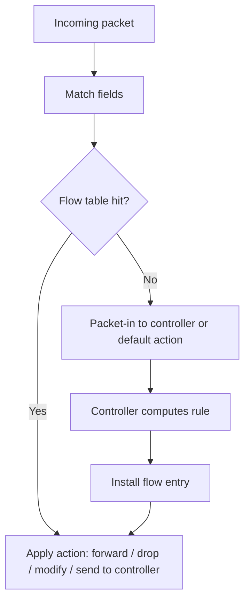

Example match fields:

- Source MAC.
- Destination MAC.
- VLAN ID.
- Source IP.
- Destination IP.
- TCP/UDP port.
- Protocol.
- Ingress port.

Example actions:

- Forward to port.
- Drop.
- Modify header.
- Push/pop VLAN.
- Send to controller.

### Advantages of OpenFlow

- Excellent for teaching separation of control and data plane.
- Allows explicit flow programming.
- Useful in research and lab environments.
- Works well with Mininet and Open vSwitch for learning.

### Limitations in Enterprise Production

- Many enterprise SDN systems do not rely primarily on OpenFlow.
- Hardware support and scale vary.
- Operational tooling may be less mature than vendor-integrated SDN platforms.
- Policy models in production often need higher-level abstractions than raw flow programming.

Key message for learners:

> OpenFlow is one possible southbound protocol. SDN is a broader architectural model.

## 12. Underlay and Overlay

Underlay and overlay are central concepts in modern SDN.

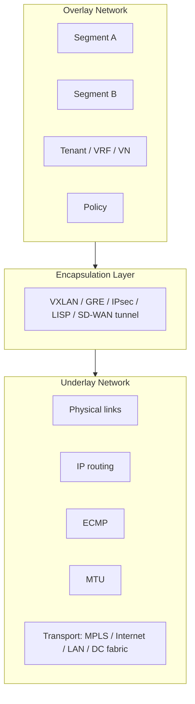

### Underlay

The underlay is the transport network that provides basic reachability between fabric nodes or tunnel endpoints.

Underlay design requirements:

- Stable IP connectivity.
- Predictable routing convergence.
- Proper MTU.
- Redundancy.
- ECMP where appropriate.
- Clear failure domains.
- Monitoring and alerting.

Examples:

- Leaf-spine IP fabric in a data center.
- Routed campus core and distribution.
- MPLS/Internet/LTE transport in SD-WAN.
- Cloud VPC/VNet network infrastructure.

### Overlay

The overlay is the logical network built on top of the underlay.

Overlay functions:

- Tenant separation.
- Network virtualization.
- Segment mobility.
- Policy abstraction.
- Tunnel-based transport.
- Logical topology independent of physical topology.

Common overlay technologies:

- VXLAN.
- EVPN-VXLAN.
- LISP.
- GRE.
- IPsec.
- SD-WAN tunnels.

### Troubleshooting Principle

Always validate underlay before overlay.

If overlay tunnels are down, do not immediately assume a controller or policy issue. Check:

- IP reachability between tunnel endpoints.
- Routing table.
- MTU and fragmentation.
- Firewall rules between endpoints.
- NAT traversal.
- Certificates.
- Time synchronization.
- Control connections.

## 13. Fabric

A fabric is a network domain operated as a coordinated system rather than as isolated devices.

Fabric components commonly include:

- Fabric nodes.
- Controller.
- Underlay.
- Overlay.
- Endpoint database.
- Policy model.
- Border/gateway functions.
- Telemetry and assurance.

Examples:

- Cisco ACI fabric for data center.
- Cisco SD-Access fabric for campus.
- Cisco Catalyst SD-WAN overlay fabric.
- EVPN-VXLAN fabric.

### Fabric Boundary

Every fabric has a boundary. Boundary design is critical because this is where SDN meets non-SDN or another SDN domain.

Typical boundary functions:

- Routing exchange.
- Firewall insertion.
- NAT.
- Route leaking.
- Policy translation.
- External connectivity.
- Internet breakout.
- Cloud connectivity.

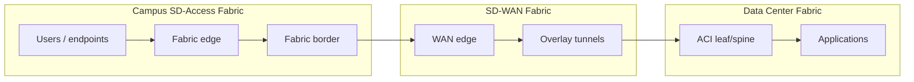

In real designs, many incidents happen at fabric boundaries because routing, policy, segmentation, NAT, and firewall behavior meet there.

## 14. Policy-Based Networking

Traditional networks often express policy through device-level constructs:

- ACLs.
- VLANs.
- Subnets.
- VRFs.
- Route maps.
- Firewall rules.
- NAT rules.

SDN systems try to express policy closer to business intent:

- Users in Finance can access ERP.
- Guest devices can access Internet only.
- OT systems can reach historian servers but not corporate user networks.
- Cameras can send video to recording servers only.
- Branch voice traffic prefers low-latency transport.
- SaaS traffic may use direct Internet access.

### Policy Abstraction Diagram

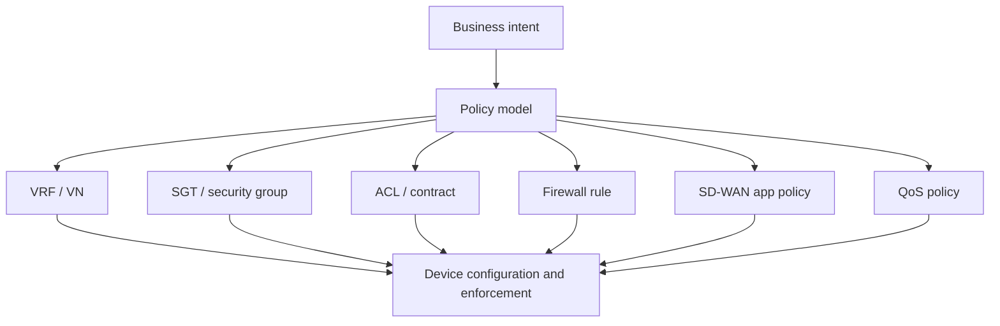

### Example Policy Matrix

| Source Segment | Destination Segment | Required Access | Enforcement Example |
|---|---|---|---|
| Guest | Internet | Allow web only | Firewall / Internet edge |
| Guest | Internal servers | Deny | Fabric policy / firewall |
| Corporate users | ERP | Allow HTTPS | SD-Access policy + firewall |
| OT | Historian | Allow specific ports | Firewall + segmentation |
| Cameras | Video recorder | Allow video stream | ACL / fabric policy |
| IoT | Management | Deny | Fabric or firewall policy |
| Network admin | Management | Allow SSH/HTTPS | RBAC + firewall + TACACS |

### Benefits

- Policy is easier to discuss with security and business teams.
- Segmentation can become more consistent across sites.
- Repeated policy can be applied at scale.
- Policy changes can be audited and automated.

### Risks

- High-level policy may hide low-level dependencies.
- Poorly designed groups can become too broad.
- Exception handling can become complex.
- Integration between SDN domains may require policy translation.
- Controller GUI may show intended policy while device-level enforcement differs due to deployment failure.

## 15. Intent-Based Networking

Intent-based networking is a higher-level evolution of SDN. Instead of telling the network every low-level command, the operator declares the desired outcome.

Intent example:

- "Create a guest segment at all branches with Internet-only access."
- "Allow OT sensors to send data to the historian but block lateral access."
- "Prefer MPLS for voice unless latency exceeds threshold."

The system then:

- Translates intent into configuration.
- Deploys configuration.
- Monitors state.
- Validates whether the network matches intent.
- Reports drift or anomalies.

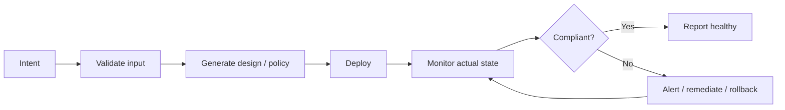

### Reality Check

Most production networks are not fully autonomous. They use partial intent-based workflows. Human approval, change windows, and validation remain important.

## 16. Automation in SDN

Automation is often the first practical step toward SDN transformation.

Automation maturity levels:

| Level | Description | Example |
|---|---|---|
| 0 | Manual CLI | Engineer configures each device |
| 1 | Scripted CLI | Python or shell pushes commands |
| 2 | Template-based | Jinja2, Ansible templates, controller templates |
| 3 | API-driven | REST API creates sites, policies, segments |
| 4 | Model-driven | NETCONF/RESTCONF/gNMI/YANG |
| 5 | Intent-driven | Declare desired state; system translates |
| 6 | Closed-loop | Telemetry triggers remediation or recommendation |

### Good Automation Requires More Than Scripts

Required elements:

- Source of truth.
- Naming standards.
- IP address management.
- Credential management.
- Pre-checks.
- Post-checks.
- Idempotency.
- Rollback.
- Logging.
- Approval workflow.
- Test environment.

### Example: Branch Site Creation

Traditional approach:

- Engineer copies configuration from previous branch.
- Edits hostname, IPs, VLANs, routing, ACLs, QoS.
- Pastes configuration into devices.
- Manually updates monitoring and documentation.

SDN/automation approach:

- Site parameters are entered in a source of truth.
- Automation validates IP ranges, naming, and policy.
- Controller API creates site, device templates, segments, and policy.
- Devices are onboarded using zero-touch provisioning.
- Monitoring is automatically updated.
- Validation tests are attached to the change ticket.

## 17. Telemetry and Assurance

Traditional monitoring often relies on polling:

- SNMP.
- ICMP.
- Syslog.
- NetFlow.
- Manual CLI checks.

SDN environments can provide richer telemetry:

- Controller state.
- Fabric health.
- Tunnel status.
- Endpoint movement.
- Policy deployment status.
- Application experience.
- Device health.
- Path tracing.
- Event correlation.

### Telemetry Flow

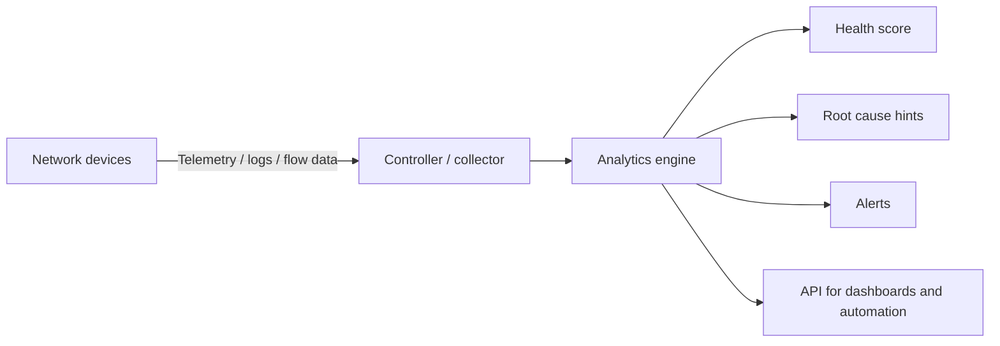

### Benefits

- Faster troubleshooting.
- Better baseline of normal behavior.
- Easier compliance reporting.
- Improved visibility into fabric-wide state.

### Risks

- Telemetry volume can be large.
- Health scores can hide detail.
- Operators may trust dashboards without validating device state.
- Time synchronization and data quality matter.

## 18. Security Implications of SDN

SDN improves security by enabling centralized segmentation and policy, but it also introduces new attack surfaces.

### Security Benefits

- Centralized policy definition.
- Consistent segmentation.
- Identity-based access.
- Faster policy deployment.
- Better audit trail.
- Integration with security platforms.
- Easier quarantine or dynamic policy response.

### New Risks

- Controller compromise can have broad impact.
- API token leakage can enable unauthorized changes.
- Automation account misuse can bypass manual controls.
- Misconfigured intent can deploy incorrect policy at scale.
- Weak RBAC can allow excessive administrative access.
- Controller backup files may contain sensitive policy or credentials.

### Security Controls

- MFA for administrators.
- RBAC with least privilege.
- Separate human and automation accounts.
- API token rotation.
- Certificate lifecycle management.
- Controller management network isolation.
- Audit logging.
- Configuration backup encryption.
- Change approval and validation.
- Regular policy review.

## 19. Cisco SDN Solution Mapping

Cisco has several SDN-oriented architectures, each optimized for a different domain.

| Domain | Cisco Solution | Primary Controller / Manager | Main Use Case |
|---|---|---|---|
| Data center | Cisco ACI | Cisco APIC / Nexus Dashboard ecosystem | Data center fabric, application policy, segmentation |
| Campus | Cisco SD-Access | Cisco Catalyst Center with Cisco ISE | Wired/wireless campus fabric, identity-based segmentation |
| WAN | Cisco Catalyst SD-WAN | SD-WAN Manager and controllers | WAN overlay, application-aware routing, branch connectivity |
| Branch / lean IT | Cisco Meraki | Meraki Dashboard | Cloud-managed branch, wireless, security, SD-WAN |
| Cross-domain | Cisco Validated designs and integrations | Multiple controllers | Integration of ACI, SD-Access, SD-WAN, security |

Cisco describes SDN as an architecture that centralizes management by abstracting the control plane from forwarding functions. Cisco ACI is positioned as an SDN solution for data centers. Cisco SD-Access uses Catalyst Center to automate and apply policy across wired and wireless campus fabrics. Cisco Validated guidance includes cross-architectural integration involving Catalyst Center for SD-Access, SD-WAN Manager for SD-WAN, APIC for ACI, and firewall management platforms.

## 20. Cisco ACI Deep Dive Overview

Cisco ACI is a data center SDN architecture based on an application-centric policy model.

Key components:

- APIC: controller cluster.
- Spine switches: fabric core.
- Leaf switches: endpoint attachment and policy enforcement.
- Tenant: administrative/policy container.
- VRF: Layer 3 routing context.
- Bridge Domain: Layer 2 forwarding domain.
- EPG: Endpoint Group.
- Contract: policy controlling communication between EPGs.

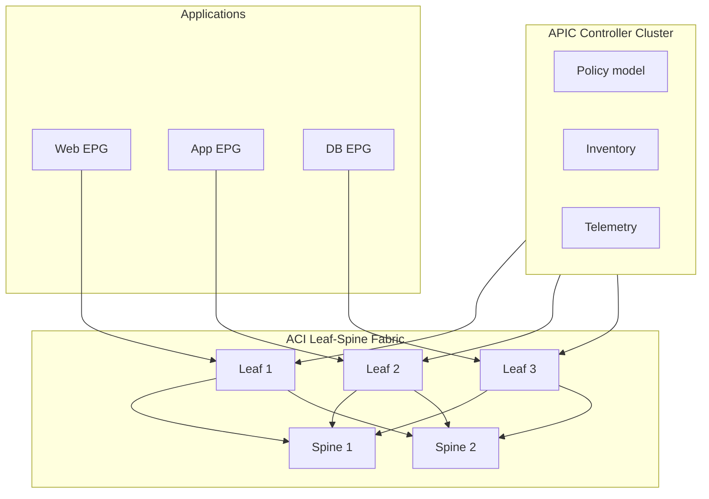

### ACI Policy Example

Application tiers:

- Web EPG.
- App EPG.
- DB EPG.

Policy:

- Web can talk to App on TCP 8443.
- App can talk to DB on TCP 1521.
- Web cannot talk directly to DB.
- Admin jump host can access Web/App/DB management ports.

Traditional design may implement this with VLANs, ACLs, firewall zones, and VRFs. ACI expresses it through EPGs and contracts.

### Strengths

- Strong data center fabric model.
- Good fit for application-tier segmentation.
- Policy abstraction via EPG and contracts.
- Integration with physical and virtual workloads.
- API-driven operations.
- Supports automation and multi-fabric/multicloud operational models through the broader Cisco ecosystem.

### Design Considerations

- Requires good application dependency mapping.
- EPG design can become complex if every exception becomes a new group.
- Operations team must learn ACI object model.
- Brownfield migration requires careful L2/L3 boundary planning.
- Integration with firewalls and external networks must be designed deliberately.

## 21. Cisco SD-Access Deep Dive Overview

Cisco SD-Access applies SDN concepts to campus and branch LAN/WLAN environments.

Key components:

- Cisco Catalyst Center: automation, assurance, and fabric management.
- Cisco ISE: identity, SGT, access policy.
- Fabric edge: endpoint attachment.
- Fabric border: external connectivity.
- Control plane node: endpoint location mapping.
- VXLAN: data plane encapsulation.
- LISP: endpoint mapping/control-plane function.
- VN: Virtual Network.
- SGT: Scalable Group Tag.

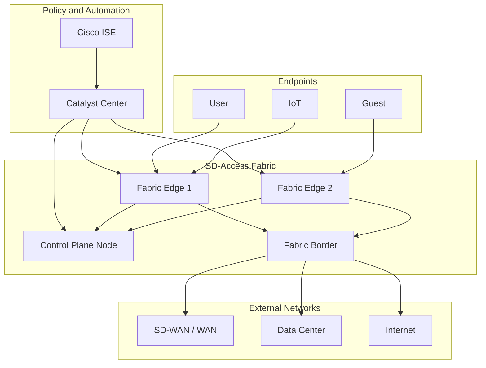

### SD-Access Policy Example

Segments:

- Corporate users.
- Contractors.
- Guest.
- IoT.
- OT.
- Management.

Policy examples:

- Guest can access Internet only.
- IoT can access defined application servers only.
- Contractors can access project systems, not internal admin systems.
- OT can reach historian and jump host only.
- Management can access infrastructure devices.

### Strengths

- Identity-based segmentation.
- Consistent wired and wireless policy.
- Reduced dependence on physical location for access policy.
- Catalyst Center provides automation and assurance.
- Strong fit for campus modernization and zero-trust access initiatives.

### Design Considerations

- Requires identity design, often with Cisco ISE.
- Brownfield campus migration needs careful device readiness assessment.
- Operational teams must understand fabric roles and boundary behavior.
- Policy matrix must be designed before broad rollout.
- Integration with non-fabric areas must be planned carefully.

## 22. Cisco Catalyst SD-WAN as a Familiar SDN Example

Because learners already know Cisco SD-WAN, it is the best bridge into broader SDN thinking.

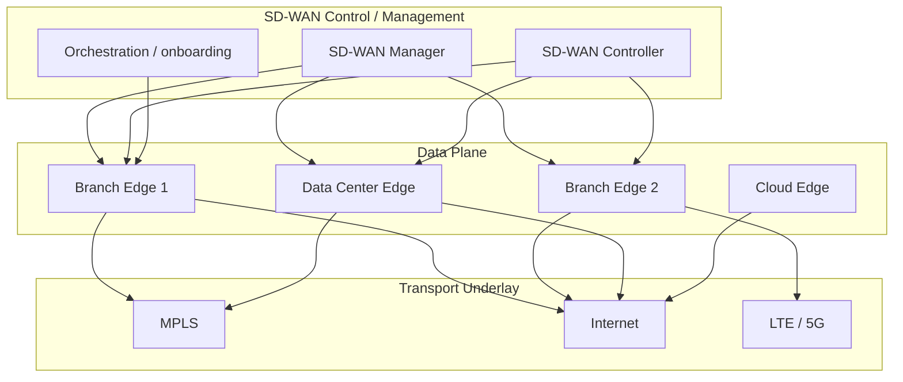

SD-WAN demonstrates:

- Underlay and overlay separation.
- Controller-based policy.
- Centralized templates.
- Zero-touch provisioning.
- Application-aware routing.
- Secure tunnels.
- Centralized monitoring.
- API-driven management.

### SD-WAN Policy Example

Business requirement:

- Voice prefers MPLS if latency is below 100 ms.
- Microsoft 365 should use local Internet breakout.
- ERP should go to data center.
- Guest traffic should go directly to Internet.
- If MPLS fails, critical traffic can use Internet tunnel.

SDN interpretation:

- The desired behavior is policy.
- The controller distributes policy.
- Edges enforce forwarding.
- Telemetry validates SLA.

### Strengths

- Strong business case: WAN cost, agility, application experience.
- Excellent example of overlay networking.
- Mature operational model for branch connectivity.
- Useful first SDN transformation domain.

### Design Considerations

- Transport quality still matters.
- Local Internet breakout changes security architecture.
- Policy complexity can grow quickly.
- Cloud/SaaS routing requires careful DNS and security design.
- Controller reachability and certificate lifecycle matter.

## 23. Cisco Meraki SD-WAN and Cloud-Managed Networking

Meraki represents a cloud-managed approach to SDN-style operations.

Typical value:

- Simple branch management.
- Cloud dashboard.
- Auto VPN.
- Integrated wireless, switching, security, and SD-WAN.
- Reduced operational overhead.

Best fit:

- Lean IT.
- Distributed retail.
- Small and medium branches.
- Fast deployment requirements.

Considerations:

- Less low-level control than some enterprise platforms.
- Cloud dashboard dependency must be understood.
- Feature depth and customization may differ from Catalyst SD-WAN.
- Governance and admin RBAC remain important.

## 24. Multi-Domain SDN Architecture

Large enterprises rarely use one SDN domain for everything. A realistic architecture may combine:

- ACI in the data center.
- SD-Access in campus.
- Catalyst SD-WAN across WAN.
- Meraki for smaller branches.
- Public cloud networking.
- Firewalls and security service edge.
- ITSM and source of truth.

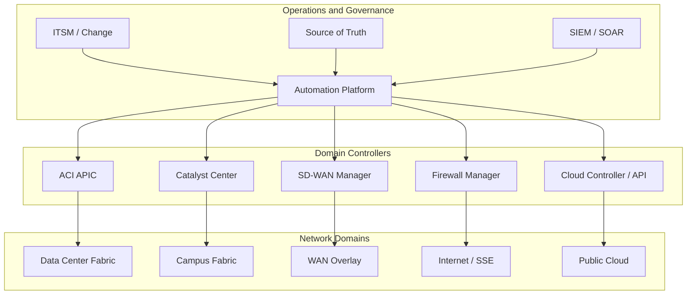

### Cross-Domain Challenges

- Policy consistency.
- Identity propagation.
- Route exchange.
- Segmentation mapping.
- Firewall insertion.
- Overlapping IP address spaces.
- Change coordination.
- End-to-end troubleshooting.
- Ownership between network, security, server, cloud, and OT teams.

### Practical Recommendation

Do not try to solve every domain on Day 1 of transformation. Pick a domain with clear business value and manageable scope, then design integration points carefully.

## 25. Open-Source SDN Platforms for Learning

Open-source tools are extremely useful for understanding SDN principles.

| Tool | Purpose | Best Use in Training |
|---|---|---|
| Mininet | Emulates hosts, switches, links | Build quick SDN topologies |
| Open vSwitch | Virtual switch with OpenFlow support | Inspect flow tables and forwarding |
| Ryu | Python SDN controller framework | Write simple controller applications |
| OpenDaylight | SDN controller platform | Explore controller architecture |
| ONOS | Network operating system | Study carrier/service-provider SDN concepts |

### Why Use Mininet on Day 1

Mininet allows learners to see:

- Hosts.
- Virtual switches.
- Links.
- Controller interaction.
- Flow installation.
- Packet behavior when controller logic changes.

This makes abstract SDN concepts visible.

## 26. Deep-Dive Example: Packet Walk in SDN

Scenario:

- User in Campus Segment `Corp-Users`.
- Application in Data Center Segment `ERP-App`.
- Traffic crosses campus fabric, WAN overlay, and data center fabric.

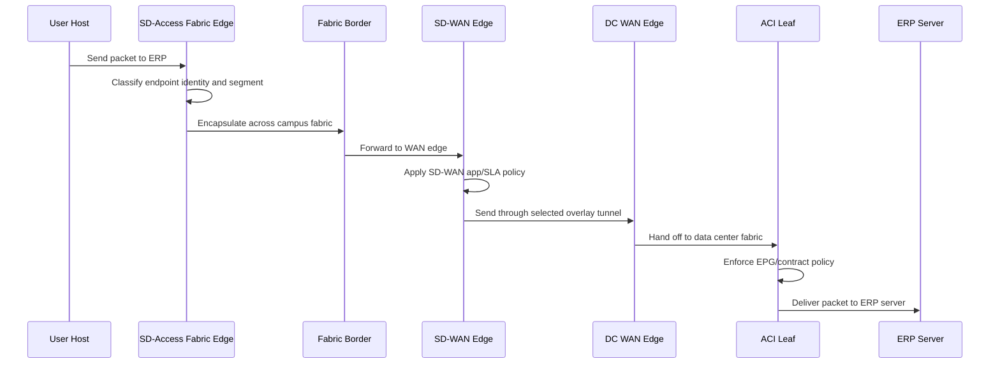

Troubleshooting checkpoints:

- Is the user correctly authenticated?
- Is the endpoint in the correct segment/group?
- Is campus fabric encapsulation working?
- Is border routing correct?
- Is SD-WAN policy selecting the expected path?
- Are tunnels up?
- Is data center routing correct?
- Does ACI contract allow the traffic?
- Is firewall policy involved?
- Is DNS resolving to the expected destination?

## 27. SDN Design Trade-Offs

| Decision | Benefit | Trade-Off |
|---|---|---|
| Centralized policy | Consistency and scale | Controller becomes operationally critical |
| Overlay networking | Flexibility and segmentation | More encapsulation and troubleshooting layers |
| API automation | Speed and repeatability | Requires governance and testing |
| Identity-based access | Better security | Depends on identity data quality |
| Fabric abstraction | Simpler operations at scale | Engineers must learn new object models |
| Multi-domain SDN | Best tool for each domain | Integration complexity |
| Closed-loop automation | Faster response | Risk of automated incorrect action |

## 28. SDN Migration Strategy for Brownfield Networks

Most enterprises will migrate gradually.

### Phase 1: Assessment

Collect:

- Device inventory.
- Software versions.
- Hardware capability.
- Topology.
- IP plan.
- VLAN/VRF mapping.
- Routing design.
- Firewall policies.
- WAN circuits.
- Application dependencies.
- Existing monitoring.
- Known pain points.

### Phase 2: Standardization

Before SDN, clean up:

- Naming conventions.
- Site codes.
- IP address management.
- VLAN and VRF standards.
- Device role definitions.
- Logging and NTP.
- AAA.
- Backup process.

### Phase 3: First Automation

Start with low-risk tasks:

- Configuration backup.
- Compliance checks.
- Inventory collection.
- Interface description standardization.
- NTP/SNMP/syslog deployment.
- Reporting.

### Phase 4: Pilot

Good pilot candidates:

- A new branch.
- A lab data center pod.
- A limited campus building.
- Guest network segmentation.
- A non-critical application zone.

Avoid starting with:

- Core production data center migration.
- OT systems with unclear dependencies.
- Highly customized legacy sites.
- Environments with poor documentation.

## 29. Advantages and Disadvantages of SDN

### Advantages

- Centralized policy and governance.
- Faster deployment of network services.
- Better automation.
- Better segmentation.
- Improved visibility and assurance.
- Reduced manual configuration errors.
- Easier integration with IT workflows.
- Better support for cloud and distributed applications.
- More consistent operations across sites.

### Disadvantages and Risks

- Controller dependency.
- New skills required.
- API and automation security risks.
- Higher initial design complexity.
- Vendor-specific object models.
- Migration complexity in brownfield networks.
- Troubleshooting requires both traditional and SDN skills.
- Poorly planned policy can be deployed at scale.

### When SDN Is a Strong Fit

- Many similar sites.
- Frequent network changes.
- Need for segmentation.
- Need for centralized policy.
- Hybrid cloud connectivity.
- Application-aware WAN requirements.
- Desire for network automation.
- Need for better assurance and telemetry.

### When SDN May Not Be the First Priority

- Very small stable network.
- Poor basic documentation.
- Severe underlay instability.
- No change management discipline.
- No ownership model for controller operations.
- No security model for API access.
- Team not ready for automation workflows.

## 30. Instructor Guidance for Day 1

Recommended teaching flow:

1. Begin with Cisco SD-WAN as the familiar example.
2. Abstract SD-WAN into SDN concepts: controller, edge, overlay, underlay, policy, telemetry.
3. Generalize to campus, data center, cloud, and security.
4. Introduce OpenFlow only as a learning model, not as the definition of SDN.
5. Use diagrams to separate architecture from product names.
6. End with brownfield migration thinking.

Suggested emphasis:

- Experienced engineers may resist SDN if it sounds like marketing. Anchor every concept in an operational problem.
- Keep repeating: SDN does not remove network fundamentals.
- When discussing controller-based networking, always discuss failure mode.
- When discussing automation, always discuss validation and rollback.
- When discussing segmentation, always ask who owns the policy matrix.

## 31. Class Discussion Exercises

### Exercise 1: Map Cisco SD-WAN to SDN Layers

Ask learners to map:

- WAN Edge.
- SD-WAN Manager.
- Controller/control connection.
- Templates.
- Centralized policy.
- Localized policy.
- Application-aware routing.
- Overlay tunnel.
- Transport underlay.

To:

- Data plane.
- Control plane.
- Management plane.
- Application plane.
- Northbound API.
- Southbound/control interface.
- Underlay.
- Overlay.

### Exercise 2: Brownfield SDN Readiness

Scenario:

An enterprise has 50 campus switches, 10 WAN routers, 2 firewalls, several VLANs per site, inconsistent ACLs, and limited documentation. Leadership wants to "move to SDN" within 12 months.

Questions:

- What should be assessed first?
- Which domain should be piloted first: WAN, campus, or data center?
- What should remain traditional during the first phase?
- Which tasks should be automated first?
- What metrics prove the SDN project is successful?

### Exercise 3: Policy Matrix Design

Groups:

- Corporate users.
- Guest.
- IoT.
- Camera.
- OT.
- Server.
- Management.

Ask learners to define:

- Allowed flows.
- Denied flows.
- Enforcement point.
- Logging requirement.
- Exception process.

## 32. Review Questions

1. Why is SDN an architecture rather than a single technology?
2. What is the difference between data plane and control plane?
3. Why is the management plane especially important in SDN?
4. What is the difference between northbound and southbound APIs?
5. Why is OpenFlow not equal to SDN?
6. Why must the underlay be stable before overlay troubleshooting?
7. What happens if a controller fails? What depends on the specific architecture?
8. How does Cisco SD-WAN demonstrate SDN principles?
9. What is the difference between VLAN-based segmentation and policy-based segmentation?
10. Why is source of truth important for network automation?
11. What are the security risks of controller-based networking?
12. Which enterprise domain is usually a good candidate for a first SDN pilot, and why?

## 33. Preparation for Day 1 Lab

The Day 1 lab should use Mininet and Open vSwitch to make SDN visible.

Lab goals:

- Build a small virtual network.
- Start an SDN controller.
- Observe host connectivity.
- Inspect Open vSwitch flow tables.
- Add or remove flows.
- Observe behavior when controller connectivity changes.

Recommended tools:

- Ubuntu VM.
- Mininet.
- Open vSwitch.
- Python 3.
- Ryu or simple controller.
- Wireshark optional.

Lab concepts to connect back to theory:

- Control plane vs data plane.
- Flow table.
- Controller-to-switch interaction.
- Default forwarding behavior.
- Failure behavior.
- Why production SDN uses richer policy models than raw flow entries.

## 34. Key Takeaways

- SDN is a way to make networking more programmable, policy-driven, and centrally coordinated.
- SDN is not the same as OpenFlow.
- SDN does not eliminate traditional networking knowledge.
- Underlay and overlay must be understood separately.
- Controllers coordinate intent, policy, configuration, and telemetry.
- APIs are operational interfaces, not optional add-ons.
- Automation without validation can create outages faster.
- Segmentation is one of the strongest SDN use cases.
- Cisco SD-WAN is a practical and familiar SDN example.
- Enterprise SDN transformation should be phased, evidence-based, and tied to business problems.

## 35. References

- Cisco, Software-Defined Networking overview: https://www.cisco.com/c/en/us/solutions/software-defined-networking/overview.html
- Cisco, Cisco ACI solution overview: https://www.cisco.com/c/en/us/solutions/collateral/data-center-virtualization/application-centric-infrastructure/solution-overview-c22-741487.html
- Cisco, Cisco SD-Access Solution Design Guide: https://www.cisco.com/c/en/us/td/docs/solutions/CVD/Campus/cisco-sda-design-guide.html
- Cisco, Catalyst Center: https://www.cisco.com/site/us/en/products/networking/catalyst-center/index.html
- Cisco, Catalyst SD-WAN: https://www.cisco.com/site/us/en/solutions/networking/sdwan/catalyst/index.html
- Cisco, Common Policy Integration Guide: https://www.cisco.com/c/en/us/td/docs/cloud-systems-management/network-automation-and-management/catalyst-center/cisco-validated-solution-profiles/common-policy-integration-guide.html
- Cisco, ACI and Catalyst SD-WAN integration: https://www.cisco.com/c/en/us/td/docs/routers/sdwan/configuration/policies/ios-xe-17/policies-book-xe/integration-with-Cisco-ACI.html
- Open Networking Foundation: https://opennetworking.org/
- Open vSwitch documentation: https://docs.openvswitch.org/
- Mininet documentation: http://mininet.org/

