# Day 2 - SDN Integration and Deployment Deep Dive

## 1. Day 2 Positioning and Learning Outcomes

Day 1 introduced SDN concepts, architecture, control/data plane separation, APIs, underlay/overlay, fabric, policy, and major Cisco SDN domains.

Day 2 focuses on the practical question every enterprise eventually faces:

> How do we introduce SDN into an existing traditional network without breaking the business?

This day is written for experienced network engineers who already understand routing, switching, WAN, firewalling, and segmentation. SD-WAN is treated as one SDN deployment domain. The emphasis is on architecture, integration, migration, design trade-offs, and brownfield reality.

By the end of Day 2, learners should be able to:

- Explain common SDN deployment models: greenfield, brownfield, hybrid, pilot, phased rollout.
- Identify integration points between SDN fabrics and traditional networks.
- Design routing boundaries between SDN and non-SDN domains.
- Explain how segmentation is extended or translated across campus, WAN, data center, cloud, and OT.
- Recognize common multi-domain SDN challenges.
- Build a migration strategy from traditional networking to SDN.
- Design a high-level SDN architecture for an enterprise with data centers, offices, branches, cloud, and IT/OT zones.
- Evaluate operational risks, rollback strategies, and acceptance criteria.

## 2. Why Integration Matters More Than the SDN Product

In a real enterprise, SDN rarely starts from a blank sheet. Most organizations already have:

- Existing VLANs and VRFs.
- Existing IP addressing.
- Existing WAN circuits.
- Existing firewalls.
- Existing routing domains.
- Existing monitoring tools.
- Existing security policies.
- Existing operational processes.
- Existing business-critical applications.
- Existing technical debt.

An SDN deployment succeeds when it integrates cleanly with this environment. It fails when the SDN domain works in isolation but creates confusion at the boundaries.

Typical symptoms of poor integration:

- Users inside the SDN fabric can reach some applications but not others.
- Routing works one way but return traffic follows a different path.
- Policies look correct in the controller but traffic is blocked by external firewalls.
- Segmentation exists inside one domain but is lost across the WAN.
- Monitoring tools do not understand overlay tunnels.
- Operations teams cannot determine whether an issue belongs to campus, WAN, data center, firewall, cloud, or identity.

### Key Principle

> SDN design is boundary design.

Inside a fabric, the controller may simplify many tasks. At the boundary, engineers must still solve routing, security, policy translation, NAT, DNS, identity, telemetry, and ownership.

## 3. Deployment Models: Greenfield, Brownfield, and Hybrid

## 3.1 Greenfield Deployment

A greenfield deployment means building a new network environment with minimal legacy constraints.

Examples:

- New data center pod.
- New headquarters building.
- New manufacturing site.
- New branch network.
- New cloud landing zone.

Advantages:

- Clean design.
- Standardized addressing and naming.
- Easier hardware/software selection.
- Easier policy model.
- Fewer legacy exceptions.
- Better opportunity to automate from the start.

Disadvantages:

- Less common than brownfield.
- Still needs integration with the rest of the enterprise.
- Design mistakes may become the new baseline.
- Business teams may underestimate operational readiness requirements.

### Greenfield Example

An enterprise builds a new data center using a leaf-spine fabric and Cisco ACI. Because the environment is new, the team can design tenants, VRFs, bridge domains, EPGs, and contracts from application requirements instead of inheriting years of VLAN sprawl.

## 3.2 Brownfield Deployment

A brownfield deployment introduces SDN into an existing production environment.

Examples:

- Migrating an existing campus to SD-Access.
- Introducing SD-WAN while keeping MPLS and existing routers during transition.
- Moving selected applications into ACI while legacy data center VLANs remain active.
- Extending segmentation to OT without redesigning all industrial systems.

Advantages:

- Targets real business problems.
- Can reuse existing investments.
- Can be phased gradually.
- Allows operational learning before full migration.

Disadvantages:

- Existing inconsistencies become migration blockers.
- Documentation may be incomplete.
- Legacy dependencies may be unknown.
- Rollback can be complex.
- Temporary hybrid states may last longer than expected.

### Brownfield Reality

Most SDN projects are brownfield projects. The technical challenge is not only configuring SDN. It is understanding what already exists, deciding what to preserve, and creating a transition path that does not interrupt critical services.

## 3.3 Hybrid Deployment

A hybrid deployment uses SDN in some domains while traditional networking remains in others.

Typical examples:

- SD-WAN for branch connectivity, traditional campus LAN.
- ACI in data center, traditional WAN.
- SD-Access in headquarters, traditional Layer 3 at smaller branches.
- Meraki at retail branches, Catalyst SD-WAN at large branches.
- Cloud-native networking in AWS/Azure/GCP, traditional data center core.

Hybrid is normal. The goal is not to make everything SDN immediately. The goal is to define clear integration boundaries and operating responsibilities.

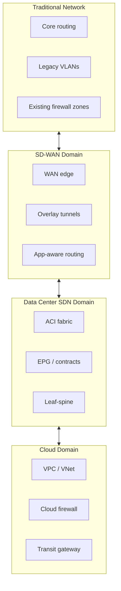

## 4. SDN Integration Domains

An enterprise SDN architecture usually touches several domains:

- Campus LAN.
- Wireless LAN.
- WAN and branch.
- Data center.
- Cloud.
- Internet edge.
- Remote access.
- Security services.
- OT/industrial networks.
- Network management.
- Identity services.

Each domain has different constraints.

| Domain | SDN Goal | Key Integration Challenge |
|---|---|---|
| Campus | Identity-based access and segmentation | Existing VLANs, NAC, wireless, endpoint identity |
| WAN | Application-aware transport and branch agility | MPLS/Internet coexistence, routing, security stack |
| Data center | Application policy and workload segmentation | App dependency mapping, L4-L7 insertion, migration |
| Cloud | Hybrid connectivity and consistent segmentation | Cloud-native constructs, routing, overlapping IP |
| Security | Central policy and inspection | Firewall placement, identity, logging, policy ownership |
| OT | Controlled isolation and visibility | Legacy protocols, safety, availability, vendor systems |
| Operations | Automation and assurance | Tool integration, RBAC, process change |

## 5. Integration Between SDN and Traditional Networks

The most important technical boundary is where an SDN domain connects to a non-SDN domain.

At this boundary, engineers must decide:

- Which routing protocol is used?
- Which routes are advertised?
- Are routes summarized?
- Are VRFs preserved?
- Is route leaking required?
- Where is the default route?
- Where is NAT performed?
- Where is traffic inspected?
- Where is policy enforced?
- How is segmentation represented?
- How is telemetry collected?

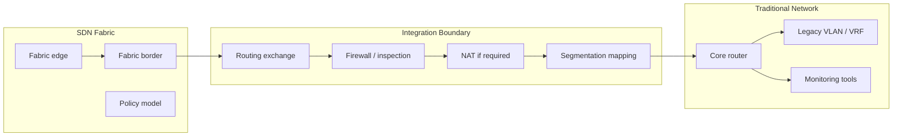

## 6. Routing Integration

Routing is often the first hard integration topic. SDN fabrics may hide some internal forwarding complexity, but external reachability still depends on routing.

Common routing integration options:

- Static routing.
- OSPF.
- IS-IS.
- EIGRP in some environments.
- BGP.
- EVPN in data center fabrics.
- Route redistribution.
- Default route injection.
- Route summarization.

## 6.1 Static Routing

Static routing is simple and predictable for small integrations.

Good use cases:

- Lab environments.
- Small branch.
- Single exit point.
- Limited external prefixes.
- Controlled pilot.

Advantages:

- Easy to understand.
- No protocol adjacency risks.
- Predictable path.

Disadvantages:

- Poor scalability.
- Manual updates.
- Weak failure handling unless combined with tracking.
- Can become operational debt.

## 6.2 Dynamic Routing

Dynamic routing is preferred when the environment has multiple paths, redundancy, or many prefixes.

BGP is common at SDN boundaries because it provides:

- Policy control.
- Route filtering.
- Summarization.
- Multi-domain scalability.
- Clear administrative boundaries.
- Good fit for WAN, data center, and cloud.

OSPF or IS-IS may be used for underlay or internal domains, but many architects prefer BGP at inter-domain boundaries because it gives stronger policy control.

## 6.3 Route Redistribution

Route redistribution is powerful but dangerous.

Risks:

- Route loops.
- Prefix explosion.
- Incorrect administrative distance.
- Loss of route tags.
- Asymmetric paths.
- Unexpected default route propagation.

Best practices:

- Redistribute only what is required.
- Use route maps/policies.
- Tag redistributed routes.
- Summarize where possible.
- Document ownership.
- Validate return paths.
- Monitor route table size.

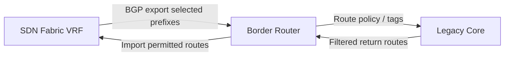

## 6.4 Default Route Design

The default route is a design decision, not a default setting.

Questions:

- Should fabric endpoints use a local default route?
- Should default route point to firewall?
- Should branch Internet traffic exit locally or through data center?
- Should guest traffic be isolated with a separate default route?
- Should OT have no default route?
- How is cloud egress handled?

Poor default route design can cause:

- Hairpin traffic.
- Security bypass.
- Asymmetric routing.
- Firewall state issues.
- Poor application performance.

## 7. Segmentation Integration

Segmentation is one of the strongest reasons to adopt SDN, but also one of the hardest things to integrate across domains.

Traditional segmentation constructs:

- VLAN.
- Subnet.
- VRF.
- ACL.
- Firewall zone.
- Security group.

SDN segmentation constructs:

- Virtual Network.
- Tenant.
- EPG.
- Contract.
- SGT.
- Group policy.
- Overlay segment.
- Application-aware policy.

The design challenge is mapping these constructs.

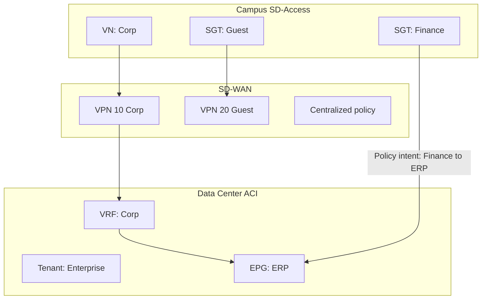

## 7.1 Macrosegmentation

Macrosegmentation separates large trust zones.

Examples:

- Corporate.
- Guest.
- IoT.
- OT.
- Management.
- PCI.
- DMZ.

Common technical implementation:

- VRFs.
- VNs.
- Separate routing tables.
- Firewall zones.
- SD-WAN VPNs.

Advantages:

- Strong separation.
- Easier to understand.
- Good for high-level security zones.

Disadvantages:

- Too many VRFs can become complex.
- Route leaking can become difficult.
- Some applications may require cross-zone exceptions.

## 7.2 Microsegmentation

Microsegmentation controls communication within or between finer groups.

Examples:

- Web tier to app tier.
- App tier to database tier.
- Finance users to ERP.
- Camera devices to video recorder.
- OT sensors to historian.

Common technical implementation:

- ACI EPGs and contracts.
- SGT-based policies.
- Firewall rules.
- Host-based controls.
- Cloud security groups.

Advantages:

- Reduces lateral movement.
- Supports least privilege.
- Improves compliance.

Disadvantages:

- Requires accurate dependency mapping.
- Can create many exceptions.
- Troubleshooting becomes more policy-aware.
- Requires governance between network, security, app, and OT teams.

## 8. Firewall and Security Integration

SDN does not remove firewalls. It changes where and how firewalls are inserted.

Security enforcement may occur at:

- Fabric edge.
- Fabric border.
- Data center leaf.
- SD-WAN edge.
- Internet edge.
- Cloud firewall.
- Host agent.
- OT firewall.
- SSE/SASE platform.

The central design question:

> Which traffic must be inspected by a firewall, and which traffic can be controlled by fabric policy?

## 8.1 East-West vs North-South Traffic

North-south traffic:

- User to Internet.
- Branch to data center.
- Data center to cloud.
- Remote user to internal application.

East-west traffic:

- Server to server.
- Endpoint to endpoint.
- Application tier to database tier.
- OT cell to OT cell.

Traditional firewall designs often focused heavily on north-south inspection. Modern security requirements increasingly demand east-west control.

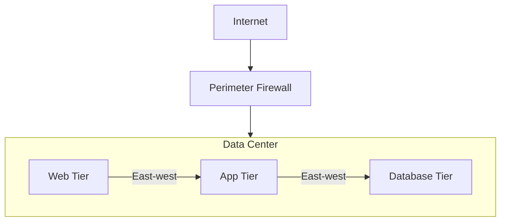

## 8.2 Firewall Insertion Patterns

Common patterns:

- Firewall outside the fabric.
- Firewall at fabric border.
- Firewall as service node inside fabric.
- Distributed enforcement using fabric policy plus firewall for selected flows.
- Cloud firewall integrated with transit routing.

### Pattern 1: Firewall Outside the Fabric

Advantages:

- Familiar.
- Clear security boundary.
- Easier initial migration.

Disadvantages:

- May hairpin traffic.
- May not inspect intra-fabric east-west flows.
- Policy may be split between fabric and firewall.

### Pattern 2: Firewall Integrated Into Fabric

Advantages:

- Better application-aware service insertion.
- More granular inspection options.
- Can align with microsegmentation.

Disadvantages:

- More complex design.
- Requires strong coordination.
- Troubleshooting needs fabric and firewall expertise.

## 9. NAT Integration

NAT is often overlooked in SDN design.

Questions:

- Is NAT required between branch and data center?
- Is NAT required for overlapping IPs?
- Where does Internet NAT happen?
- Does guest traffic use separate NAT?
- Does cloud connectivity require NAT?
- Are OT systems using legacy overlapping addressing?

NAT risks:

- Breaks identity based on original source IP.
- Complicates troubleshooting.
- Creates asymmetric path problems.
- Interacts poorly with some application protocols.
- Can hide policy mistakes.

Best practice:

- Avoid NAT inside trusted enterprise domains unless required.
- Use NAT deliberately at clear boundaries.
- Document pre-NAT and post-NAT identity.
- Ensure logs preserve useful source context.

## 10. Identity Integration

SDN segmentation becomes much more powerful when connected to identity.

Identity sources:

- Active Directory.
- LDAP.
- SAML/OIDC identity provider.
- RADIUS.
- TACACS+.
- Cisco ISE.
- Endpoint profiling.
- Certificate authority.
- MDM/UEM.
- Asset inventory.

Identity can describe:

- User.
- Device.
- Device type.
- Location.
- Posture.
- Ownership.
- Business role.
- Security group.

## 10.1 Identity-Based Policy Example

Business intent:

- Finance users can access ERP from managed devices.
- Contractors can access only project tools.
- Guest users can access Internet only.
- OT engineer can access OT jump host with MFA.

Technical enforcement may combine:

- 802.1X.
- Cisco ISE.
- SGT.
- SD-Access group policy.
- Firewall user identity.
- VPN posture.
- Cloud identity.

### Risk

Identity-based networking depends on identity data quality. If endpoint profiling is wrong, policy enforcement may be wrong.

## 11. Integrating Multiple SDN Domains

Large organizations may deploy multiple SDN technologies. This creates a new challenge: SDN-to-SDN integration.

Examples:

- Cisco SD-Access to Cisco ACI.
- Cisco SD-WAN to Cisco ACI.
- Cisco SD-WAN to public cloud.
- SD-Access to firewall manager.
- Meraki branch to Catalyst SD-WAN or data center.
- Cloud-native networking to enterprise SD-WAN.

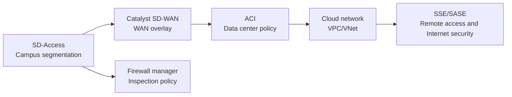

## 11.1 Common Multi-Domain Problems

Policy mismatch:

- Campus uses SGT.
- Data center uses EPG.
- SD-WAN uses VPN and application policy.
- Cloud uses security groups.
- Firewalls use zones and objects.

Routing mismatch:

- Different domains summarize differently.
- Some domains use VRF/VPN separation.
- Cloud may have route table limits.
- SD-WAN may use centralized policy.

Operational mismatch:

- Each domain has a different controller.
- Each team has a different dashboard.
- Each controller has different RBAC.
- Each platform has different telemetry.

Change management mismatch:

- Campus changes may be controlled by network access team.
- Data center changes may be controlled by application or platform team.
- Firewall changes may be controlled by security.
- Cloud changes may be controlled by DevOps.

## 11.2 Integration Strategy

For every pair of SDN domains, define:

- What is the routing boundary?
- What is the segmentation mapping?
- What is the policy owner?
- What is the source of truth?
- What is the troubleshooting workflow?
- What telemetry is collected?
- What is the rollback process?
- What is the acceptance test?

## 12. Enterprise SDN Reference Architecture

The following model can be used for an enterprise with:

- One primary data center.
- One disaster recovery data center.
- Headquarters.
- Multiple branch offices.
- Manufacturing/OT sites.
- Public cloud.
- Internet/SaaS access.
- Remote users.

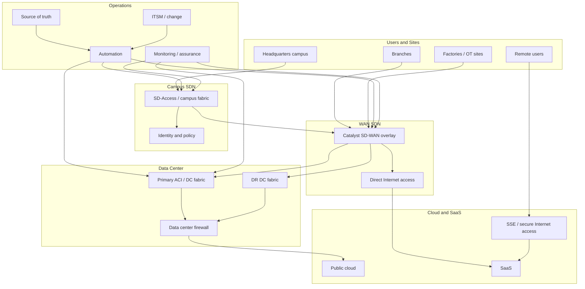

## 13. Design for Data Center SDN

Data center SDN usually focuses on:

- Leaf-spine fabric.
- Application segmentation.
- Workload mobility.
- Automation.
- L4-L7 service insertion.
- Multi-tenancy.
- Hybrid cloud connectivity.

## 13.1 Data Center Design Questions

- Is this a new fabric or migration from legacy core/aggregation/access?
- What are the application tiers?
- Which applications require Layer 2 adjacency?
- Which workloads are virtual, bare metal, containerized, or cloud-based?
- What is the segmentation model?
- Where are firewalls inserted?
- Is route leaking required?
- How is disaster recovery handled?
- How are load balancers integrated?
- How are shared services exposed?

## 13.2 Data Center Migration Pattern

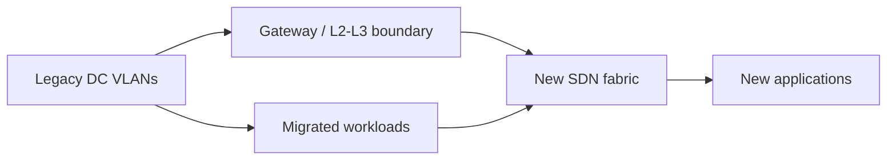

Common migration options:

- New applications go directly to SDN fabric.
- Existing applications migrate gradually.
- Legacy VLANs are extended temporarily.
- Routing boundary is used to avoid L2 extension.
- Firewalls and load balancers are integrated in phases.

### Design Recommendation

Avoid unnecessary Layer 2 extension during migration. It may simplify initial cutover but can preserve legacy failure domains and delay proper segmentation.

## 14. Design for Campus SDN

Campus SDN usually focuses on:

- User and device segmentation.
- Wired and wireless policy consistency.
- Identity-based access.
- Automated provisioning.
- Assurance and troubleshooting.

## 14.1 Campus Design Questions

- Which switches are fabric-capable?
- Is the access layer ready for 802.1X?
- Is endpoint identity reliable?
- How will guests be handled?
- How will IoT devices be profiled?
- Which sites should be fabric-enabled first?
- Where are fabric borders?
- How are legacy VLANs integrated?
- How is wireless integrated?
- How is segmentation mapped to the WAN and data center?

## 14.2 Campus Migration Pattern

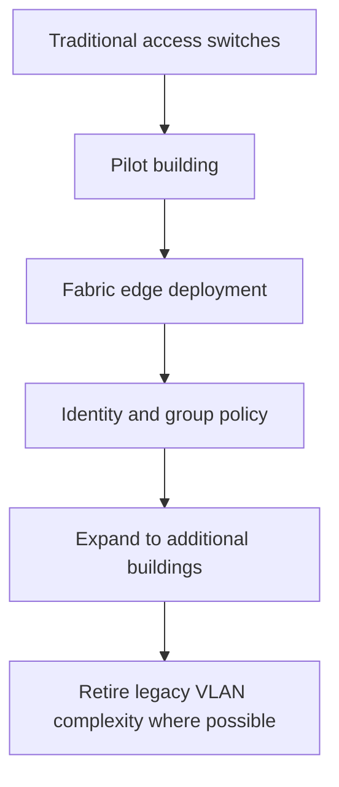

Good pilot candidates:

- A building with modern switches.
- A controlled user group.
- Guest network.
- IoT onboarding use case.
- New office floor.

Poor pilot candidates:

- Executive floor with many exceptions.
- OT environment with unknown dependencies.
- Building with old access switches.
- Site with poor cabling or unstable uplinks.

## 15. Design for SD-WAN and Branch Integration

SD-WAN is often the first SDN domain enterprises adopt because the business case is clear:

- Better branch agility.
- Transport independence.
- Application-aware routing.
- Centralized templates.
- Improved cloud/SaaS access.
- Reduced dependence on private WAN.

## 15.1 SD-WAN Design Questions

- What transports are available: MPLS, Internet, LTE/5G?
- Is local Internet breakout allowed?
- Where is security inspection performed?
- Which applications are business critical?
- What SLA thresholds are required?
- Which branches need high availability?
- How is segmentation mapped into SD-WAN VPNs?
- How are legacy branches migrated?
- How is DNS handled for SaaS?
- How are cloud on-ramps handled?

## 15.2 Branch Migration Pattern

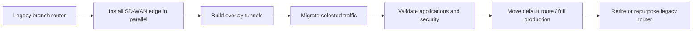

### Common SD-WAN Integration Risks

- Asymmetric routing between MPLS and Internet.
- Firewall policy not aligned with local breakout.
- SaaS traffic affected by DNS path.
- Overlapping routes between legacy and SD-WAN.
- Branch segmentation not mapped to data center security zones.
- Controller reachability blocked by firewall.

## 16. Design for Cloud Integration

Cloud integration introduces a different operational model. Cloud networks use constructs such as:

- VPC/VNet.
- Subnet.
- Route table.
- Security group.
- Network ACL.
- Transit gateway.
- Cloud firewall.
- Private endpoint.
- Load balancer.

The SDN challenge is to integrate enterprise policy with cloud-native policy.

## 16.1 Cloud Connectivity Options

- Site-to-site VPN.
- Dedicated private connection.
- SD-WAN cloud on-ramp.
- Transit gateway.
- Cloud-native hub-and-spoke.
- SSE/SASE for user-to-SaaS access.

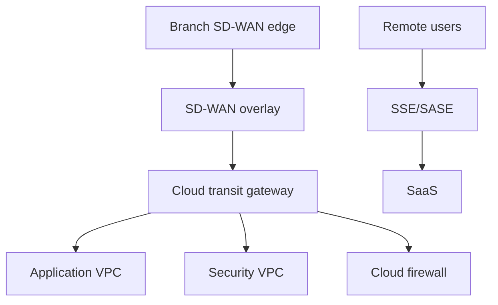

## 16.2 Cloud Integration Questions

- Who owns cloud routing?
- Are IP ranges unique?
- How is DNS resolved?
- Where is inspection performed?
- Are cloud security groups aligned with enterprise segmentation?
- How is traffic logged?
- Is cloud policy managed by Terraform, cloud console, or security team?
- How are changes synchronized with network operations?

## 17. IT/OT SDN Integration

IT/OT integration requires special care. OT environments prioritize availability, safety, determinism, and vendor support. Many OT systems are old, fragile, or poorly documented.

Common OT characteristics:

- Legacy protocols.
- Static addressing.
- Long device lifecycles.
- Limited patching windows.
- Vendor-managed systems.
- High availability requirements.
- Safety-critical processes.
- Limited endpoint authentication support.

## 17.1 OT Segmentation Design

Use a conservative model:

- Separate OT from IT.
- Use firewalls between IT and OT.
- Use jump hosts for administrative access.
- Allow only required flows.
- Monitor passively where possible.
- Avoid aggressive endpoint enforcement without testing.
- Use phased discovery before control.

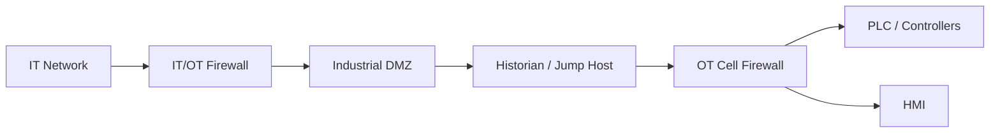

## 17.2 OT Migration Cautions

- Do not assume 802.1X is immediately feasible.
- Do not scan aggressively without OT approval.
- Do not change routing without process owner approval.
- Do not merge IT and OT telemetry without access controls.
- Do not treat OT like a normal office network.

SDN can help OT through segmentation and visibility, but migration must be slower and more controlled.

## 18. Operational Model for SDN Deployment

SDN changes daily operations.

Traditional operations:

- Device-level changes.
- CLI-based troubleshooting.
- Manual documentation.
- Separate monitoring tools.
- Ticket-based handoffs.

SDN operations:

- Controller-based changes.
- API-driven workflows.
- Fabric-level troubleshooting.
- Policy lifecycle management.
- Telemetry-based assurance.
- Cross-domain coordination.

## 18.1 New Operational Roles

Possible roles:

- Fabric administrator.
- Automation engineer.
- Network platform owner.
- Policy owner.
- Security policy reviewer.
- Source-of-truth owner.
- Controller administrator.
- API/service account administrator.
- Observability owner.

## 18.2 Runbook Requirements

Every SDN deployment should have runbooks for:

- Controller backup and restore.
- Device onboarding.
- Site onboarding.
- Segment creation.
- Policy change.
- Emergency rollback.
- Certificate renewal.
- Software upgrade.
- Controller failure.
- Fabric border failure.
- Tunnel failure.
- Identity service failure.
- API credential rotation.

## 19. Source of Truth and Documentation

SDN automation depends on accurate input.

A source of truth may include:

- Sites.
- Devices.
- Device roles.
- Interfaces.
- IP prefixes.
- VLANs.
- VRFs.
- Segments.
- Circuit IDs.
- Application dependencies.
- Security zones.
- Owners.
- Change references.

Tools may include:

- NetBox.
- Nautobot.
- CMDB.
- IPAM.
- Git repository.
- Controller inventory.

### Important Distinction

A controller inventory is not always the source of truth. It may be a source of discovered state. The source of truth should represent intended state.

## 20. Migration Strategy

Migration should be phased and measurable.

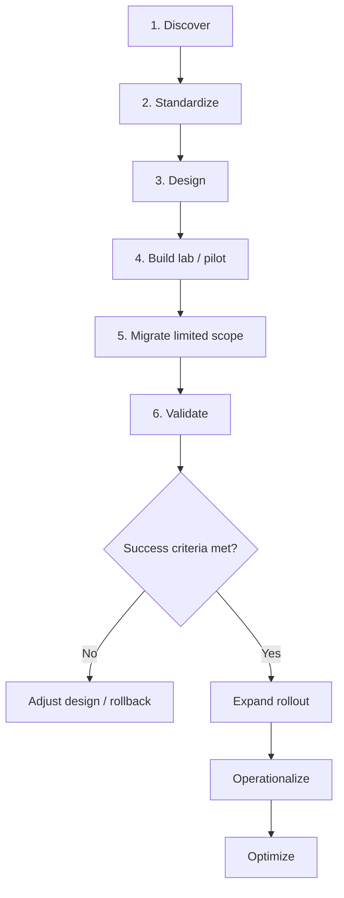

## 20.1 Discovery Phase

Collect technical data:

- Device inventory.
- Software versions.
- Hardware models.
- Topology.
- Interface utilization.
- Routing tables.
- VLAN/VRF map.
- Firewall rules.
- NAT rules.
- Application flows.
- WAN transport details.
- Wireless design.
- Identity integration.
- Monitoring coverage.

Collect operational data:

- Change process.
- Incident history.
- Known pain points.
- Team responsibilities.
- Compliance requirements.
- Maintenance windows.
- Support contracts.

## 20.2 Standardization Phase

Before SDN rollout, standardize:

- Naming convention.
- Site code.
- Device roles.
- IP addressing.
- VRF/VN model.
- Segment names.
- Logging.
- NTP.
- AAA.
- SNMP/telemetry.
- Backup.
- Software baseline.

## 20.3 Pilot Phase

A good pilot has:

- Clear scope.
- Representative traffic.
- Limited blast radius.
- Rollback path.
- Success criteria.
- Monitoring.
- User acceptance.
- Security validation.
- Operations handover.

Pilot success criteria examples:

- No critical outage.
- Policy works as designed.
- Application latency within baseline.
- Troubleshooting runbook validated.
- Monitoring detects expected events.
- Operations team can perform standard tasks.
- Rollback tested or documented.

## 20.4 Rollout Phase

Rollout strategies:

- Site by site.
- Building by building.
- Application by application.
- Segment by segment.
- Branch class by branch class.

Avoid changing too many variables at once. For example, do not simultaneously change WAN path, firewall policy, DNS behavior, endpoint identity, and application hosting unless absolutely necessary.

## 21. Rollback Design

Rollback is not optional.

Rollback questions:

- What exactly is being changed?
- What is the rollback trigger?
- Who approves rollback?
- How long does rollback take?
- Are old routes/configurations preserved?
- Can endpoints move back?
- Are DNS changes reversible?
- Are firewall changes reversible?
- Is data migration involved?
- What is the communication plan?

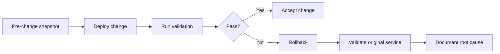

## 22. Validation and Acceptance Testing

Validation should include more than ping.

Technical validation:

- Routing table.
- Tunnel status.
- Endpoint identity.
- Segment assignment.
- DNS resolution.
- Firewall logs.
- Application port test.
- Latency/jitter/loss.
- Authentication.
- Controller deployment task status.
- Telemetry health.

Business validation:

- Users can access required applications.
- Guest access works.
- OT flows are not disrupted.
- Critical applications meet SLA.
- Security team confirms logging and policy.
- Operations team can monitor and troubleshoot.

## 23. Common Integration Failure Scenarios

## 23.1 Asymmetric Routing

Symptom:

- Connection starts but application fails.
- Firewall drops return traffic.
- TCP sessions reset.

Common causes:

- SD-WAN path differs from return path.
- Default route points to different firewall.
- Route redistribution is inconsistent.
- NAT is applied only in one direction.

Troubleshooting:

- Trace both forward and return path.
- Check firewall session table.
- Check routing from source and destination.
- Check SD-WAN policy and tunnel selection.

## 23.2 Segmentation Mismatch

Symptom:

- User is in correct campus group but cannot reach application.
- Policy works inside one domain but not across WAN/data center.

Common causes:

- SGT not mapped to data center policy.
- VN/VRF not extended or leaked correctly.
- Firewall zone does not match SDN segment.
- Cloud security group blocks traffic.

Troubleshooting:

- Identify segment at each domain.
- Verify policy translation.
- Check route table per VRF/VPN.
- Check firewall/security group logs.

## 23.3 Controller State vs Device State Mismatch

Symptom:

- Controller shows deployment success, but device forwarding is wrong.
- GUI policy differs from CLI state.

Common causes:

- Deployment task partially failed.
- Device unreachable during push.
- Version mismatch.
- Manual device change after controller deployment.
- Template drift.

Troubleshooting:

- Check controller task details.
- Check device configuration.
- Check device logs.
- Check compliance/drift tools.
- Resync device only after understanding impact.

## 23.4 MTU Problems

Symptom:

- Small packets work, large packets fail.
- Some applications hang.
- Tunnels form but traffic is unstable.

Common causes:

- Overlay encapsulation adds overhead.
- Underlay MTU not increased.
- Path MTU discovery blocked.
- Firewall drops ICMP fragmentation-needed messages.

Troubleshooting:

- Test with DF-bit ping.
- Check tunnel overhead.
- Verify interface MTU.
- Check firewall ICMP handling.

## 24. Design Workshop: Enterprise SDN Target Architecture

Use this scenario for classroom work.

Enterprise profile:

- Primary data center.
- Disaster recovery data center.
- Headquarters campus.
- 15 branches.
- 2 factories with OT.
- Public cloud workloads.
- SaaS applications.
- Remote users.
- Existing MPLS and Internet circuits.
- Existing firewalls.
- Existing VLAN/ACL-based segmentation.
- Interest in improving WAN and branch connectivity.

Business goals:

- Standardize branch deployment.
- Improve segmentation.
- Reduce manual configuration.
- Improve visibility.
- Support cloud/SaaS traffic.
- Prepare for IT/OT security requirements.

## 24.1 Required Student Deliverables

Each group should produce:

- High-level architecture diagram.
- SDN domain selection.
- Routing integration plan.
- Segmentation model.
- Security enforcement model.
- Cloud connectivity model.
- IT/OT integration approach.
- Migration phases.
- Rollback approach.
- Acceptance criteria.

## 24.2 Suggested Target Architecture

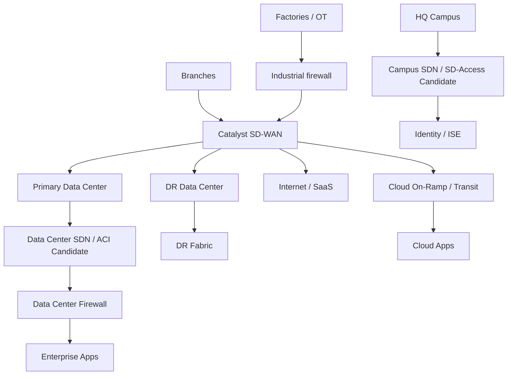

## 25. Instructor Notes

Recommended teaching flow:

1. Start with the phrase: "SDN design is boundary design."
2. Review the Day 1 architecture quickly.
3. Move into brownfield reality and hybrid deployment.
4. Spend significant time on routing and segmentation integration.
5. Use Cisco SD-WAN as the WAN-domain example, then connect it to campus and data center SDN.
6. Discuss firewalls, NAT, identity, and cloud early. These are often the real blockers.
7. End with migration phases, rollback, and validation.

Common discussion prompts:

- Where should the first pilot be?
- Which domains should remain traditional initially?
- Who owns the policy matrix?
- What must be discovered before migration?
- What is the rollback plan if the fabric works but applications fail?
- How do we prove SDN created business value?

## 26. Review Questions

1. Why is SDN integration often harder than initial SDN configuration?
2. What is the difference between greenfield, brownfield, and hybrid deployment?
3. What are the most important questions at an SDN-to-traditional network boundary?
4. Why is BGP commonly used at inter-domain boundaries?
5. What are the risks of route redistribution during SDN migration?
6. How do macrosegmentation and microsegmentation differ?
7. Why does SDN not eliminate the need for firewalls?
8. What problems can NAT create in SDN environments?
9. Why is identity integration important for SDN segmentation?
10. What are common problems when integrating SD-Access, SD-WAN, ACI, and cloud?
11. What makes a good SDN pilot candidate?
12. Why must rollback be designed before implementation?

## 27. Day 2 Key Takeaways

- SDN rarely replaces everything at once. Hybrid is normal.
- Integration boundaries are where most design risk lives.
- Routing, segmentation, firewalling, NAT, identity, and telemetry must be designed together.
- Multi-domain SDN requires policy mapping, not just physical connectivity.
- Brownfield migration requires discovery and standardization before deployment.
- A pilot should have limited blast radius, clear success criteria, and rollback.
- SDN transformation is as much an operating model change as a technical change.
- The best SDN design is not the most advanced one; it is the one that solves real business problems safely and repeatably.

## 28. References

- Cisco, Software-Defined Networking overview: https://www.cisco.com/c/en/us/solutions/software-defined-networking/overview.html
- Cisco, Cisco SD-Access Solution Design Guide: https://www.cisco.com/c/en/us/td/docs/solutions/CVD/Campus/cisco-sda-design-guide.html
- Cisco, Cisco ACI solution overview: https://www.cisco.com/c/en/us/solutions/collateral/data-center-virtualization/application-centric-infrastructure/solution-overview-c22-741487.html
- Cisco, Catalyst Center: https://www.cisco.com/site/us/en/products/networking/catalyst-center/index.html
- Cisco, Catalyst SD-WAN: https://www.cisco.com/site/us/en/solutions/networking/sdwan/catalyst/index.html
- Cisco, Common Policy Integration Guide: https://www.cisco.com/c/en/us/td/docs/cloud-systems-management/network-automation-and-management/catalyst-center/cisco-validated-solution-profiles/common-policy-integration-guide.html
- Cisco, ACI and Catalyst SD-WAN integration: https://www.cisco.com/c/en/us/td/docs/routers/sdwan/configuration/policies/ios-xe-17/policies-book-xe/integration-with-Cisco-ACI.html
