# Day 3 - SDN Automation, APIs, and Infrastructure as Code Deep Dive

## 1. Day 3 Positioning and Learning Outcomes

Day 1 established the SDN architecture: controllers, planes, APIs, underlay, overlay, fabric, policy, and Cisco SDN domains.

Day 2 focused on integration and deployment: how SDN connects to traditional networks, routing boundaries, segmentation mapping, security insertion, brownfield migration, rollback, and validation.

Day 3 focuses on automation:

> How do we operate SDN and traditional network infrastructure through APIs, models, templates, and repeatable workflows instead of manual device-by-device configuration?

This day is designed for experienced network engineers who understand networking fundamentals. The goal is to move learners from "I can configure the network" to "I can design a controlled automation workflow for network change."

By the end of Day 3, learners should be able to:

- Explain the difference between scripting, automation, orchestration, and intent-based workflows.
- Use REST API concepts to interact with SDN controllers.
- Understand authentication, authorization, tokens, payloads, status codes, and task tracking.
- Explain NETCONF, RESTCONF, YANG, and model-driven network management.
- Compare CLI automation, API automation, and model-driven automation.
- Explain the roles of Ansible and Terraform in network automation.
- Design a source-of-truth-driven workflow.
- Identify automation risks such as credential leakage, bad templates, drift, and large blast radius.
- Build safe automation patterns using validation, idempotency, change control, rollback, and logging.

## 2. Automation Is Not Just Scripting

Many network teams start automation by writing scripts that push CLI commands. This is useful, but it is only the first step.

Network automation can mean:

- Collecting device facts.
- Backing up configurations.
- Checking compliance.
- Generating configuration from templates.
- Calling controller APIs.
- Creating SDN policies.
- Deploying site templates.
- Updating monitoring systems.
- Validating application connectivity.
- Creating change records.
- Rolling back failed changes.
- Detecting drift between intended state and actual state.

### Key Distinction

Scripting answers:

> How do I make a device do this task faster?

Automation answers:

> How do I make this network change repeatable, validated, governed, and observable?

Orchestration answers:

> How do I coordinate changes across multiple systems and teams?

Intent-based operation answers:

> How do I declare the desired outcome and let the system translate, deploy, monitor, and validate it?

## 3. Network Automation Maturity Model

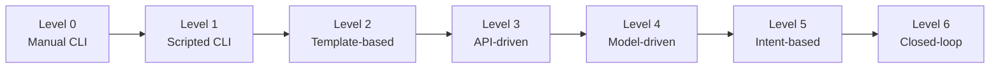

| Level | Description | Example |
|---|---|---|
| 0 | Manual configuration | Engineer logs in and configures a switch |
| 1 | Scripted CLI | Python script sends commands over SSH |
| 2 | Template-based | Jinja2 or Ansible template renders config |
| 3 | API-driven | REST API creates SD-WAN policy or SDN segment |
| 4 | Model-driven | NETCONF/RESTCONF/gNMI with YANG models |
| 5 | Intent-based | Engineer declares desired policy or segment |
| 6 | Closed-loop | Telemetry triggers validation, alert, or remediation |

The target is not always Level 6. Many organizations get major value from Levels 2-4 if they are implemented safely.

## 4. Why SDN Makes Automation Easier

Traditional automation often has to connect to many devices individually.

SDN automation can often connect to a controller or orchestrator instead.

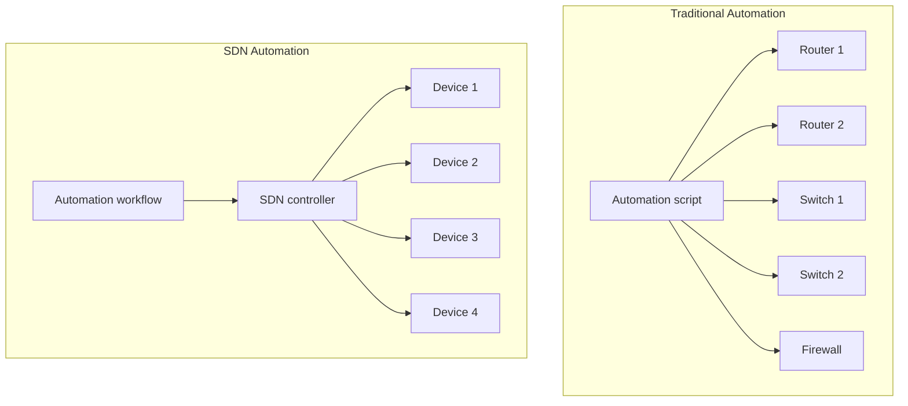

Benefits:

- Fewer integration targets.
- Controller understands topology and inventory.
- Controller can provide task status.
- Policy is expressed at a higher level.
- Validation can use controller state.
- Automation can operate on sites, segments, policies, and templates instead of raw commands.

Risks:

- A controller API can affect many devices at once.
- Incorrect input can produce large-scale incorrect changes.
- Controller abstractions may hide device-specific failure.
- API permissions must be controlled carefully.

## 5. Core API Concepts

Most SDN controllers expose APIs. REST APIs are the most common northbound interface.

## 5.1 REST API Basics

REST APIs commonly use:

- HTTP methods.
- URLs/endpoints.
- Headers.
- JSON payloads.
- Status codes.
- Authentication tokens.

Common HTTP methods:

| Method | Meaning | Network Example |
|---|---|---|
| GET | Retrieve data | Get device inventory |
| POST | Create or trigger | Create site, create policy, start task |
| PUT | Replace full object | Replace template or policy |
| PATCH | Modify part of object | Update description or parameter |
| DELETE | Remove object | Delete test policy |

Example REST workflow:

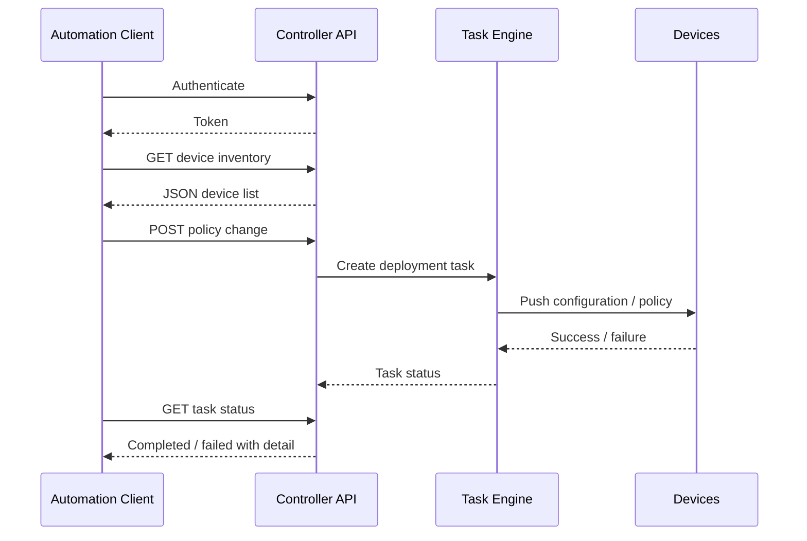

## 5.2 API Endpoint Design

An endpoint identifies a resource or operation.

Examples:

- `/devices`
- `/devices/{id}`
- `/sites`
- `/sites/{siteId}/devices`
- `/policies`
- `/templates`
- `/tasks/{taskId}`
- `/health/network`

In a controller API, not every endpoint is a simple data object. Some endpoints trigger asynchronous tasks. This matters because a successful HTTP response may only mean "task accepted," not "configuration deployed successfully."

## 5.3 Status Codes

Common status codes:

| Code | Meaning | Automation Implication |
|---|---|---|
| 200 | OK | Request completed |
| 201 | Created | Object created |
| 202 | Accepted | Task accepted; check task status |
| 204 | No content | Request succeeded, no body |
| 400 | Bad request | Payload or parameter issue |
| 401 | Unauthorized | Authentication problem |
| 403 | Forbidden | Permission problem |
| 404 | Not found | Wrong ID or endpoint |
| 409 | Conflict | Object already exists or state conflict |
| 429 | Too many requests | Rate limiting |
| 500 | Server error | Controller-side failure |

Good automation does not only check if the API call returned a response. It checks status codes, response body, task status, and post-change validation.

## 6. Authentication and Authorization

API automation must treat credentials as sensitive infrastructure.

Common authentication patterns:

- Basic authentication to obtain a token.
- Bearer token.
- API key.
- OAuth2.
- Client certificate.
- Session cookie.

Common authorization controls:

- RBAC.
- Scoped tokens.
- Service accounts.
- Read-only vs read-write roles.
- Time-limited credentials.
- Approval workflow.

### Bad Practice

- Hardcoding passwords in scripts.
- Sharing one admin token across teams.
- Using full administrator privileges for read-only reports.
- Storing credentials in Git.
- Reusing personal accounts for automation.

### Good Practice

- Use dedicated service accounts.
- Grant least privilege.
- Store secrets in a vault.
- Rotate API credentials.
- Log automation actions.
- Separate development and production credentials.
- Require approval for high-impact workflows.

## 7. JSON Payloads

Most REST APIs use JSON.

Example device inventory response:

```json
{
  "devices": [
    {
      "id": "dev-001",
      "hostname": "branch-01-edge-01",
      "role": "sdwan-edge",
      "site": "branch-01",
      "managementIp": "10.10.1.11",
      "status": "reachable"
    }
  ]
}
```

Example policy creation payload:

```json
{
  "name": "guest-internet-only",
  "sourceSegment": "guest",
  "destination": "internet",
  "action": "permit",
  "services": ["dns", "http", "https"],
  "logging": true
}
```

The exact structure depends on the controller. The important skill is understanding how to read API documentation, identify required fields, build payloads, and validate responses.

## 8. Synchronous vs Asynchronous APIs

Some API calls complete immediately. Others start background jobs.

Example:

- `GET /devices` may return immediately.
- `POST /deploy-policy` may create a task that takes minutes.

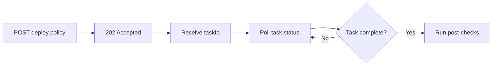

Automation must handle asynchronous operations carefully:

- Store task IDs.
- Poll with reasonable interval.
- Handle timeout.
- Capture failure detail.
- Avoid launching conflicting tasks.
- Run post-change checks.

## 9. Idempotency

Idempotency means that running the same automation multiple times produces the same final state without unintended side effects.

Example of non-idempotent automation:

- "Add this ACL line every time the script runs."

Result:

- Duplicate ACL entries.
- Configuration drift.
- Harder troubleshooting.

Example of idempotent automation:

- "Ensure this ACL line exists exactly once."

Result:

- First run adds it.
- Second run makes no change.

### Why Idempotency Matters

- Automation can be rerun safely.
- Failures can be retried.
- Desired state is clearer.
- Change reports are meaningful.
- Drift can be detected.

Ansible and Terraform both encourage idempotent operation, but module/provider behavior must still be verified.

## 10. Source of Truth

A source of truth is the system that stores intended state.

It may contain:

- Sites.
- Devices.
- Roles.
- Interfaces.
- IP prefixes.
- VLANs.
- VRFs.
- Segments.
- Circuits.
- Application dependencies.
- Security zones.
- Owners.
- Change windows.

Examples:

- NetBox.
- Nautobot.
- CMDB.
- IPAM.
- Git repository.
- Database.

### Source of Truth vs Discovered State

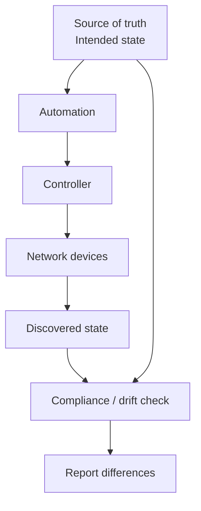

The controller inventory may show what exists. The source of truth should define what should exist.

## 11. Configuration Drift

Drift occurs when actual state differs from intended state.

Common causes:

- Manual CLI changes.
- Emergency fixes.
- Failed automation.
- Controller deployment failure.
- Out-of-band changes by another team.
- Software upgrade changes defaults.
- Device replacement.

Drift detection examples:

- Intended NTP servers differ from actual.
- Interface description missing.
- Device assigned to wrong site.
- Firewall rule exists without approval.
- SD-WAN template variable differs from source of truth.
- Segment exists in controller but not in documentation.

Good automation workflows include drift detection before making changes.

## 12. CLI Automation

CLI automation remains useful, especially in brownfield networks.

Common tools:

- Python with Netmiko.
- Python with Paramiko.
- NAPALM.
- Ansible network modules.
- Expect-style automation.

### Advantages

- Works with many legacy devices.
- Familiar to network engineers.
- Useful when APIs are unavailable.
- Good for backups and show commands.

### Disadvantages

- Output parsing can break between versions.
- CLI is less structured than API/YANG data.
- Error handling is harder.
- Idempotency is harder.
- Vendors may change command syntax.

### Good CLI Automation Use Cases

- Configuration backup.
- Inventory collection.
- Compliance checks.
- Read-only reporting.
- Small controlled changes on legacy devices.

### Risky CLI Automation Use Cases

- Large-scale changes without validation.
- Multi-vendor changes with inconsistent syntax.
- Security policy changes using raw string templates.
- Emergency changes with no rollback.

## 13. REST API Automation

REST API automation is usually more structured than CLI automation.

Good use cases:

- Interacting with SDN controllers.
- Creating policies.
- Retrieving inventory and health.
- Deploying templates.
- Managing sites.
- Integrating with ITSM.
- Triggering workflows.

### API Automation Workflow

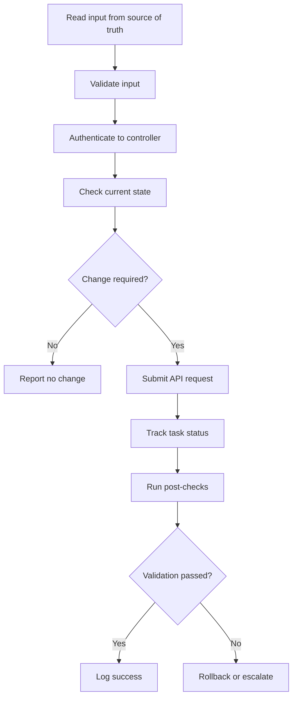

### Common Mistakes

- Ignoring pagination.
- Ignoring rate limits.
- Assuming object names are unique.
- Not storing object IDs.
- Not checking async task status.
- Not validating actual network behavior.
- Running production changes with test credentials.

## 14. NETCONF, RESTCONF, and YANG

REST APIs are common for controllers. NETCONF and RESTCONF are common for model-driven device management.

## 14.1 YANG

YANG is a data modeling language used to describe network configuration and state.

YANG models define:

- Configuration hierarchy.
- Data types.
- Constraints.
- Operational state.
- RPC/action structures.

Benefits:

- Structured data.
- Machine-readable schema.
- Vendor-neutral or vendor-specific models.
- Better validation than raw CLI.

## 14.2 NETCONF

NETCONF is a protocol for installing, manipulating, and deleting device configuration. It typically runs over SSH.

NETCONF concepts:

- Datastores: running, candidate, startup depending on device support.
- Operations: get, get-config, edit-config, commit, lock, unlock.
- XML encoding.
- YANG models.

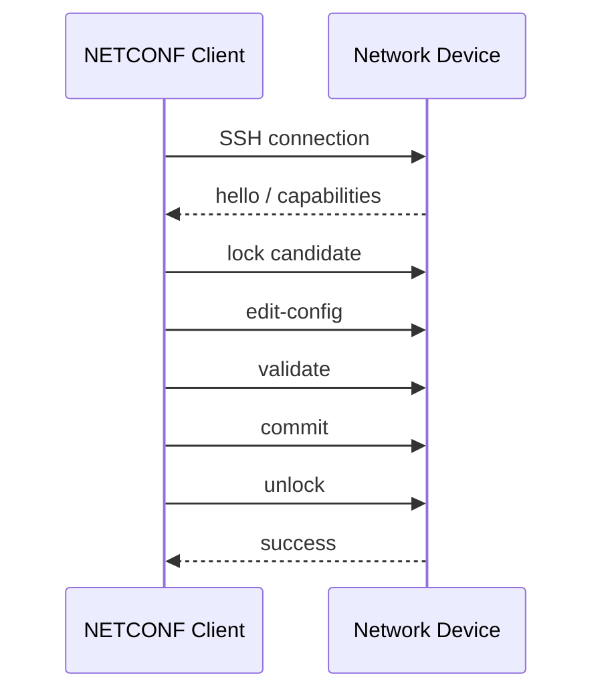

Advantages:

- Structured configuration.
- Supports validation.
- Can support candidate configuration and commit.
- Better than scraping CLI.

Challenges:

- XML can be verbose.
- Device support varies.
- Model differences still exist.
- Engineers must understand YANG paths.

## 14.3 RESTCONF

RESTCONF exposes YANG-modeled data through HTTP methods.

It combines:

- REST-style interaction.
- JSON or XML payloads.
- YANG-modeled data.

Advantages:

- Easier for teams familiar with REST.
- Structured data model.
- Good for integration with modern tools.

Challenges:

- Device support varies.
- YANG model knowledge still required.
- Error handling and path structure can be confusing at first.

## 15. gNMI and Model-Driven Telemetry

gNMI is commonly used for telemetry and configuration in modern model-driven networks.

Use cases:

- Subscribe to interface counters.
- Stream routing state.
- Monitor CPU/memory.
- Observe tunnel status.
- Feed observability platforms.

Polling model:

- Tool asks device for data periodically.

Streaming telemetry model:

- Device streams updates to collector.

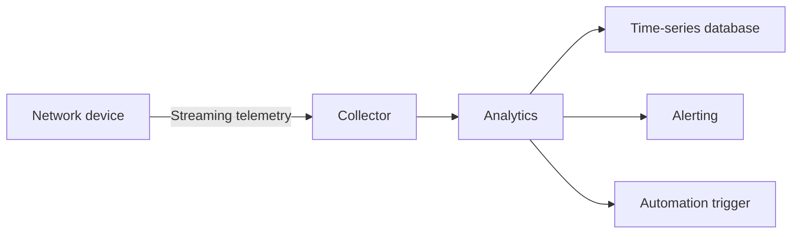

Benefits:

- More timely data.
- Better scale than frequent polling.
- Useful for assurance and closed-loop automation.

Risks:

- More data volume.
- Requires good data pipeline design.
- Bad telemetry interpretation can trigger wrong actions.

## 16. Ansible for Network Automation

Ansible is widely used for network automation because it is readable, agentless, and module-driven.

Core concepts:

- Inventory.
- Playbook.
- Task.
- Module.
- Variable.
- Template.
- Role.
- Collection.

## 16.1 Ansible Architecture

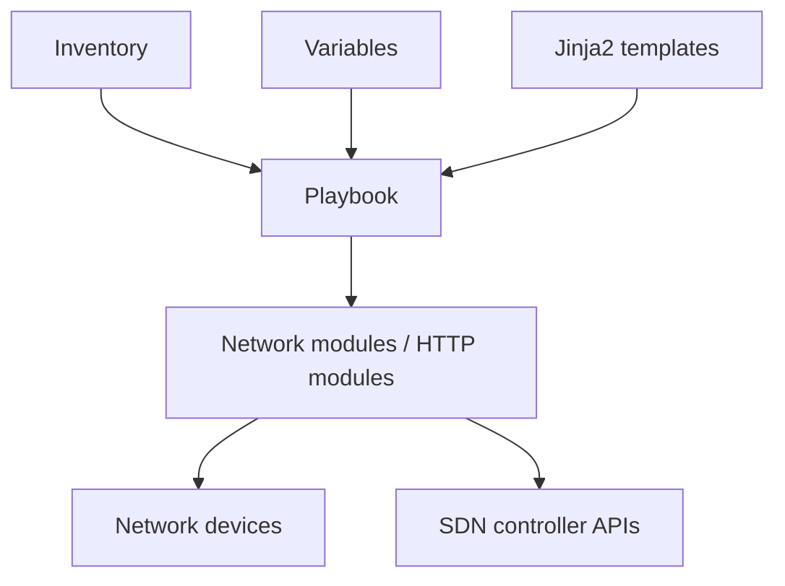

## 16.2 Ansible Use Cases

Good fit:

- Backup configurations.
- Push standard settings.
- Generate interface config.
- Configure NTP, SNMP, syslog.
- Validate compliance.
- Call REST APIs.
- Render templates.
- Orchestrate multi-step tasks.

Less ideal:

- Managing long-lived infrastructure state with complex dependencies.
- Workflows requiring state locking across teams.
- Highly interactive troubleshooting.

## 16.3 Example Playbook Concept

```yaml
---
- name: Backup network device configurations
  hosts: branch_routers
  gather_facts: false
  tasks:
    - name: Collect running configuration
      ansible.netcommon.cli_command:
        command: show running-config
      register: running_config

    - name: Save configuration locally
      ansible.builtin.copy:
        content: "{{ running_config.stdout }}"
        dest: "backups/{{ inventory_hostname }}.cfg"
```

This simple workflow is valuable because it is repeatable. It can be extended with timestamping, Git commit, compliance checks, and reporting.

## 17. Terraform for Network Automation

Terraform is an infrastructure-as-code tool based on desired state.

Core concepts:

- Provider.
- Resource.
- Data source.
- State file.
- Plan.
- Apply.
- Destroy.
- Module.

Terraform is commonly associated with cloud infrastructure, but it can also manage network controllers and policies when suitable providers exist.

## 17.1 Terraform Workflow

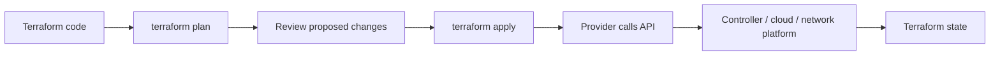

## 17.2 Terraform Strengths

- Declarative desired state.
- Plan before apply.
- Good for infrastructure lifecycle.
- Strong cloud ecosystem.
- Version-controlled infrastructure definitions.
- Reusable modules.

## 17.3 Terraform Risks

- State file contains sensitive information.
- State locking is required for teams.
- Provider quality varies.
- Not every network platform maps cleanly to Terraform resources.
- `destroy` can be dangerous.
- Manual changes create drift.

## 17.4 Ansible vs Terraform

| Area | Ansible | Terraform |
|---|---|---|
| Style | Procedural / task-based, can be declarative with modules | Declarative desired state |
| State | Usually stateless | Maintains state |
| Strength | Orchestration, configuration, operational tasks | Infrastructure lifecycle |
| Network fit | Very good for device tasks and API workflows | Good when providers model resources well |
| Review | Diff depends on module/task | `terraform plan` is central |
| Risk | Playbooks can do too much if uncontrolled | State and destroy risks |

Practical recommendation:

- Use Ansible for operational workflows, backups, configuration tasks, and API orchestration.
- Use Terraform for resource lifecycle where a reliable provider exists.
- Use both when appropriate, but define ownership clearly.

## 18. Infrastructure as Code for Networking

Infrastructure as Code means storing infrastructure definitions in version-controlled files and applying them through controlled workflows.

For networking, this may include:

- Sites.
- Prefixes.
- VLANs.
- VRFs.
- Segments.
- Firewall objects.
- SD-WAN policies.
- Controller templates.
- Cloud network resources.

## 18.1 Git-Based Workflow

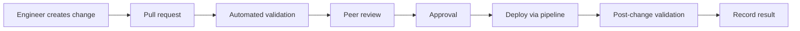

Validation examples:

- YAML syntax.
- JSON schema.
- IP overlap check.
- Naming convention.
- Required owner field.
- Security policy review.
- Lab deployment.
- Dry-run.

## 19. Change Safety Controls

Automation can reduce errors, but unsafe automation can amplify them.

Safety controls:

- Limit blast radius.
- Use approvals.
- Validate input.
- Check current state.
- Use dry-run or plan mode.
- Use staged rollout.
- Use maintenance windows.
- Use rollback.
- Log every action.
- Require post-checks.
- Separate read-only and read-write workflows.

## 19.1 Blast Radius

Blast radius is the scope of potential damage if something goes wrong.

Low blast radius:

- Read-only inventory collection.
- Backup configuration.
- Update one interface description.
- Create lab policy.

High blast radius:

- Change default route.
- Modify firewall rules globally.
- Push SD-WAN policy to all branches.
- Change campus segmentation.
- Rotate certificates incorrectly.
- Modify controller admin roles.

Automation should start with low blast radius tasks.

## 20. Pre-Checks and Post-Checks

Pre-checks answer:

> Is it safe to make this change now?

Post-checks answer:

> Did the change produce the intended result?

## 20.1 Pre-Check Examples

- Device reachable.
- Controller healthy.
- No conflicting task running.
- Correct software version.
- Backup completed.
- Interface status known.
- Route exists before migration.
- Required policy object exists.
- Change window active.
- Approval received.

## 20.2 Post-Check Examples

- API task completed successfully.
- Device config matches intended state.
- Route table updated.
- Tunnel is up.
- Endpoint assigned to correct segment.
- Firewall logs show permitted flow.
- Application port reachable.
- Latency/jitter/loss within threshold.
- No new critical alarms.

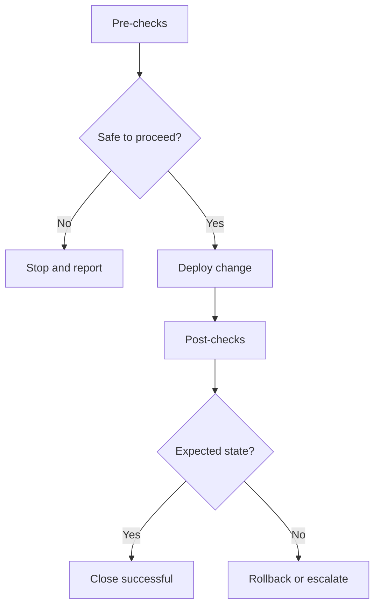

## 21. Rollback in Automation

Rollback must be designed before deployment.

Rollback types:

- Restore previous configuration.
- Reapply previous controller policy.
- Revert Git commit and redeploy.
- Disable new policy.
- Move traffic back to old path.
- Restore old template variables.
- Revert DNS or route change.

Challenges:

- Not all changes are easily reversible.
- Some APIs do not provide automatic rollback.
- Stateful systems may not return instantly.
- Firewall/session behavior may persist.
- DNS caching may delay recovery.
- Cloud resources may have dependencies.

## 22. Network Automation Security

Automation systems can become high-value targets.

Protect:

- API tokens.
- SSH keys.
- Vault passwords.
- Controller credentials.
- CI/CD runners.
- Git repositories.
- State files.
- Logs containing secrets.

Controls:

- MFA for human access.
- Dedicated service accounts.
- Least privilege.
- Secret vault.
- Token rotation.
- Signed commits where appropriate.
- Protected branches.
- Approval gates.
- Audit logging.
- Segregation between development and production.

## 23. API Rate Limits and Scale

Controllers and devices have limits.

Automation must consider:

- API rate limits.
- Pagination.
- Task queue limits.
- Concurrent deployment limits.
- Controller CPU/memory.
- Device CPU impact.
- WAN bandwidth for deployment.
- Maintenance windows.

Bad pattern:

- Push changes to 500 devices at once without staging.

Better pattern:

- Group by site or region.
- Deploy to pilot group.
- Validate.
- Expand gradually.
- Pause on error threshold.

## 24. Error Handling

Good automation expects failure.

Failure examples:

- Authentication failure.
- Timeout.
- Rate limit.
- Object not found.
- Duplicate object.
- Controller task failure.
- Device unreachable.
- Validation failed.
- Unexpected response schema.

Automation should:

- Fail clearly.
- Log useful context.
- Avoid partial silent success.
- Report exact object and step.
- Stop before increasing damage.
- Provide recovery guidance.

## 25. Designing an SDN API Workflow

Example use case:

> Create a new branch network segment and apply Internet-only guest access.

Workflow:

1. Read branch ID, site code, segment name, IP prefix, and owner from source of truth.
2. Validate naming and IP prefix.
3. Check whether the segment already exists.
4. Create or update the segment.
5. Create policy object.
6. Attach policy to site.
7. Track controller deployment task.
8. Run post-checks.
9. Update ITSM ticket.
10. Log result.

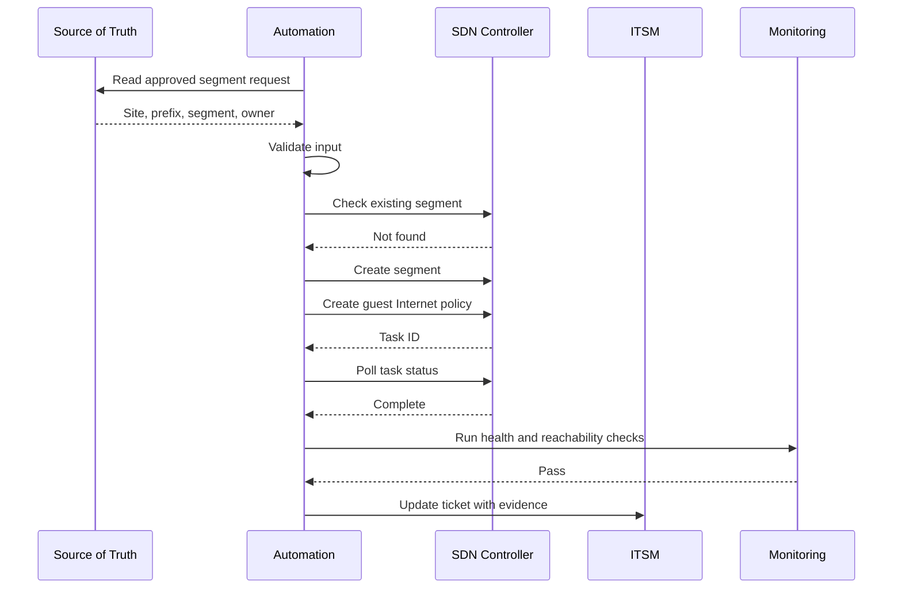

## 26. Lab 5 Theory: REST API Inventory Collection

Lab objective:

- Authenticate to a controller or mock API.
- Retrieve inventory.
- Parse JSON.
- Extract device name, role, site, management IP, and status.
- Export results.

Concepts reinforced:

- Authentication.
- GET request.
- Headers.
- JSON parsing.
- Error handling.
- Read-only automation.

Instructor emphasis:

- Start with read-only API calls.
- Read-only automation builds confidence.
- Inventory collection is a safe first automation use case.

## 27. Lab 6 Theory: REST API Configuration Change

Lab objective:

- Use API to create or update a simple object.
- Track task status.
- Validate result.

Possible objects:

- Site.
- Segment.
- Policy object.
- Device tag.
- Interface description.
- Template variable.

Concepts reinforced:

- POST/PUT/PATCH.
- Payload construction.
- Object IDs.
- Task ID.
- Post-check.
- Rollback planning.

Instructor emphasis:

- A successful API call does not always mean a successful network change.
- Always validate intended state and actual behavior.

## 28. Lab 7 Theory: Ansible Network Automation

Lab objective:

- Create inventory.
- Run a simple playbook.
- Collect configuration or facts.
- Apply a low-risk configuration.
- Verify idempotency.

Recommended first tasks:

- Backup running config.
- Configure NTP.
- Configure syslog.
- Set interface description.
- Check compliance.

Concepts reinforced:

- Inventory grouping.
- Variables.
- Modules.
- Registering output.
- Conditional tasks.
- Idempotency.

## 29. Lab 8 Theory: Terraform for Network or Controller Resources

Lab objective:

- Define a simple resource.
- Run `terraform init`.
- Run `terraform plan`.
- Review proposed change.
- Run `terraform apply`.
- Inspect state.
- Modify resource and observe drift/plan.

Possible resource examples:

- Cloud network object.
- Controller policy object.
- Lab segment object.
- DNS record.
- Firewall address object if provider exists.

Concepts reinforced:

- Desired state.
- Provider.
- Resource.
- Plan.
- Apply.
- State.
- Drift.

Instructor emphasis:

- Terraform is powerful when the provider models the target platform well.
- State management is a serious operational responsibility.

## 30. Example Automation Architecture for Enterprise SDN

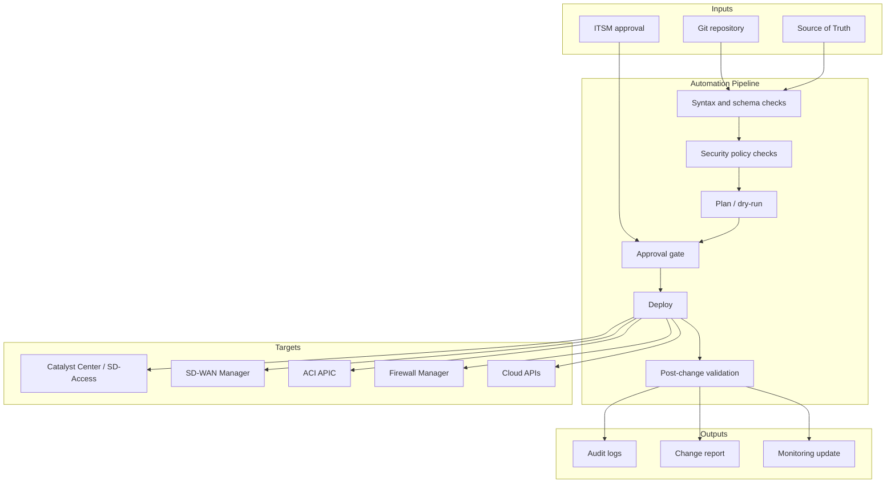

## 31. Common Automation Anti-Patterns

Anti-patterns:

- Automating undocumented processes.
- Writing scripts before standardizing naming and IP plans.
- Hardcoding credentials.
- Skipping pre-checks.
- Skipping post-checks.
- Treating lab success as production readiness.
- Pushing global changes without staging.
- Using personal admin accounts for automation.
- Ignoring rollback.
- Allowing manual changes without drift detection.
- Building automation no one else understands.

Better patterns:

- Document the manual process first.
- Start with read-only tasks.
- Use source of truth.
- Use least privilege.
- Add validation at every stage.
- Use peer review.
- Keep workflows small and composable.
- Log actions and outcomes.

## 32. Day 3 Design Exercise

Scenario:

An enterprise wants to automate branch onboarding. Each new branch requires:

- Site code.
- Hostname standard.
- Management IP.
- WAN circuit details.
- LAN prefixes.
- Guest segment.
- Corporate segment.
- NTP/SNMP/syslog.
- SD-WAN template variables.
- Monitoring registration.
- ITSM ticket evidence.

Group task:

Design an automation workflow that includes:

- Source of truth fields.
- Validation checks.
- API calls.
- Ansible or Terraform role.
- Security controls.
- Pre-checks.
- Post-checks.
- Rollback approach.
- Success report.

Deliverable:

- Workflow diagram.
- Required data model.
- Failure handling plan.
- Tool selection explanation.

## 33. Instructor Notes

Recommended teaching flow:

1. Start with why automation is not just scripting.
2. Introduce maturity levels.
3. Explain REST API using controller examples.
4. Explain task tracking and validation.
5. Introduce source of truth and drift.
6. Compare CLI, REST API, NETCONF/RESTCONF/YANG.
7. Introduce Ansible and Terraform as complementary tools.
8. Spend serious time on safety: credentials, RBAC, rollback, blast radius.
9. End with branch onboarding or segment creation workflow.

Important messages:

- Automation should reduce risk, not just increase speed.
- Read-only automation is a great first step.
- The source of truth is more important than the script.
- Idempotency is a design requirement.
- Every write operation needs validation and rollback thinking.
- Network engineers must learn APIs, but they should not forget routing, switching, security, and troubleshooting.

## 34. Review Questions

1. What is the difference between scripting, automation, orchestration, and intent-based networking?
2. Why is idempotency important?
3. Why should automation start with read-only workflows?
4. What is the role of a source of truth?
5. Why is controller inventory not always the source of truth?
6. What is configuration drift?
7. What are the main differences between REST API and CLI automation?
8. What problems do NETCONF, RESTCONF, and YANG try to solve?
9. When is Ansible a good fit?
10. When is Terraform a good fit?
11. What are the risks of Terraform state?
12. Why must automation include pre-checks and post-checks?
13. What makes an automation workflow unsafe?
14. How can API credentials be protected?
15. Why is blast radius important in network automation?

## 35. Day 3 Key Takeaways

- SDN makes automation easier by exposing controller-level APIs and higher-level policy objects.
- Automation is not the same as scripting.
- Safe automation requires source of truth, validation, idempotency, logging, and rollback.
- REST APIs are central to SDN controller integration.
- NETCONF, RESTCONF, YANG, and gNMI support model-driven management and telemetry.
- Ansible is strong for operational workflows and orchestration.
- Terraform is strong for declarative infrastructure lifecycle when provider support is mature.
- API credentials and automation accounts must be treated as privileged assets.
- Automation should begin with low-risk, read-only tasks and grow toward controlled write operations.
- The real goal is not speed alone; it is repeatable, governed, verifiable network change.

## 36. References

- Cisco DevNet: https://developer.cisco.com/
- Cisco Catalyst Center APIs: https://developer.cisco.com/docs/dna-center/
- Cisco Catalyst SD-WAN APIs: https://developer.cisco.com/docs/sdwan/
- Cisco ACI Programmability: https://developer.cisco.com/site/aci/
- Ansible Network Automation: https://docs.ansible.com/ansible/latest/network/index.html
- Terraform Documentation: https://developer.hashicorp.com/terraform/docs
- IETF NETCONF: https://datatracker.ietf.org/doc/html/rfc6241
- IETF RESTCONF: https://datatracker.ietf.org/doc/html/rfc8040
- YANG 1.1: https://datatracker.ietf.org/doc/html/rfc7950
- OpenConfig: https://www.openconfig.net/
