# Day 4 - SDN Security, Monitoring, Assurance, and Troubleshooting Deep Dive

## 1. Day 4 Positioning and Learning Outcomes

Day 1 introduced SDN concepts and architecture.

Day 2 explained integration and deployment in brownfield enterprise networks.

Day 3 covered automation, APIs, model-driven management, Ansible, Terraform, and infrastructure as code.

Day 4 focuses on operating SDN safely:

> How do we secure, monitor, troubleshoot, and continuously assure an SDN environment after it is deployed?

This day is written for experienced network engineers and operations teams. The focus is not generic cybersecurity theory. The focus is how SDN changes the way security policy, visibility, troubleshooting, incident response, and operational assurance are designed.

By the end of Day 4, learners should be able to:

- Explain the security benefits and new risks introduced by SDN.
- Design segmentation for campus, WAN, data center, cloud, and IT/OT domains.
- Identify where policy enforcement occurs in different SDN architectures.
- Build monitoring and telemetry requirements for an SDN environment.
- Explain assurance, health scoring, path tracing, and intent verification.
- Use a structured troubleshooting method for control plane, data plane, policy, identity, and automation issues.
- Understand how AI/ML can support anomaly detection, RCA, capacity analysis, and network assurance.
- Create incident runbooks and root-cause analysis reports for SDN failures.

## 2. Security in SDN: Better Control, Bigger Blast Radius

SDN improves security because it can centralize policy, automate segmentation, and provide better visibility. But it also introduces new risks because controllers, APIs, automation accounts, and policy engines become powerful control points.

Traditional network security often depends on:

- VLAN separation.
- ACLs.
- Firewalls.
- VRFs.
- NAC.
- VPNs.
- Manual change control.

SDN security adds:

- Centralized policy models.
- Identity-based segmentation.
- Controller-driven enforcement.
- API-based policy changes.
- Automated quarantine or remediation.
- Fabric-wide visibility.
- Telemetry-driven anomaly detection.

### Core Trade-Off

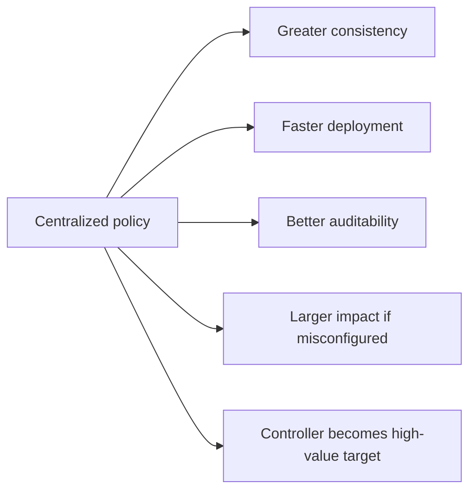

The same control plane that makes policy easier to deploy also makes incorrect policy easier to deploy at scale. SDN security must therefore include governance, validation, RBAC, logging, and rollback.

## 3. SDN Security Architecture

An SDN security architecture should address:

- Controller security.
- API security.
- Management plane isolation.
- Identity integration.
- Segmentation.
- Policy lifecycle.
- Telemetry and logging.
- Automation safety.
- Incident response.
- Backup and recovery.

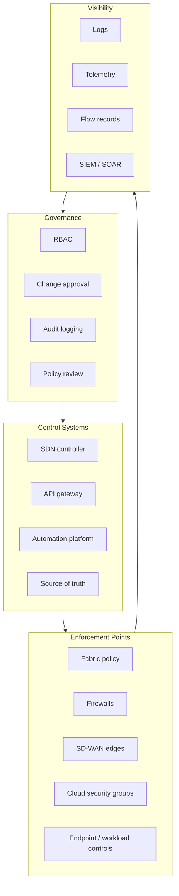

## 4. Controller Security

The SDN controller is one of the most sensitive systems in the network. It may be able to:

- Create or delete policy.
- Push configuration to many devices.
- Onboard devices.
- Modify segmentation.
- Retrieve inventory.
- View topology.
- Generate or hold certificates.
- Expose APIs to automation platforms.

### Controller Threats

- Unauthorized administrator access.
- Stolen API token.
- Weak RBAC.
- Unpatched controller software.
- Exposed management interface.
- Insecure backup files.
- Compromised automation account.
- Rogue integration using excessive privileges.
- Lack of audit review.

### Controller Security Controls

- Dedicated management network.
- MFA for human administrators.
- RBAC with least privilege.
- Separate roles for operator, admin, auditor, and automation.
- Service accounts with scoped permissions.
- API token rotation.
- Certificate lifecycle management.
- Secure backup storage.
- Software patching and vulnerability management.
- Audit log forwarding to SIEM.
- Administrative session timeout.
- Change approval for high-impact operations.

## 5. API Security

Day 3 covered API usage. Day 4 treats APIs as a security boundary.

API access can be more dangerous than GUI access because it is easy to automate at speed.

### API Security Risks

- Hardcoded credentials.
- Token leakage in scripts.
- Tokens stored in Git.
- Overprivileged service accounts.
- No rate limiting.
- Lack of request logging.
- Weak TLS validation.
- API exposed to broad networks.
- No separation between development and production.

### API Security Best Practices

- Use service accounts, not personal accounts.
- Apply least privilege.
- Store secrets in a vault.
- Rotate tokens.
- Use short-lived credentials where possible.
- Use TLS validation.
- Log API calls.
- Protect CI/CD runners.
- Separate read-only and write-capable integrations.
- Require approval gates for high-impact workflows.

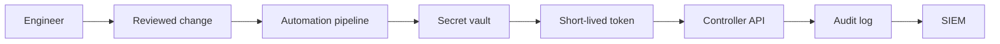

## 6. Segmentation in SDN

Segmentation is one of the strongest SDN use cases. It limits lateral movement, supports least privilege, and allows policy to be defined consistently across many sites.

Segmentation can be:

- Network-based.
- Identity-based.
- Application-based.
- Device-type-based.
- Location-based.
- Risk-based.

Common SDN segmentation constructs:

- Cisco SD-Access Virtual Networks and SGTs.
- Cisco ACI tenants, VRFs, EPGs, and contracts.
- Cisco SD-WAN VPNs and centralized policies.
- Firewall zones and dynamic objects.
- Cloud security groups and route tables.
- SSE/SASE policies.

## 6.1 Macrosegmentation

Macrosegmentation separates broad zones.

Examples:

- Corporate.
- Guest.
- IoT.
- OT.
- Server.
- Management.
- PCI.
- DMZ.

Typical implementation:

- VRFs.
- Virtual Networks.
- SD-WAN VPNs.
- Firewall zones.
- Cloud VPC/VNet separation.

Advantages:

- Clear security boundaries.
- Easier for operations teams to understand.
- Strong isolation.
- Good for compliance.

Limitations:

- Exceptions often require route leaking or firewall rules.
- Too many VRFs can increase operational complexity.
- Does not automatically control traffic within a zone.

## 6.2 Microsegmentation

Microsegmentation controls traffic between smaller groups or application components.

Examples:

- Web to app.
- App to database.
- Finance users to ERP.
- OT sensors to historian.
- Cameras to recorder.
- Admin jump host to infrastructure.

Typical implementation:

- ACI EPG contracts.
- SGT-based policy.
- Firewall policy.
- Cloud security groups.
- Host-based security controls.

Advantages:

- Strong least-privilege model.
- Limits lateral movement.
- Better application security.
- Useful for zero-trust architecture.

Limitations:

- Requires dependency mapping.
- Exceptions can multiply quickly.
- Troubleshooting requires policy visibility.
- Ownership between network, security, and application teams must be clear.

## 7. Policy Enforcement Points

Policy can be enforced at different points in the architecture.

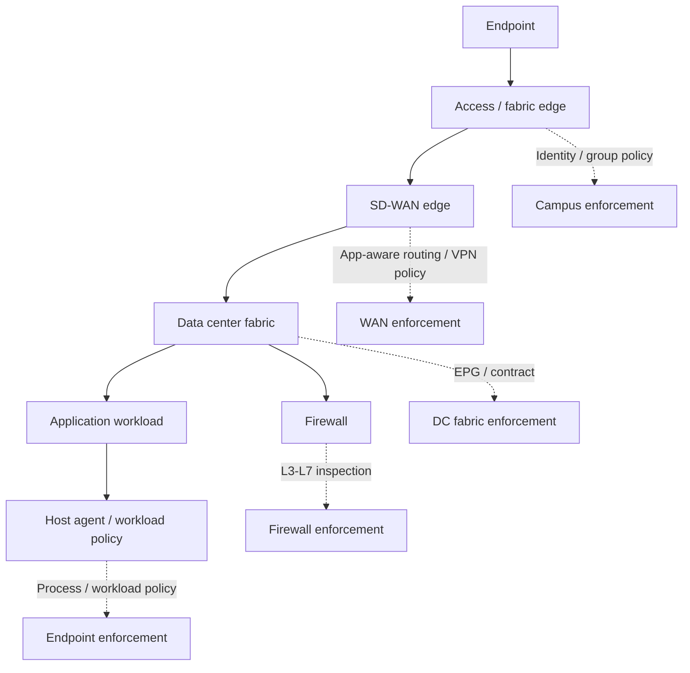

### Design Question

For every policy, ask:

- Where is the policy defined?
- Where is the policy enforced?
- Who owns the policy?
- How is it logged?
- How is it tested?
- How is it rolled back?
- How is it represented in other domains?

## 8. Zero Trust and SDN

Zero Trust is not a product. It is a security architecture based on:

- Never trust by default.
- Verify identity and context.
- Enforce least privilege.
- Assume breach.
- Continuously monitor.

SDN can support Zero Trust by providing:

- Identity-aware access.
- Segmentation.
- Dynamic policy.
- Central policy visibility.
- Telemetry.
- Automated response.

### Example

Business policy:

- A managed finance laptop used by an authenticated finance user can access ERP over HTTPS.
- The same user from an unmanaged device cannot access ERP.
- Guest devices can only access the Internet.
- OT devices can only communicate with approved OT services.

Technical enforcement may involve:

- 802.1X authentication.
- Endpoint posture.
- SGT assignment.
- SD-Access policy.
- SD-WAN segmentation.
- Data center firewall rule.
- ACI contract.
- SIEM logging.

## 9. IT/OT Security Segmentation

OT environments require special treatment. The goal is not simply to "apply enterprise SDN everywhere." The goal is to increase visibility and control without creating safety or availability risk.

Recommended IT/OT model:

- Separate IT and OT routing/security domains.
- Use an industrial DMZ.
- Enforce access through firewalls and jump hosts.
- Permit only required flows.
- Use passive discovery first.
- Avoid intrusive scanning unless approved by OT owners.
- Maintain vendor support constraints.
- Document emergency access.

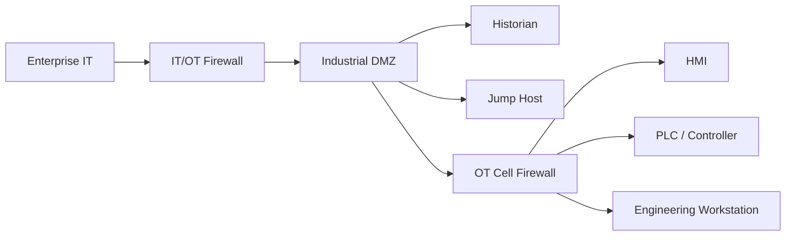

### OT SDN Use Cases

- Segment OT from corporate IT.
- Provide controlled remote access.
- Monitor OT traffic passively.
- Standardize access to historian and jump hosts.
- Prevent lateral movement between OT cells.
- Create clear emergency access procedures.

### OT Risks

- Legacy devices may not support modern authentication.
- Some protocols are sensitive to latency or packet inspection.
- Vendor systems may have hardcoded assumptions.
- Maintenance windows may be rare.
- Safety requirements override convenience.

## 10. Monitoring in SDN

Monitoring in SDN must cover more than device up/down status.

Required monitoring layers:

- Physical infrastructure.
- Underlay routing.
- Overlay tunnels.
- Controller health.
- Policy deployment status.
- Endpoint identity and assignment.
- Fabric health.
- Application reachability.
- Security events.
- Automation task status.
- API health.

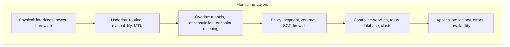

## 11. Telemetry Sources

Common telemetry sources:

- SNMP.
- Syslog.
- NetFlow/IPFIX.
- Streaming telemetry.
- gNMI.
- Controller APIs.
- Firewall logs.
- Authentication logs.
- Endpoint telemetry.
- Cloud flow logs.
- Application performance monitoring.
- Synthetic probes.

### Telemetry Comparison

| Source | Strength | Limitation |
|---|---|---|
| SNMP | Widely supported | Polling delay, limited detail |
| Syslog | Good event visibility | Unstructured, noisy |
| NetFlow/IPFIX | Traffic visibility | Sampling and storage considerations |
| Streaming telemetry | Timely structured data | Requires pipeline design |
| Controller API | Fabric-aware state | Controller view may differ from device state |
| Firewall logs | Security decision evidence | Only sees inspected paths |
| Cloud flow logs | Cloud visibility | Provider-specific format |
| Synthetic probes | User/application path validation | Must be placed carefully |

## 12. Assurance

Assurance means continuously checking whether the network is behaving as intended.

It combines:

- Inventory.
- Topology.
- Telemetry.
- Events.
- Policy state.
- User/application experience.
- Path analysis.
- Health scoring.
- Compliance checking.

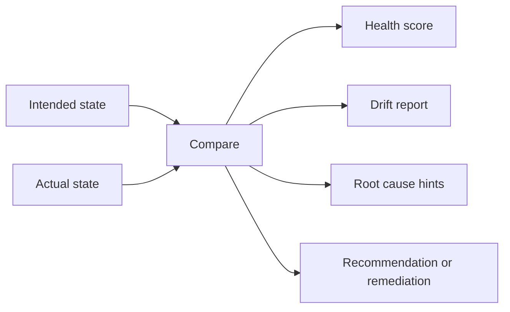

### Assurance Questions

- Are all devices reachable?
- Are controller services healthy?
- Are tunnels up?
- Are endpoints in the correct segment?
- Is policy deployed?
- Is actual traffic matching expected policy?
- Are application paths healthy?
- Are there anomalies compared with baseline?
- Is the network compliant with intended design?

## 13. Health Scores: Useful but Dangerous if Misused

Many SDN systems provide health scores or dashboards.

Benefits:

- Quick operational summary.
- Good for triage.
- Helps non-experts understand state.
- Can prioritize investigation.

Risks:

- A high-level score can hide detail.
- A low score may not identify root cause.
- Operators may trust dashboard state without checking device/path evidence.
- Health logic may be vendor-specific.

Best practice:

- Use health score as a starting point.
- Confirm with path, logs, telemetry, and device state.

## 14. AI/ML in SDN Operations

AI/ML can support network operations when there is enough quality telemetry.

Use cases:

- Anomaly detection.
- Baseline learning.
- Predictive capacity analysis.
- Root-cause assistance.
- Event correlation.
- Change risk scoring.
- Wireless performance analysis.
- Application experience analysis.
- Security behavior analytics.

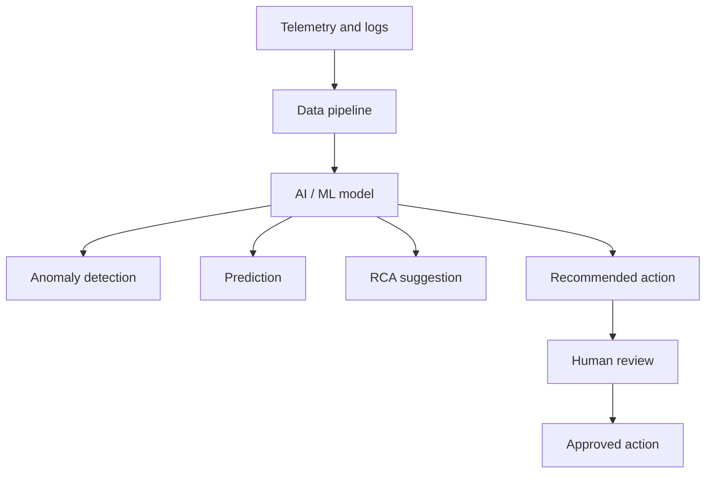

### Important Limits

AI/ML is not magic.

It depends on:

- Data quality.
- Correct timestamps.
- Sufficient history.
- Good labels or baselines.
- Clear topology context.
- Human validation.

Do not allow automated remediation for high-impact changes until the organization has strong guardrails and proven confidence.

## 15. Troubleshooting SDN: A Structured Method

Traditional troubleshooting often starts with hop-by-hop checks. SDN troubleshooting must include:

- Controller state.
- Device state.
- Policy state.
- Identity state.
- Underlay state.
- Overlay state.
- Automation/task state.
- Security enforcement state.

### General Troubleshooting Flow

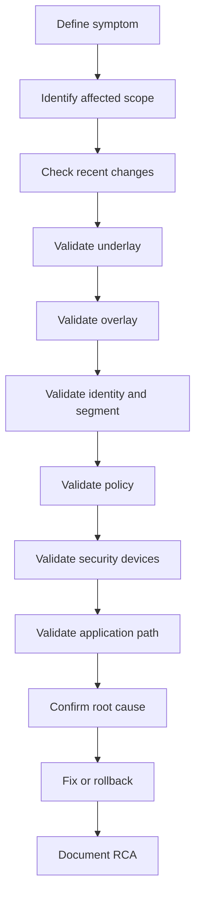

## 16. Control Plane Troubleshooting

Control plane issues affect how the network learns topology, endpoint location, routes, policy, or tunnel state.

Examples:

- Controller service down.
- Controller cluster degraded.
- Device not registered.
- Control connection down.
- Endpoint mapping missing.
- Route not advertised.
- Tunnel control session down.
- Certificate expired.
- Time synchronization issue.
- Policy deployment task failed.

### Control Plane Checklist

- Is the controller reachable?
- Are controller services healthy?
- Is the controller cluster healthy?
- Are devices registered?
- Are control sessions up?
- Are certificates valid?
- Is NTP synchronized?
- Are there failed deployment tasks?
- Are routes or endpoint mappings present?
- Are there version compatibility issues?

## 17. Data Plane Troubleshooting

Data plane issues affect actual packet forwarding.

Examples:

- Interface down.
- Link errors.
- MTU mismatch.
- Wrong next hop.
- Tunnel down.
- Encapsulation issue.
- ACL or contract drop.
- Firewall drop.
- QoS queue drop.
- Asymmetric routing.

### Data Plane Checklist

- Is the physical interface up?
- Are there errors or drops?
- Is the route present?
- Is ARP/ND working?
- Is MTU correct?
- Is the tunnel up?
- Does packet capture show traffic entering and leaving?
- Is traffic dropped by policy?
- Is return path valid?

## 18. Underlay vs Overlay Troubleshooting

Always validate underlay before overlay.

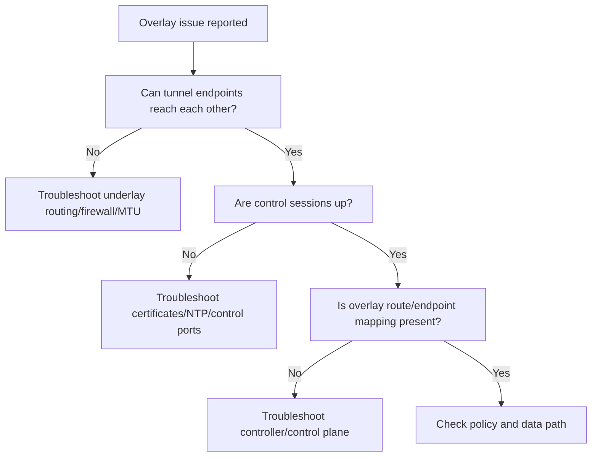

Underlay checks:

- IP reachability.
- Routing adjacency.
- Route table.
- MTU.
- Firewall between tunnel endpoints.
- Link errors.
- Packet loss.

Overlay checks:

- Tunnel state.
- Control connections.
- Endpoint mappings.
- Overlay route table.
- Encapsulation.
- Policy.
- Application path.

## 19. Policy Troubleshooting

Policy troubleshooting is central in SDN.

Policy may be represented as:

- SGT policy.
- ACI contract.
- SD-WAN centralized policy.
- Firewall rule.
- Cloud security group.
- SSE/SASE access rule.
- Host firewall policy.

### Policy Troubleshooting Questions

- What is the source identity or segment?
- What is the destination identity or segment?
- Which policy object should allow the flow?
- Where is policy enforced?
- Is the policy deployed?
- Is the traffic matching the expected rule?
- Is there a more specific deny?
- Is logging enabled?
- Is another domain enforcing additional policy?

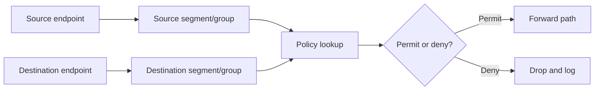

## 20. Identity Troubleshooting

Identity issues often look like network issues.

Symptoms:

- User cannot access application.
- Device placed in guest or quarantine.
- IoT device gets wrong policy.
- Wireless user works in one building but not another.
- OT engineering laptop loses access after reauthentication.

Common causes:

- 802.1X failure.
- RADIUS timeout.
- Wrong authorization profile.
- Endpoint profiling error.
- Certificate issue.
- User group mismatch.
- MDM/posture failure.
- Stale session.

Troubleshooting:

- Check authentication logs.
- Check assigned VLAN/VN/SGT/group.
- Check endpoint identity.
- Check RADIUS attributes.
- Check certificate status.
- Check policy mapping.
- Test with known-good user/device.

## 21. Automation Troubleshooting

Automation failures may create network failures or simply fail to deploy changes.

Common symptoms:

- API returns success but task fails.
- Playbook completes but config not applied.
- Terraform plan differs unexpectedly.
- Controller shows object exists but device did not receive it.
- Duplicate policy object created.
- Drift between source of truth and actual state.

Checklist:

- Check input data.
- Check credentials and permissions.
- Check API response code.
- Check async task status.
- Check rate limiting.
- Check controller logs.
- Check device logs.
- Check idempotency.
- Check source of truth.
- Check recent manual changes.

## 22. Troubleshooting Scenario 1: User Cannot Reach Application

Scenario:

- User is in headquarters campus.
- Application is in data center.
- Network uses campus SDN, SD-WAN, and data center SDN.

Investigation flow:

1. Define source, destination, application port, time, and user identity.
2. Check user authentication and segment assignment.
3. Check campus fabric path.
4. Check border routing.
5. Check SD-WAN tunnel and policy.
6. Check data center route and segment.
7. Check firewall logs.
8. Check ACI contract or data center policy.
9. Check application server status.
10. Confirm return path.

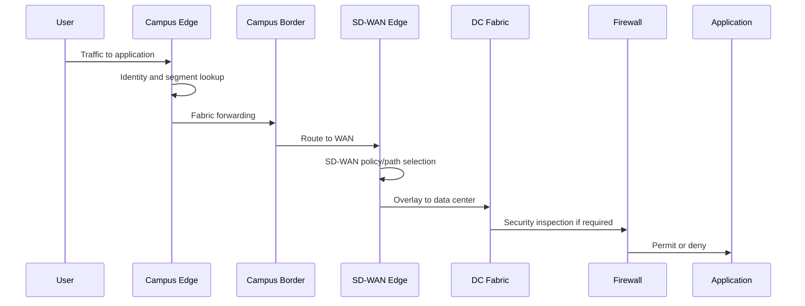

## 23. Troubleshooting Scenario 2: Tunnel Down

Symptoms:

- Branch unreachable.
- SD-WAN tunnel down.
- Overlay path unavailable.
- Applications fail over or degrade.

Possible causes:

- Transport outage.
- Firewall blocking control or data ports.
- Certificate issue.
- Clock/NTP issue.
- Device not authorized.
- NAT traversal issue.
- Controller unreachable.
- Incorrect template.

Checks:

- Underlay Internet/MPLS reachability.
- DNS resolution if controller FQDN is used.
- NTP.
- Certificates.
- Control connections.
- Firewall/NAT rules.
- Device template.
- Controller logs.

## 24. Troubleshooting Scenario 3: Policy Misconfiguration

Symptoms:

- A group that should be blocked is allowed.
- A group that should be allowed is blocked.
- Issue appears after policy change.

Possible causes:

- Wrong source/destination group.
- Policy order issue.
- Missing contract.
- Incorrect firewall object.
- Policy deployed to wrong site.
- Incomplete multi-domain mapping.
- Cached session or stale state.

Response:

- Identify exact flow.
- Check policy matrix.
- Compare intended policy with deployed policy.
- Review recent changes.
- Check enforcement point logs.
- Roll back if business impact is high.
- Update policy documentation.

## 25. Troubleshooting Scenario 4: MTU and Encapsulation

Symptoms:

- Ping works but application fails.
- Small packets pass, large packets fail.
- File transfer hangs.
- Tunnel is up but performance is poor.

Cause:

Overlay encapsulation adds headers. If underlay MTU is too small, packets may fragment or be dropped.

Checks:

- Interface MTU.
- Tunnel overhead.
- DF-bit ping.
- Firewall handling of ICMP fragmentation-needed.
- Path MTU discovery.
- Application packet size.

Remediation:

- Increase underlay MTU where possible.
- Adjust TCP MSS.
- Allow required ICMP.
- Validate after change.

## 26. Incident Response in SDN

An SDN incident response process should include:

- Incident classification.
- Scope identification.
- Recent change review.
- Controller health check.
- Fabric/tunnel health check.
- Policy and identity validation.
- Security log review.
- Rollback decision.
- Communication plan.
- RCA documentation.

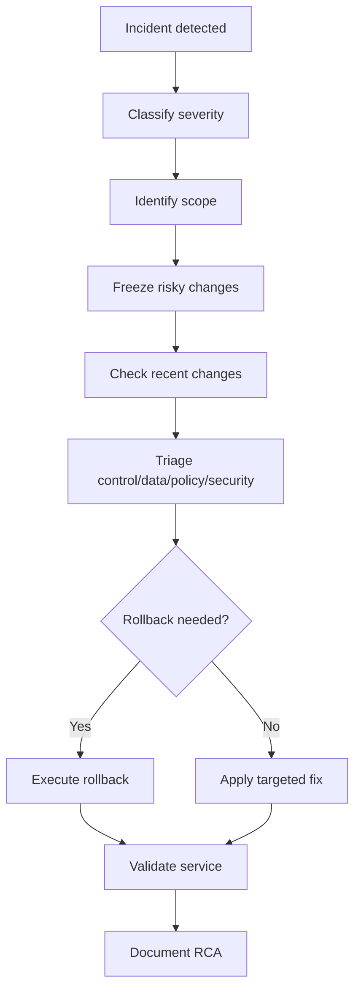

## 27. Root Cause Analysis

An RCA should be short, factual, and evidence-based.

Recommended RCA sections:

- Summary.
- Business impact.
- Timeline.
- Detection method.
- Root cause.
- Contributing factors.
- Resolution.
- Validation.
- Prevention actions.
- Owner and due date.

### RCA Example

Summary:

- Branch guest Internet access failed after SD-WAN policy update.

Root cause:

- Guest VPN was omitted from the centralized data policy applied to branch group B.

Contributing factor:

- Policy template validation checked corporate VPN only.

Resolution:

- Restored previous policy, added guest VPN validation, redeployed corrected policy.

Prevention:

- Add automated pre-check for all required VPNs before policy deployment.

## 28. SDN Monitoring Dashboard Design

A useful dashboard should serve specific users.

Network operations dashboard:

- Controller health.
- Device reachability.
- Fabric status.
- Tunnel status.
- Critical alarms.
- Change tasks.

Security dashboard:

- Policy violations.
- Denied flows.
- Guest/IoT/OT events.
- Admin actions.
- API calls.
- Quarantine events.

Application dashboard:

- Application reachability.
- Latency.
- Packet loss.
- Branch-to-app path.
- SaaS experience.

Executive dashboard:

- Service availability.
- Site health.
- Major incidents.
- SLA compliance.
- Risk indicators.

## 29. Operational Metrics

Useful SDN operational metrics:

- Controller availability.
- Device onboarding success rate.
- Policy deployment success rate.
- Mean time to detect.
- Mean time to repair.
- Number of policy exceptions.
- Number of failed automation tasks.
- Drift count.
- Tunnel availability.
- Fabric health score.
- Application path SLA.
- Unauthorized API attempts.
- Configuration rollback count.

## 30. Day 4 Lab Theory: Monitoring and Health Check

Lab objective:

- Collect health data from controller or lab environment.
- Check node/device status.
- Check interface/tunnel status.
- Check policy deployment state.
- Produce a health summary.

Concepts reinforced:

- Controller health.
- Device reachability.
- Tunnel state.
- API-based monitoring.
- Structured reporting.

## 31. Day 4 Lab Theory: Segmentation and Policy Validation

Lab objective:

- Define source and destination groups.
- Apply allow/deny policy.
- Test expected permitted flows.
- Test expected denied flows.
- Capture evidence.

Concepts reinforced:

- Policy matrix.
- Enforcement point.
- Positive and negative testing.
- Logging.
- Evidence for security review.

## 32. Day 4 Lab Theory: Troubleshooting Drill

Lab objective:

- Introduce a controlled fault.
- Diagnose using structured troubleshooting.
- Identify root cause.
- Propose fix.
- Write short RCA.

Example faults:

- Missing route.
- Wrong segment.
- Deny policy.
- Tunnel down.
- Controller task failure.
- MTU issue.

Required output:

- Symptom.
- Scope.
- Evidence.
- Root cause.
- Fix.
- Validation.
- Prevention.

## 33. Design Exercise: SDN Security and Assurance Plan

Scenario:

Enterprise has:

- Headquarters campus.
- 15 branches.
- Primary and DR data centers.
- Two factories.
- Public cloud.
- Remote users.
- Existing SD-WAN.
- Planned segmentation across user, guest, IoT, OT, server, and management zones.

Group deliverables:

- Segmentation model.
- Policy matrix.
- Enforcement point map.
- Monitoring architecture.
- Telemetry sources.
- Dashboard requirements.
- Incident runbook.
- RCA template.
- AI/ML use cases.
- Security controls for controllers and APIs.

## 34. Instructor Notes

Recommended teaching flow:

1. Start with the core trade-off: centralized control improves consistency but increases blast radius.
2. Discuss controller and API security before segmentation.
3. Build segmentation from macro to micro.
4. Emphasize policy enforcement points and ownership.
5. Introduce monitoring layers from physical to application.
6. Explain assurance as continuous intent verification.
7. Present AI/ML as useful support, not automatic truth.
8. Spend significant time on structured troubleshooting.
9. End with RCA and operational metrics.

Important messages:

- SDN security is governance plus enforcement plus visibility.
- A policy is not complete until it has an owner, enforcement point, log, test, and rollback.
- Dashboards are not evidence by themselves.
- AI/ML can assist but must be validated.
- Troubleshooting SDN requires both traditional packet-path thinking and controller/policy awareness.

## 35. Review Questions

1. Why does SDN improve security and increase risk at the same time?
2. Why is the SDN controller a high-value security target?
3. What are the main controls for API security?
4. What is the difference between macrosegmentation and microsegmentation?
5. Why does SDN not eliminate the need for firewalls?
6. What is a policy enforcement point?
7. How can SDN support Zero Trust?
8. Why must IT/OT segmentation be handled conservatively?
9. What monitoring layers are required in SDN?
10. What is the difference between monitoring and assurance?
11. Why should health scores be treated carefully?
12. What are useful AI/ML use cases in SDN operations?
13. Why should underlay be checked before overlay?
14. What are common causes of identity-related access issues?
15. What should be included in an SDN RCA?

## 36. Day 4 Key Takeaways

- SDN centralizes policy and visibility, but controller and API security become critical.
- Segmentation is one of the strongest SDN use cases, but it requires ownership, testing, and governance.
- Policy must be mapped across campus, WAN, data center, cloud, firewall, and identity systems.
- Monitoring must cover physical, underlay, overlay, controller, policy, and application layers.
- Assurance means verifying that actual network behavior matches intended state.
- AI/ML can help detect anomalies and suggest root causes, but human validation remains essential.
- Troubleshooting SDN requires a structured method that includes control plane, data plane, identity, policy, security, automation, and application checks.
- RCA and prevention actions are part of mature SDN operations.

## 37. References

- Cisco Catalyst Center: https://www.cisco.com/site/us/en/products/networking/catalyst-center/index.html
- Cisco SD-Access Solution Design Guide: https://www.cisco.com/c/en/us/td/docs/solutions/CVD/Campus/cisco-sda-design-guide.html
- Cisco ACI solution overview: https://www.cisco.com/c/en/us/solutions/collateral/data-center-virtualization/application-centric-infrastructure/solution-overview-c22-741487.html
- Cisco Catalyst SD-WAN: https://www.cisco.com/site/us/en/solutions/networking/sdwan/catalyst/index.html
- Cisco Security and Zero Trust: https://www.cisco.com/site/us/en/solutions/security/zero-trust/index.html
- Cisco Identity Services Engine: https://www.cisco.com/site/us/en/products/security/identity-services-engine/index.html
- NIST Zero Trust Architecture SP 800-207: https://csrc.nist.gov/publications/detail/sp/800-207/final
- MITRE ATT&CK for Enterprise: https://attack.mitre.org/

