# Day 5 - SDN Capstone: Enterprise Design and Implementation Planning

## 1. Day 5 Positioning and Learning Outcomes

Day 1 introduced SDN architecture and core concepts.

Day 2 explained integration and deployment in real enterprise networks.

Day 3 covered automation, APIs, and infrastructure as code.

Day 4 focused on security, monitoring, assurance, AI/ML operations, and troubleshooting.

Day 5 is the capstone day:

> Learners will design a practical SDN architecture for a multi-site enterprise and defend their design choices.

This day should feel like a real architecture workshop. Learners should not simply repeat theory. They should make design decisions, explain trade-offs, handle constraints, build migration phases, and show how the solution will be operated after deployment.

By the end of Day 5, learners should be able to:

- Translate business requirements into SDN technical requirements.
- Design an enterprise SDN target architecture across data center, campus, WAN, branch, cloud, and IT/OT domains.
- Build a segmentation and policy model.
- Define security enforcement points.
- Design monitoring, telemetry, assurance, and troubleshooting workflows.
- Define automation workflows and required source-of-truth data.
- Create a phased migration and rollback plan.
- Prepare HLD and LLD-level artifacts.
- Present and defend an SDN design to technical stakeholders.

## 2. Capstone Scenario

The enterprise is a medium-to-large organization with both office and industrial environments.

Current environment:

- One primary data center.
- One disaster recovery data center.
- One headquarters campus.
- Ten regional branch offices.
- Two manufacturing plants with OT networks.
- Public cloud workloads.
- SaaS applications such as Microsoft 365, CRM, collaboration tools.
- Remote users.
- Existing MPLS and Internet circuits.
- Existing Cisco SD-WAN knowledge in the operations team.
- Existing VLAN/ACL-based campus segmentation.
- Existing firewalls at data center and Internet edge.
- Limited automation.
- Inconsistent documentation across sites.

Business drivers:

- Improve segmentation between user, guest, IoT, OT, server, and management networks.
- Reduce manual network configuration.
- Accelerate new branch deployment.
- Improve WAN application experience.
- Prepare for cloud and SaaS growth.
- Improve monitoring and troubleshooting.
- Create a scalable operating model for network and security teams.
- Reduce risk during migration from traditional network to SDN.

## 3. Business Requirements

Business requirements should be technology-neutral. They describe outcomes, not products.

Example requirements:

- The enterprise must support secure connectivity between all branches and data centers.
- Branch rollout time should be reduced from weeks to days.
- Guest users must have Internet-only access.
- OT networks must be isolated from corporate IT except through approved services.
- Corporate users must access enterprise applications based on role and business need.
- Cloud workloads must be reachable through controlled and monitored paths.
- Critical applications must meet defined latency, jitter, and availability requirements.
- Network changes must be auditable.
- Network policy should be standardized across sites.
- The solution must support phased migration with rollback.

## 4. Technical Requirements

Technical requirements translate business outcomes into design constraints.

Examples:

- Support macrosegmentation across corporate, guest, IoT, OT, server, management, and DMZ zones.
- Support microsegmentation for selected data center applications.
- Support SD-WAN overlay across MPLS and Internet.
- Support local Internet breakout for approved SaaS traffic.
- Support centralized security logging.
- Support identity integration for campus users and devices.
- Support controller/API-based automation.
- Support telemetry collection from SDN controllers and network devices.
- Support high availability for controllers and critical forwarding nodes.
- Support route filtering and summarization at domain boundaries.
- Support IT/OT separation through an industrial DMZ.

## 5. Constraints and Assumptions

Every design has constraints. Good architects document them clearly.

Possible constraints:

- Not all campus switches are fabric-capable.
- OT systems cannot be aggressively scanned.
- Some legacy applications require static IP dependencies.
- Some branch circuits have limited bandwidth.
- Firewall policy ownership belongs to the security team.
- Cloud routing is managed by a separate platform team.
- Change windows are limited.
- Budget does not allow full hardware refresh in year one.
- Existing MPLS contracts continue for two more years.
- Operations team has limited experience with APIs and automation.

Possible assumptions:

- Cisco SD-WAN knowledge already exists.
- Identity integration can be built using an enterprise identity platform.
- Branches can be migrated in waves.
- New sites can use standardized templates.
- Data center segmentation can start with selected application groups.
- The source of truth will be created or improved before large-scale automation.

## 6. Target Architecture Overview

The target architecture should include multiple SDN and traditional domains that integrate cleanly.

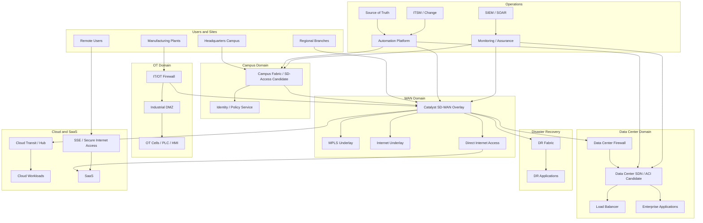

## 7. SDN Domain Selection

Learners should choose which SDN domains are included in the target architecture.

Typical domain choices:

| Domain | Recommended Approach | Reason |
|---|---|---|
| WAN / Branch | Cisco Catalyst SD-WAN | Team already has SD-WAN knowledge; strong branch use case |
| Campus | Cisco SD-Access or phased campus fabric | Identity-based segmentation and wired/wireless policy |
| Data Center | Cisco ACI or EVPN-VXLAN fabric | Application segmentation and data center automation |
| Cloud | Cloud-native networking plus SD-WAN/cloud on-ramp | Hybrid application access and controlled routing |
| OT | Conservative segmentation with firewall/DMZ | Safety and availability constraints |
| Operations | Automation and source of truth | Repeatability, audit, and scale |

Important design note:

> Not every domain must become SDN at the same time. A phased hybrid model is usually safer.

## 8. High-Level Design Artifacts

The capstone should produce HLD-level artifacts.

HLD contents:

- Executive summary.
- Business goals.
- Current state summary.
- Target architecture.
- SDN domain selection.
- Routing design.
- Segmentation design.
- Security design.
- Cloud integration.
- IT/OT integration.
- Monitoring and assurance.
- Automation approach.
- Migration roadmap.
- Risk register.
- Operational model.

## 9. Low-Level Design Artifacts

The capstone does not need a full production LLD, but learners should understand what an LLD would include.

LLD contents:

- Device roles.
- Controller placement.
- IP addressing.
- Loopbacks.
- Routing protocol details.
- VRF/VN/VPN mapping.
- VLAN mapping.
- Segment IDs.
- Firewall zones.
- NAT rules.
- Route filters.
- Policy matrix.
- Template variables.
- HA design.
- Monitoring configuration.
- Backup and restore procedures.
- Validation test cases.

## 10. Routing Design

The routing design must define how each domain exchanges reachability.

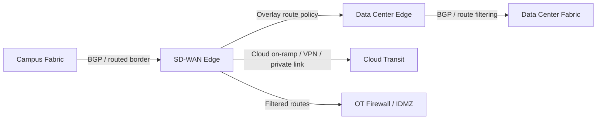

Routing decisions:

- Which protocol is used at each boundary?
- Where are routes summarized?
- Which routes are leaked between segments?
- Which domain owns the default route?
- How are branch routes advertised?
- How are cloud routes advertised?
- How are OT routes restricted?
- How is asymmetric routing avoided?

## 11. Segmentation Model

A practical enterprise design should start with macrosegmentation and apply microsegmentation selectively.

Recommended macrosegments:

- Corporate users.
- Guest.
- IoT.
- OT.
- Server.
- Management.
- DMZ.
- Cloud workloads.
- Remote users.

Possible technical mapping:

| Business Segment | Campus | SD-WAN | Data Center | Cloud | Security |
|---|---|---|---|---|---|
| Corporate users | VN + SGT | VPN 10 | VRF Corp | Corporate VNet/VPC | Firewall zone Corp |
| Guest | Guest VN | VPN 20 / DIA | No direct access | Internet only | Guest firewall policy |
| IoT | IoT VN + SGT | VPN 30 | Limited services VRF | Limited/no access | IoT zone |
| OT | OT VN or separate routed domain | VPN 40 | Historian access only | No direct access | IT/OT firewall |
| Server | N/A | DC route target | ACI VRF/EPG | App VPC/VNet | Server zone |
| Management | Mgmt VN | Mgmt VPN | Mgmt VRF | Mgmt subnet | Admin-only policy |
| DMZ | N/A | Edge routing | DMZ VRF/EPG | Public services | Perimeter firewall |

## 12. Policy Matrix

Every segmentation design needs a policy matrix.

Example:

| Source | Destination | Access | Enforcement Point | Logging |
|---|---|---|---|---|
| Corporate users | ERP | HTTPS permit | Campus policy + DC firewall | Yes |
| Corporate users | Internet | Web permit | Internet edge / SSE | Yes |
| Guest | Internet | DNS/HTTP/HTTPS permit | Guest firewall / DIA | Yes |
| Guest | Internal networks | Deny | Campus/WAN/firewall | Yes |
| IoT | IoT platform | Required ports only | Fabric/firewall | Yes |
| IoT | Corporate users | Deny | Fabric/firewall | Yes |
| OT | Historian | Required industrial flows | IT/OT firewall | Yes |
| IT admin | Network devices | SSH/HTTPS permit | Mgmt firewall + AAA | Yes |
| Cloud app | Database | App-specific permit | Cloud SG + DC firewall | Yes |
| Remote users | Selected apps | Identity-based permit | SSE/VPN/firewall | Yes |

## 13. Security Enforcement Map

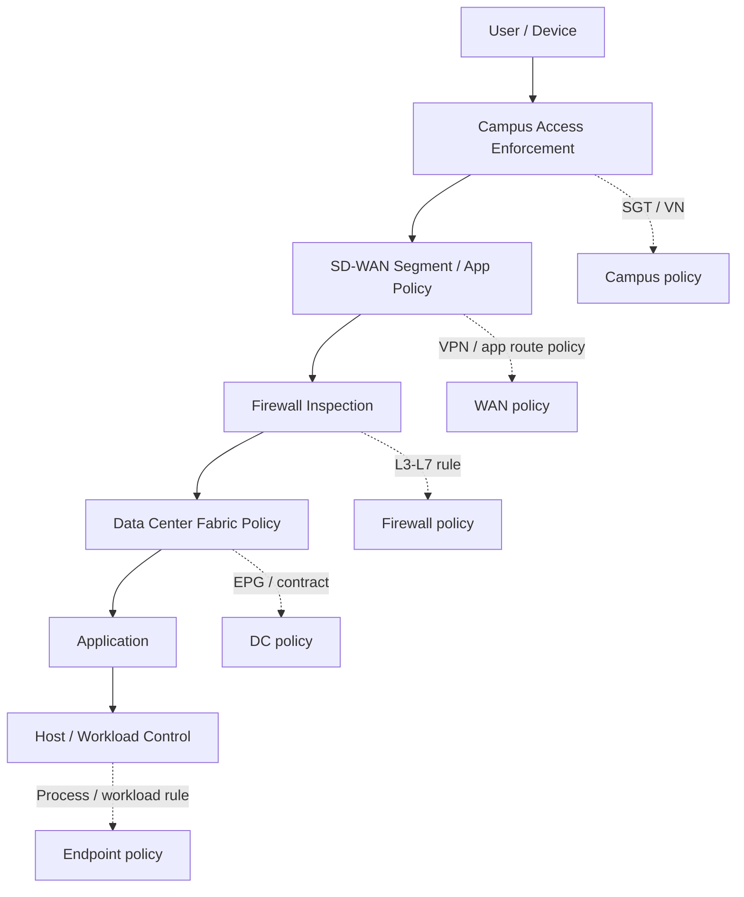

Design questions:

- Which traffic must pass through a firewall?
- Which traffic can be enforced by fabric policy?
- Where is logging required?
- Which team owns each policy?
- How are emergency exceptions handled?
- How are temporary rules expired?

## 14. Data Center Design

Recommended approach:

- Use leaf-spine as the target data center architecture.
- Use ACI or EVPN-VXLAN for data center fabric.
- Start with application groups that have clear dependencies.
- Avoid unnecessary Layer 2 extension.
- Use firewall insertion for high-risk flows.
- Build EPG/contract or equivalent policy model gradually.

Application segmentation example:

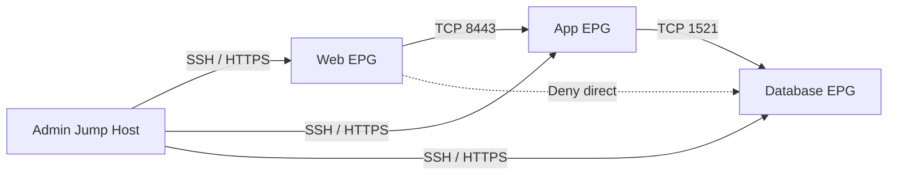

Migration pattern:

- New applications go to the SDN fabric first.
- Legacy applications remain on existing network temporarily.
- Shared services are exposed through controlled routing.
- Application teams validate dependencies before migration.
- Firewall and load balancer integration is tested early.

## 15. Campus Design

Recommended approach:

- Use identity-based segmentation where endpoint identity is reliable.
- Start with controlled sites or buildings.
- Integrate with identity services before broad rollout.
- Use guest or IoT segmentation as an early use case.
- Preserve traditional design where hardware is not ready.

Campus segmentation example:

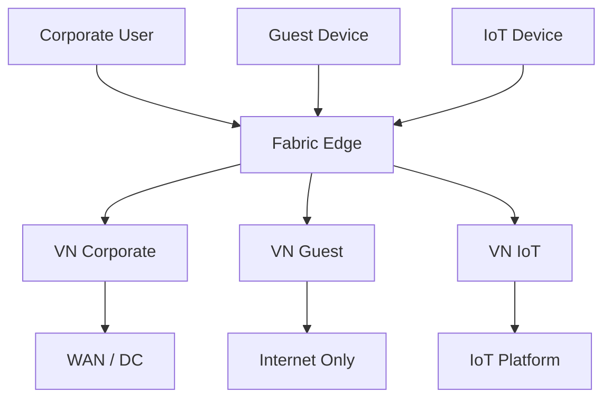

Design questions:

- Which endpoints support 802.1X?
- How are non-802.1X devices handled?
- How are wireless and wired policies aligned?
- Where are fabric borders?
- How are legacy VLANs migrated?
- How are user groups mapped to access policy?

## 16. Branch and SD-WAN Design

Recommended approach:

- Use SD-WAN as the first broad SDN domain if the team already has knowledge.
- Standardize branch templates.
- Use transport independence across MPLS and Internet.
- Define application-aware routing policy.
- Decide local Internet breakout per segment.
- Integrate branch security with firewall/SSE/SASE strategy.

Branch design example:

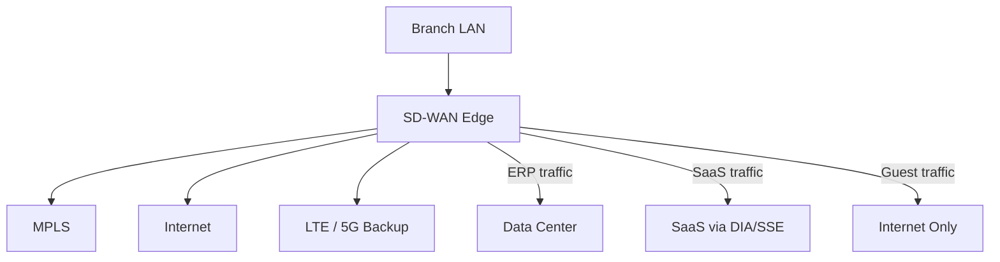

Policy examples:

- ERP prefers MPLS, fails over to Internet.
- Voice prefers lowest latency path.
- Microsoft 365 uses local breakout or SSE path.
- Guest uses Internet-only path.
- OT traffic uses restricted path to data center historian.

## 17. Cloud Integration Design

Recommended approach:

- Use a cloud hub/transit model.
- Avoid uncontrolled mesh connectivity.
- Use cloud-native security groups and route tables.
- Integrate with SD-WAN or private connectivity.
- Centralize logging.
- Define ownership between network, cloud, and security teams.

Cloud design example:

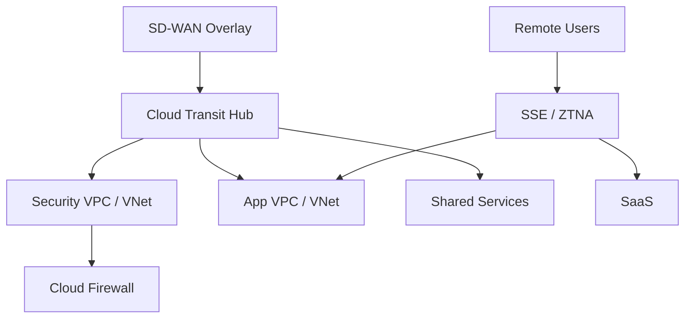

Design questions:

- Are IP ranges unique?
- Who owns cloud route tables?
- Where is inspection performed?
- How are cloud security groups mapped to enterprise policy?
- How are logs collected?
- How are cloud changes approved?

## 18. IT/OT Design

Recommended approach:

- Treat OT as a protected domain.
- Use industrial DMZ.
- Use firewalls between IT and OT.
- Use jump hosts for administration.
- Use passive monitoring first.
- Avoid aggressive endpoint enforcement until tested.
- Use phased segmentation by production cell or criticality.

IT/OT target model:

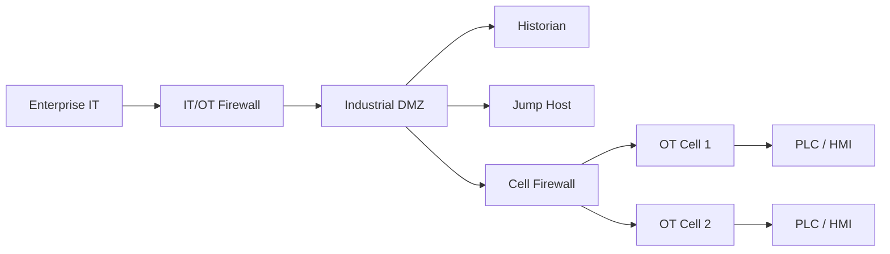

Policy examples:

- IT users cannot directly access OT cells.
- OT engineer must use jump host with MFA.
- Historian receives data from OT systems.
- OT systems cannot initiate broad access to corporate IT.
- Remote vendor access is time-bound and logged.

## 19. Monitoring and Assurance Plan

Monitoring must cover:

- Controller health.
- Device reachability.
- Underlay status.
- Overlay tunnel status.
- Routing status.
- Policy deployment.
- Endpoint identity.
- Firewall/security events.
- Application path.
- Automation task results.
- Cloud connectivity.
- OT boundary events.

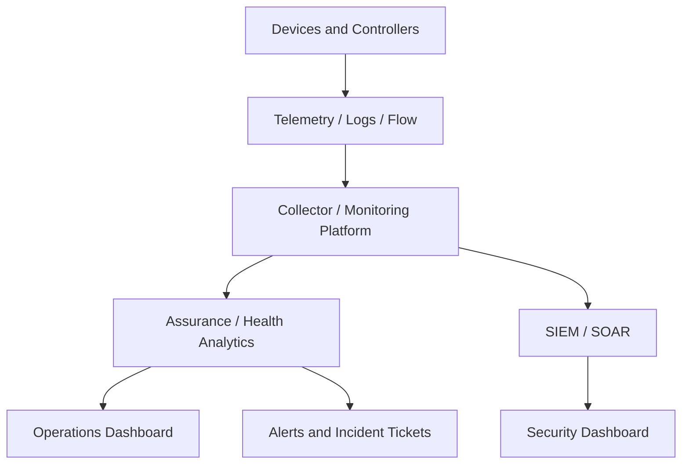

Dashboard requirements:

- Site health.
- Controller health.
- Tunnel status.
- Policy deployment status.
- Application SLA.
- Security policy violations.
- OT boundary alerts.
- Failed automation tasks.
- Drift reports.

## 20. Automation Plan

Automation should start with safe, high-value workflows.

Phase 1 automation:

- Inventory collection.
- Configuration backup.
- Compliance checks.
- Device reachability report.
- Standard NTP/SNMP/syslog validation.

Phase 2 automation:

- Branch template variable generation.
- Site onboarding.
- Segment creation.
- Monitoring registration.
- Policy reporting.

Phase 3 automation:

- Controlled policy deployment.
- Git-based change workflow.
- API integration with ITSM.
- Drift detection.
- Limited closed-loop remediation for low-risk events.

Automation architecture:

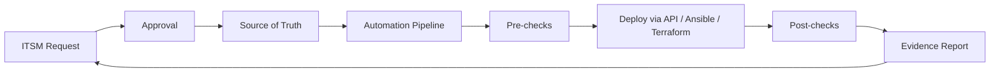

Required source-of-truth fields:

- Site ID.
- Site type.
- Region.
- Device role.
- Hostname.
- Management IP.
- WAN transport.
- LAN prefixes.
- Segment assignment.
- Circuit ID.
- Owner.
- Change window.
- Security zone.

## 21. Migration Roadmap

Recommended migration phases:

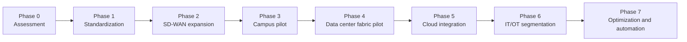

## 21.1 Phase 0: Assessment

Activities:

- Inventory devices.
- Map topology.
- Review routing.
- Review VLAN/VRF/ACLs.
- Review firewall rules.
- Map application dependencies.
- Identify branch categories.
- Review OT constraints.
- Review monitoring tools.
- Review operational processes.

Deliverables:

- Current-state architecture.
- Risk register.
- Technical debt list.
- Migration readiness score.

## 21.2 Phase 1: Standardization

Activities:

- Define naming standards.
- Clean up IP plan.
- Standardize site codes.
- Define segment taxonomy.
- Define policy ownership.
- Standardize logging and NTP.
- Improve backup and monitoring.
- Create source of truth.

Deliverables:

- Standards document.
- Source-of-truth schema.
- Segment catalog.
- Policy ownership matrix.

## 21.3 Phase 2: SD-WAN Expansion

Activities:

- Standardize branch templates.
- Define application-aware routing.
- Define DIA/SaaS policy.
- Migrate branches in waves.
- Validate SLA and failover.

Deliverables:

- Branch template.
- SD-WAN policy design.
- Branch migration runbook.
- Validation checklist.

## 21.4 Phase 3: Campus Pilot

Activities:

- Select pilot building/site.
- Integrate identity.
- Create initial VNs/groups.
- Test guest and IoT segmentation.
- Validate wired/wireless policy.

Deliverables:

- Campus fabric pilot design.
- Identity integration plan.
- Policy matrix.
- Rollback plan.

## 21.5 Phase 4: Data Center Fabric Pilot

Activities:

- Select non-critical application.
- Map dependencies.
- Create application groups.
- Define contracts/firewall policy.
- Migrate workload or deploy new app.

Deliverables:

- Application dependency map.
- EPG/contract or segment design.
- Migration plan.
- Application validation results.

## 21.6 Phase 5: Cloud Integration

Activities:

- Define cloud routing model.
- Build hub/transit design.
- Integrate SD-WAN/cloud connectivity.
- Align cloud security groups with policy.
- Enable flow logs.

Deliverables:

- Cloud network HLD.
- Route table design.
- Security group mapping.
- Cloud logging design.

## 21.7 Phase 6: IT/OT Segmentation

Activities:

- Passive discovery.
- Define OT zones.
- Build industrial DMZ.
- Insert firewalls.
- Create jump host access.
- Validate with OT owners.

Deliverables:

- IT/OT policy matrix.
- OT access runbook.
- Passive monitoring plan.
- Emergency access procedure.

## 21.8 Phase 7: Optimization and Automation

Activities:

- Expand source-of-truth integration.
- Automate compliance checks.
- Automate site onboarding.
- Add drift detection.
- Add dashboarding.
- Add selected closed-loop workflows.

Deliverables:

- Automation backlog.
- Git workflow.
- API integration plan.
- Operational dashboard.

## 22. Rollback and Risk Management

Every migration phase needs a rollback plan.

Rollback design must define:

- Trigger conditions.
- Decision owner.
- Technical steps.
- Time required.
- Communication plan.
- Validation after rollback.
- Evidence to collect.

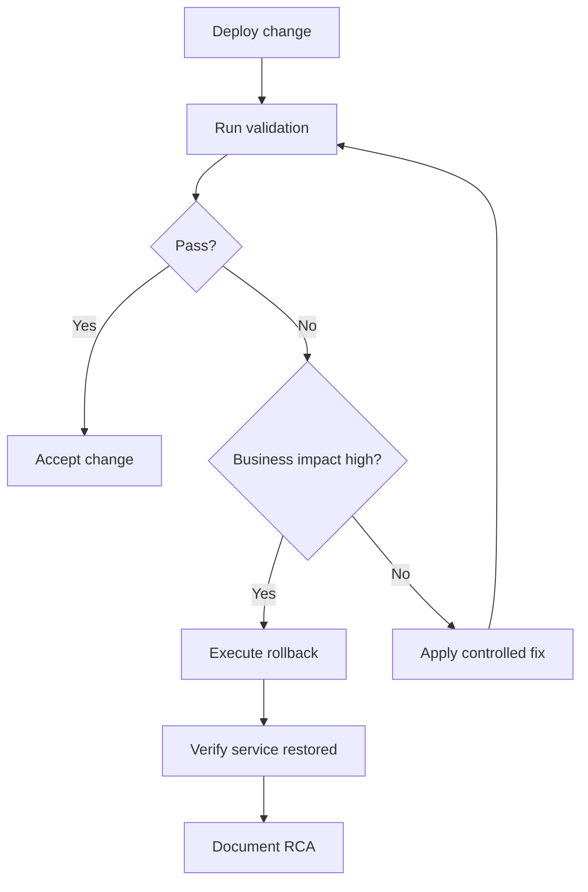

Risk register example:

| Risk | Impact | Likelihood | Mitigation |
|---|---|---|---|
| Unknown application dependency | Application outage | High | Dependency mapping and pilot testing |
| Route leak between segments | Security exposure | Medium | Route filtering and review |
| Controller outage | Operational impact | Medium | HA, backup, DR runbook |
| Wrong policy deployed at scale | Service disruption | Medium | Staged rollout and approval |
| OT device disruption | Safety/production impact | High | Passive discovery and OT approval |
| Automation credential leak | Security compromise | Medium | Vault, RBAC, token rotation |

## 23. Validation Plan

Validation should include:

- Technical validation.
- Security validation.
- Application validation.
- Operational validation.
- User acceptance.

Technical validation examples:

- Routing table correct.
- Tunnels up.
- Controller healthy.
- Policy deployed.
- Endpoint assigned to correct group.
- No critical alarms.

Security validation examples:

- Guest cannot access internal systems.
- OT access only through approved paths.
- Admin access logged.
- Denied flows logged.
- Temporary rules expire.

Application validation examples:

- ERP reachable.
- SaaS reachable.
- Voice quality acceptable.
- Cloud application reachable.
- OT historian flow working.

Operational validation examples:

- NOC can see dashboard.
- Security can see logs.
- Runbook steps tested.
- Rollback steps documented.
- Helpdesk escalation path defined.

## 24. Final Presentation Structure

Each group should present for 15-20 minutes.

Recommended structure:

1. Business and technical requirements.
2. Current-state assumptions.
3. Target architecture.
4. SDN domain selection.
5. Routing and segmentation model.
6. Security policy and enforcement points.
7. Monitoring and assurance plan.
8. Automation plan.
9. Migration roadmap.
10. Risks and rollback.
11. Success criteria.

## 25. Evaluation Rubric

Suggested scoring:

| Area | Weight | Evaluation Criteria |
|---|---:|---|
| Architecture | 20% | Clear target architecture, correct SDN domain selection, realistic boundaries |
| Integration | 15% | Routing, segmentation, firewall, cloud, and legacy integration handled |
| Security | 20% | Segmentation, policy matrix, enforcement, IT/OT, logging, governance |
| Automation and Operations | 15% | Source of truth, API workflow, monitoring, assurance, runbooks |
| Migration and Risk | 15% | Phased roadmap, rollback, validation, risk mitigation |
| Presentation | 15% | Clear explanation, trade-off analysis, ability to defend decisions |

## 26. Common Design Mistakes to Watch For

Common mistakes:

- Designing only the SDN fabric and ignoring boundaries.
- Assuming one controller solves all domains.
- Creating too many segments too early.
- Ignoring identity readiness.
- Ignoring firewall policy ownership.
- Forgetting NAT and DNS.
- Ignoring return path.
- Making OT design too aggressive.
- Automating before standardizing data.
- Skipping rollback.
- Treating monitoring as an afterthought.
- Not defining operational ownership.

Better design behavior:

- Start with business requirements.
- Define boundaries clearly.
- Use phased migration.
- Keep segmentation understandable.
- Assign policy ownership.
- Validate with application flows.
- Build source of truth early.
- Automate gradually.
- Document rollback and RCA process.

## 27. Capstone Templates

## 27.1 Segment Catalog Template

| Segment | Purpose | Users/Devices | Routing Scope | Internet Access | Owner |
|---|---|---|---|---|---|
| Corporate | Employee access | Managed laptops | Enterprise | Controlled | Network/Security |
| Guest | Visitor access | Guest devices | Internet only | Yes | Network |
| IoT | Non-user devices | Cameras, sensors | Limited | Usually no | Facilities/Network |
| OT | Industrial systems | PLC, HMI | OT only | No | OT/Security |
| Management | Admin access | Network admins | Infrastructure | No | Network |

## 27.2 Policy Matrix Template

| Source | Destination | Protocol/Port | Action | Enforcement | Logging | Owner |
|---|---|---|---|---|---|---|
|  |  |  | Permit/Deny |  | Yes/No |  |

## 27.3 Migration Wave Template

| Wave | Scope | Prerequisites | Change Window | Validation | Rollback |
|---|---|---|---|---|---|
| Wave 1 | Pilot branch | Template, circuit, backup | Saturday 22:00 | App test, tunnel test | Restore legacy path |

## 27.4 Risk Register Template

| Risk | Impact | Likelihood | Mitigation | Owner |
|---|---|---|---|---|
|  | Low/Medium/High | Low/Medium/High |  |  |

## 27.5 Automation Workflow Template

| Step | System | Input | Action | Output | Validation |
|---|---|---|---|---|---|
| 1 | Source of truth | Site data | Validate | Approved data | Schema check |

## 28. Instructor Notes

Recommended Day 5 flow:

1. Present the capstone scenario.
2. Divide learners into groups.
3. Give each group time to clarify assumptions.
4. Require a high-level architecture first.
5. Then require segmentation and policy matrix.
6. Then require migration and rollback.
7. Add challenge questions during design time.
8. Let groups present.
9. Score using rubric.
10. Close with lessons learned.

Challenge questions for instructors:

- What happens if the controller is unavailable?
- Where is the default route?
- Where is guest traffic inspected?
- How does OT access the historian?
- How is return path guaranteed?
- Who owns firewall policy?
- What is the first pilot?
- What is the rollback plan?
- What data must exist before automation?
- How do you prove success after six months?

## 29. Review Questions

1. Why should SDN design start from business requirements?
2. What is the difference between HLD and LLD?
3. Why is segmentation mapping across domains difficult?
4. Why should macrosegmentation usually come before microsegmentation?
5. Why is policy ownership important?
6. What makes IT/OT design different from normal campus design?
7. Why is a source of truth important before automation?
8. What should a migration roadmap include?
9. What makes a good rollback plan?
10. What should be included in final validation?
11. How should SDN success be measured?
12. What are common design mistakes in enterprise SDN?

## 30. Day 5 Key Takeaways

- A successful SDN project is an architecture and operating model transformation, not just a product deployment.
- Hybrid SDN is normal; integration boundaries must be designed carefully.
- Segmentation must be understandable, enforceable, logged, and owned.
- Automation depends on accurate data and safe workflows.
- Monitoring and assurance must be part of the design from the start.
- Migration should be phased, validated, and reversible.
- IT/OT requires conservative, safety-aware design.
- The best design is not the most advanced design; it is the design that solves real business problems with acceptable risk.

## 31. References

- Cisco, Software-Defined Networking overview: https://www.cisco.com/c/en/us/solutions/software-defined-networking/overview.html
- Cisco, Cisco SD-Access Solution Design Guide: https://www.cisco.com/c/en/us/td/docs/solutions/CVD/Campus/cisco-sda-design-guide.html
- Cisco, Cisco ACI solution overview: https://www.cisco.com/c/en/us/solutions/collateral/data-center-virtualization/application-centric-infrastructure/solution-overview-c22-741487.html
- Cisco, Catalyst Center: https://www.cisco.com/site/us/en/products/networking/catalyst-center/index.html
- Cisco, Catalyst SD-WAN: https://www.cisco.com/site/us/en/solutions/networking/sdwan/catalyst/index.html
- Cisco, Common Policy Integration Guide: https://www.cisco.com/c/en/us/td/docs/cloud-systems-management/network-automation-and-management/catalyst-center/cisco-validated-solution-profiles/common-policy-integration-guide.html
- Cisco, Zero Trust: https://www.cisco.com/site/us/en/solutions/security/zero-trust/index.html
- NIST Zero Trust Architecture SP 800-207: https://csrc.nist.gov/publications/detail/sp/800-207/final

